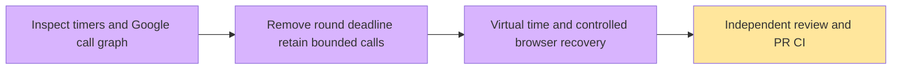

# Progress

Issue #5359 implements the user's cancellation of a round-level three-minute cutoff. Search optimization and the ten-minute whole-report soft target remain #5306.

API 416 / Web 364 tests pass. Initial UI red and old-deadline counterfactual failures are preserved in private logs. Actual controlled browser reload beyond 266s remained active, and pause settled without a round error. Actual Google-only baseline is recorded separately; no report SLA or live model quality is claimed.
