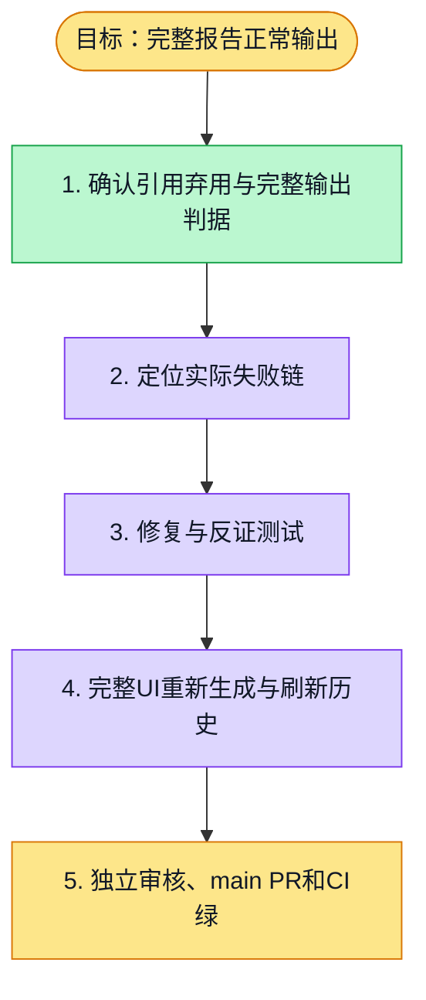

# 执行计划 — 报告首次生成与重新生成修复 #5546

> 规范：`.harness/instructions/execution-plan-visualization.md`。
> 改状态用 `node .harness/scripts/execution-plan.mjs set <本文件> <节点> <状态>`，
> 改完 `check` 一遍；不要手改 classDef 颜色。

## 我理解的目标
- **目标**：首次和重新生成正常输出完整报告；无效引用丢弃，不阻断生成
- **完成判据**：完整四章/32题正式报告、正常刷新与重新生成历史；受影响测试/类型/lint/release通过，自动main PR并CI绿
- **不做什么**：仅#5546；保留语义支持性/深度/缺口门；独立基线依赖不混入本PR
- **假设与待确认**：同现有worktree/session；正常UI动作，无预审报告注入

## 执行计划

图例：⬜ 灰=未开始 · 🟨 黄=已开始 · 🟩 绿=已完成 · 🟪 紫=已测试（有证据） · 🟥 红=被堵塞

## 进度日志（append-only，每次改颜色追加一行）
| 时间 | 节点 | 状态变化 | 依据（命令 / 证据 / 堵塞原因） |
|---|---|---|---|
| 2026-10-10T15:04Z | G, S1 | todo → doing | 接到目标，开始理解 |
