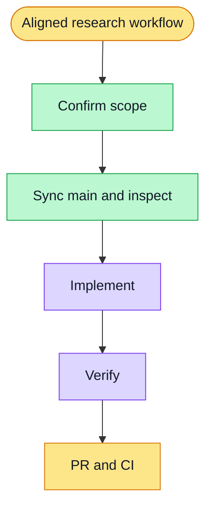

# Research step transitions — issue #4857

## Approved scope

Confirm each step into its destination before generated content returns; align route, active step and loading copy. Hide cross-step progress and previous-report presentation without deleting history. Place actions after current-step content. Preserve durable streaming, refresh recovery and retry.

Reuse the existing session worktree. Branch `codex/research-step-transition-layout` starts from freshly fetched `origin/main` after PR #4793 merged. No gateway, merge or deployment.

## Evidence / progress

### Complete requirement audit (2026-10-01 continuation)

User requested completing the entire scope before final validation and PR. Existing eight-item simplification delivery is in merged PR #4793; this branch builds on it without duplicating backend work. Latest main was fetched and fast-forwarded to `68e1146c3` before the remaining correction (no overlapping files).

| Requirement | Implementation / final acceptance coverage |
| --- | --- |
| Research name across steps; no explanatory subtitles | Six-step shell; reference-layout and runtime browser flow |
| Simple plans; single numbering | Plan editor; plan workspace regressions |
| Click-to-edit, add and delete plan rows | Plan editor; interaction, save and reload coverage |
| Compact source list without read pills or separators | Source workspace; compact-source regressions and mobile screenshot |
| Concurrent readable source collection and persisted summaries | Merged backend; research-unit collection/persistence tests |
| Editable chapter/subchapter hierarchy | Chapter workspace; edit/add/remove and route recovery tests |
| Relevant source coverage for reports | Merged evidence pipeline; coverage/evidence API tests (no unrelated source padding) |
| Export without references | Word/print export regressions; in-page references retained |
| Confirm into next step and align loading/URL | Step-transition tests; intake, chapter confirmation and refresh browser flow |
| Hide report description/history presentation | Live report regression; persisted history helper retained |
| Hide cross-step progress box; actions below content | Live report/source layout regressions and streamed-body screenshot |

The audit found one remaining chapter-save alignment bug. New regression failed with actual `/chapters` instead of expected `/plan`. Minimal correction clears the chapter presentation only after a successful outline response. Final unified UI verification passed: 37 files / 326 tests, including all eight transition cases. Backend research suite passed: 5 files / 121 tests. Web typecheck and lint passed. Fresh isolated browser verification is running after this correction and the main update.

- Added six regression cases; all six failed before implementation and passed afterwards.
- Focused UI verification: 58 cases passed across step transitions, reference layout and reference workflow (2026-10-01).
- Existing report history helper remains available and tested; live page no longer mounts it. No persisted history is deleted.
- Independent review identified and verified fixes for chapter assistant node locking, browser-history chapter restoration and report toolbar placement.
- Complete module UI suite: 24 files / 210 cases passed using one worker. Added chapter-route restore coverage subsequently passed in the seven-case transition suite.
- Final web typecheck passed; lint passed without warnings after adding the route-stage effect dependency. The seven-case transition suite passed again after correcting its role-query typing.
- Execution-plan validation and the E2E test-ID gate passed (3,889 references checked).
- First browser E2E attempt: exit 1 before browser cases started (`config.webServer` 600,000 ms startup timeout). Webpack compiled successfully, but the production build's lint/type-validation stage exceeded the budget. No screenshot or browser-passing claim from this attempt. Exact compose project `wsx-0e477d9d9e096c8d6449` containers and volumes were confirmed removed.
- Retrying with the configuration's supported `FULLSTACK_E2E_SERVER_TIMEOUT_MS=1200000` startup budget; no checks, assertions or load gate are skipped.
- Second browser attempt: exit 1 with a separate 30,000 ms WebServer startup timeout. No browser cases started (`failedTests: []`); available logs cannot identify the individual fixture. Exact compose project `wsx-9332c997a4396a917efd` containers and volumes were confirmed removed. Next retry will be sequential after standard verification to avoid resource competition.
- Standard `pnpm run verify:quick`: exit 1; affected typecheck/lint passed, web tests reported 767 files / 6,555 tests passed and 12 files / 19 tests failed (5 skipped). Duration 34m50s after 5m8s admission wait.
- Bounded-worker rerun of all 12 failed files: 11 files / 143 tests passed, including `guided-research-sources.test.tsx`; 8 failures remain only in `tests/whiteboard/board-content-tools.test.tsx`. The whiteboard test and `components/whiteboard/board-content-adapter.ts` have no diff from `origin/main`. The observed error is `SubtleCrypto.digest` rejecting an ArrayBuffer argument. This unrelated baseline failure is not fixed or declared green in this research-only change.
- Third browser attempt passed: exit 0, `1 passed (10.8m)`, after a sequential run with `DEBUG=pw:webserver` and the supported startup budget. Full production compilation, lint/type validation and browser assertions were retained. `.last-run.json` reports `status: passed`, `failedTests: []`.
- Browser artifacts: 13 PNGs in `apps/web/test-results/fullstack-smoke/guided-research-runtime-re-492a8--real-UI-API-and-PostgreSQL-seeded/`, including `research-chapters-route.png`, `research-report-streaming.png` and `research-completed.png`. Streaming body appears above the timeline. Exact compose project `wsx-dad2700752d0f56e4235` containers and volumes were confirmed removed.
- Prior independent code review has no remaining blocking findings. Research-only verification passes; standard verification retains the eight unchanged whiteboard failures above. User subsequently explicitly instructed completing the entire requirement, then verification, then PR. Proceed with the research-only PR after fresh scoped verification, disclose the baseline exception, and follow CI/review without bypassing gates. No merge or deployment authorized.

No completion claim until fresh verification and PR checks pass.

### Final unified acceptance

- Final isolated browser/API/PostgreSQL run: exit 0, `1 passed (4.7m)`, browser case 2.6m. Production build, lint, types and all assertions retained. Model/search providers are loopback fixtures, not deployed external-provider acceptance.
- Final artifacts: 13 screenshots in the same `apps/web/test-results/fullstack-smoke/guided-research-runtime-re-492a8--real-UI-API-and-PostgreSQL-seeded/` directory. Compose `wsx-85033fe4b35594b7c9a8` containers and volumes are empty after cleanup.
- Final independent review: no critical/important issues across the eleven requirements. Outside acceptance: live external model/source quality, production deployment, pending PR CI. No unrelated whiteboard changes.
- Execution plan check and E2E test-ID gate passed (3,889 references). Commit/PR follows; CI remains a separate gate.
