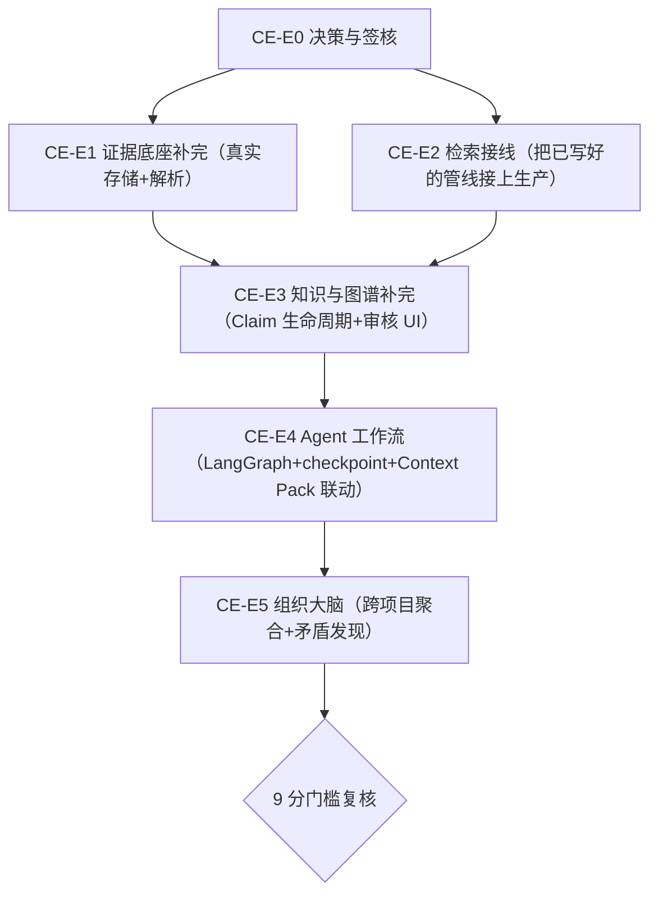

# PROP-CONTEXT-ENGINE-001：Context Engine 从 3.0 分补到 9 分的落地路线图

- 状态：**Accepted（带一处修订）**——人类 2026-08-11 在 coord-main 会话逐字裁决：
  「CE-000 接受，解析统一用 anydoc」。修订落点：CE-012/CE-013 的解析库选型由
  pdf-parse/mammoth 改为统一 `@firecrawl/anydoc`（W1/PR #934 已过依赖评审并批准，
  覆盖 PDF/docx/pptx/xlsx；同一解析事实只留一个实现）。CE-014 扫描件 OCR 仍为
  tesseract.js（anydoc 不覆盖 image-only PDF）。代抄：coord-main（#660 先例，人类可改）。
- 作者：coord-architecture（**跨域代拟**——见下方"域外免责声明"）
- 依据：`docs/architecture/context-engine.md`（2026-07-28 定稿的目标架构，本提案不推翻它，是它的落地计划）
- 打分依据：对 exact baseline `752b5e5f158e6f1169914820d318e31224b6c365`
  的仓库内可重跑 inventory，见本文档"现状实测"与"可重跑 evidence"两节

## ⚠ 域外免责声明（先读这个）

Context Engine 是 `apps/api` 的 chat/AI runtime 能力，按本仓库刚建立的 H3A-011 Domain
归属（`.harness/domains/registry.yaml`），它属于 `DOM-AI-RUNTIME`/`DOM-CHAT`，
**不属于我（coord-architecture）的域**（`DOM-CONTRACT-CONTROL-PLANE`，只管
`harness/docs/adr/agent-protocol`）。

本提案是人类明确要求"你先制定方案，交给 main agent 来 plan"之后的产物——**我只写
方案，不实现代码**。落地执行需要 coord-main 分派给 dev-ai-runtime / coord-chat（或
其派生 worker），每个条目照常需要独立 issue/分支/PR，且涉及 UI 的部分（Claim 审核
工作台）在开工前需要走 `contract-design.md` 的设计签核关卡（ADR-023），不能因为
"这是个大提案"就跳过逐条 issue 和签核纪律。

## 现状实测：3.0 / 10（baseline 2026-08-09，2026-08-11 重跑）

评分采用固定口径：每阶段 0~2 分；0=缺失，0.5=只有局部骨架/测试，1=已有生产
组件但关键验收链未闭合，1.5=主链可用但仍有一个重大缺口，2=该阶段验收闭合。

| 阶段 | 分数 | exact-tree 实测状态 |
|---|---:|---|
| P1 证据底座 | 1.0/2 | 六张核心表、FTS、PG outbox 与生产 `ObjectStore` 注入真实；但唯一实现仍是本地 `FsObjectStore`，PDF/Office 是字节 UTF-8 解码，OCR/ASR 明确为 stub，真实摄取验收未闭合 |
| P2 混合检索 | 0.5/2 | 五路召回+RRF+screening 与测试已存在；排除测试后，`retrieveCandidates(` 只有函数声明，没有生产调用方 |
| P3 知识与图谱 | 0.5/2 | `claims` 已有 `status` 与证据关联，但设计要求的 7 个生命周期字段中仅 `status` 已落地，缺其余 6 个；`ontology_objects` migration 不存在；无审核 UI |
| P4 Agent 工作流 | 1.0/2 | **已有并已注入** `DeepAgentModelProvider`；Python 服务已声明 `langgraph-cli[inmem]` 并调用 `create_deep_agent`。仍缺 `agent_runs.context_pack_id`、持久化 checkpoint/恢复和动态 `interrupt()` |
| P5 组织大脑 | 0/2 | `ontology_objects` 尚不存在，跨项目 Claim 聚合与矛盾发现的验收前提未成立 |

合计 **3.0/10**。这次重跑纠正了旧提案对 P4 的失真陈述；不能因为 P4 已有
LangGraph/DeepAgent 基线，就把尚未存在的 checkpoint、Context Pack 联动算作完成。

核心问题不是"代码写得差"——底层工程质量真实可靠（RLS 强制、幂等键、CJK 分词、
权限传播测试）。核心问题是：**这套系统的核心价值主张（给 AI 可引用可审计的上下文）
今天仍未形成端到端生产链**：检索管线写好了但没有生产调用方，claim 生命周期缺了
表达"知识冲突/被取代"必需的字段，文件解析仍是替身实现；P4 已有真实
DeepAgent/LangGraph 对接基线，但 checkpoint 与 Context Pack 联动仍是空白，P5 的实体
与跨项目聚合前提尚未成立。

## 可重跑 evidence（exact baseline `752b5e5f158e6f1169914820d318e31224b6c365`）

以下输出于 2026-08-11 在该 SHA 的独立 worktree 中实跑；命令只读取 git tree，后续
reviewer 可在任意 checkout 重跑。`git grep` 的无匹配分支显式输出 `NO ...`，避免把
空输出误读成漏跑。

```text
$ git rev-parse HEAD
752b5e5f158e6f1169914820d318e31224b6c365

$ git grep -nE '^CREATE TABLE IF NOT EXISTS (artifacts|artifact_versions|segments|anchors|derived_representations|provenance_events|ingestion_outbox|segment_text)' -- apps/api/migrations
apps/api/migrations/0005-f03-admin-boundary.sql:66:CREATE TABLE IF NOT EXISTS provenance_events (
apps/api/migrations/0006-f04-artifact-model.sql:55:CREATE TABLE IF NOT EXISTS artifacts (
apps/api/migrations/0006-f04-artifact-model.sql:88:CREATE TABLE IF NOT EXISTS artifact_versions (
apps/api/migrations/0006-f04-artifact-model.sql:133:CREATE TABLE IF NOT EXISTS segments (
apps/api/migrations/0006-f04-artifact-model.sql:144:CREATE TABLE IF NOT EXISTS anchors (
apps/api/migrations/0006-f04-artifact-model.sql:161:CREATE TABLE IF NOT EXISTS derived_representations (
apps/api/migrations/0009-f10-retrieval-index.sql:155:CREATE TABLE IF NOT EXISTS segment_text (
apps/api/migrations/20260801130000_f36_ingestion_outbox.sql:32:CREATE TABLE IF NOT EXISTS ingestion_outbox (

$ git grep -nE 'class (Fs|Minio)ObjectStore|provide: OBJECT_STORE' -- apps/api/src/infrastructure/storage apps/api/src/kernel.module.ts
apps/api/src/infrastructure/storage/fs-object-store.ts:29:export class FsObjectStore implements ObjectStore {
apps/api/src/kernel.module.ts:675:    { provide: OBJECT_STORE, useFactory: () => new FsObjectStore(objectStoreRoot()) },
apps/api/src/kernel.module.ts:719:      provide: OBJECT_STORE_PROBE,

$ git grep -nE 'generatorModel: "(deterministic-document-parser|stub-ocr-engine|stub-asr-engine)"' -- apps/api/src/domain/files/extraction-adapters.ts
apps/api/src/domain/files/extraction-adapters.ts:136:    generatorModel: "deterministic-document-parser",
apps/api/src/domain/files/extraction-adapters.ts:160:    generatorModel: "stub-ocr-engine",
apps/api/src/domain/files/extraction-adapters.ts:189:    generatorModel: "stub-asr-engine",

$ git grep -n 'retrieveCandidates(' -- apps/api/src ':!apps/api/src/**/*.test.ts'
apps/api/src/application/retrieval/retrieve-candidates.ts:167:export async function retrieveCandidates(

$ git grep -nE 'import \{ applyRerank, fuse|screenCandidates\(' -- apps/api/src/application/retrieval/retrieve-candidates.ts apps/api/src/application/context-pack/replay-pack.ts
apps/api/src/application/context-pack/replay-pack.ts:82:  const screened = screenCandidates({
apps/api/src/application/retrieval/retrieve-candidates.ts:56:import { applyRerank, fuse, type ChannelRanking } from "../../domain/retrieval/rrf";

$ sed -n '/CREATE TABLE IF NOT EXISTS claims (/,/);/p' apps/api/migrations/0009-f10-retrieval-index.sql
CREATE TABLE IF NOT EXISTS claims (
  id         text PRIMARY KEY,
  org_id     text NOT NULL REFERENCES organizations (id) ON DELETE CASCADE,
  project_id text REFERENCES projects (id) ON DELETE SET NULL,
  statement  text NOT NULL CHECK (length(statement) > 0),
  -- Mirrors `contextPack.ClaimStatus`; asserted equal to the contract in the tests.
  status     text NOT NULL CHECK (status IN (
    'proposed', 'reviewed', 'accepted', 'contested', 'superseded'
  )),
  tsv        tsvector NOT NULL
);

$ if git grep -n 'CREATE TABLE IF NOT EXISTS ontology_objects' -- apps/api/migrations; then true; else echo 'NO ontology_objects table migration'; fi
NO ontology_objects table migration

$ if git grep -nE 'superseded|claim_segments|reviewed_by' -- apps/web/app; then true; else echo 'NO Claim lifecycle review UI wiring under apps/web/app'; fi
NO Claim lifecycle review UI wiring under apps/web/app

$ git grep -nE 'export class DeepAgentModelProvider|new DeepAgentModelProvider|langgraph-cli\[inmem\]|create_deep_agent' -- apps/api/src/infrastructure/agent-run/deep-agent-model-provider.ts apps/api/src/kernel.module.ts apps/deep-agent-service/pyproject.toml apps/deep-agent-service/src/deep_agent_service/graph.py
apps/api/src/infrastructure/agent-run/deep-agent-model-provider.ts:221:export class DeepAgentModelProvider implements ModelCallPort {
apps/api/src/kernel.module.ts:868:          [DEEP_AGENT_PROVIDER_NAME, new DeepAgentModelProvider(readDeepAgentProviderConfig())],
apps/deep-agent-service/pyproject.toml:9:  "langgraph-cli[inmem]>=0.4.0",
apps/deep-agent-service/src/deep_agent_service/graph.py:20:from deepagents import create_deep_agent
apps/deep-agent-service/src/deep_agent_service/graph.py:33:graph = create_deep_agent(

$ if git grep -nE 'MemorySaver|PostgresSaver|checkpointer[[:space:]]*=|interrupt\(' -- apps/deep-agent-service apps/api/src/application/agent-run apps/api/src/infrastructure/agent-run; then true; else echo 'NO runtime checkpoint/interrupt implementation'; fi
NO runtime checkpoint/interrupt implementation

$ if git grep -n 'context_pack_id' -- apps/api/migrations/20260804060000_wave2_chat_message_acceptance.sql apps/api/src/application/agent-run apps/api/src/infrastructure/agent-run; then true; else echo 'NO agent_runs context_pack_id wiring'; fi
NO agent_runs context_pack_id wiring
```

## 三个关键技术决策（已与人类确认，写入本提案作为约束）

1. **对象存储：本地 MinIO**，不是云端 S3。`apps/api/docker-compose.dev.yml` 里
   `minio` 服务**已经配置好**（`minio/minio:RELEASE.2024-09-13T20-26-02Z`，
   `MINIO_ROOT_USER=minio_dev`，端口 `${MINIO_PORT:-59000}`/`${MINIO_CONSOLE_PORT:-59001}`），
   只是没有客户端代码接它——`ObjectStore` port（`apps/api/src/application/artifact/ports.ts`）
   已经是干净的六边形架构，`FsObjectStore` 是唯一实现，MinIO 客户端是"同一个 port 的
   第二个实现"，`fs-object-store.ts` 文件头注释原文就是这么设计的（"S3 arrives as a
   second implementation of the SAME port and nothing above this layer changes"）。
   生产环境如果将来要换真实云端 S3，只需再加第三个实现（同 endpoint 协议，MinIO 本身
   就是 S3 兼容 API），不是重新设计。
2. **OCR：本地 tesseract.js**。零外部 API/凭据依赖、MIT 协议、Node 生态原生可用，
   现在就能接真。
3. **ASR：FunASR**（`https://github.com/modelscope/FunASR`，ModelScope 开源，
   人类指定）。这是一个真实、成熟、对中文效果好的开源 ASR 工具包，不是云端付费 API——
   跟 MinIO/tesseract 一样是"本地起服务、零凭据"的路线，但它是 Python 生态、需要独立
   部署（模型推理有 CPU/GPU 资源占用），架构上应该跟 `apps/deep-agent-service` 一样，
   起一个独立的 Python 服务（`apps/asr-service`，FunASR 官方有 FastAPI/gRPC 部署范式可抄），
   `apps/api` 的摄取 adapter 通过 HTTP 调用它，不要把 Python 推理进程内嵌进 Node 后端。
   **资源占用是真实运维成本**，需要在 E1-05（见下）里现场测出模型加载时间和内存占用，
   如实写进 evidence，不要假设"能跑"。

## 落地路线图（Epic 划分，对应 checklist 的 CE-0xx）



**为什么这个顺序**：E1（真实存储+解析）和 E2（检索接线）互相独立、都不依赖对方，
可以并行；两者都是本次打分里"性价比最高"的部分——E2 尤其是，代码已经写好测过，
纯粹是接线工作，风险最低、见效最快（从"0 个生产调用"到"真实可用"）。E3 依赖两者
（Claim 需要真实文档和真实检索才有意义去审核）。E4/E5 是最新的地，依赖 E3 的
Claim 模型先立住。

**关于"分几个阶段做完 vs 一次性摆开"**：人类选了"一次性全部摆开，直到 9 分"——
本提案把 E1-E5 全部规划出来，但真正开工的顺序仍然遵循上面的依赖图，不是五个 Epic
同时无脑并行（E3/E4/E5 依赖前面的产出，并行了也会卡住互相等）。

## 9 分是什么样子（验收基准，对应设计文档"首批完成门槛"6 条 + 补充 3 条）

原文 6 条门槛全部转正（今天 2/6 完全达标，4/6 有测试但未接生产或未完全实现）：

1. 100% AI 引用可定位——且是**真实生产请求**验证通过，不只是单元测试。
2. 跨 tenant 零泄漏——保持（已达标）。
3. 幂等摄取——保持（已达标）。
4. 删除级联失效——**六类全部真实通过**（今天 ontology-edges 那类测试诚实标记失败）。
5. 检索测试覆盖五维——保持，且**接入真实生产流量做一次回归**。
6. Agent 运行可重放 Context Pack——`agent_runs` 表加 `context_pack_id`，端到端打通。

补充 3 条（9 分需要，原文 6 条门槛本身对应的是"P1-P2 完成"，不是"9 分"）：

7. Claim 生命周期七字段全部真实（status/confidence/valid_from/valid_to/created_by/
   reviewed_by/supersedes_claim_id），且有真实的"两条冲突结论并存"回归测试。
8. 至少一条端到端真实链路：用户上传一份真实 PDF → 真实解析 → 真实检索召回它 →
   AI 回答真实引用它的页码 → 人工能在审核工作台看到并操作对应 Claim。
9. Agent 深度研究至少一条真实跑通：LangGraph 驱动、有 checkpoint、崩溃后能从
   checkpoint 恢复（不是靠重新跑一遍蒙混）。

9 分不是"P1-P5 概念上都有代码"，是"核心链路端到端真实可用、可审计、可复现"。
