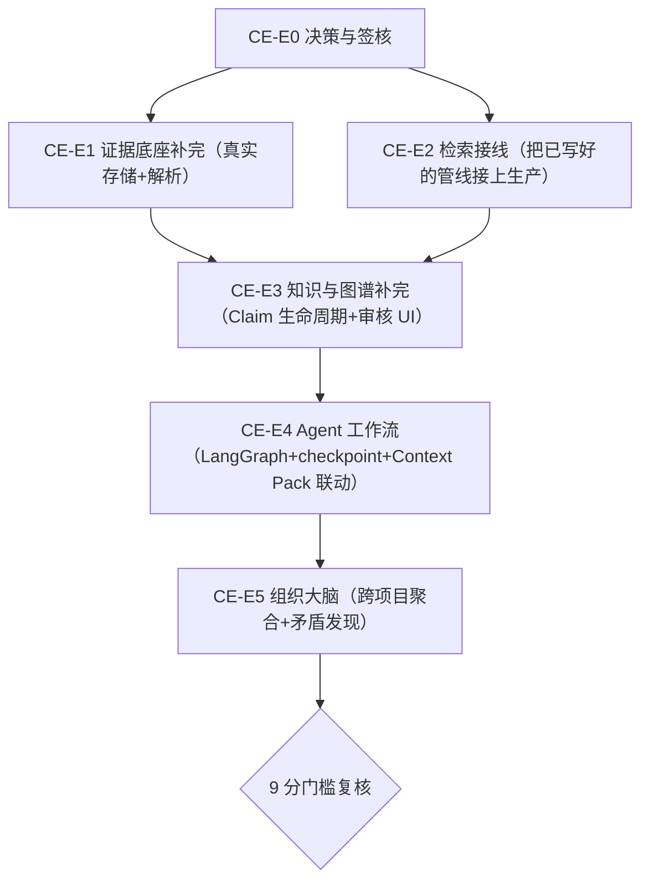

# PROP-CONTEXT-ENGINE-001：Context Engine 从 3.5 分补到 9 分的落地路线图

- 状态：Proposed（2026-08-09，等待人类 Accept/Revise/No-Go）
- 作者：coord-architecture（**跨域代拟**——见下方"域外免责声明"）
- 依据：`docs/architecture/context-engine.md`（2026-07-28 定稿的目标架构，本提案不推翻它，是它的落地计划）
- 打分依据：2026-08-09 现场实测，见本文档"现状实测"一节和随附的 `PROP-CONTEXT-ENGINE-001.checklist.md`

## ⚠ 域外免责声明（先读这个）

Context Engine 是 `apps/api` 的 chat/AI runtime 能力，按本仓库刚建立的 H3A-011 Domain
归属（`.harness/domains/registry.yaml`），它属于 `DOM-AI-RUNTIME`/`DOM-CHAT`，
**不属于我（coord-architecture）的域**（`DOM-CONTRACT-CONTROL-PLANE`，只管
`harness/docs/adr/agent-protocol`）。

本提案是人类明确要求"你先制定方案，交给 main agent 来 plan"之后的产物——**我只写
方案，不实现代码**。落地执行需要 coord-main 分派给 dev-ai-runtime / coord-chat（或
其派生 worker），每个条目照常需要独立 issue/分支/PR，且涉及 UI 的部分（Claim 审核
工作台）在开工前需要走 `contract-design.md` 的设计签核关卡（ADR-023），不能因为
"这是个大提案"就跳过逐条 issue 和签核纪律。

## 现状实测：3.5 / 10（2026-08-09）

详见对话记录，摘要：

| 阶段 | 实测状态 |
|---|---|
| P1 证据底座 | 六张核心表真实、FTS 真实、PG outbox 真实；**S3 是文件系统占位、PDF/Office/OCR/ASR 全部是 stub** |
| P2 混合检索 | 五路召回+RRF+screening 代码质量好、测试齐全，**但零生产 controller 调用它** |
| P3 知识与图谱 | `claims` 表缺 6 个设计要求字段里的 5 个；`ontology_objects` 不存在；无审核 UI |
| P4 Agent 工作流 | `agent_runs` 表存在但服务的是聊天工具循环，非设计里的深度研究工作流；零 checkpoint；无 langgraph 依赖 |
| P5 组织大脑 | 零实现 |

核心问题不是"代码写得差"——底层工程质量真实可靠（RLS 强制、幂等键、CJK 分词、
权限传播测试）。核心问题是：**这套系统的核心价值主张（给 AI 可引用可审计的上下文）
今天在生产环境里完全不存在**，检索管线写好了没人调，claim 生命周期缺了表达"知识
冲突/被取代"必需的字段，文件解析是假的，P4/P5 几乎是白板。

## 三个关键技术决策（已与人类确认，写入本提案作为约束）

1. **对象存储：本地 MinIO**，不是云端 S3。`apps/api/docker-compose.dev.yml` 里
   `minio` 服务**已经配置好**（`minio/minio:RELEASE.2024-09-13T20-26-02Z`，
   `MINIO_ROOT_USER=minio_dev`，端口 `${MINIO_PORT:-59000}`/`${MINIO_CONSOLE_PORT:-59001}`），
   只是没有客户端代码接它——`ObjectStore` port（`apps/api/src/application/artifact/ports.ts`）
   已经是干净的六边形架构，`FsObjectStore` 是唯一实现，MinIO 客户端是"同一个 port 的
   第二个实现"，`fs-object-store.ts` 文件头注释原文就是这么设计的（"S3 arrives as a
   second implementation of the SAME port and nothing above this layer changes"）。
   生产环境如果将来要换真实云端 S3，只需再加第三个实现（同 endpoint 协议，MinIO 本身
   就是 S3 兼容 API），不是重新设计。
2. **OCR：本地 tesseract.js**。零外部 API/凭据依赖、MIT 协议、Node 生态原生可用，
   现在就能接真。
3. **ASR：FunASR**（`https://github.com/modelscope/FunASR`，ModelScope 开源，
   人类指定）。这是一个真实、成熟、对中文效果好的开源 ASR 工具包，不是云端付费 API——
   跟 MinIO/tesseract 一样是"本地起服务、零凭据"的路线，但它是 Python 生态、需要独立
   部署（模型推理有 CPU/GPU 资源占用），架构上应该跟 `apps/deep-agent-service` 一样，
   起一个独立的 Python 服务（`apps/asr-service`，FunASR 官方有 FastAPI/gRPC 部署范式可抄），
   `apps/api` 的摄取 adapter 通过 HTTP 调用它，不要把 Python 推理进程内嵌进 Node 后端。
   **资源占用是真实运维成本**，需要在 E1-05（见下）里现场测出模型加载时间和内存占用，
   如实写进 evidence，不要假设"能跑"。

## 落地路线图（Epic 划分，对应 checklist 的 CE-0xx）

**为什么这个顺序**：E1（真实存储+解析）和 E2（检索接线）互相独立、都不依赖对方，
可以并行；两者都是本次打分里"性价比最高"的部分——E2 尤其是，代码已经写好测过，
纯粹是接线工作，风险最低、见效最快（从"0 个生产调用"到"真实可用"）。E3 依赖两者
（Claim 需要真实文档和真实检索才有意义去审核）。E4/E5 是最新的地，依赖 E3 的
Claim 模型先立住。

**关于"分几个阶段做完 vs 一次性摆开"**：人类选了"一次性全部摆开，直到 9 分"——
本提案把 E1-E5 全部规划出来，但真正开工的顺序仍然遵循上面的依赖图，不是五个 Epic
同时无脑并行（E3/E4/E5 依赖前面的产出，并行了也会卡住互相等）。

## 9 分是什么样子（验收基准，对应设计文档"首批完成门槛"6 条 + 补充 3 条）

原文 6 条门槛全部转正（今天 2/6 完全达标，4/6 有测试但未接生产或未完全实现）：

1. 100% AI 引用可定位——且是**真实生产请求**验证通过，不只是单元测试。
2. 跨 tenant 零泄漏——保持（已达标）。
3. 幂等摄取——保持（已达标）。
4. 删除级联失效——**六类全部真实通过**（今天 ontology-edges 那类测试诚实标记失败）。
5. 检索测试覆盖五维——保持，且**接入真实生产流量做一次回归**。
6. Agent 运行可重放 Context Pack——`agent_runs` 表加 `context_pack_id`，端到端打通。

补充 3 条（9 分需要，原文 6 条门槛本身对应的是"P1-P2 完成"，不是"9 分"）：

7. Claim 生命周期六字段全部真实（status/confidence/valid_from/valid_to/created_by/
   reviewed_by/supersedes_claim_id），且有真实的"两条冲突结论并存"回归测试。
8. 至少一条端到端真实链路：用户上传一份真实 PDF → 真实解析 → 真实检索召回它 →
   AI 回答真实引用它的页码 → 人工能在审核工作台看到并操作对应 Claim。
9. Agent 深度研究至少一条真实跑通：LangGraph 驱动、有 checkpoint、崩溃后能从
   checkpoint 恢复（不是靠重新跑一遍蒙混）。

9 分不是"P1-P5 概念上都有代码"，是"核心链路端到端真实可用、可审计、可复现"。
