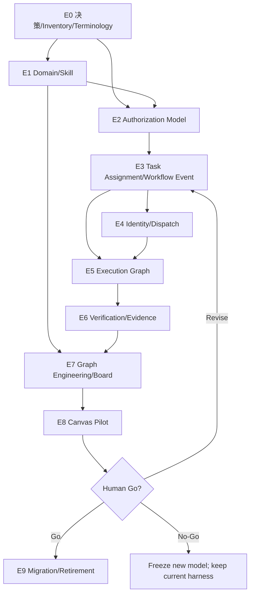

# PROP-HARNESS-AGENT-001 执行 Backlog

> ⚠ #658 已关闭（内容已交付进本文档所在的 PR #659，见该 issue 最后一条评论）——
> 它是"起草这份提案"的追踪 issue，不是"实施"的追踪 issue。
>
> **H3A-001 已完成（2026-08-07，人类原话 "Yes"，无保留接受）**——状态从
> Proposed 变为 Accepted，见 `PROP-HARNESS-AGENT-001.md` 文件头。本清单头部
> 自己写着"每个 H3A 条目实施时必须独立 issue、独立分支、独立 PR"——与 V2
> 那份"跳过逐条建 issue"的例外**不一样**，这条要求本身没有被人类推翻，所以
> H3A-002~ 之后的实施仍需为每一条真的开 issue，不能沿用 V2 的口径。
>
> 每个 H3A 条目实施时必须独立 issue、独立分支、独立 PR；本清单不是批量修改授权。
>
> **Epic E0 现场取值产出**：
> [inventory](./PROP-HARNESS-AGENT-001-e0-inventory.md)（H3A-002）、
> [baseline + 交叉表](./PROP-HARNESS-AGENT-001-e0-baseline.md)（H3A-003/005）。
> 两份都是 2026-08-07 对真实文件/`gh` 数据现场取值，不是推演。

## Epic E0 — 决策、基线与边界

| ID | P | 状态 | 交付物 | 依赖 | 完成契约 |
|---|---|---|---|---|---|
| H3A-001 | P0 | ✅ 完成 | Proposal 人类签核 | 无 | 状态变为 Accepted，目标/非目标明确——2026-08-07 人类原话 "Yes"，无保留接受，见 PROP-HARNESS-AGENT-001.md 文件头 |
| H3A-002 | P0 | ✅ 完成 | Role/Agent/Domain/Skill/Worker inventory（含旧名） | 001 | 每个现有对象有来源、writer、consumer、重复项和 legacy alias |
| H3A-003 | P0 | ✅ 完成 | 当前协调流基线 | 001 | flow/WIP/review wait/重复 token 有基线 |
| H3A-004 | P0 | ✅ 完成（PR #675） | 旧自由角色新增冻结策略 | 002 | 新增未登记角色 WARN，历史仍可读 |
| H3A-005 | P0 | ✅ 完成 | 与 ADR-010/Graph/HMV2 职责交叉表 | 002 | 无重复 schema/authority |
| H3A-006 | P0 | ✅ 完成（PR #672） | 规范术语注册表 | 001 | 每个规范概念有唯一 Term ID、规范名、旧名和使用边界 |
| H3A-007 | P0 | ✅ 完成（PR #672） | 旧名兼容映射 | 006 | 稳定 ID 不变；旧字段可读；新 writer 只产生规范字段 |
| H3A-008 | P0 | ✅ 完成（PR #672，「新写旧字段」全仓扫描仍未做，如实保留） | 术语 doctor | 006–007 | 新增未登记同义词、歧义映射或新写旧字段会红——已实现同义词/映射歧义两项；「新写旧字段」需全仓扫描，如实标注未做 |
| H3A-009 | P0 | ✅ 完成（PR #679） | Graph authority/projection contract | 005–008 | Domain、Authorization、Workflow、Runtime、Telemetry writer/authority 明确且不可互相反写——Workflow 类目如实标 UNKNOWN（Epic E3 未开工，尚无权威可言），Telemetry 类目如实标"不存在"（本仓无 OpenTelemetry），"投影不可反写"用机械检查覆盖已知 4 条路径 |

反证：新增一个 registry 自由角色、一个无 owner 模块、一个无消费者 Skill，分别产生稳定 finding。

> **Epic E0 状态（2026-08-07 现场核实）：H3A-001~009 九项全部 ✅ 完成，已合并**
> （PR #668/#672/#675/#677[事故找回，非 backlog 项]/#679）。实测吞吐（不是估算）：
> #668 开出到 #679 合并，总跨度 8.3h，交付 9 项 backlog / 4 条 backlog PR；同一批
> PR 的平均 review-wait 2.5h（对照更早的 #634/#641/#642 批次，review-wait
> 17~18.5h——同一晚上不同时段差 7 倍，说明**瓶颈是 review 可用性，不是实现吞吐**，
> 这条直接影响下面 Epic E1~E9 的时间估算怎么读）。

## Epic E1 — Domain Registry 与 Domain Skill（原 Module / Module Skill）

| ID | P | 状态 | 交付物 | 依赖 | 完成契约 |
|---|---|---|---|---|---|
| H3A-010 | P0 | ✅ 完成（PR #687） | Domain Registry schema | 002、007 | domain_id、owner、areas、contracts、verification 可验证——见 `.harness/domains/registry.yaml` + `lib/domain-model.ts` |
| H3A-011 | P0 | 🔶 PR #749 待 review（issue #748） | 核心 Domain inventory 与人类确认 | 010 | 无目录猜测，边界由真实权威源支持——2026-08-08 人类逐条裁决：coord-chat-e2e 拆分为 coord-chat/coord-canvas/coord-e2e；DOM-AGENT-SKILL-DIRECTORY owner 暂缓维持 null；DOM-PLATFORM/DOM-AI-RUNTIME 接受既定例外。见 `PROP-HARNESS-AGENT-001-h3a011-domain-inventory.md`"裁决记录"一节 |
| H3A-012 | P0 | ✅ 完成（PR #687） | TPL-MOD-001 Domain Skill schema | 005、010 | skill/domain/authority refs/last_verified 完整——见 `lib/domain-skill-model.ts`；今天 0 个真实实例（H3A-002 已核实），schema 只服务未来实例 |
| H3A-013 | P0 | ✅ 完成（PR #687） | Domain↔Skill 一对一 active gate | 012 | 缺失、重复 active Skill 会红——重复/引用未知 domain_id 判 FAIL；缺失判 WARN（0 实例是今天真实状态，不因为 H3A-016+ 未开工而让 CI 变红），见 `lib/domain-skill-gates.ts` |
| H3A-014 | P0 | ✅ 完成（PR #687） | Skill reference integrity gate | 012 | Contract/ADR/path 死引用会红；verification 字段（shell 命令非路径）如实标注不检查 |
| H3A-015 | P0 | ✅ 完成（PR #687） | Skill freshness/STALENESS gate | 012 | last_verified.commit 形状不像 SHA 判红；真实 git 历史校验如实标注做不到 |
| H3A-016 | P1 | 🔶 PR #776 待 review（issue #769） | Candidate Knowledge 晋升协议 | 012 | 无证据经验不能进入 active Skill——`findUnprovenActivePromotions`（`lib/domain-skill-gates.ts`）：active 且 authority_refs 四类引用与 last_verified 全空判 FAIL；今天 0 实例不触发，已知状态非回归 |
| H3A-017 | P1 | ⬜ 未开始 | Domain Skill 体积与渐进加载门 | 012 | SKILL 入口保持短，reference 按任务加载 |
| H3A-018 | P1 | ⬜ 未开始 | Fabric.js/Mermaid Domain Skill | 011–017 | 架构、身份、序列化、协作、验证与陷阱引用完整 |
| H3A-019 | P0 | 🔶 PR #780 待 review（issue #777） | Domain readiness gate | 011–015 | Role/Skill/数据源缺失时 Task Assignment 保持 UNKNOWN/blocked |

## Epic E2 — 分层 Authorization Model（原三层 Role Graph）

| ID | P | 状态 | 交付物 | 依赖 | 完成契约 |
|---|---|---|---|---|---|
| H3A-020 | P0 | ✅ 完成（PR #686） | TPL-ROL-001 分层扩展 | 005、007 | layer、domain、supervisor、dispatch、authority 可验证 |
| H3A-021 | P0 | ✅ 完成（PR #686） | Root Orchestrator Role 单例门 | 020 | 同项目两个 active Root 会红 |
| H3A-022 | P0 | 🔶 PR #698 待 review（issue #696） | Domain Orchestrator Role schema | 010、020 | 每个 Role 绑定一个 Domain 和一个 active Skill |
| H3A-023 | P0 | ✅ 完成（PR #686） | Specialist Worker Role schema | 020 | 单一职责、I/O、tools、write scope、stop 条件完整 |
| H3A-024 | P0 | ✅ 完成（PR #686） | 最大三层深度 gate | 020–023 | Specialist Worker 派生第四层会红 |
| H3A-025 | P0 | ✅ 完成（PR #686） | Role authority monotonicity gate | 020 | 子角色权限不能大于 supervisor/Task Assignment |
| H3A-026 | P0 | ✅ 完成（PR #686） | merge/signoff 权限 gate | 020 | 非 Root merge、任意 Agent 人类签核会红 |
| H3A-027 | P0 | ✅ 完成（PR #686） | producer/verifier separation policy | 023 | 同 actor 自产自签会红 |
| H3A-028 | P1 | ⬜ 未开始 | 现有 portable role generator 适配 | 020–023 | Claude/Codex 从同一 Role model 生成且无漂移 |
| H3A-029 | P0 | ✅ 完成（PR #686） | Root 直派 L3 例外门 | 019、023 | 仅独立 review、恢复、迁移兼容；必须绑定 subject domain 和受限 scope |

反证：创建第四层、给 Domain merge 权、让 Skill 声明写权限、让 reviewer=producer，必须分别只红对应约束。

## Epic E3 — Task Assignment 与 Workflow Event

| ID | P | 状态 | 交付物 | 依赖 | 完成契约 |
|---|---|---|---|---|---|
| H3A-030 | P0 | ✅ 完成（PR #717） | TPL-TSK-001 Task Assignment schema | 020–023 | objective/scope/acceptance/budget/authority hash 完整 |
| H3A-031 | P0 | ✅ 完成（PR #722） | Root→Domain Task Assignment gate | 030 | assignee domain/scope/skill/依赖有效 |
| H3A-032 | P0 | ✅ 完成（PR #723） | Domain→Worker Task Assignment gate | 030 | 不越领域、不越配额、不越权限 |
| H3A-033 | P0 | ✅ 完成（PR #721） | TPL-EVT-001 四类 Workflow Event envelope | 030 | Task Assignment/Progress/Blocker/Task Result 可解析 |
| H3A-036 | P0 | 🔶 PR #764 待 review（issue #759） | TPL-RVW-001 Revision-bound Review Decision | 027、033 | revision、producer、reviewer、evidence 完整 |
| H3A-035 | P0 | 🔶 PR #761 待 review（issue #758） | 12 行短文本 renderer | 033 | 普通事件默认不超过 12 行 |
| H3A-034 | P0 | 🔶 PR #760 待 review（issue #757） | Event stable ID 与 append-only gate | 033 | 重复 ID、历史覆写会红 |
| H3A-037 | P0 | 🔶 PR #779 待 review（issue #774） | Review Decision stale gate | 036 | head/artifact 改变后旧 decision 自动失效 |
| H3A-038 | P1 | 🔶 PR #809 待 review（issue #803） | Task Context Bundle selector | 030、033 | 不含 supervisor private reasoning 和无关日志 |
| H3A-039 | P1 | ⬜ 未开始 | GitHub 评论结构化投影 | 033–037 | Board 可可靠解析最新事件，不猜标题 |

> **Epic E3 阶段状态（2026-08-08 现场核实）：H3A-030~033 四项 ✅ 完成，已合并**
> （PR #717/#721/#722/#723）。030 是单人直接实现（issue #716 开出到 PR 合并
> 仅 2 分钟——人类正好在线立即 review）；031/032/033 三项走并行派工（3 个
> subagent 各自独立 worktree 同时开发），issue 从 09:10~09:12 陆续开出，最后
> 一个 PR（#723）14:39 合并，总跨度 ~5.6h，其中真实实现时间（issue 开出到
> PR 开出）三项都在 1~2h 内完成，**剩余 ~4h 是 review 等待**——与 Epic E0
> 的结论一致（瓶颈是 review 可用性，不是实现吞吐）。#722/#723 在合并顺序上
> 撞了预期内的"共享接缝文件"冲突（`task-assignment-doctor.ts` 等，三个 PR
> 都在扩展同一个 doctor 入口）——不是逻辑冲突，是并行 PR 各自追加不同 gate
> 函数调用，rebase 保留双方即可，已解决。
> H3A-034~039（Event/Review Decision 相关）剩余 6 项未开始，038/039 是 P1。

## Epic E4 — Agent Runtime Instance、Dispatch 与回收

| ID | P | 状态 | 交付物 | 依赖 | 完成契约 |
|---|---|---|---|---|---|
| H3A-040 | P0 | ⬜ 未开始 | TPL-AGT-001 runtime registration | 020、030 | Directory ULID、role、supervisor、task、spawned_at 完整 |
| H3A-041 | P0 | ⬜ 未开始 | dispatch-before-write 原子协议 | 031、032、040 | identity+claim+lease 未齐不能写 |
| H3A-042 | P0 | ⬜ 未开始 | Domain Worker quota | 032、041 | 默认一个并行 Worker + 一个 Verifier；超总运行/并行配额会红 |
| H3A-043 | P0 | ⬜ 未开始 | Supervision Hierarchy integrity gate | 040 | 无 supervisor、环、跨项目关系会红 |
| H3A-044 | P0 | ⬜ 未开始 | Lease Expiration fail-closed | 041 | lease 到期后继续写会被拒绝 |
| H3A-045 | P0 | ⬜ 未开始 | Orphaned Worker sweeper | 043–044 | supervisor 失联子树在 SLA 内可回收 |
| H3A-046 | P0 | ⬜ 未开始 | Resource Claim 原子冲突门 | 041 | 两 Agent 抢同一 primary scope 恰一成功 |
| H3A-047 | P1 | ⬜ 未开始 | Agent Runtime Instance resume | 040–046 | 新实例可接管 State Checkpoint，不依赖旧会话记忆 |
| H3A-048 | P1 | ⬜ 未开始 | Registry 投影去重复职责 | 040 | D1/Role model 权威，registry 只做检查投影 |

## Epic E5 — Execution Graph 与 Durable Execution（原 Work Graph）

| ID | P | 状态 | 交付物 | 依赖 | 完成契约 |
|---|---|---|---|---|---|
| H3A-050 | P0 | ⬜ 未开始 | Root/Domain/Worker Workflow Definition | 009、030–033 | Executor、Transition、state、policy refs 版本化并可编译为 Execution Graph |
| H3A-051 | P0 | ⬜ 未开始 | Task 状态机命令 | 050 | 禁止手改状态，非法 transition 会红 |
| H3A-052 | P0 | ⬜ 未开始 | Workflow Event store | 034、050 | append-only、按 run/task/actor 查询 |
| H3A-053 | P0 | ⬜ 未开始 | Handoff State Checkpoint | 038、052 | exact revisions、frontier、artifact refs、budget 完整 |
| H3A-054 | P0 | ⬜ 未开始 | crash/resume | 044、053 | kill 后从最后可信 State Checkpoint 恢复 |
| H3A-055 | P0 | ⬜ 未开始 | pending writes | 052–054 | fan-out 成功分支不因另一分支失败而重跑 |
| H3A-056 | P0 | ⬜ 未开始 | idempotency/compensation gate | 050、055 | 外部副作用无幂等/补偿不得自动 retry |
| H3A-057 | P0 | ⬜ 未开始 | UNKNOWN fail-closed transition | 050 | 数据源失联不显示 PASS/空队列 |
| H3A-058 | P1 | ⬜ 未开始 | replay/fork | 052–054 | 绑定旧 Workflow Definition revision，可追溯 supervisor checkpoint |

## Epic E6 — Independent Verification 与现实证据

| ID | P | 状态 | 交付物 | 依赖 | 完成契约 |
|---|---|---|---|---|---|
| H3A-060 | P0 | ⬜ 未开始 | Producer/Verifier context isolation | 027、038 | verifier 不继承 producer 推理历史 |
| H3A-061 | P0 | ⬜ 未开始 | Evidence Manifest 绑定 | 036、060 | command/exit/SHA/hash/source 完整 |
| H3A-062 | P0 | ⬜ 未开始 | Ground-truth Evidence 等级 | 061 | 模型 decision 不能冒充 E2E/测试/生产证据 |
| H3A-063 | P0 | ⬜ 未开始 | Root Merge Policy Gate | 026、036、061 | 独立 review、CI、evidence、Closes、merge state 全部检查 |
| H3A-064 | P0 | ⬜ 未开始 | stale evidence propagation | 037、061 | SHA/Contract/Definition 漂移使后代结论 STALE |
| H3A-065 | P1 | ⬜ 未开始 | 对抗 verifier protocol | 060–064 | 主动尝试推翻产物而非复述 |
| H3A-066 | P1 | ⬜ 未开始 | 伪造证据反证套件 | 061–065 | 空测试、旧 SHA、假 exit、失联数据源分别会红 |

## Epic E7 — Graph Engineering、Board 与可观测性

| ID | P | 状态 | 交付物 | 依赖 | 完成契约 |
|---|---|---|---|---|---|
| H3A-070 | P0 | ⬜ 未开始 | Traceability/Authorization/Execution Graph compiler | 009、E1–E5 | 三类 writer 分离、稳定 ID 连接，投影可删除重建 |
| H3A-071 | P0 | ⬜ 未开始 | Orchestration Hierarchy view | 070 | 从 Authorization Graph 生成，不手写 Mermaid |
| H3A-072 | P0 | ⬜ 未开始 | Task Assignment DAG/critical path | 050、070 | 基于 Transition/依赖，不用 issue 数猜瓶颈 |
| H3A-073 | P0 | ⬜ 未开始 | Runtime hierarchy/lease/claim view | 040–046、070 | unregistered/orphaned/stale 可见 |
| H3A-074 | P0 | ⬜ 未开始 | Domain Skill health view | 013–017、070 | 缺失/STALE/死引用显示 UNKNOWN/FAIL |
| H3A-075 | P0 | ⬜ 未开始 | Review Decision/Evidence freshness view | 036–037、061–064 | exact revision 可追踪 |
| H3A-076 | P1 | ⬜ 未开始 | token/cost/time budget telemetry | 030、050 | executor/task/domain/root 四层可聚合 |
| H3A-077 | P1 | ⬜ 未开始 | context duplication metric | 038、076 | 重复背景 token 可比较 |
| H3A-078 | P1 | ⬜ 未开始 | per-agent/per-domain flow attribution | 033、039、076 | 不只看全局已合并中位数 |
| H3A-079 | P1 | ⬜ 未开始 | OpenTelemetry projection | 052、070、076 | Workflow Run→Trace、Executor attempt→Span、Workflow Event→Span Event；telemetry 不反写运行权威 |

## Epic E8 — Canvas-Diagram 试点

| ID | P | 状态 | 交付物 | 依赖 | 完成契约 |
|---|---|---|---|---|---|
| H3A-080 | P0 | ⬜ 未开始 | 选定真实 Fabric.js/Mermaid feature | E1–E3 | 人类确认，不为试点虚构任务 |
| H3A-081 | P0 | ⬜ 未开始 | 单 Agent 基线 | 080 | 质量/token/cost/latency/flow 有记录 |
| H3A-082 | P0 | ⬜ 未开始 | Canvas Domain Orchestrator Role | 018、022 | scope/skill/authority/supervisor 完整 |
| H3A-083 | P0 | ⬜ 未开始 | Implementer + Verifier pipeline | E3–E6、082 | 不超过三层，actor/context 独立 |
| H3A-084 | P0 | ⬜ 未开始 | crash/lease/UNKNOWN 注入 | 083 | 可恢复且不假绿 |
| H3A-085 | P0 | ⬜ 未开始 | 信息损失和成本对照报告 | 081–084 | 与单 Agent 基线比较，不只报告成功 |
| H3A-086 | P0 | ⬜ 未开始 | 人类 Go/Revise/No-Go | 085 | 明确决定是否扩张 |

## Epic E9 — 逐模块迁移与文档收敛

| ID | P | 状态 | 交付物 | 依赖 | 完成契约 |
|---|---|---|---|---|---|
| H3A-090 | P1 | ⬜ 未开始 | Platform Domain 迁移 | 086（Go） | Domain/Skill/Role/Task Assignment 全链通过 |
| H3A-091 | P1 | ⬜ 未开始 | Identity/Auth Domain 迁移 | 090 | 同上 |
| H3A-092 | P1 | ⬜ 未开始 | Chat/Collaboration Domain 迁移 | 090 | 同上 |
| H3A-093 | P1 | ⬜ 未开始 | AI Runtime/Agent Skill Domain 迁移 | 090 | 同上 |
| H3A-094 | P1 | ⬜ 未开始 | E2E/Release Domain 迁移 | 090 | 同上 |
| H3A-095 | P1 | ⬜ 未开始 | registry/role/SOP 重复事实清理 | 090–094 | 同一角色事实只有一个可编辑源 |
| H3A-096 | P1 | ⬜ 未开始 | 旧自由消息冻结 | 095 | 历史可读，新状态只接受结构化事件 |
| H3A-097 | P1 | ⬜ 未开始 | 全量三层 doctor | 090–096 | identity/role/skill/task/event/evidence/graph 全绿 |
| H3A-098 | P1 | ⬜ 未开始 | 效率与治理复盘 | 097 | 对比基线，明确收益与代价 |
| H3A-099 | P1 | ⬜ 未开始 | 三层架构最终启用 | 098 | 人类最终签核 |

## 实施依赖图

## 全局禁止项

- 没有 inventory 就批量迁移；
- 没有 Domain Skill 就启动 Domain Orchestrator；
- 没有 identity/lease/claim 就让 Specialist Worker 写入；
- Specialist Worker 派生第四层；
- Domain Orchestrator 或 Specialist Worker 合并 PR；
- Producer 自签最终 verdict；
- 没有单 Agent 基线就声称三层更高效；
- 没有 checkpoint/idempotency 就自动重试副作用；
- 数据源失败渲染成零或 PASS；
- 直接编辑 Graph Projection 或让 telemetry 反写运行权威；
- 新 schema、renderer 或文档继续产生已废弃旧名；
- 没有人类 Go 决策就删除旧协议。
