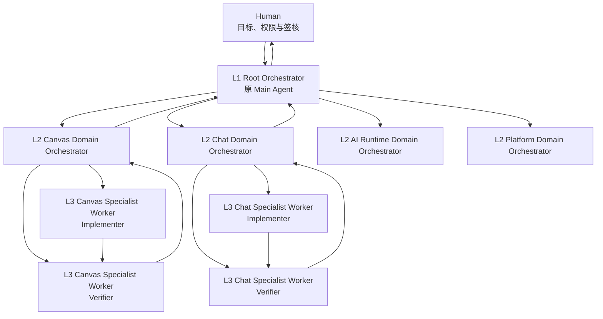
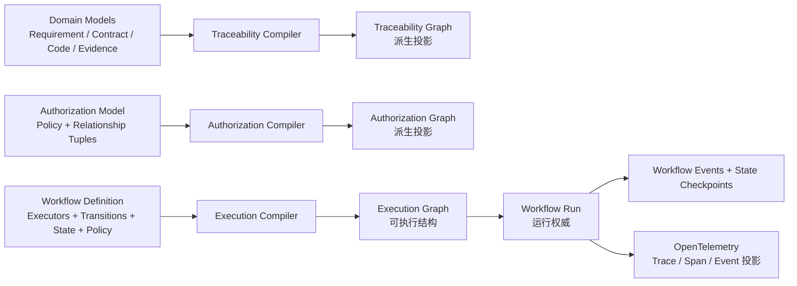
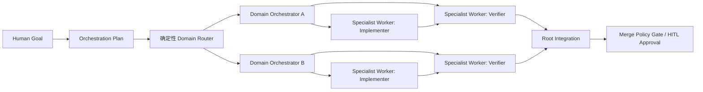
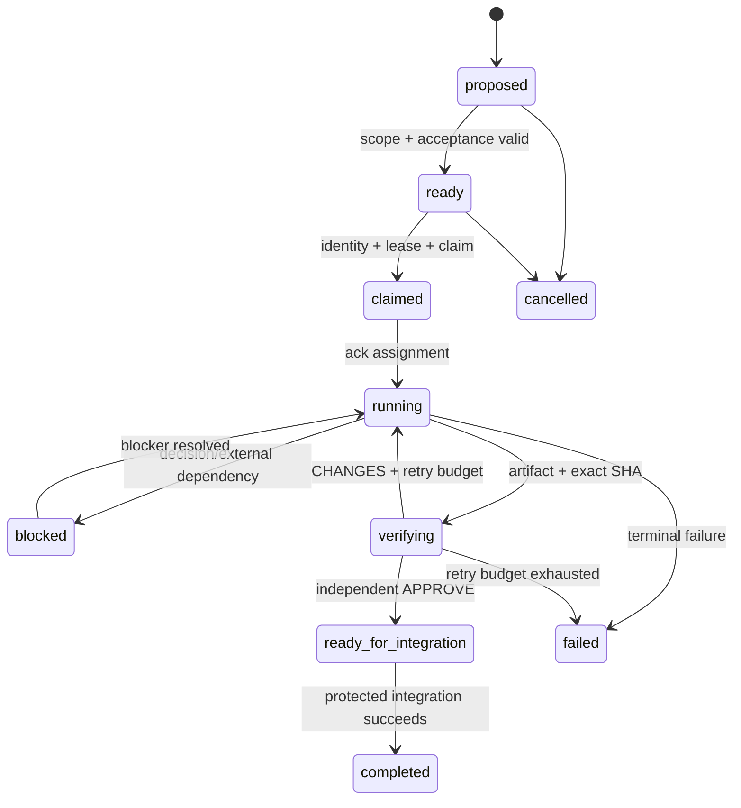

# PROP-HARNESS-AGENT-001 — 分层多 Agent 编排与可执行图控制平面

- 状态：Proposed
- 日期：2026-08-07
- Issue：#658
- 决策者：项目人类负责人
- 建议负责人：coord-architecture
- 影响范围：`.harness/agents/`、`.agents/skills/`、coord-service、Graph Kernel、GitHub 投影、agent runtime
- 实施原则：一个 backlog item 对应一个 issue、一个分支、一个 PR
- 建立在：ADR-009、ADR-010、ADR-103、portable-role-runtime、PROP-HARNESS-GRAPH-001（PR #642）
- 模板依赖：Harness V2 的 TPL-ROL-001、TPL-AGT-001、TPL-MOD-001、TPL-TSK-001、TPL-EVT-001、TPL-RVW-001、TPL-EVD-001、TPL-HOF-001
- 文档定位：人类决策与迁移参考；不是 Agent 启动或每轮必读材料
- 旧标题：三层 Agent 架构与模块知识控制平面（兼容名称，保留检索）

---

## 1. 摘要

WorkspaceX 已经具备多 Agent 协作的主要零件：唯一 `coord-main`、module coordinator、worker/reviewer 角色、coord-service 的身份/lease/claim、GitHub issue/PR 总线、portable role 生成，以及若干 subagent 规格。

当前缺口不是再增加一种 agent，而是把这些零件收敛成一套能被机器执行、观察和恢复的三层组织协议：

> Root Orchestrator（原 Main Agent）负责全局推理、规划和集成；Domain Orchestrator（原 Module Agent）负责领域内规划、知识和交付质量；Specialist Worker（原 Subagent）负责一个有明确输入输出的原子任务。

分层 Agent 与控制平面资产严格分离：

- Authorization Model/Graph（原 Role Graph）保存长期权限；
- Domain Skill（原 Module Skill）保存经过验证的领域开发知识；
- Workflow Definition 编译为 Execution Graph（原 Work Graph），定义工作如何流动；
- Workflow Run、Workflow Event、State Checkpoint 保存本次运行状态；
- Contract、代码、Schema、ADR 继续保存权威事实和设计理由。

本 Proposal 不把层级关系写成新的散文 SOP，而是定义角色、任务、事件、证据、权限和状态转换的结构化模型，并通过 renderer 生成短消息、看板和人类文档。

Proposal 被接受后，真正的运行权威是已登记的 Role、Domain、Skill、Task Assignment、Workflow Event 和 Policy schema；本文件退化为设计理由与迁移档案，不与运行模型双写事实。

---

## 2. 当前架构与真实缺口

### 2.1 已经存在的能力

| 能力 | 当前权威/实现 | 状态 |
|---|---|---|
| 唯一 Main Coordinator 与合并权 | ADR-010、`coord-main` role、D1 role claim | 已有 |
| Module Coordinator 边界 | ADR-010、module-coordinator skill、registry | 部分模块已有 |
| Worker/Reviewer 角色 | `.harness/agents/roles/`、portable role contract | 已有有限集合 |
| Subagent 中立规格 | `.harness/agents/*.yaml` | 已有多种任务角色 |
| 身份、lease、claim | coord-service / D1 | 已有 |
| GitHub issue/PR 审计链 | harness sync、review/merge gate | 已有 |
| Claude/Codex 双表面生成 | `.harness/agents/roles/*.yaml` → generated surfaces | 已有 |
| Module Skill 骨架 | `.agents/skills/mod-_template/` | 只有骨架，核心模块未全覆盖 |
| 自动派生子 agent 并登记 | ADR-010 已决定 | 尚未落地 |
| 结构化 Assignment/Event/Result | Harness V2 已规划 | 尚未形成统一运行协议 |
| Work Graph checkpoint/recovery | Graph Proposal 已规划 | 尚未落地 |

### 2.2 当前结构问题

1. 角色事实同时出现在 registry、role YAML、skill、SOP、onboarding 和 ADR 中。
2. 一些 worker 直接 `reports_to: coord-main`，模块层不能稳定承接日常规划和质量责任。
3. 一个 module coordinator 可能同时覆盖 chat、agent、skills、canvas、recording、e2e，模块边界和知识边界不一致。
4. 核心模块没有一一对应的 Module Skill，迭代知识仍主要留在 issue、聊天和个人上下文。
5. Subagent 可以被工具创建，但尚无统一的自动登记、claim、预算和孤儿回收协议。
6. Main、Module、Worker 之间主要传自由文本，背景反复转述，状态难以机械推导。
7. producer、reviewer、verifier 的独立性依赖流程纪律，尚未完全成为 Role Graph 和 Work Graph 约束。
8. D1 实时协调状态、GitHub 审计投影与 Git 规格之间尚无统一 revision/provenance 链。

### 2.3 规范术语注册表

本 Proposal 采用“规范名 + 兼容旧名”机制。稳定 ID、历史文档和现有 CLI 不因术语升级失效；新 schema、renderer 和文档必须输出规范名，读取器在迁移期接受旧名。

#### 组织与知识

| Term ID | 当前/旧名 | 新规范名 | 使用边界 |
|---|---|---|---|
| TERM-ORG-001 | 三层 Agent 架构 | **Hierarchical Multi-Agent Orchestration / 分层多 Agent 编排** | 整体架构；强调 orchestration 而非组织图 |
| TERM-ORG-002 | Main Agent、Main Coordinator | **Root Orchestrator / 根编排器** | `coord-main` 的显示名；稳定 role ID 不改 |
| TERM-ORG-003 | Module Agent、Module Coordinator | **Domain Orchestrator / 领域编排器** | `coord-<module>` 的显示名；运行时 kind 继续兼容 `module-coordinator` |
| TERM-ORG-004 | Subagent | **Specialist Worker / 专业工作者** | L3 总称；具体 subtype 使用 Implementer/Explorer/Reviewer/Verifier |
| TERM-ORG-005 | Module | **Domain / 领域** | 责任与知识边界；只有经 DDD 证明时才称 Bounded Context |
| TERM-KNW-001 | Module Skill | **Domain Skill / 领域技能包** | 领域知识入口；保留 skill 作为产品机制名称 |
| TERM-ORG-006 | parent chain | **Supervision Hierarchy / 监督层级** | 运行实例的 supervisor 关系 |
| TERM-ORG-007 | Agent tree | **Orchestration Hierarchy / 编排层级** | Root→Domain→Worker 的可视化视图 |
| TERM-ORG-008 | shadow agent | **Unregistered Worker / 未登记工作者** | 没有 Directory identity/lease/claim 的非法运行实例 |
| TERM-ORG-009 | orphan agent | **Orphaned Worker / 孤立工作者** | supervisor 失效但仍有未终结状态的 Worker |

#### Graph Engineering 与工作流

| Term ID | 当前/旧名 | 新规范名 | 使用边界 |
|---|---|---|---|
| TERM-GRF-001 | Spec Graph | **Traceability Graph / 追踪图** | Requirement→Feature→Contract→Code→Evidence 的派生图 |
| TERM-GRF-002 | Role Graph | **Authorization Model / 授权模型**；派生视图称 **Authorization Graph** | 权威是 model + relationship tuples，不把图数据库当权限权威 |
| TERM-GRF-003 | Work Graph | **Execution Graph / 执行图** | Workflow Definition 编译出的可执行结构；动态状态属于 Workflow Run |
| TERM-GRF-004 | Graph Snapshot | **Graph Projection Snapshot / 图投影快照** | 可重建缓存/CI artifact，不是权威源 |
| TERM-WFL-001 | GraphDefinition | **Workflow Definition / 工作流定义** | 版本化 executor、transition、state、policy 定义 |
| TERM-WFL-002 | GraphRun | **Workflow Run / 工作流运行实例** | 绑定 exact Workflow Definition revision 的一次执行 |
| TERM-WFL-003 | Node（运行图语境） | **Executor / 执行器** | 运行时处理单元；Traceability Graph 中仍称 Node |
| TERM-WFL-004 | Edge（运行图语境） | **Transition / 转换** | 确定性路由；静态图关系仍称 Edge |
| TERM-WFL-005 | Main Plan | **Orchestration Plan / 编排计划** | Root Orchestrator 的版本化全局计划 |
| TERM-WFL-006 | Assignment | **Task Assignment / 任务分派** | 目标、scope、acceptance、budget、authority snapshot |
| TERM-WFL-007 | Work Event | **Workflow Event / 工作流事件** | append-only 运行事实 |
| TERM-WFL-008 | Result/Verdict | **Task Result / Review Decision** | 产出与审查决定分开建模 |
| TERM-WFL-009 | Context Pack | **Task Context Bundle / 任务上下文包** | 通过 selector 生成的最小输入集合 |
| TERM-WFL-010 | checkpoint | **State Checkpoint / 状态检查点** | 持久化恢复边界；查询视图可称 State Snapshot |
| TERM-WFL-011 | Protected Merge Gate | **Merge Policy Gate / 合并策略门** | exact revision、review、CI、evidence 的确定性 policy enforcement |
| TERM-WFL-012 | Human Gate | **Human-in-the-loop Approval / HITL 审批** | 人类暂停、检查、批准、拒绝和恢复 |
| TERM-WFL-013 | reality anchor | **Ground-truth Evidence / 真实依据证据** | E2E、数据库、测试、生产结果、revision/hash |
| TERM-WFL-014 | exact-SHA review | **Revision-bound Review / 版本绑定审查** | Review Decision 绑定不可变 revision |
| TERM-WFL-015 | pending writes | **Pending Writes / 待提交写入** | 保留行业术语；同一 superstep 已成功 executor 的输出 |
| TERM-WFL-016 | fan-out/fan-in | **Fan-out/Fan-in / 扇出扇入** | 保留行业术语；并发 dispatch 与 barrier aggregation |

#### 运行与可观测性

| Term ID | 当前/旧名 | 新规范名 | 使用边界 |
|---|---|---|---|
| TERM-RUN-001 | Agent Instance | **Agent Runtime Instance / Agent 运行实例** | Directory ULID 标识的 actor，不等于 Role |
| TERM-RUN-002 | task/path claim | **Resource Claim / 资源认领** | D1 原子排他关系 |
| TERM-RUN-003 | lost lease | **Lease Expiration / 租约到期** | 到期后 fail closed，不能继续写 |
| TERM-OBS-001 | 一次 Work Run | **Trace / 追踪** | 仅用于 OpenTelemetry 可观测性投影，不替代 Workflow Run 权威 |
| TERM-OBS-002 | NodeRun | **Span / 跨度** | 一个 Executor 尝试的可观测性投影 |
| TERM-OBS-003 | Progress log | **Span Event / Workflow Event** | OTel 中为 Span Event；业务权威仍是 Workflow Event |

命名优先级：schema 字段和 UI 使用英文规范名对应的稳定 snake_case；中文用于人类视图；旧名只进入 `legacy_aliases`，禁止继续产生新的同义词。

### 2.4 命名迁移与兼容规则

术语升级不等于破坏现有协议。迁移遵循以下规则：

1. `coord-main`、`coord-<module>`、`H3A-*`、`TPL-*`、文件路径和 GitHub issue/PR 编号保持不变；
2. 新文档、schema、API、事件和看板只写规范名；旧名仅作为 `legacy_aliases` 或读取兼容字段；
3. 读取器在一个明确版本窗口内接受旧字段，writer 从切换日起只产生新字段；
4. doctor 拒绝新增未登记同义词，并验证旧名到规范名是一对一映射；
5. 历史 ADR 和已发布日志不批量改写，通过 Term ID 建立可追踪映射。

首批字段迁移：

| 旧字段/对象 | 新字段/对象 | 兼容策略 |
|---|---|---|
| `module_id` | `domain_id` | 旧字段只读；稳定值可暂时保留 `MOD-*`，新实例使用 `DOM-*` |
| `parent_agent_id` | `supervisor_agent_id` | 读取双兼容，新写只用新字段 |
| `work_event` | `workflow_event` | 事件 kind 不变，只升级 envelope 名称 |
| `result/verdict` | `task_result/review_decision` | 拆分“产出事实”和“审查决定” |
| `context_pack` | `task_context_bundle` | selector 行为不变 |
| `graph_definition/run` | `workflow_definition/run` | stable instance ID 不变 |

`module-coordinator` 等已被运行时消费的 enum 暂不直接重命名；通过 display name 和 schema version 渐进迁移，避免“为了名词正确”制造协议中断。

### 2.5 术语依据

- Anthropic 使用 **workflow**、**orchestrator-workers**、routing、parallelization、evaluator-optimizer，支持本 Proposal 的 Root/Domain Orchestrator 与 Specialist Worker 命名。
- LangGraph 使用 **StateGraph、checkpoint、StateSnapshot、pending writes、human-in-the-loop、durable execution**，支持执行图持久化术语。
- Microsoft Agent Framework 使用 **workflow、executor、edge、event、superstep、sequential/concurrent/handoff orchestration**，支持 Executor/Transition/Workflow Event 命名。
- OpenFGA 使用 **Authorization Model + relationship tuples**，因此权限权威称 Authorization Model，Authorization Graph 只作为派生视图。
- OpenTelemetry 使用 **trace、span、event**，因此这些名称只用于观测投影，不与 Workflow Run/Executor 的业务状态混写。

参考资料：

- https://www.anthropic.com/engineering/building-effective-agents
- https://platform.claude.com/docs/en/managed-agents/multiagent-orchestration
- https://docs.langchain.com/oss/python/langgraph/overview
- https://docs.langchain.com/oss/python/langgraph/persistence
- https://learn.microsoft.com/en-us/agent-framework/workflows/orchestrations/
- https://learn.microsoft.com/en-us/agent-framework/workflows/workflows
- https://openfga.dev/docs/interacting/managing-relationships-between-objects
- https://opentelemetry.io/docs/specs/otel/trace/api/

---

## 3. 目标

### G1：建立明确的分层编排责任树

```text
L1 Root Orchestrator（原 Main Agent）
  └─ L2 Domain Orchestrator（原 Module Agent）
       └─ L3 Specialist Worker（原 Subagent）
```

最大派生深度固定为三层。Specialist Worker 默认无 `dispatch_authority`，不能继续派生，避免形成不可观察的递归编排层级。

### G2：每个核心 Domain 拥有稳定知识入口

每个核心 Domain（原 Module）必须登记：

- 唯一 `domain_id`；
- 唯一 active Domain Skill；
- 稳定 Domain Orchestrator Role；
- areas/path/contract 边界；
- 验证入口；
- owner 与消费者；
- last verified revision。

Domain Orchestrator Role 是稳定编制；Agent Runtime Instance 按需启动，不要求为每个 Domain 维持空闲常驻会话。

### G3：Root Orchestrator 规划全局，Domain Orchestrator 规划局部，Specialist Worker 执行原子任务

- Root Orchestrator 决定目标、Domain 路由、跨 Domain 依赖、预算和集成顺序；
- Domain Orchestrator 决定领域内任务拆分、实现策略、Specialist Worker 调度和首轮质量处理；
- Specialist Worker 只完成一个具有输入、输出、范围和停止条件的任务。

### G4：通信结构化、短小、可反驳

普通协作只允许 Task Assignment、Progress、Blocker/DecisionRequest、Task Result/Review Decision 四类 Workflow Event。完整背景通过 ID 和 artifact 引用获取，不在层级间复制聊天历史。

### G5：所有 Agent 可见、可度量、可回收

每个 Agent Runtime Instance 在工作前必须有 Directory identity、supervisor、role binding、Resource Claim、lease、预算和 State Checkpoint。看不见的 Worker 视为不存在，不允许写入受控资源。

### G6：生成与验证分离

完成结论必须绑定 exact SHA/artifact hash 和 Ground-truth Evidence。实现者、Domain Orchestrator 和 Root Orchestrator 均不能替独立 Reviewer/Verifier 自签最终 Review Decision。

### G7：简单任务保持简单

单次调用或单 Agent 有界循环能够完成的任务，不得为了利用三层架构而强行拆成多 Agent 图。

---

## 4. 非目标

本 Proposal 不做：

- 不让 Root Orchestrator 成为所有代码的超级 Worker；
- 不为每个目录、文件或小功能创建 Domain Orchestrator；
- 不让 Skill 成为 Contract、代码、Schema 或 ADR 的副本；
- 不允许 Domain Orchestrator 或 Specialist Worker 获得合并权；
- 不允许 Agent 修改人类签核状态；
- 不以多 Agent 数量、消息数量或 token 用量作为成功指标；
- 不把完整聊天历史作为运行状态；
- 不在第一阶段引入新的常驻编排框架或专用图数据库；
- 不一次性迁移全部历史身份和文档；
- 不删除 ADR-010 等历史决策记录。

---

## 5. 设计原则

### P1：人类在 Agent 层级之外

人类定义目标、风险偏好、长期权限和签核。Root Orchestrator 是最高 Agent 控制节点，但不是最终治理主体。

### P2：权限来自 Role，知识来自 Skill，工作来自 Task Assignment

Skill 不能扩大 Role 权限；Task Assignment 不能越过 Role 和 Domain scope；模型上下文不能成为授权依据。

### P3：上级给约束，不给逐 token 指令

Root Orchestrator 给 Domain 目标、范围、依赖、完成契约和预算；Domain Orchestrator 在范围内自主细化。Specialist Worker 接收原子任务，不继承上级完整推理历史。

### P4：代码控制边，模型判断留在节点

任务状态转换、权限检查、预算、retry、fan-out、review freshness 和 merge gate 由确定性代码控制。

### P5：每次交接都是 checkpoint

Root→Domain、Domain→Worker、Worker→Verifier、Domain→Root 的交接都产生版本化 Workflow Event 和可恢复 State Checkpoint。

### P6：独立验证是组织结构，不是提示词要求

Producer 和 Verifier 必须是不同 actor/context；Review Decision 绑定 exact SHA，SHA 改变自动失效。

### P7：引用而不复制

Agent 通过稳定 ID 引用 Domain Skill、Contract、Feature、ADR、Evidence 和 Artifact，不复制它们的正文。

### P8：失败关闭

身份、lease、权限、数据源、review freshness 或证据状态为 UNKNOWN 时，不得继续受保护 transition。

---

## 6. 分层多 Agent 编排



### 6.1 L1 — Root Orchestrator（原 Main Agent）

稳定角色：`coord-main`。

负责：

- 解释人类目标并形成全局计划；
- 读取 Traceability Graph、Authorization Graph、当前 Execution Graph 和真实 WIP；
- 将工作路由到一个或多个 Domain Orchestrator；
- 计算依赖 DAG、最长串行链、热点文件和集成顺序；
- 给 Domain Task Assignment 设置范围、完成契约、预算和并发额度；
- 处理跨模块冲突、模块缺位、外部依赖和 Andon；
- 检查 exact-SHA review、CI、evidence、Closes issue 和 merge state；
- 保持唯一合并权，并将人类签核请求升级给人类。

明确不做：

- 不实现 Domain Orchestrator 可正常承接的业务 feature；
- 不为下级选择具体代码写法；
- 不绕过 Domain Orchestrator 频繁微操普通 Specialist Worker；
- 不兼任最终 reviewer/verifier；
- 不凭自由文本“完成了”推进状态；
- 不修改长期 Authorization Model 以解决一次性任务阻塞。

### 6.2 L2 — Domain Orchestrator（原 Module Agent）

稳定角色：`coord-<module>`，继续使用现有运行时 `kind: module-coordinator`；“Domain Orchestrator”是规范显示名，不新增一个语义重复的 kind。

每个核心 Domain 有稳定 Domain Orchestrator Role，但运行实例按需认领 role lease。控制平面 `coord-architecture` 在组织关系上视为 harness Domain 的 L2 Agent，不成为第四层。

负责：

- 加载唯一绑定的 Domain Skill；
- 将 Root Task Assignment 细化为领域内 Execution Graph；
- 检查 Contract、Invariant、已有 WIP、热点和验证入口；
- 决定保持单 Agent、流水线或有限 fan-out；
- 创建有配额的 Specialist Worker Task Assignment；
- 管理模块内文件/feature claim；
- 处理首轮 review、返工和模块内冲突；
- 聚合 evidence、风险和跨模块影响；
- 将全绿 revision-bound 结果交回 Root Orchestrator。

明确不做：

- 无合并权；
- 不跨模块写文件；
- 不修改 Root Orchestrator 的全局目标和 acceptance；
- 不扩大自己或 Specialist Worker 的 Role 权限；
- 不让自己实现的产物由自己签发最终 Review Decision；
- 不隐藏 Specialist Worker 或在 D1 之外维护未登记队伍。

### 6.3 L3 — Specialist Worker（原 Subagent）

类型包括 implementer、explorer、reviewer、verifier、migration worker、test runner 等。

负责：

- 完成一个明确的原子任务；
- 只读取 Context Selector 选中的最小上下文；
- 只写 Assignment 授权的路径；
- 产生 commit、artifact、evidence、finding、Task Result 或 Review Decision；
- 阻塞时发 DecisionRequest，不自行扩大范围；
- 达到停止条件后结束运行实例。

硬边界：

- 默认 `dispatch_authority: false`，不得继续派生第四层；
- 无合并权、无签核权、无 Authorization Model 修改权；
- 一个实例同时最多持有一个 primary task claim；
- 不能把模型自评作为 evidence；
- 失去 lease 后立即停止写入并 fail closed。

### 6.4 路由例外与失败关闭

正常实现路径必须是 Root→Domain→Worker。Root Orchestrator 只能在以下场景直接分派 L3：

- 为保持独立性而指派跨模块 reviewer/verifier；
- 回收失联 Domain 子树后的恢复任务；
- 迁移期尚未建立 Domain Role 的兼容任务。

直接分派仍必须绑定 `subject_domain`、Domain Skill 和受限 scope，不能获得跨 Domain 实现写权限。迁移完成后，第三种兼容路径退役。

Reviewer/Verifier 属于 L3 原子执行角色，但可以 `reports_to: coord-main`，以避免由被评审 Domain 控制最终 Review Decision。这里的“层”表示责任粒度，不强制所有运行实例只有一种汇报边。

当目标 Domain 缺少 active Domain Role、active Domain Skill 或健康数据源时，Root Orchestrator 将 Task Assignment 保持在 `blocked/UNKNOWN` 并请求修复，不能静默退化为 Root 自己实现。

---

## 7. 权限与责任矩阵

| 能力 | Human | Root Orchestrator | Domain Orchestrator | Specialist Worker |
|---|---:|---:|---:|---:|
| 定义项目目标 | ✅ | 提议/解释 | ❌ | ❌ |
| 人类设计签核 | ✅ | 请求 | 请求 | ❌ |
| 修改长期 Role Policy | ✅/PR review | 提议 | 提议 | ❌ |
| 全局计划与跨模块排序 | 裁决 | ✅ | 提议 | ❌ |
| 创建 Domain Task Assignment | 可 | ✅ | ❌ | ❌ |
| 模块内拆分 | 监督 | 配额/约束 | ✅ | ❌ |
| 创建 Worker Task Assignment | ❌ | 必要时 | ✅ | ❌ |
| 修改业务代码 | ❌ | 原则上否 | 例外 | ✅ |
| 首轮模块质量处理 | ❌ | 监督 | ✅ | reviewer 执行 |
| Revision-bound Review Decision | ❌ | 指派/消费 | 指派/消费 | reviewer/verifier |
| 合并 PR | 人类可保留紧急权 | ✅唯一 Agent 权限 | ❌ | ❌ |
| 回收失联子树 | 可 | ✅全局 | ✅本模块 | ❌ |
| 修改自己的任务状态 | ❌ | 通过命令 | 通过命令 | 通过命令 |

任何角色的 `Skill`、prompt 或 Assignment 都不能扩大此矩阵。

---

## 8. Domain 与 Domain Skill（原 Module / Module Skill）

### 8.1 Domain 不是目录别名

Domain 是具有稳定责任、契约边界、代码边界和验证入口的领域单元。一个目录可以被多个 Domain 引用，但同一权威事实必须只有一个 owner domain。只有边界经过 DDD 分析并具备独立语言/模型时才称 Bounded Context。

建议首批核心模块：

- platform；
- identity/auth；
- chat；
- canvas-diagram；
- collaboration/realtime；
- ai-runtime；
- agent/skill-directory；
- contract/control-plane；
- e2e/release-readiness。

最终清单必须通过 inventory 从真实代码、Contract Bundle 和 ownership 推导，由人类签核，不能直接把本建议当作已接受注册表。

### 8.2 Domain Skill 的职责

每个核心 Domain 恰好有一个 active Domain Skill，例如：

```yaml
template_id: TPL-MOD-001
template_version: 1
instance_id: MODKNOW-canvas-diagram
skill_id: SKL-MOD-CANVAS-001
domain_id: DOM-CANVAS-DIAGRAM
status: active
authority_refs:
  contracts: []
  adrs: []
  source_paths: []
  verification: []
last_verified:
  commit: <exact-sha>
  evidence_refs: []
```

Domain Skill 保存：

- 模块边界和权威入口；
- 技术架构导航；
- 不变量和禁区引用；
- 常见任务的操作路径；
- 验证命令与现实证据入口；
- 经验证的陷阱、失败模式和恢复方法；
- 与其他模块的稳定接口。

Domain Skill 不保存：

- 完整 API/Contract 副本；
- 代码中可直接推出的类型和常量；
- 临时 issue 状态；
- 当前 Agent 的任务进度；
- 没有证据的一次性经验；
- Role 权限或凭据。

### 8.3 迭代知识晋升

```text
Workflow Event / Issue 发现
  → Candidate Knowledge
  → 复现或第二次复用
  → Domain Reviewer 核验
  → Skill PR + evidence
  → Domain Skill active knowledge
```

一次调试叙述不会自动进入 Skill。半年未被验证、来源失效或与代码矛盾的条目标记 STALE，不继续作为 Agent 上下文。

---

## 9. Graph Engineering：三类模型、三张图与一套运行态

本 Proposal 所说的 Graph Engineering 不是手绘流程图，也不是默认引入图数据库。它是把系统的关系、控制流、状态和策略建模为可验证、可执行、可恢复的图，并明确每张图的 writer、authority、projection 与 runtime。



Graph Engineering 的四条权威边界：

1. Domain Models、Authorization Model、Workflow Definition 分别是三类慢变权威，writer 必须分离；
2. Traceability Graph 与 Authorization Graph 是可重建的查询投影，不能被人工直接改状态；
3. Execution Graph 是 Workflow Definition 的编译结果，Workflow Run、Workflow Event 和 State Checkpoint 保存动态事实；
4. OpenTelemetry Trace/Span/Event 只承载可观测性，不反向成为任务、授权或完成状态的事实源。

### 9.1 Traceability Graph（原 Spec Graph）

回答“任务涉及什么”：

```text
Requirement → Feature → Domain → Contract → Code → Verification → Evidence
Domain → has_skill → DomainSkill
```

### 9.2 Authorization Model / Graph（原 Role Graph）

回答“谁有权做什么”：

```text
RootOrchestratorRole → may_assign → DomainOrchestratorRole
DomainOrchestratorRole → may_assign → SpecialistWorkerRole
Role → scoped_to → Domain/Area/Path
Role → may_load → Skill
Role → may_use → Tool
ReviewerRole → may_verdict → ArtifactType
```

Authorization Model 是慢变、Git review、人类可审计的安全上界，关系用 relationship tuples 表达；Authorization Graph 是查询/可视化投影。运行时 Agent 不能创建新长期权限关系。

### 9.3 Execution Graph（原 Work Graph）

回答“这次任务怎样流动”：



所有边的 scope、predicate、预算、retry 和失败路径由代码执行；Mermaid 只是派生视图。

---

## 10. 核心数据模型与规范字段

### 10.1 Role Definition — TPL-ROL-001

```yaml
template_id: TPL-ROL-001
template_version: 1
instance_id: ROL-module-canvas
stable_role_id: coord-canvas
layer: domain_orchestrator
kind: module-coordinator # legacy runtime enum；迁移窗口内保留
domain_id: DOM-CANVAS-DIAGRAM
reports_to: coord-main
dispatch:
  allowed_child_layers: [specialist_worker]
  allowed_roles: [canvas-implementer, canvas-verifier]
authority:
  merge: false
  signoff: false
  write_scopes: []
skill_refs:
  - SKL-MOD-CANVAS-001
```

### 10.2 Agent Runtime Instance Registration — TPL-AGT-001

稳定 Role 与运行实例分离：

```yaml
template_id: TPL-AGT-001
template_version: 1
instance_id: AGT-01...
directory_agent_id: agt_01...
stable_role_id: coord-canvas
supervisor_agent_id: agt_main...
task_id: TSK-658-canvas-01
status: leased
spawned_at: <server-time>
lease_ref: role:coord-canvas
```

Agent name、会话名和模型名都不是身份。Directory ULID 才是运行时 actor。

### 10.3 Task Assignment — TPL-TSK-001

```yaml
template_id: TPL-TSK-001
template_version: 1
instance_id: TSK-658-canvas-01
parent_task_id: TSK-658-main
assigned_by: <directory-main-agent-id>
assignee_role: coord-canvas
objective: 建立 Mermaid 到 Fabric 对象的稳定身份映射
scope:
  include: []
  exclude: []
dependencies: []
acceptance_refs: []
skill_refs:
  - SKL-MOD-CANVAS-001
budget:
  max_parallel_workers: 1
  max_total_worker_runs: 2
  max_retries: 1
  token: null
  cost: null
  wall_time_ms: null
authority_snapshot_hash: <authorization-model-hash>
```

默认只有一个并行实现 Worker，并为独立 Verifier 预留第二个运行实例。Verifier 不算实现并行度，但计入 `max_total_worker_runs`。只有存在真实并行、上下文隔离或专业化要求时，Root Orchestrator 才显式提高 Worker 配额。

### 10.4 Workflow Event — TPL-EVT-001

```yaml
template_id: TPL-EVT-001
template_version: 1
instance_id: EVT-658-0007
kind: progress
task_id: TSK-658-canvas-01
actor: <directory-agent-id>
head_sha: <exact-sha>
delta:
  implemented: []
blockers: []
evidence_refs: []
next_action:
  owner_role: canvas-verifier
  action: verify_exact_sha
```

### 10.5 Task Result / Review Decision

```yaml
template_id: TPL-RVW-001
template_version: 1
instance_id: RVW-pr000-abcdef1
task_id: TSK-658-canvas-01
reviewer: <directory-agent-id>
producer: <different-directory-agent-id>
exact_sha: abcdef123456
decision: approve
evidence_refs: []
findings: []
```

`reviewer == producer`、SHA 不匹配、evidence 不可读或 reviewer lease 无效时 Review Decision 无效。Task Result 只陈述产物和执行结果，不能隐含 APPROVE。

---

## 11. Task Assignment 生命周期与状态机



状态只能由命令按 transition policy 修改。Agent 不能手改 YAML/JSON 把任务标成 completed。

---

## 12. 分层编排运行协议

### 12.1 Root Orchestration Planning

输入：Human Goal、Traceability Graph revision、当前 WIP、Domain health、依赖、预算。

输出：

- 一个 Orchestration Plan；
- 一个或多个 Domain Task Assignment；
- 跨 Domain DAG；
- Merge Policy Gate；
- 明确的 UNKNOWN/DecisionRequest。

### 12.2 Domain Orchestration Planning

Domain Orchestrator 验证 scope 和 Domain Skill freshness 后，选择：

1. 单 Specialist Worker 有界循环；
2. implementer → verifier 流水线；
3. 无共享写的有限 fan-out/fan-in；
4. 升级 Root Orchestrator 处理跨 Domain 依赖。

Domain Orchestrator 不得为了显示“在编排”而拆分本可由一个 Agent 完成的原子任务。

### 12.3 Specialist Worker Execution

Specialist Worker 启动前原子完成：

1. 解析 stable role 到 Directory identity；
2. 验证 supervisor 和 Authorization Model；
3. 登记或恢复 Agent Runtime Instance；
4. ack Task Assignment；
5. 获取 Resource Claim；
6. 获取最小 Task Context Bundle；
7. 执行并持续 heartbeat；
8. 写 Workflow Event、Artifact 和 Handoff；
9. 释放 claim/lease。

任一步失败则不开始受控写入。

### 12.4 Verification and Integration

- Verifier 使用新上下文，只读取产物、验收和必要来源；
- Review Decision 绑定 exact SHA/artifact hash；
- Domain Orchestrator 消费 Review Decision，处理领域内返工；
- Root Orchestrator 只集成全绿结果；
- merge 后产生 Workflow Event 和最终 evidence；
- 人类签核仍只能由人类身份完成。

---

## 13. 通信协议

### 13.1 允许的 Workflow Event

| 事件 | 方向 | 用途 |
|---|---|---|
| Task Assignment | Root→Domain、Domain→Worker | 目标、范围、验收、预算 |
| Progress | 下级→上级/总线 | 只报告新增事实和证据 |
| Blocker/DecisionRequest | 下级→授权层 | 请求范围外决策 |
| Task Result/Review Decision | Producer/Verifier→上级 | exact revision 的产出与审查决定 |

### 13.2 普通消息的人类视图

```text
TSK-658-canvas-01 · progress · abcdef1
变化：stableNodeId 映射已实现
阻塞：无
证据：EVD-canvas-unit-0042
下一步：canvas-verifier 验证 exact SHA
```

普通事件默认不超过 12 行。只有 ADR、多方案权衡、事故复盘、人类签核材料和 P0/P1 finding 允许长篇 Markdown。

### 13.3 禁止的通信

- 重复任务背景；
- “正在努力”“基本完成”等无证据状态；
- 把完整上游聊天复制给下游；
- 用自由文本改变 scope、权限或 acceptance；
- Domain Orchestrator 绕过总线私下维护 Specialist Worker 状态；
- Root Orchestrator 依靠消息数量判断进度。

---

## 14. Task Context Bundle（原 Context Pack）

每个 Agent 只获取与 Task Assignment 相关的 Task Context Bundle：

```yaml
task_ref: TSK-658-canvas-01
role_ref: ROL-canvas-implementer
domain_skill_ref: SKL-MOD-CANVAS-001
spec_revision: <exact-sha>
required_refs:
  contracts: []
  adrs: []
  source_paths: []
  evidence: []
excluded_context:
  - parent_private_reasoning
  - unrelated_issue_history
  - sibling_raw_logs
```

Root Orchestrator 不加载所有 Domain Skill；Domain Orchestrator 不加载其他领域完整知识；Specialist Worker 不继承 Root/Domain 的完整对话。需要更多上下文必须产生显式 retrieval event。

---

## 15. 存储与权威边界

| 数据 | 权威位置 | 说明 |
|---|---|---|
| Role Definition / Domain Registry | Git | 慢变、PR review |
| Domain Skill | Git | 引用 Contract/ADR/代码，不复制权威事实 |
| Feature/Contract/Invariant | Git 领域模型 | 产品规格权威 |
| Runtime Agent Identity | Platform Directory / D1 | Directory ULID |
| Task Assignment/Resource Claim/Lease | coord-service / D1 | 实时协调权威 |
| Workflow Event/State Checkpoint | coord-service event store | 追加式，可恢复 |
| Issue/PR/Comment | GitHub | 人类审计投影，不是 lease 权威 |
| Code/Commit | Git/worktree | 独立 worktree |
| Test/E2E logs | CI artifact/evidence store | 绑定 exact SHA |
| Graph Projection Snapshot | 派生缓存/CI artifact | 可重建，不人工维护 |

D1 不保存完整聊天历史。State Checkpoint 保存任务状态、artifact refs、预算、frontier、pending writes 和 exact revisions。

---

## 16. Durable Execution、失败恢复与防断链

### 16.1 Agent 失联

- lease 到期后禁止继续写；
- Domain Orchestrator 可回收本领域 Specialist Worker；
- Root Orchestrator 可回收整个 Domain 子树；
- 新实例从最后可信 State Checkpoint 和 Git artifact 恢复；
- 不依赖旧会话记忆续上。

### 16.2 Supervisor 失联

Supervisor lease 失效不会立即删除子成果。已提交 commit、artifact、Workflow Event 和 pending writes 保留；未提交的本地状态不算成果。Root Orchestrator 根据 Supervision Hierarchy 重新挂接或回收。

### 16.3 部分 fan-out 失败

同一 super-step 已成功分支的结果进入 pending writes；恢复时只重跑失败分支。具有外部副作用的节点必须有 idempotency key 或 compensation edge。

### 16.4 数据源失联

Directory、coord-service、GitHub、CI 或 evidence store 不可读时显示 UNKNOWN。受保护 transition 非零退出，不把“没有读取到”渲染为“没有任务/没有问题”。

### 16.5 SHA 漂移

PR head、artifact 或 Workflow Definition revision 改变后，旧 Review Decision、Task Context Bundle 和 readiness 自动 STALE；必须重新验证受影响路径。

---

## 17. 是否使用多 Agent 的决策门

默认选择顺序：

```text
确定性代码
→ 单次模型调用
→ 单 Agent 有界循环
→ Domain Orchestrator + 一个 Specialist Worker
→ 有限 Execution Graph
```

满足以下任一治理条件，或至少两项效率条件，才扩大为多个 Specialist Worker：

- 治理：需要 producer/verifier 独立；
- 治理：需要暂停、审批、断点恢复；
- 效率：存在无共享写的真实并行；
- 效率：需要隔离大量无关上下文；
- 效率：不同步骤需要显著不同工具、权限或专业知识。

每次扩大必须声明 `max_parallel_workers`、`max_total_worker_runs`、`max_retries`、成本/时间预算和 fan-in 验收。没有单 Agent 基线和可测收益，不扩大。

---

## 18. 看板与可视化

看板从 Authorization/Execution Graph 派生，至少回答：

- Root Orchestrator 当前 Orchestration Plan revision；
- 每个 Domain 的 Domain Orchestrator、Domain Skill freshness 和 WIP；
- 每个 Task Assignment 的 owner、frontier、blocker 和 evidence；
- 每个 Specialist Worker 的 supervisor、lease、claim 和最后事件；
- 当前最长串行链；
- orphan/stale agent；
- Review Decision revision freshness；
- UNKNOWN 数据源；
- token/cost/time 与预算偏差。

Orchestration Hierarchy、Execution DAG、Agent Runtime Instance 生命周期图均从模型生成，不人工维护第二份 Mermaid。

---

## 19. 成功指标

### 结构指标

- 核心 Domain 有唯一 active Domain Skill：100%；
- Domain Skill 有有效 Domain/Role/Contract/Verification 引用：100%；
- Agent Runtime Instance 有 Directory identity、supervisor、role、task、lease：100%；
- Specialist Worker 最大派生深度超过三层：0；
- Unregistered Worker：0；
- Role/Skill/Task Assignment 越权：0。

### 协作指标

- 普通事件人类视图不超过 12 行；
- 无证据“完成”声明：0；
- Review Decision 绑定 exact SHA：100%；
- producer 与 final verifier 相同：0；
- Root/Domain/Worker 间复制完整聊天历史：0；
- 数据源失败误显示 PASS/空队列：0。

### 恢复指标

- lease 到期资源可机械回收：100%；
- checkpoint 后恢复不重复已成功副作用：100%；
- stale Review Decision 自动失效：100%；
- Orphaned Worker 检测延迟在定义 SLA 内：100%。

### 效率指标

同时观察：

- merged PR flow-time median；
- open WIP p90 age；
- oldest open PR age；
- Root Orchestrator 等待 Domain 结果的时间；
- Domain Orchestrator 等待 verifier 的时间；
- 重复背景 token；
- 每个完成 feature 的 token/cost/latency；
- CHANGES→next push 等待时间。

禁止只用已合并 PR 中位数或 Agent 数量证明三层架构有效。

---

## 20. 与现有架构的关系

| 现有资产 | 本 Proposal 的处理 |
|---|---|
| ADR-010 | 保留为已接受组织原则；本 Proposal 将其升级为结构化、可执行协议 |
| ADR-009 / coord-service | 继续作为 identity/lease/claim 权威，不新建协调权威 |
| ADR-103 portable roles | 继续生成 Claude/Codex 表面；Role Definition 成为其输入 |
| `.harness/agents/registry.yaml` | 迁移为 Directory 的受控投影，逐步删除重复 responsibilities 散文 |
| coordinator/module-coordinator skills | 迁移为短运行入口；职责事实由 Role/Domain 模型提供 |
| `.harness/agents/*.yaml` subagents | 注册为 L3 Specialist Worker Role，不再是孤立 prompt 文件 |
| Module Skill 模板 | 兼容旧路径，语义升级为 TPL-MOD-001 Domain Skill 并建立 freshness/reference gate |
| Graph Kernel | 编译 Traceability/Authorization/Execution Graph 并提供约束/视图 |
| GitHub issue/PR | 保留审计投影和人类协作入口，不承担实时 lease |
| Harness V2 templates | 复用既有永久 Template ID，不创建第二套格式 |

如 Harness V2 Registry 尚未合入，本 Proposal 只定义语义，不预先创建未登记的模板实例。

---

## 21. 迁移策略

### Wave 0 — 决策与 inventory

- 人类接受/修订 Proposal；
- inventory 当前 Role、Agent、Domain、Skill、Specialist Worker、旧名和重复职责事实；
- 冻结新增自由格式 agent 角色，但不破坏历史读取。

### Wave 1 — Role/Domain/Skill 模型

- 建立 Domain Registry；
- 把现有角色映射到 L1/L2/L3；
- 为核心 Domain 建立 Domain Skill；
- 先做引用和 freshness gate，不立刻删除旧 skill/SOP。

### Wave 2 — Task Assignment/Workflow Event 协议

- 落地 TPL-TSK-001、TPL-EVT-001、TPL-RVW-001 renderer；
- Root→Domain、Domain→Worker 双层派工进入结构化双写；
- 旧自由文本消息继续可读，但不再作为状态权威。

### Wave 3 — Runtime identity 与 recovery

- dispatch 时自动登记 Specialist Worker；
- 原子 identity + claim + lease；
- Supervision Hierarchy、quota、orphan sweep；
- State Checkpoint/resume 与 stale Review Decision gate。

### Wave 4 — Canvas-Diagram 试点

选一个下一次真实 Fabric.js/Mermaid feature：

```text
Root Task Assignment
→ Canvas Domain Orchestrator
→ Canvas Implementer
→ Canvas Verifier
→ Domain Task Result
→ Root Integration
```

旧流程并行只读对照；记录信息损失、恢复时间、重复 token、质量、成本和 flow time。

### Wave 5 — 人类 Go/No-Go

- Go：逐模块迁移；
- Revise：修订 schema/协议并继续单模块试点；
- No-Go：保留 ADR-010 + 当前运行方式，冻结新模型，不强行扩张。

### Wave 6 — 收敛旧文档

只有新模型完整覆盖并通过对照后，才删除 registry/SOP/skill 中的重复角色事实。历史 ADR 保留。

---

## 22. 风险与缓解

| 风险 | 缓解 |
|---|---|
| Root Orchestrator 成为中央瓶颈 | Root 只处理全局路由、跨 Domain 决策和集成；领域内自治 |
| Domain 形成信息孤岛 | Traceability Graph 稳定引用、跨 Domain 影响边、Root 集成视图 |
| Skill 膨胀成新百科 | 短入口、按任务引用、证据晋升、STALE/体积 gate |
| 过度拆分导致 token/延迟上升 | 单 Agent 优先、默认一个并行 Worker、必须有基线 |
| 层级转述造成信息损失 | 传结构化状态和 artifact refs，不传摘要链 |
| Domain 自产自审 | 独立 verifier actor/context + revision-bound gate |
| Specialist Worker 成为未登记劳动力 | dispatch-before-write 自动登记、D1 supervisor/lease/claim |
| Supervisor 失联造成 Orphaned Worker | Supervision Hierarchy、TTL、orphan sweep、State Checkpoint/reclaim |
| Skill 扩大权限 | Authorization Model 是权限上界，Skill 不参与授权计算 |
| 三套模型/图状态冲突 | Domain/Authorization/Workflow writer 分离，稳定 ID 引用，不互相反写 |
| 图工程退化为手绘流程图 | 图只从权威模型编译；图、运行、观测三层分别验证 |
| 图数据库成为新的事实孤岛 | 第一阶段使用 Git + D1 保存权威模型和运行状态，图存储仅作可重建投影 |
| 指标被 Goodhart 化 | 同时看质量、成本、延迟、open WIP、现实结果 |
| 迁移影响正在开发的 feature | 双轨读取、单模块试点、Go/No-Go 后才批量迁移 |

---

## 23. 启动条件

实施前必须满足：

1. 人类接受或修订本 Proposal；
2. #658 保持总追踪 issue；
3. 每个 backlog item 单独 issue/branch/PR；
4. 指定 coord-architecture 负责协议实现；
5. Graph Kernel 与 Harness V2 Registry 的依赖顺序明确；
6. 当前 Domain/Role/Skill inventory 完成；
7. 试点 Domain 和真实 feature 由人类确认；
8. 所有开发使用独立 worktree；
9. 不把迁移塞进在途产品 feature；
10. 没有自动登记前，不允许扩大运行时 Specialist Worker 数量。

---

## 24. 完成定义

分层多 Agent 编排与 Graph Engineering 只有同时满足以下条件才算启用：

- Root/Domain/Worker 三层 Role schema 和 Authorization Model 机械生效；
- 核心 Domain 全部有唯一 active Domain Skill；
- Root→Domain→Worker Task Assignment 可执行并可追溯；
- 所有运行 Agent 自动登记、可见、可度量、可回收；
- Specialist Worker 不可派生第四层；
- Workflow Event、Task Result、Review Decision 使用统一 envelope；
- producer/verifier 分离且 Review Decision 绑定 exact revision；
- lease/Resource Claim/State Checkpoint/orphan recovery 反证通过；
- Domain Model、Authorization Model、Workflow Definition、Workflow Run 和 telemetry 权威边界无冲突；
- Traceability/Authorization/Execution Graph 均可由权威模型重建，不能人工反写；
- Canvas-Diagram 真实试点完成并有对照数据；
- 三层方案相对单 Agent 基线有可测收益，或人类明确接受其治理收益；
- 旧重复角色事实已收敛且历史仍可读；
- 人类完成最终 Go 决策。
