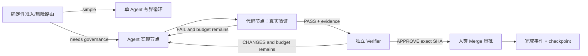

# PROP-HARNESS-GRAPH-001 — Harness Graph Engineering

状态：执行中
Issue：#637
首阶段基线：`origin/main@48eb80c1131f255400182f413d9aa8bff0f40adb`
执行图修订：2026-08-07

## 1. 决策

Harness 已经隐含了一张由 requirement、feature、contract、implementation、verification、evidence、PR、review、agent 组成的图，但关系分散在 JSON、Markdown、路径、issue 和专项脚本中。

本提案把这些权威模型**确定性编译**为统一 Graph IR，再由具名子图产生约束、语义差分、看板、Mermaid/UML 与 agent context。

这里必须区分两类常被混为一谈的图：

- **规格图（Spec Graph）**回答“系统里有什么、彼此如何引用”，是当前第一阶段内核的职责；
- **工作图（Work Graph）**回答“一次工作如何执行、暂停、验证、恢复”，是后续执行层的职责。

规格图不是把文档画成流程图，工作图也不是把一个无限循环拆成更多 agent。只有节点可独立执行、边由代码判定、状态可持久化、策略可审计时，工作图才算可执行系统。

第一阶段采用：

```text
Git 权威模型 → TypeScript Graph Compiler → 内存 Graph IR
                                      ├→ Validator / Findings
                                      ├→ JSON Cache（不入 Git）
                                      └→ 后续 Views / Semantic Diff
```

不引入 Neo4j、Apache AGE 或在线图服务。专用图数据库只有在真实路径查询或多进程共享性能数据证明必要后才评估。

## 2. 不变量

1. Git 保存事实，Graph Compiler 保存语义，缓存保存速度，CI artifact 保存历史证据。
2. Graph Snapshot 是派生物，禁止人工维护。
3. 所有可引用实体有稳定 ID；关系必须有类型，禁止新增无语义的通用 `refs[]`。
4. 相同权威源与 Git SHA 必须产生字节一致的 snapshot。
5. 每个节点和边必须回指 source path/pointer。
6. 约束失败必须给出稳定 finding ID、focus node、path、severity 和 message。
7. 作者继续写 Feature、Contract 等领域模型，不直接维护通用 nodes/edges。
8. 自然语言引用不得被猜成结构化实体；无法无歧义解析时保留为 ExternalReference。
9. 可视化只渲染回答具体问题的具名子图，不默认渲染全局毛线球。
10. 图内核必须替代重复脚本；不得成为再增加一套文档和数据库的理由。
11. 单次调用或单循环能可靠完成的任务默认不升级为工作图。
12. 模型判断只允许发生在节点内；边的路由、预算、权限、验收和恢复由确定性代码控制。
13. 生成者与验证者必须隔离上下文；高风险结论禁止同一节点自审后放行。
14. 工作图必须至少有一个现实锚点；模型互相赞同不是证据。
15. 角色图是慢变安全策略，运行时 agent 不得创建、扩大或绕过长期权限。

## 3. 首阶段模型

节点类型：

- Project
- Phase
- Feature
- Verification
- ExternalReference

边类型：

- `contains`
- `depends_on`
- `verified_by`

稳定身份：

```text
urn:wsx:harness:project:<project>
urn:wsx:harness:phase:<phase-id>
urn:wsx:harness:feature:<phase-id>:<feature-id>
urn:wsx:harness:verification:<phase-id>:<feature-id>:<command-hash>
```

Edge ID 由 `(type, from, to, qualifier)` 的规范化内容确定性计算。

## 4. 存储边界

| 内容 | Git | 本地缓存 | CI Artifact |
|---|---:|---:|---:|
| 节点/边类型注册表 | 是 | 否 | 否 |
| snapshot schema | 是 | 否 | 否 |
| roadmap/feature 等权威模型 | 是 | 否 | 否 |
| Graph Snapshot | 否 | 是 | 是 |
| Findings | 否 | 是 | 是 |
| Semantic Diff | 否 | 可选 | 是 |
| 签核用 Mermaid/UML | 按需 | 是 | 是 |

默认缓存位置：

```text
.harness/state/.cache/graph/current.snapshot.json
.harness/state/.cache/graph/current.findings.json
```

## 5. 目标模型

后续逐步加入：Requirement、UseCase、ContractBundle、Operation、UISurface、Controller、Route、Rewrite、Evidence、Gate、Finding、Agent、Role、Task、Review、PR、Commit、Signoff 与 ADR。

目标追踪链：

```text
Requirement → Feature → UseCase/Operation → Implementation
Feature → Verification → Evidence
Feature → Issue → PR → Commit on main
Signoff → exact ContractBundle revision
Review → exact PR head SHA
```

## 5.1 三图分层，而不是一张全局大图

| 图 | 回答的问题 | 变化速度 | 权威存储 | 运行时可修改 |
|---|---|---|---|---|
| Spec Graph | 需求、契约、实现、验证如何追踪 | 随 Git 提交 | Git 领域模型 | 否，只能重新编译 |
| Role Graph | 谁可做什么、可调用哪些工具、谁能审批 | 慢变 | Git 策略模型 + 人类 review | 否 |
| Work Graph | 本次任务下一步去哪、哪些分支已完成 | 每次运行 | 事件日志 + checkpoint | 仅能在策略允许的边界内推进 |

三图通过稳定 ID 连接，但不得合并成一个可被任意 writer 修改的通用图数据库。Role Graph 对 Work Graph 形成权限上界；Spec Graph 为 Work Graph 提供任务和验收引用；Work Graph 只追加运行事实，不反写规格事实。

## 5.2 可执行图的最小契约：G = (V, E, S, P)

### V — Execution Node

节点一进一出、只承担一种职责，并显式声明：

- `node_kind`: `deterministic | agent | human_approval`；
- 输入/输出 schema；
- tool allowlist 与写权限；
- context 输入选择器和 token/cost/time budget；
- retry policy、idempotency key 和 timeout；
- verifier 要求与现实证据要求。

确定性格式校验、排序、去重、测试、hash、状态转换必须是代码节点，不交给模型。Agent 节点只处理需要判断力的工作。

### E — Transition

边是可执行路由，不是说明性箭头：

- `straight`：无条件前进；
- `conditional`：由确定性谓词选择；
- `fan_out` / `fan_in`：并行拆分与聚合；
- `retry`：有次数和预算上限的回环；
- `pause` / `resume`：等待人类或外部事实；
- `compensate`：失败后的补偿路径。

每次边选择都产生 `EdgeDecision`，记录输入状态 hash、谓词版本、结果、actor 和时间。模型可以提出建议，不能直接决定受保护边。

### S — Run State

运行状态不能是不断增长的聊天历史，最小状态包括：

```yaml
run_id: RUN-<graph>-<ulid>
graph_revision: <exact-commit-or-content-hash>
status: queued|running|paused|blocked|failed|completed|cancelled
frontier: []
artifacts: []
evidence_refs: []
budgets:
  token_used: 0
  cost_used: 0
  wall_time_ms: 0
attempts: {}
checkpoint_id: null
```

原始网页、长日志和完整对话保存为 artifact，只把引用和必要摘要送往后续节点，以阻断上下文腐烂。

### P — Policy

策略至少约束：

- 谁能创建/取消 run；
- 哪类节点能用哪些工具和写哪些资源；
- 谁能修改 Graph Definition；
- 哪些边必须经过人类批准；
- 哪些验证必须来自独立 actor/context；
- 最大 fan-out、最大 retry、token/cost/time 上限；
- 哪些节点输出必须绑定 exact SHA 或现实证据。

策略默认失败关闭。UNKNOWN、策略不可读、审批身份不可验证时不得前进。

## 5.3 Definition、Run 与 Event 分离

```text
GraphDefinition（Git、慢变、可 review）
        │ exact revision
        ▼
GraphRun（一次执行实例、状态机）
        │ append-only
        ▼
RunEvent ──→ Checkpoint ──→ Evidence / Artifact
```

- Definition 描述允许的节点、边、schema 和 policy refs；
- Run 绑定 exact Definition revision，禁止运行中静默换图；
- Event 是追加式事实，Snapshot/Checkpoint 是可重建的加速视图；
- resume 从最后可信 checkpoint 开始；
- replay 使用原 Definition revision 和记录的输入；
- fork 创建新 `run_id` 并记录 `parent_checkpoint_id`；
- 同一 super-step 中已成功分支的 pending writes 必须保留，失败恢复不得重复付费或重复产生副作用。

副作用节点必须具备幂等键或补偿边，否则不得自动重试。

## 6. 约束族

- HGC-IDENTITY：重复 ID、确定性身份。
- HGC-TYPE：未知节点/边类型、非法端点组合。
- HGC-REFERENCE：悬空边与不可解析引用。
- HGC-DEPENDENCY：依赖环与关键路径。
- HGC-TRACE：Requirement 到 Evidence 的可达性。
- HGC-PASSING：Evidence、Issue、PR、main commit 的完整完成链。
- HGC-SIGNOFF：签核绑定精确 bundle revision，修改自动失效。
- HGC-REVIEW：review verdict 绑定精确 SHA。
- HGC-AUTHORITY：同一属性只有一个 authoritative writer。
- HGC-DERIVATION：派生物具有来源与生成活动。

## 7. Agent 协作目标

Agent 之间传递 graph delta，而不是重复背景散文：

```yaml
graph_delta:
  added_edges: []
  removed_edges: []
  resolved_findings: []
  introduced_findings: []
next_frontier:
  node: FEATURE-466
  missing_edge: consumes
  target: OP-VOICE-STREAM
evidence: []
```

人类摘要由 renderer 从事件模型生成。

工作图中的 agent 之间不传递整段对话，只传递版本化状态 envelope、artifact refs 和 graph delta。节点需要额外上下文时必须通过显式 selector 获取，禁止默认继承上游完整上下文。

## 7.1 推荐拓扑与适用边界

| 拓扑 | Harness 中的适用场景 | 强制约束 |
|---|---|---|
| Pipeline | claim → implement → verify → review → merge | 每步有 schema 和 checkpoint |
| Router | 按风险选择验证强度 | 路由谓词为代码，UNKNOWN 走高风险路径 |
| Fan-out/Fan-in | 独立研究、跨模块影响分析、多视角 review | 分支无共享写；聚合前去重和来源校验 |
| Orchestrator/Workers | 高价值、可拆分、需要专业工具的任务 | coordinator 不兼任最终 verifier |
| Evaluator/Optimizer | 有明确评分标准的草案改进 | 有最大轮数、预算和退出条件 |

禁止把普通单 feature 实现默认扇出成多个 agent。动态工作节点只能在 Graph Definition 预先允许的 spawn slot 内产生，并继承更小而不是更大的权限。

首个试点保持餐巾纸级复杂度：



图中的条件文字最终必须落成可执行 predicate 和稳定 finding；Mermaid 只是由 Definition 生成的阅读视图。

## 7.2 独立验证器与现实锚点

Verifier 是工作图中最高收益节点，但必须满足：

1. 不继承生成节点的推理历史；
2. 只读取产物、验收标准和必要来源；
3. verdict 绑定 exact artifact hash / commit SHA；
4. 尝试推翻结论，而不是复述结论；
5. 至少引用一个确定性或现实证据。

Harness 的现实锚点优先级：

```text
真实用户/生产结果
> 浏览器 + API + 数据库 E2E
> 可执行测试与退出码
> exact SHA、artifact hash、签核身份
> 静态结构校验
> 模型 verdict
```

高层锚点缺失时必须显示 `UNKNOWN` 或明确降级，不得用低层模型判断伪装成已验证。

## 8. 具名视图

- VIEW-DELIVERY-001：最长串行链与下一前沿。
- VIEW-TRACE-001：需求到证据追踪链。
- VIEW-IMPACT-001：变更影响锥。
- VIEW-AUTHORITY-001：权威源与派生源冲突。
- VIEW-PROVENANCE-001：passing 结论来源链。
- VIEW-AGENT-001：Agent、Role、Task、Artifact、Review、Handoff。

## 9. 采用专用图数据库的门槛

只有满足至少一项才进入评估：

- 内存编译或查询超过已定义 CI 时间预算；
- 多进程必须持续共享图状态；
- 出现跨仓库长期在线图探索；
- SQLite/Postgres 递归查询有可复现性能瓶颈；
- 基准证明专用引擎有显著收益且不污染权威源边界。

执行图的持久化不等于采用图数据库。第一选择是 append-only event log + checkpoint（本地可用 SQLite，已有服务可用 PostgreSQL）；图数据库只服务查询投影，不承载审批权威、权限权威或不可重建的 run 状态。

## 9.1 是否升级为工作图的决策门

默认方案依次为：确定性函数 → 单次模型调用 → 单 agent 有界循环 → 可执行工作图。只有前一层无法满足目标时才升级。

候选任务满足以下任一**治理条件**，或至少两项**效率条件**，才进入 Work Graph 设计：

- 治理条件——**独立验证**：风险要求生成与验证隔离；
- 治理条件——**暂停恢复**：需要审批、长时等待、断点续跑或失败恢复；
- 效率条件——**上下文隔离**：子任务产生大量与主任务无关的信息；
- 效率条件——**真实并行**：存在两个以上无共享写的独立分支；
- 效率条件——**专业化**：不同步骤需要显著不同的工具、权限或模型。

同时必须给出：单循环基线、预期质量收益、token/cost/latency 上限、失败补偿方案。若图方案没有可测收益，回退到更简单层级。

## 9.2 图复杂度预算

每张生产 Work Graph 默认预算：

- 静态节点不超过 12 个；
- 单次动态 fan-out 不超过 5；
- evaluator 回环不超过 3 次；
- 每个节点工具不超过 7 个；
- 每条失败路径都能到达 `failed`、`paused` 或补偿终点；
- 每个 agent 节点必须解释其相对确定性代码的必要性。

超预算不是自动禁止，但必须有 ADR、基准和人类批准。

## 10. 成功指标

- 权威实体进入图的覆盖率 ≥95%。
- 相同 revision snapshot 字节一致率 100%。
- 新增悬空结构化引用进入 main：0。
- Requirement 到 Evidence 完整路径比例持续上升。
- 被统一图约束替代的专项 lint 数量持续增加。
- Agent 状态消息自由散文比例降低 70%。
- 总体 PR flow time 不恶化并在三个周期内下降。

执行层新增指标：

- 可恢复 run 比例 100%，恢复后不重复已成功副作用；
- 所有 run 绑定 exact Graph Definition revision；
- protected transition 由确定性策略判定比例 100%；
- verifier 与 producer 独立 actor/context 比例 100%；
- 有现实锚点的完成结论比例 100%；
- 相比单循环基线的质量、成本、延迟同时可见；
- 因上下文继承造成的重复背景 token 持续下降；
- UNKNOWN 被错误渲染为 PASS 的次数为 0。

## 11. 与 Harness V2 模板方案的关系

Graph Kernel 不取代模板注册表。Graph Definition、Graph Run、Checkpoint、Edge Decision、Approval 等新实例必须先通过模板注册表申请永久 `template_id`，再进入实现；本 Proposal 不绕过原子编号器预占手写编号。

模板模型负责“实例格式和生命周期”，Graph Kernel 负责“实体关系和可执行约束”，Work Graph Runtime 负责“运行、持久化与恢复”。三者不得重复保存同一状态。

职责边界如下：

| 已有 Harness V2 工作 | 权威 Proposal/Backlog | Graph Engineering 只做什么 |
|---|---|---|
| Template Registry、编号、生命周期 | HMV2 E1 | 消费 registry，不另建编号器 |
| Role、Agent、Work Event、Review Verdict | HMV2 E3 | 编译为 Role/Work 子图并执行约束 |
| Feature、Evidence、Readiness、Handoff | HMV2 E4 | 建立追踪边、现实锚点和运行输入引用 |
| Contract Bundle、Signoff、Coherence | HMV2 E5 | 编译 trace/signoff 图并检测失效 |
| Issue、Board、Mermaid renderer | HMV2 E2/E6 | 提供具名查询，不另存展示状态 |
| GraphDefinition、GraphRun、Checkpoint、EdgeDecision | 本 Proposal G7–G10 | 仅定义 HMV2 尚未覆盖的执行语义 |

若 HMV2 后续增加同名模型，以 HMV2 Template Registry 为格式和编号权威；本 Proposal 删除重复 schema，只保留执行语义和图约束。

## 12. 结论

优化后的路线不是“把 Harness 全部图化”，而是：

1. 用 Spec Graph 消除文档与追踪关系的重复；
2. 用 Role Graph 固定长期权限和职责分离；
3. 仅把高价值、需隔离/并行/验证/恢复的流程升级为 Work Graph；
4. 用代码控制边，用模型完成节点内判断，用现实证据决定是否放行；
5. 先交付最小三到五节点试点，再依据质量/成本/延迟决定是否扩张。
