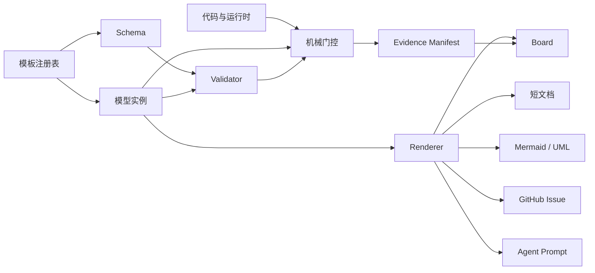
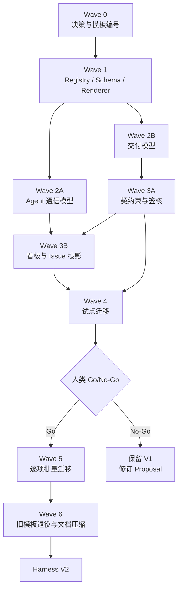

# PROP-HARNESS-MODEL-001

# Harness V2：模型驱动的模板、协作与可视化控制平面

- 状态：Proposed
- 日期：2026-08-06
- 决策者：项目人类负责人
- 建议负责人：coord-architecture
- 影响范围：`.harness/`、`.agents/`、`phases/`、GitHub 投影、agent 协作协议
- 实施原则：一个 backlog item 对应一个 issue、一个分支、一个 PR
- 替代范围：现有模板体系、部分重复指令、自由文本协作消息、契约束五件套

> 执行口径变更（2026-08-06，人类裁决）：本文件的 backlog **不逐条开 GitHub issue**，
> 改用同目录 [`PROP-HARNESS-MODEL-001.checklist.md`](./PROP-HARNESS-MODEL-001.checklist.md)
> 追踪完成状态。文档本身是唯一事实源（P1），checklist 是它的派生视图，不是第二份规格。

---

## 1. 摘要

当前 harness 的主要问题不是缺少规范，而是规范、模板、状态、协作消息和派生视图之间没有统一模型：

- 模板没有稳定身份和统一 schema；
- 相同事实出现在 AGENTS、instructions、模板、issue、handoff、契约束和 agent prompt 中；
- 文档由人工同步，产生重复、冲突和过期内容；
- agent 沟通以自由文本为主，背景复述和计划性语言过多；
- 看板与报告混合实时数据和手写判断；
- 可视化不足，复杂状态、依赖和协作关系仍靠长篇散文表达；
- 部分"机械门控"依赖不完整扫描器或失败开放行为。

本 Proposal 将 harness 改造成模型驱动系统：

> 结构化模型是唯一事实源；文档、Mermaid/UML、Issue、看板、agent prompt 和验证门控都是模型的消费者或派生视图。

---

## 2. 已知基线

截至 `origin/main@efbc1a8`（**2026-08-06 coord-architecture 现场复核**：AGENTS.md 131 行准确；
instructions 实测 17 份/2342 行，与下表 16/2310 略有出入，口径差异不影响结论；ADR 实测 20 份，
与下表 22 略有出入，同上。`efbc1a8` 之后 main 又合并了 8 个 commit，更细粒度的数字可能已漂移，
不影响本节的结构性结论）：

| 指标                       | 当前值           |
| ------------------------ | ------------- |
| 根 AGENTS.md              | 131 行         |
| `.harness/instructions/` | 16 份 / 2310 行 |
| 显式模板                     | 11 份 / 422 行  |
| phase-01 契约束             | 12 个          |
| phase-01 契约束五件套          | 约 18,000 行    |
| ADR                      | 22 份          |
| 模板中央注册表                  | 无             |
| 模板唯一编号                   | 无             |
| 模板 schema 全覆盖            | 无             |
| agent 结构化消息协议            | 无             |
| 自动生成的协作图                 | 无             |
| 契约→路由完整门控                | 无             |
| UI→controller 完整门控       | 无             |

---

## 3. 目标

### G1：每个模板拥有稳定身份

所有模板必须拥有：

- 全仓唯一 `template_id`；
- 单调递增 `template_version`；
- 明确 schema；
- 明确 owner；
- 明确消费者；
- 明确 active/deprecated/retired 生命周期。

### G2：同一事实只有一个可编辑位置

以下内容禁止人工维护副本：

- Feature 状态；
- Sprint 工作集；
- Issue 正文；
- 角色权限；
- agent prompt 中的角色事实；
- 契约束覆盖关系；
- UI、operation、verification 追踪关系；
- 看板下一步和依赖链；
- 已生成的 Mermaid/UML 图。

### G3：agent 沟通结构化、短小、可反驳

普通进度消息只表达：

1. 新事实；
2. 本轮变化；
3. 阻塞；
4. 证据；
5. 下一动作。

不重复任务背景，不输出长篇"准备怎么做"。

### G4：复杂关系可视化

自动生成：

- 系统组件图；
- Feature 依赖 DAG；
- Feature 生命周期状态机；
- agent 协作泳道图；
- Requirement→Feature→Operation→Controller→UI→E2E 追踪图；
- 契约束依赖与一致性图；
- 当前最长串行链。

### G5：文档显著缩减

目标：

- 根 AGENTS.md 不超过 100 行；
- JOIN + LOOP + DELIVERY 三份必读文档合计不超过 180 行；
- 契约束人工维护内容减少至少 60%；
- 手写 progress 文档归零；
- Issue 正文规格副本归零；
- 角色事实副本归零。

### G6：仪器失败时不说谎

所有看板和门控必须区分：

```text
PASS | FAIL | UNKNOWN | STALE
```

数据源不可用、扫描器失效或结果不完整时，不得显示为 0、无缺口或通过。

---

## 4. 非目标

本 Proposal 不做：

- 不重写产品业务契约；
- 不一次性迁移全部历史文档；
- 不把 UML 图设为事实源；
- 不新增常驻协调服务；
- 不改变"仓库是产品规格权威"的原则；
- 不允许 agent 代替人类签核；
- 不把每个工作周期都强制变成 harness 改进周期；
- 不通过删除历史记录掩盖已有漂移。

---

## 5. 设计原则

### P1：模型优先

结构化模型优先于散文。

### P2：图是视图，不是事实源

Mermaid、UML、表格和看板只能从模型生成。

### P3：引用优于复制

文件之间通过稳定 ID 引用，不复制正文。

### P4：事实与理由分离

- YAML/JSON：事实、状态、关系；
- Markdown：理由、取舍、解释；
- Mermaid：结构、状态和时序视图。

### P5：人类签精确内容

签核必须绑定模型 hash 和 commit，模型变化自动使旧签核失效。

### P6：生成内容不可手改

所有 generated 文件带来源和 revision，由 drift gate 检查。

### P7：失败开放禁止进入权威视图

权威数据源不可读时必须输出 UNKNOWN 并非零退出。

---

## 6. 目标架构



---

## 7. 模板身份体系

### 7.1 模板编号

格式：

```text
TPL-<三位领域码>-<三位流水号>
```

规则：

- 全仓唯一；
- 创建后不可修改；
- 永不复用；
- 文件移动不改变编号；
- 退役后保留登记；
- 版本变化只增加 `template_version`。

### 7.2 模板实例编号

每个产物必须拥有唯一 `instance_id`：

```text
REQ-p01-chat-uc08-01
FTR-p01-F108
CTR-p01-chat
SGN-p01-chat-v03
RVW-pr601-efbc1a8
```

### 7.3 公共元数据

```yaml
template_id: TPL-REQ-001
template_version: 2
instance_id: REQ-p01-chat-uc08-01
status: active
scope:
  project: workspacex
  phase: "01"
refs: []
```

---

## 8. V2 模板目录

| 编号          | 模板                      | 权威性质            |
| ----------- | ----------------------- | --------------- |
| TPL-REG-001 | Template Registry       | 人工维护            |
| TPL-PRJ-001 | Project Model           | 人工维护            |
| TPL-PHS-001 | Phase Model             | 人工维护            |
| TPL-REQ-001 | Requirement / Use Case  | 人工维护            |
| TPL-FTR-001 | Feature Model           | 人工 + 命令受控状态     |
| TPL-SPR-001 | Sprint Model            | 人工维护            |
| TPL-CTR-001 | Contract Bundle         | 人工维护            |
| TPL-SGN-001 | Design Signoff          | 仅人类维护           |
| TPL-COH-001 | Phase Coherence         | 仅人类维护           |
| TPL-INV-001 | Invariant               | 人工维护            |
| TPL-ADR-001 | ADR                     | 人工维护            |
| TPL-ROL-001 | Agent Role              | 人工维护            |
| TPL-AGT-001 | Agent Registration      | 人工维护            |
| TPL-TSK-001 | Task Assignment         | 系统创建            |
| TPL-EVT-001 | Work Event              | agent/system 创建 |
| TPL-RVW-001 | Review Verdict          | reviewer 创建     |
| TPL-EVD-001 | Evidence Manifest       | verify 创建       |
| TPL-RDY-001 | Runtime Readiness       | 门控创建            |
| TPL-HOF-001 | Session Handoff         | 工具生成、agent 补增量  |
| TPL-CYP-001 | Cycle Plan              | coordinator 创建  |
| TPL-CYR-001 | Cycle Result            | coordinator 创建  |
| TPL-ISS-001 | GitHub Issue Projection | 自动生成            |
| TPL-UIA-001 | UI/UX Audit             | reviewer 创建     |
| TPL-MOD-001 | Module Knowledge        | 人工维护            |

---

## 9. 契约束收敛

现有：

```text
ui.md
usecases.md
domain.md
coverage.md
design-signoff.md
```

目标：

```text
bundle.yaml
rationale.md
signoff.yaml
```

### bundle.yaml

维护：

- Feature 引用；
- Requirement 引用；
- Operation 引用；
- UI surface 引用；
- Entity 引用；
- Invariant 引用；
- Traceability edges；
- 未决问题。

### rationale.md

只维护无法从模型推出的：

- 为什么这样切束；
- 被拒绝的替代方案；
- 重要设计权衡；
- 风险说明。

### signoff.yaml

绑定：

- bundle ID；
- bundle hash；
- exact commit；
- UI/Use Case/API 三项结论；
- 人类身份；
- 时间。

---

## 10. Agent 通信协议

### 10.1 普通进展事件

```yaml
template_id: TPL-EVT-001
template_version: 1
instance_id: EVT-564-0007
kind: progress
issue: 564
actor: AGT-coord-architecture
sha: efbc1a8
facts:
  - contract_operations: 429
delta:
  - rewrite_gate: implemented
blockers: []
evidence_refs:
  - EVD-564-rewrite
next_action:
  owner: AGT-coord-architecture
  action: implement_contract_route_inventory
decision_needed: null
```

### 10.2 人类显示格式

```text
#564 · progress · efbc1a8
事实：429 个契约操作
变化：rewrite gate 已落地
阻塞：无
证据：EVD-564-rewrite
下一步：实现 contract→route inventory
```

### 10.3 长消息允许条件

只有以下情况允许长篇 Markdown：

- 架构决策；
- 多方案权衡；
- 事故复盘；
- 人类需要签核的设计；
- reviewer 的 P0/P1 发现解释。

---

## 11. 看板模型

看板不再维护自由文本 `note` 和 `next`。

下一动作由以下差集计算：

```text
最新 merged SHA
+ 当前 Feature/Issue 状态
+ 最近 Issue 评论中的结构化事件
+ 未通过的 verification
+ 依赖 DAG
+ open PR 状态
= 下一可验证动作
```

看板必须显示：

- 数据 revision；
- 数据源健康状态；
- 当前最长串行链；
- 每个 owner 的下一动作；
- 外部依赖；
- 可控部分；
- 阻塞来源；
- 已合并 flow time；
- oldest open WIP age；
- UNKNOWN/STALE 状态。

---

## 12. 验证体系

新增命令：

```text
pnpm harness templates doctor
pnpm harness templates render
pnpm harness templates migrate
pnpm harness model graph
pnpm harness event render
```

### templates doctor 检查

1. Template ID 唯一；
2. Instance ID 唯一；
3. Template ID 已注册；
4. 版本受支持；
5. retired 模板没有新实例；
6. schema 验证通过；
7. renderer 存在；
8. 消费者存在；
9. generated 文件未手改；
10. signoff hash 未漂移；
11. 模型引用无死链；
12. 新模板带反证；
13. 数据源失败不会渲染为零；
14. allowlist 只能相对 merge-base 缩短。

---

## 13. 成功指标

### 结构指标

| 指标                  | 目标   |
| ------------------- | ---- |
| 已注册模板比例             | 100% |
| 带唯一 Template ID 的模板 | 100% |
| 带唯一 Instance ID 的实例 | 100% |
| 未解析占位符              | 0    |
| generated drift     | 0    |
| 退役模板新实例             | 0    |

### 文档指标

| 指标                 | 目标      |
| ------------------ | ------- |
| AGENTS.md          | ≤100 行  |
| JOIN+LOOP+DELIVERY | ≤180 行  |
| 契约束人工维护行数          | 降低 ≥60% |
| 手写 progress 文档     | 0       |
| 手写 Issue body 规格副本 | 0       |
| 重复角色事实             | 0       |

### 协作指标

| 指标                          | 目标    |
| --------------------------- | ----- |
| 普通 progress 消息              | ≤12 行 |
| 无证据状态陈述                     | 0     |
| 看板数据源失败显示"无任务"              | 0     |
| Review verdict 绑定 exact SHA | 100%  |
| Handoff 包含 base/head SHA    | 100%  |

### 效率指标

同时保留：

- merged PR flow-time median；
- open WIP p90 age；
- oldest open PR age；
- CHANGES→next push 等待时间。

禁止只用已合并 PR 中位数判断整体效率。

---

## 14. Backlog

见同目录 [`PROP-HARNESS-MODEL-001.checklist.md`](./PROP-HARNESS-MODEL-001.checklist.md)。
HMV2-001 至 HMV2-100，按 Epic E0–E10 分组，含依赖与完成契约。**backlog 正文只在这一份文件里，
checklist 文件只勾状态，不复制描述**（P3：引用优于复制）。

---

## 15. 依赖与实施波次



### 可并行部分

- E3 Agent 模型与 E4 交付模型可并行；
- Role 迁移与 Requirement/Feature schema 可并行；
- Mermaid renderer 与 Evidence Manifest 可并行；
- 各契约束迁移在 schema 稳定后可按束并行，但一束一个 PR。

### 不可并行部分

- 没有 Registry/Schema 前不得批量迁移；
- 没有试点和人类 Go/No-Go 前不得删除旧模板；
- 没有新 Board 对照验证前不得替换旧 Board；
- 没有 hash 签核门前不得迁移正式签核状态。

---

## 16. 风险与缓解

| 风险               | 缓解                             |
| ---------------- | ------------------------------ |
| 模型层本身继续膨胀        | 新字段必须声明消费者                     |
| YAML 变成另一种长文档    | Schema 限制字段；理由放 rationale.md   |
| 自动生成内容难读         | 人类视图单独设计，不暴露完整机器模型             |
| 迁移时丢失设计理由        | rationale.md + 原文件 archive     |
| 历史签核失效           | 旧签核保留 legacy 状态，迁移需人类复签        |
| 一次性重构影响开发        | 双轨读取、逐模板/逐契约束迁移                |
| ID 体系发生冲突        | 原子分配器 + 唯一性 gate               |
| UML 漂移           | 只允许从模型生成                       |
| agent 结构化消息失去上下文 | ID 链接回 Issue、Feature、ADR，不复制正文 |
| 指标被优化作弊          | 同时看 merged flow 与 open WIP age |
| 新门控产生假红          | 每道门必须有扫描完整性检查和单点反证             |

---

## 17. 启动条件

开始实施前必须满足：

1. 人类接受或修订本 Proposal；
2. 建立总追踪 Issue；
3. HMV2-001～005 各自建立 issue；
4. 指定 coord-architecture 负责人；
5. 明确旧格式冻结时点；
6. 当前共享 checkout 清理完毕；
7. 所有开发使用独立 worktree；
8. 不把本计划合并进任何在途产品 feature。

> **执行口径变更**（2026-08-06）：人类明确要求"不需要放到 issues，做一个 check list 来完成"——
> 第 2、3 条（总追踪 Issue + HMV2-001~005 各自建 issue）**不按字面执行**，改用
> `PROP-HARNESS-MODEL-001.checklist.md` 追踪。其余六条仍然有效。

---

## 18. 完成定义

Harness V2 只有同时满足以下条件才算完成：

- HMV2-001～100 中所有必需项完成或有明确取消决策；
- 所有 active 模板有唯一 ID；
- 所有 active 实例通过 schema；
- agent role/prompt 无事实副本；
- Contract Bundle 追踪链可机械验证；
- 看板数据源失败不会渲染成零；
- Review verdict 100% 绑定 exact SHA；
- AGENTS.md 与三份必读文档满足行数预算；
- 旧模板禁止创建新实例；
- V2 全量 doctor 通过；
- 人类完成最终签核。
