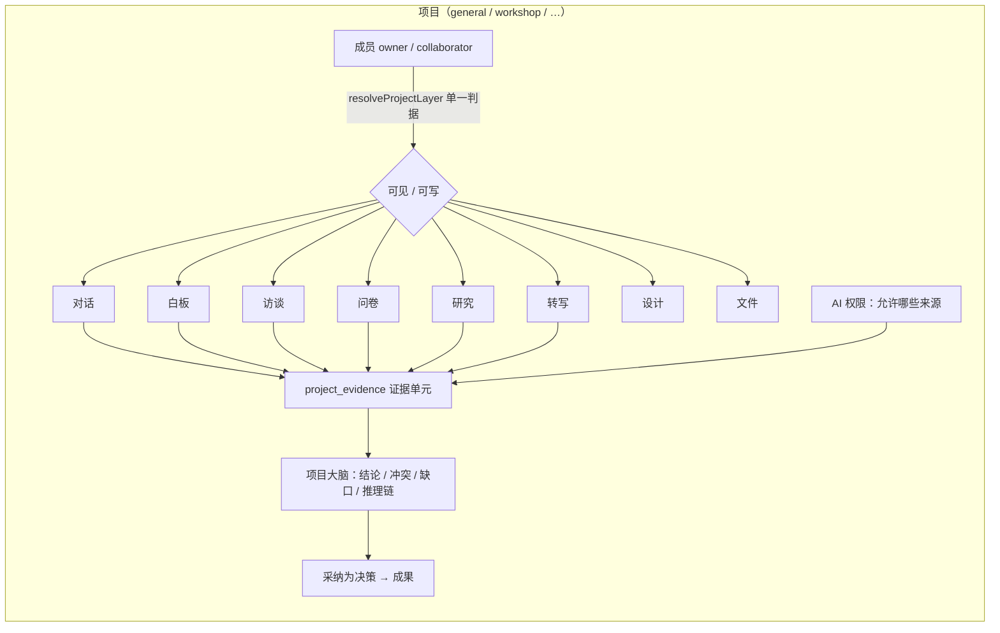

# PROP-PROJECT-WORKSPACE-001：项目泛化为通用工作空间（第一版，最小改动）

- 状态：**已裁决（2026-09-29）**，签核 delta：`phases/phase-01-run-a-project/design-deltas/project-general-workspace/`（PR #4617，人类合入）
- 提出：2026-09-29，协调者（Claude Code），应用户要求「把 Project 的概念泛化，不只是针对 workshop……做成通用的项目管理工作空间」「用尽可能小变更、快的方式实现第一个版本」「board 也必须是项目的一部分」
- 关系：推翻 / 修订 `phases/phase-01-run-a-project/requirements/00-project/OPEN-QUESTIONS.md` **Q-12**（「项目」收窄为工作坊、三类独立容器）；延续 PROP-PROJECT-HUB-001 / 002（项目是邀请制权限容器 + 项目大脑）与 #4584（非工作坊容器可进工作台）

---

## 1. 一句话

**项目 = 一个邀请制的工作空间（沙箱）**：成员在里面放任意内容——对话、白板、访谈、问卷、深度研究、转写、设计、文件——这些内容统一沉淀为证据，项目大脑在上面做推演（冲突 / 缺口 / 推理链 / 采纳为决策）。
**工作坊不再是「项目」本身，而是项目的一种可选形态**（带议程、分组、现场协作的那一套），第一版原样保留。

## 2. 现状问题（梳理结论）

| 问题 | 现状 | 出处 |
|---|---|---|
| 「项目」= 工作坊 | 新建页标题「新建项目（工作坊）」，只建 `kind:"workshop"`；蓝本 / 时长 / 日期 / 人数 / 六类初始化全是工作坊概念，且除「项目名称」外全是不写后端的占位 | `apps/web/components/project/new-project-flow.tsx:103,231-300` |
| 通用内容进不来 | 只有问卷 / 深度研究 / 转写能「关联到项目」；访谈只能「在本项目新建」；**白板、设计完全没有项目关联** | `packages/contracts/src/project.ts:302`；`whiteboards` 表无 `project_id` |
| 非工作坊容器半通 | #4584 后研究项目 / 用户洞察的负责人、协作者能进工作台，但对话、白板、画布、录音、采纳决策等 27 处仍直读工作坊成员表 ⇒ 对它们关闭 | `findProjectMembership` 27 个调用点 |
| 界面按工作坊组织 | 工作台 tab：概览 / 研究洞察 / 项目筹备 / 现场协作 / 成果沉淀 / 待办 / 设置；概览卡片（当前环节、角色计数、蓝本）工作坊专属 | `apps/web/lib/project-workbench.ts:62` |

## 3. 第一版范围（最小改动）

### 3.1 数据：容器两类——`general`（「项目」）与 `workshop`
- **裁决 ③**：研究项目 / 用户洞察**并入** `general`。产品未上线（人类逐字：「不需要迁移数据」），直接替换结构：`research_projects` → `general_projects`、`research_project_members` → `general_project_members`（owner / collaborator），`user_insights` / `user_insight_members` 删除；`projects.kind ∈ {workshop, general}`。迁移仍须可重放。
- 完全复用 F128 / #4584 已有的非工作坊模式：`findNonWorkshopStanding` 与 `nonWorkshopProjectLayer` 只换 kind 值。
- `createProject` 对 `general`：创建者即 owner。工作坊数据与行为不变。
- **不**给 `projects` 加列（遵守 I-P33 列集白名单）；项目描述 / 目标等留待第二版（需要时进 `general_projects`）。

### 3.2 内容：一张「挂载表」装下所有模块
- `project_resource_links.kind` 扩为：`survey`、`guided_research`、`personal_transcription`（已有）+ **`interview`、`whiteboard`、`design`**。
- 对话继续走 `chat_threads.project_id`（已有）。文件继续走 `artifacts.project_id`（已有）。
- **白板（重点）**：
  - 「在本项目新建白板」= 建白板 + 挂载；「关联已有白板」= 挂载自己有权的白板。
  - **项目成员即白板成员**：白板访问判定（`domain/whiteboard/access-decision.ts`）增加一条来源——挂在项目上的白板，项目 owner / collaborator 可编辑，组织 lead/admin 旁观可读；白板自己的成员表照旧生效（取并集）。移出项目或被移出成员即失去这条来源。
  - 白板内容进证据：新增证据来源 `whiteboard_note`（便签 / 文本块，一张便签一条证据），采集时机同其它来源（挂载时 + 变更时增量）。
- 设计（design workbench）第一版只做挂载与列表入口；设计内容进证据留第二版。

### 3.3 权限：一处改动，打通所有内容
- 把对话（`list-threads` / `resolve-visibility` / `mutate-thread`）、白板、项目大脑采纳决策（SQL 函数 `kg_adopt_project_decision`）从直读 `project_memberships` 改为走 `resolveProjectLayer`（#4584 建的单一判据）。
- `general` 容器的动作白名单沿用 `NON_WORKSHOP_CONTAINER_ACTIONS`，再加对话 / 白板所需动作。
- 对话可见范围在非工作坊容器里只保留两档：**仅自己** / **项目内共享**（去掉「组内共享」）。
- 议程、分组、现场、临时授权、邀请链接仍只属工作坊（邀请链接第二版再泛化；第一版用设置页「协作者」直接加人）。

### 3.4 界面：新建一步到位，工作台按「内容」组织
**新建项目**（替换现在的三步表单）：
- 只填 **项目名称** → 「创建」即进入项目。
- 下方一行次要入口：「要办一场工作坊？→ 用工作坊模板创建」（保留现有工作坊流程，但不再是默认）。

**项目工作台（`general` 容器）**：

| Tab | 内容 | 复用 |
|---|---|---|
| 概览 | 项目名、成员头像、各类内容数量、最近更新的内容、项目大脑摘要（结论 / 待验证 / 冲突数） | 新卡片，数据来自已有接口 |
| 内容 | 统一列表 + 类型筛选：对话 / 白板 / 访谈 / 问卷 / 研究 / 转写 / 设计 / 文件；右上「新建 ▾」「关联已有」 | 现 `ProjectResourceSection` / `ProjectConversations` 合并 |
| 大脑 | 来源（证据列表）+ 推演（冲突 / 缺口 / 推理链）+ 采纳为决策 | 现 `ProjectBrainPanel` / `ProjectEvidenceSection` 搬过来 |
| 成果 | 结论与决策去向（沿用现 results 中已接真数据的部分） | 现 `TabResults` |
| 设置 | 成员（owner / collaborator）、AI 权限（哪些来源可进大脑） | 现 `ProjectCollaboratorsPanel` / `ProjectAiSettingsPanel` |

- 工作坊容器的工作台**保持现状**（7 个 tab）。
- 项目列表：卡片类型标签「项目 / 工作坊 / 研究项目 / 用户洞察」；空态文案改为通用描述。

### 3.5 不在第一版
项目描述 / 目标 / 截止日期字段；项目模板（除工作坊外）；邀请链接泛化；viewer（只读）档位；设计与访谈内容进证据的细化；研究项目 / 用户洞察并入 `general`；删除项目。

## 4. 数据流

## 5. 切片与并行开发（子 agent 开发，协调者测试）

| 切片 | 内容 | 依赖 |
|---|---|---|
| W1 容器 | 迁移（kind `general` + 子类型表 + 成员表，装组织冻结 / 项目归档策略）、契约枚举、`createProject`、`findNonWorkshopStanding`、协作者接口接受 `general` | — |
| W2 挂载 + 白板 | `project_resource_links` 扩三种 kind、白板访问判定加项目来源、白板证据采集器 `whiteboard_note`、对话三处与采纳决策 SQL 改走统一判据 | W1 契约 |
| W3 界面 | 新建页一步化、`general` 工作台五 tab（概览 / 内容 / 大脑 / 成果 / 设置）、列表标签与空态 | W1 契约 |
| W4 测试 | 协调者：DB-free + PG + 真栈 e2e（新建 → 建白板 / 对话 / 问卷 → 证据 → 大脑 → 协作者可见、被移出即不可见） | W1–W3 |

预计三个切片并行开发，契约先由协调者落形状（同第三批做法），合成一个 PR 或按切片三个 PR。

## 6. 风险

- 推翻 Q-12：必须人类重签（§8）。
- `project_resource_links` 主键 `(org_id, kind, resource_id)` 意味着一个内容只属一个项目——第一版沿用（与「沙箱」语义一致）。
- 白板访问取并集：要保证「移出项目」后白板自己成员表里仍有的人不受影响、没有的人立即失去访问（有 PG 测试）。
- 工作坊专属的 27 处直读第一版只改对话 / 白板 / 采纳决策这几处，其余保持对非工作坊关闭，范围可控。

## 7. 人类裁决（2026-09-29，经 AskUserQuestion）

结果：① 同意推翻 Q-12；② 新增 `general` 容器；③ 第一版就并入通用项目（未上线、不迁数据）；④ 项目成员自动可编辑项目白板；⑤ 未单独问，按推荐走 design-delta（PR #4617）。

原始选项：

1. **是否推翻 Q-12**：「项目」= 通用工作空间，工作坊只是一种形态。（A 同意 / B 不同意，维持现状）
2. **通用项目怎么落库**：A 新增 `general` 容器（推荐：一条迁移、复用现成非工作坊机制、语义干净）/ B 直接把「研究项目」改名当通用项目用（零迁移，但语义错位、以后要还债）。
3. **现有研究项目 / 用户洞察**：A 保留不动、只是不在新建入口出现（推荐）/ B 第一版就并入通用项目（要迁移数据，变更大）。
4. **白板权限**：A 项目成员自动可编辑挂在项目上的白板（推荐）/ B 白板仍只认自己的成员表，项目只做归类。
5. **签核方式**：A 走 design-delta（推荐，变更集中在一份文档）/ B `project` 契约束整体重签。

## 8. 签核路径

按 ADR-023 与 `contract-design.md`：
1. 协调者把 §7 的裁决写入 `phases/phase-01-run-a-project/design-deltas/project-general-workspace/`（UI 截图 + 用例 + 契约 diff 三件），`status: pending`；
2. 人类确认后按 `human-decision-packaging.md` 以 `chore(signoff)` PR 落 `status: confirmed`（协调者不自行合入签核 PR）；
3. 签核合入后开 W1–W3 issue 并行开发。
