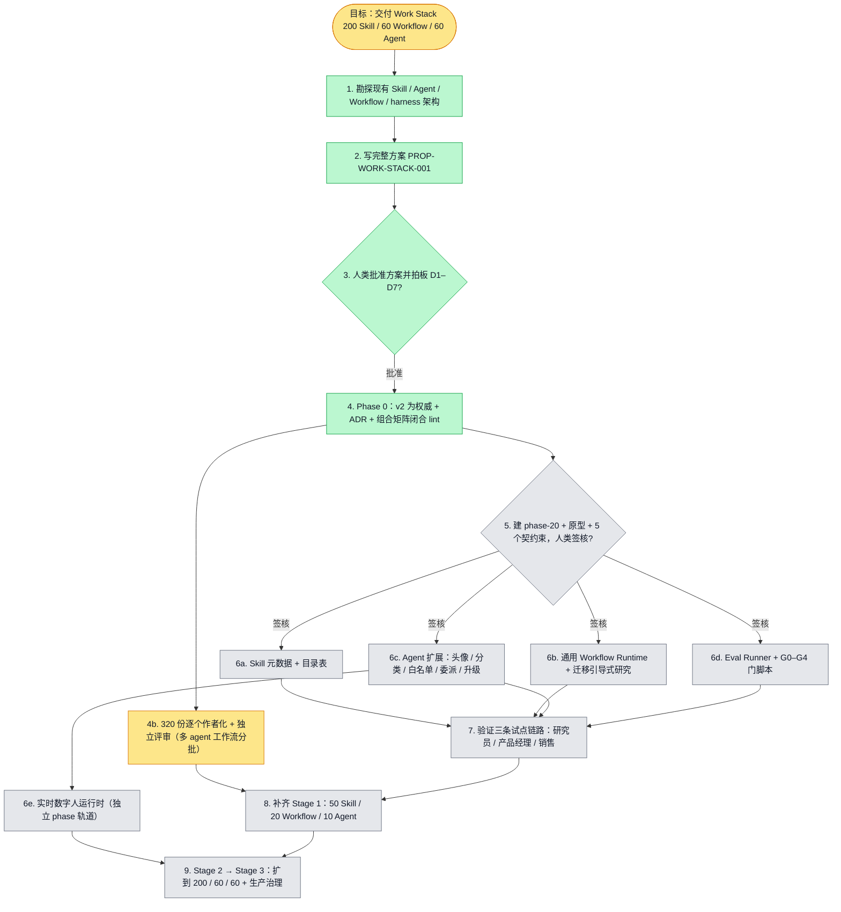

# 执行计划 — Work Stack（200 Skill / 60 Workflow / 60 Agent）

> 规范：`.harness/instructions/execution-plan-visualization.md`。
> 方案正文：`docs/proposals/PROP-WORK-STACK-001.md`。
> 改状态用 `node .harness/scripts/execution-plan.mjs set <本文件> <节点> <状态>`，
> 改完 `check` 一遍；不要手改 classDef 颜色。

## 我理解的目标
- **目标**（2026-09-28 按 #4523 修订：需求权威 = `requirements/work-stack-v2`）：在现有架构上交付 Work Stack——用户选一个带头像的角色 Agent（=数字人），它组合已发布的 Skill 和 Workflow，在权限和人工审批下把真实工作做完或升级给人，全程可审计、可回放；最终规模 200 Skill / 60 Workflow / 60 Agent，分三个 Stage。
- **完成判据**：每个 Stage 的出口条件由 `pnpm harness verify` 和 G0–G6 门脚本判定；Stage 1 = 研究员 / 产品经理 / 销售三条链路端到端通过，50/20/10 实体有基线评测，越权副作用为 0。
- **不做什么**：不建 DigitalHuman 第二身份实体、不建第二套 agent 内核或记忆库、不做 Workflow DSL（推迟到 Stage 3）、不在本项目里合并两套 Skill 模型。
- **假设与待确认**：需求以 main #4502 为权威；D1–D7 七个决策待人类拍板（见方案第 9 节）——**在拍板前不开工**。

## 执行计划

图例：⬜ 灰=未开始 · 🟨 黄=已开始 · 🟩 绿=已完成 · 🟪 紫=已测试（有证据） · 🟥 红=被堵塞

## 进度日志（append-only，每次改颜色追加一行）
| 时间 | 节点 | 状态变化 | 依据（命令 / 证据 / 堵塞原因） |
|---|---|---|---|
| 2026-09-28 | G, R1 | todo → doing | 接到目标，开始勘探 |
| 2026-09-28 | R1 | doing → done | 4 路勘探完成（Skill / Agent / Workflow / harness），结论写入方案 §1 |
| 2026-09-28 | R2 | todo → done | 方案已提交到 `claude/tender-maxwell-dh21fg` |
| 2026-09-28 | H1 | todo → doing | 方案交人类审阅，等 D1–D7 拍板 |
| 2026-09-28 | H1 | blocked → done | 人类在对话中回复「批准」：D1–D7 按方案建议执行；D5 头像先用插画 key 集占位，出图方式后续再定 |
| 2026-09-28 | P0 | todo → doing | 开始 Phase 0 |
| 2026-09-28 | P0 | doing → blocked | main 合入 #4523：v2 否决 v1、自带组合矩阵、要求 320 份逐个作者化+独立评审、新增实时数字人运行时；方案 D1 前提失效 |
| 2026-09-28 | P0 | blocked → doing | 人类确认：v2 为权威；平台与作者化并行；实时数字人作独立轨道；作者化由多 agent 工作流跑。新增节点 AU、RT |
| 2026-09-28 | P0 | doing → done | ADR-116~121、v1 superseded、AUTHORING-OUTPUT.md、lint:work-stack-graph（7 个反证测试通过）已写；等 PR CI 绿再转紫 |
| 2026-09-28 | AU | todo → doing | 作者化试点批次启动：W001 / S003 / S063 / S171（作者 + 独立评审）|
| 2026-09-28 | AU | doing | 试点批次完成：S003、S171 PASS；W001、S063 REWRITE（S063↔S171 契约枚举不一致、W001 阶段 1 职责与 S003 不符、权限重查点不全）。发现跨实体规则待人类裁决：Workflow 固定 Skill 版本时，负责它的 Agent 是否还需挂载这些 Skill |
