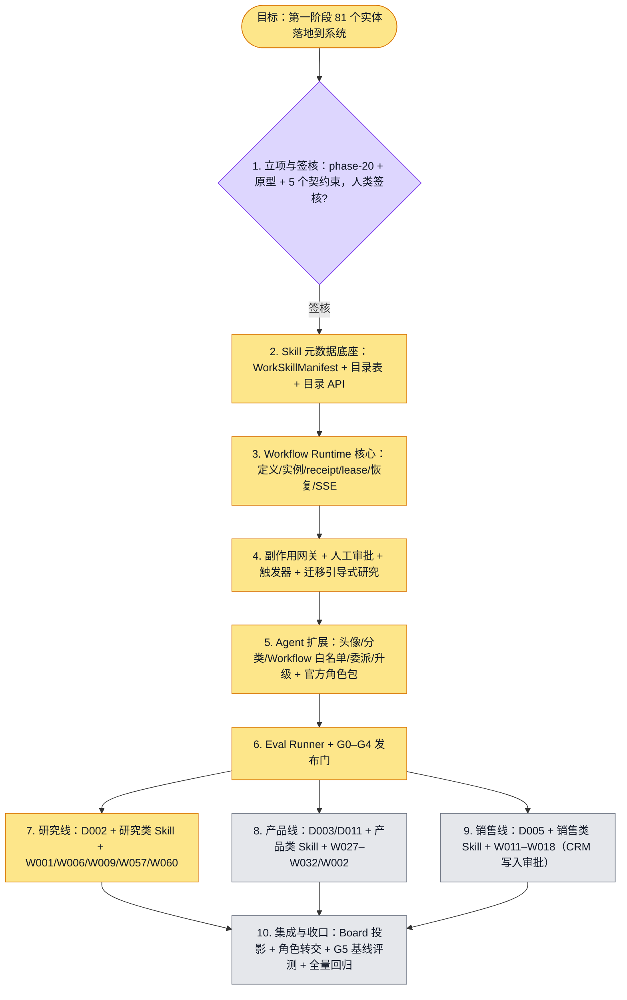

# 执行计划 — Work Stack 第一阶段落地（10 轮迭代）

> 规范：`.harness/instructions/execution-plan-visualization.md`。需求：`requirements/work-stack-v2/`（第一阶段 81 份，main 已合入 #4552）。
> 改状态用 `node .harness/scripts/execution-plan.mjs set <本文件> <节点> <状态>`。

## 我理解的目标
- **目标**：把第一阶段 4 个数字人（D002 / D003 / D005 / D011）、19 个 Workflow、58 个 Skill 真正实现到 WorkspaceX 系统里，用户能在产品中选中角色 Agent、跑通它的 Workflow、用到它的 Skill。
- **完成判据**：分 10 轮迭代，每轮有可执行的验收（`pnpm harness verify` + 端到端测试 + 验收清单），经你验收通过才进入下一轮；第 10 轮结束时三条真实链路（研究 / 产品 / 销售）端到端跑通，81 个实体在目录里可见、可用、有评测。
- **不做什么**：不做实时语音数字人（ADR-121 独立轨道）；不做第二至四阶段的实体；不改组合矩阵；不引入第二套 Agent 内核、记忆库或 Workflow 引擎。
- **假设与待确认**：见文末「开工前需要你确认」。

## 执行计划

图例：⬜ 灰=未开始 · 🟨 黄=已开始 · 🟩 绿=已完成 · 🟪 紫=已测试（有证据） · 🟥 红=被堵塞

## 每轮的验收标准
| 轮 | 交付 | 验收（全部要有可执行证据） |
|---|---|---|
| 1 | phase-20 目录、`feature_list.json`、界面原型截图、5 个契约束的 `design-signoff.md` | 你在 5 份签核文档上签字 + 一致性复核通过；`validate-fl`、`verify-uc-coverage` 通过 |
| 2 | `WorkSkillManifest` 契约、frontmatter 校验、`skill_catalog_entries` 表、目录/搜索 API、目录页 | S003 以包形式导入后在目录可见，元数据（依赖/溯源/地区）可查；契约与迁移测试通过 |
| 3 | `domain|application|infrastructure/workflow/`、checkpointer 工厂、统一 receipt/lease、SSE 信封 | 示例 Workflow：启动 → 崩溃 → 恢复不重复副作用；并发恢复 CAS 冲突；集成测试通过 |
| 4 | effect-gateway（执行前重查权限）、审批/拒绝、pg-boss 与 webhook 触发、引导式研究迁到新运行时 | 引导式研究现有 e2e 在新运行时上全绿；拒绝后无副作用；权限中途撤销被拦 |
| 5 | Agent 版本新字段、starter-pack 放宽、官方角色包、头像组件与 Agent 目录页 | 4 个角色 Agent 按组织导入，带头像/分类可见；未授权时只能只读；克隆/版本快照测试通过 |
| 6 | `evals/work-stack/`、`pnpm harness eval`、G0–G4 门脚本、门状态回写目录 | S003 评测可跑并出分；门状态显示在目录；门脚本反证测试通过 |
| 7 | 研究线 Skill 包 + 5 个 Workflow + D002 | 「调研到简报」真实链路 e2e：检索 → 证据评审 → 综合 → 简报 → 审批发布 |
| 8 | 产品线 Skill 包 + 7 个 Workflow + D003/D011 | 「问题到 PRD」真实链路 e2e：问题定义 → 机会地图 → PRD → 审批 |
| 9 | 销售线 Skill 包 + 7 个 Workflow + D005 | 「线索到合格」真实链路 e2e：含 CRM 写入审批、拒绝路径、幂等重放 |
| 10 | Board 参与者/运行投影、Agent 间转交、58 个 Skill 的 G5 基线评测、回归 | 三条链路 + 转交全绿；81 个实体目录全部可见；`./init.sh` 与全量回归通过 |

每轮都走仓库规则：feature 建 issue → 分支 → PR（`Closes #N`）→ CI 全绿 → 合入 main → `harness verify` 转 passing。

## 进度日志（append-only，每次改颜色追加一行）
| 时间 | 节点 | 状态变化 | 依据（命令 / 证据 / 堵塞原因） |
|---|---|---|---|
| 2026-09-28 | G, I1 | todo → doing | 接到目标：第一阶段按 10 轮迭代落地，每轮验收 |
| 2026-09-28 | I1 | doing → done | phase-20 建立：5 份需求、36 个 feature（189 点，validate-fl 通过）、5 个契约束 + zod 契约、界面原型与截图；门控除签核外全绿；设计签核与一致性复核待人类补签（已授权先行开发） |
| 2026-09-28 | I2, I3, I5, I6 | todo → doing | 人类允许每轮独立分支；并行开工：第 2 轮 WS01–WS05、第 3 轮 WF01–WF03、第 5 轮 AG01–AG02、第 6 轮 EV01–EV03（各自 worktree，无依赖冲突） |
| 2026-09-28 | I1 | done → tested | 人类签核完成，doctor 0 FAIL；PR #4577 待 CI 绿后合入 |
| 2026-09-28 | I2 | doing | WS01–WS05 开发与评审完成，真实旅程验收进行中 |
| 2026-09-28 | I6 | doing | EV01–EV03 验收 ACCEPT，PR #4601；EV04 待 WS03 合入后做 |
| 2026-09-28 | I3 | doing | 修复真实 CI 问题：权限白名单审计计数漏算（命名常量不被机器解析），改回内联字面量，天花板 99→105，已推送 |
| 2026-09-28 | I5 | doing | AG01 最终修复经独立复核 ACCEPT；AG02 已 ACCEPT；开始 AG03–AG06 |
| 2026-09-28 | I4, I7 | doing | 新开：第4轮副作用网关/审批/触发器（继承 WF03）；第7轮研究线 Skill 包（继承 WS02）。backlog 并行计划图：docs/proposals/WORK-STACK-PHASE1-BACKLOG.png |
