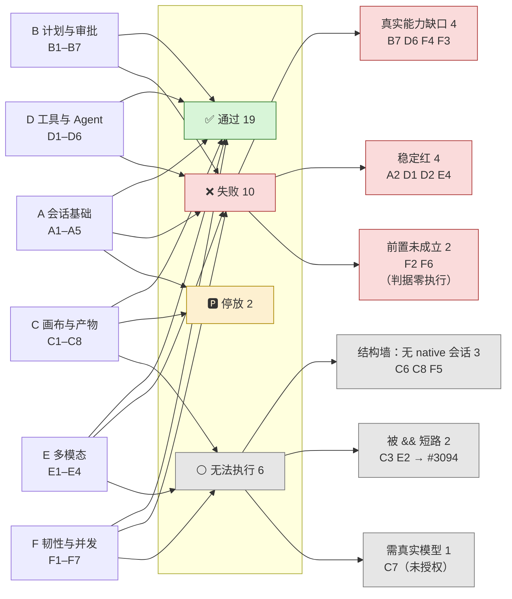

# `/chat` 37 条路径验收报告

> 独立验收员（rev-e2e）在**当前 main** 上的一次真实验收。只测试、只取证，不修代码、不改 spec。
> 结论绑定 exact SHA；每条路径写明「执行方式 / 结果 / 证据 / 对应 issue」。

## 0. 实测 SHA 与车道

| 项 | 值 |
| --- | --- |
| **实测 SHA** | `303d0022477dca448b25a3fe6827a1752b0225c7` |
| 取法 | `git fetch origin && git rev-parse origin/main`（2026-09-08 17:31 CST） |
| 验收 ref | `verify/acceptance-303d00224`（该 SHA 的独立 ref，**不含**任何在飞修复 PR） |
| 基线 | run `34198904439`，SHA `ce5242ef5`，`chat-read` **71 ✓ / 17 ✘** |

⚠ **实测 SHA 不是"此刻"的 main。** 我 fetch 之后 `e77c9bb33`（PR #3071，十步滚动替身）合入了 main。
本轮**不含** #3071。这是刻意的：验收要绑定一个不动的 SHA，否则每条结论都指向一个已经变了的树。

### 本轮派的 CI run

| 车道 | run | 覆盖的路径 |
| --- | --- | --- |
| `e2e-full`（含 `verify:chat-read` step） | [34210666232](https://github.com/boardx/workspacex/actions/runs/34210666232) | 24 条（chat-read）+ C3 / E2 |
| `chat-path-coverage` | [34210719166](https://github.com/boardx/workspacex/actions/runs/34210719166) | A3 / C4 / C5 / F2 / F6 |
| `chat-task-workbench` | [34210929521](https://github.com/boardx/workspacex/actions/runs/34210929521) | B7 / D6 / F4 |

> `verify:chat-read` 不是独立 job，是 `e2e-full` job 里的一个 step（`harness-verify.yml:606`）——
> 找不到叫 `chat-read` 的 job 是正常的，不是车道没跑。
>
> 第二、三趟显式传了 `run_e2e_full=false`（该 input 默认 **true**）。否则同一个 SHA 会排三趟
> 90 分钟的 `e2e-full`；在 #3038 那种 runner 排满的情况下，这是纯自伤。
>
> `chat-task-workbench` 车道不在派工书的两条 dispatch 里，是我加派的——B7 / D6 / F4 三条路径只在
> 那条车道上有断言，不派它这三条就只能写「未执行」。

## 1. 权威清单：派工书指的那份文档不存在

派工书把权威清单指向 `docs/reports/2026-09-08-chat-37-path-test-plan.md`。
**该文件在 `origin/main`、任何远端分支、任何历史 commit 中都不存在**
（`git log --all --diff-filter=A -- '*37-path*'` 零命中；`docs/reports/` 目录本身也不在 main 上）。

实际承载这 37 行的是 **`.harness/instructions/chat-path-coverage-matrix.md`**：
它的分组与编号（A1–A5 / B1–B7 / C1–C8 / D1–D6 / E1–E4 / F1–F7 = 5+7+8+6+4+7 = **37**）
与派工书逐字吻合，且自称「唯一事实源」。**本报告按该矩阵验收**。

同样不存在的还有 `docs/reports/build-pdf.py`（全仓无此文件）。本报告的 PDF 用仓内现成依赖自建：
`marked@16.4.2` 渲染 markdown、`mermaid@11.16.0`（ESM build）真渲染图、`@playwright/test@1.62.0`
的 chromium 打印。构建脚本会**核对渲染出的 `<svg>` 数量等于 mermaid 围栏数量**，对不上就非零退出——
避免交出一份"图是空白框"的 PDF。

## 2. 判读纪律（本轮的四条硬约束）

1. **红 ≠ 跑过。** `test.fixme` / `test.skip` 的条目一律记 🅿，**不记 ✅ 也不记 ❌**——它们一条断言都没执行。
2. **单趟红 ≠ 回归。** 每条 ❌ 标注「稳定红（与基线同）」还是「本趟新红（疑抖动）」。
3. **`#3047` 已 CLOSED，但它的修法被 revert 了。** #3049（车道串行跑）于 06:03Z 合入并关闭 #3047，
   随后 07:20Z 被 #3056 **revert**（作者自述"被 CI 实测反证推翻"）。
   ⇒ **「约 25% 顺序相关的红」这个现象在本实测 SHA 上仍然成立**，不能因为 issue 显示 CLOSED 就当它没了。
   这正是「静态痕迹 ≠ 动态事实」：issue 的 state 是痕迹，revert commit 才是事实。
4. **原生运行时路径本轮零覆盖。** 见 §5。

### 在飞 PR 的真实状态（派工书的名单已经过期）

| PR | 派工书说 | 实际（对 `303d00224` 核） |
| --- | --- | --- |
| #3060 / #3062 / #3064 | 在飞，别合 | **已在实测 SHA 内**（`453495f2c` / `bca69f201` / `e2ed4e752`） |
| #3071 | 在飞，别合 | 已 MERGED，但在我 fetch **之后**（`e77c9bb33`）⇒ 本轮不含 |
| #3068 | 在飞 PR | **是 issue，不是 PR** |
| #3074 | 未提及 | **唯一真正在飞的修复 PR**（chat-read 基线四条红） |

## 3. 逐条验收结果

图例：✅ 通过 · ❌ 失败 · 🅿 fixme 停放（断言未执行）· ⚪ 无 spec / 本轮无法执行

| # | 判据（用户可见行为） | 执行方式 | 结果 | 证据 | issue / PR |
| --- | --- | --- | --- | --- | --- |
| A1 | 一问一答落真库，刷新后恢复同一条回复 | CI chat-read | ✅ | `agent-chat-core-paths.spec.ts:62` ✓ | — |
| A2 | 第二轮引用第一轮输入，两个 run 各自持久化 | CI chat-read | ❌ **稳定红**（基线同） | `agent-chat-core-paths.spec.ts:89` ✘ 1.3m | #3072（已关）→ 修复在 **PR #3074**（在飞） |
| A3 | 早期事实被挤出 L1 后仍穿过 L2 摘要层 | CI chat-path-coverage | 🅿 | `chat-path-a3-…:49` **skipped**（`test.fixme`） | #3028 |
| A4 | 切走再切回不整页硬导航、不出骨架屏，历史正确恢复 | CI chat-read | ✅ **基线红→本轮绿** | `copilotkit-v2-thread-persistence.spec.ts:97` ✓、`:183` ✓ | #3057 / #3000 |
| A5 | 首次进 `/chat` 走到可输入，不停在骨架屏 | CI chat-read | ✅ | `chat-path-a5-cold-start-first-paint.spec.ts:31` ✓ | #3026 |
| B1 | `confirm_task_intent` 可改假设并恢复同一 run | CI chat-read | ✅ | `agent-task-planning-hitl.spec.ts:132` ✓ 20.9s | — |
| B2 | 按 optionId 选；「都不要」诚实结束为拒绝态 | CI chat-read | ✅ **基线红→本轮绿** | `agent-task-planning-hitl.spec.ts:186` ✓、`:211` ✓ 18.3s | #3062 |
| B3 | 宽泛请求补参后同一持久 run 恢复，只显示一条轨迹一个产物 | CI chat-read | ✅ **基线红→本轮绿** | `agent-task-clarification-result.spec.ts:25` ✓ | #3062 |
| B4 | once / forever / deny 各自的真实服务端语义；deny 不变失败态 | CI chat-read | ✅ | `copilotkit-v2-hitl.spec.ts:81` ✓、`:91` ✓、`:110` ✓ | #3064 |
| B5 | 刷新后恢复同一 permissionRequestId，旧请求重放得 409 | CI chat-read | ✅ | `copilotkit-v2-hitl.spec.ts:97` ✓ | — |
| B6 | 继续操作只提交一次，旧请求不能重复裁决 | CI chat-read | ✅ | `agent-task-planning-hitl.spec.ts:158` ✓ | — |
| B7 | 复杂任务先确认计划，简单问题直答不加门槛 | CI chat-task-workbench | ❌ 记分牌红（能力未实现） | `chat-task-workbench-workflow-states.spec.ts:131` ✘ 1.2m | #2114（记分牌车道） |
| C1 | 模型产出的 canvas 围栏真渲染成工作坊画布 | CI chat-read（用例是 fixme） | 🅿 | `chat-canvas-guidance-render.spec.ts:76` = `test.fixme`，**全文件 0 个 `test()`**；矩阵误标「已覆盖」 | **#3080（本轮新开）**、#3028 |
| C2 | 最大化编辑 → 保存 → reload 看到保存版 → 可回原始版 | CI chat-read | ✅ | `chat-diagram-save-reopen-roundtrip.spec.ts:108` ✓、`:278` ✓ | — |
| C3 | 管理员建模板 → 发布 → 引导师绑定 → 该项目 chat 可达 | CI e2e-full | ⚪ **未执行** | 一条 api 单测红短路掉整个 `fullstack-smoke`；日志里只有静态注册行 `[covered]`，无执行结果 | **#3094（本轮新开）** |
| C4 | 同一轮产出两个画布且都可用、不互相覆盖 | CI chat-path-coverage | ✅ | `chat-path-c4-two-canvases-one-turn.spec.ts:42` ✓ 42.0s | #3026 |
| C5 | 连着三轮各产一个产物，不失败、不重复挂载、不互相覆盖 | CI chat-path-coverage | ✅ | `chat-path-c5-consecutive-artifact-turns.spec.ts:37` ✓ 50.0s | #3026 |
| C6 | chat 里请求 docx/xlsx/pptx，产出可下载且可重新打开 | 未能执行 | ⚪ | chat 侧无 spec；需 native 会话 + 真实沙箱，回环车道（本地同款）结构上测不到 | #3026「已知缺口」、#3052 |
| C7 | chat 里请求 PDF，页数与逐页渲染可核 | 未能执行 | ⚪ | 唯一覆盖在 `real-model-smoke` 车道，需真实模型；本轮**未授权**触发 | #3026 |
| C8 | durable subtask 产出文件回到父会话，可下载 | 未能执行 | ⚪ | 无任何 spec；同 C6 那堵墙（`NativeSessionOwner` + 真实沙箱套接字） | #3026「已知缺口」、#3052 |
| D1 | `write_todos` / `search_documents` 定制卡片走到终态 | CI chat-read | ❌ **稳定红**（基线同） | `copilotkit-v2-tool-rendering.spec.ts:141`（write_todos）✘ 2.6m；`:194`（search_documents）✓ | #3072（已关）→ **PR #3074**（在飞） |
| D2 | 默认折叠、运行中展开实时更新、刷新后可回放 | CI chat-read | ❌ **稳定红**（基线同） | `:285（项目）` ✘ 16.9s / `:285（个人）` ✓ — 同一条用例两个参数化实例，只有「项目」那个红 | #2999 |
| D3 | 临时挂载落库、刷新仍在、重复挂载幂等 | CI chat-read | ✅（第三子句未执行） | `chat-agent-skill-context.spec.ts:188` ✓ 21.0s（前两句）；**「重复挂载幂等」在 `:264` 是 `test.fixme`** | #2514 / #2997 |
| D4 | 「目录可见 / 正文送达 / 真的执行过」三者不混为一谈 | CI chat-read | ✅ | `chat-path-d4-skill-three-states.spec.ts:57` ✓ | #3026 |
| D5 | wire 上 header 与回复来源都换了；不选时默认路径完好 | CI chat-read | ✅（仅新会话） | `copilotkit-v2-agent-switch.spec.ts:72` ✓、`:153` ✓ — 但用例把「切 agent = 开新对话」写成**预期行为**，**不覆盖既有对话内切换** | #3028 |
| D6 | 展开可见输入 / 工具 / 耗时 / 结果 | CI chat-task-workbench | ❌ 记分牌红（能力未实现） | `chat-task-workbench-tool-events.spec.ts:93` ✘ 1.2m | #2114 |
| E1 | 麦克风实时转录进输入框、可编辑、发送后成为消息 | CI chat-read | ✅ | `copilotkit-v2-voice-input.spec.ts:26` ✓（ASR 走 `loopback-asr-provider` 替身） | — |
| E2 | 图片进模型；能力缺席时诚实告知而非静默丢图 | CI e2e-full | ⚪ **未执行** | 同 C3，被 `&&` 短路；它是 `seeded` project 的成员，随 `seeded-github-import` 的依赖一起没跑 | **#3094（本轮新开）** |
| E3 | 上传后可预览、可下载、授权正确 | CI chat-read | ✅（气泡内入口未执行） | `chat-attachment-preview-download.spec.ts:173/209/230` 三条 ✓；`:156`「气泡里附件条可点开预览」是 `test.fixme` | #2997 |
| E4 | steering 排队到下一安全步骤，不打断当前原子步骤 | CI chat-read | ❌ **稳定红**（基线同） | `agent-workbench-steering-acceptance.spec.ts:10` ✘ 20.4s | #3069（已关）→ 修复 **PR #3071 合入于本 SHA 之后**，本轮未含 |
| F1 | 真实失败出现人类可读横幅，横幅之后界面仍可用 | CI chat-read | ✅ | `copilotkit-v2-error-banner.spec.ts:60` ✓ | — |
| F2 | 网络中断后事件流重连并从 journal 续上，不重复不空转 | CI chat-path-coverage | ❌ **前置未成立** | `chat-path-f2-…:40` ✘，死在 `spec:85` 自检守卫「断网时 run 已是终态（succeeded）……本跑测不到重连」⇒ **判据零执行** | #3026 |
| F3 | 暂停 / 恢复 / 重试单步 四个控制都可点且真生效 | CI chat-task-workbench | ❌ **真实能力缺口** | `chat-task-workbench-p1-efficiency.spec.ts:193`（TW-P1-5）✘ 1.3m，首个锚点 `chat-task-workbench-run-pause` 60s 未出现（「运行中不能暂停」）。**矩阵把 spec/车道两列指错了地方** | **#3081（本轮新开）** |
| F4 | 显示失败步骤，可重试该步 / 修改输入 | CI chat-task-workbench | ❌ 记分牌红（能力未实现） | `chat-task-workbench-workflow-states.spec.ts:187` ✘ 2.2m | #2114 |
| F5 | 父取消后子任务不再产出、不发布晚到产物 | 未能执行 | ⚪ | chat 侧无 spec（`apps/api` 侧有）；同 C6 那堵墙 | #3026「已知缺口」、#3052 |
| F6 | 两个线程同时跑，事件不串线、不互相覆盖 | CI chat-path-coverage | ❌ **前置未成立** | `chat-path-f6-…:41` ✘，死在 fixture `support/chat-path-coverage.ts:191`（新建线程落到已存在线程）。截图显示应用健康 ⇒ 车道内跨用例状态污染 | #3047（**修法已被 #3056 回滚**） |
| F7 | 模型侧断流后 UI 诚实结束，不假装还在跑 | CI chat-read | ✅ | `chat-path-f7-upstream-stream-abort.spec.ts:34` ✓ | #3026 |

## 4. 汇总

### 计数

| 结果 | 条数 | 路径 |
| --- | --- | --- |
| ✅ 通过 | **19** | A1 A4 A5 B1 B2 B3 B4 B5 B6 C2 C4 C5 D3 D4 D5 E1 E3 F1 F7 |
| ❌ 失败 | **10** | A2 B7 D1 D2 D6 E4 F2 F3 F4 F6 |
| 🅿 fixme 停放 | **2** | A3 C1 |
| ⚪ 无法执行 | **6** | C3 C6 C7 C8 E2 F5 |
| 合计 | **37** | |

### 10 条 ❌ 的分型（这一层比总数重要）

| 型 | 条数 | 含义 | 路径 |
| --- | --- | --- | --- |
| **真实能力缺口** | 4 | 产品确实没做到，用例正确地红 | B7 D6 F4 F3 |
| **稳定红（与基线一致）** | 4 | 跨 SHA 稳定，已有 issue/PR 在修 | A2 D1 D2 E4 |
| **前置未成立**（判据零执行） | 2 | 用例死在 setup，被测行为一条断言都没跑 | F2 F6 |

⚠ **没有一条是「本趟新红（疑抖动）」。** 本轮 10 条 ❌ 全部可归因，不需要第二趟去区分抖动。

### 与 11:30Z 干净基线（run 34198904439 / SHA `ce5242ef5`）的差异

`chat-read` 车道：**基线 71 ✓ / 17 ✘ → 本轮 78 ✓ / 10 ✘ / 11 skipped**（+7 绿 / −7 红）。

| 方向 | 项 |
| --- | --- |
| **转绿（落在 37 条里）** | **A4**（`thread-persistence:183` 硬导航/骨架屏）、**B2**（`planning-hitl:211` 拒绝态）、**B3**（`clarification:25`） |
| 转绿（不在 37 条里） | `hitl-dialog-dismiss:8`、`run-restore-after-switch:49`、`stream-frame-timing:77`、`control-acceptance:82` |
| **仍红（落在 37 条里）** | **A2**、**D1**、**D2**、**E4** —— 四条跨两个 SHA 稳定 |
| 仍红（不在 37 条里） | `scroll-acceptance:6`、`persona-archived:86`、`roster-landing:104`、`runtime-adapter:293`、`uiux-shots:119` |

⇒ 基线到本轮之间合入的 #3057 / #3060 / #3062 / #3064 确实各自转绿了它们声称修的那些，
**没有制造新的红**。这是本轮唯一一条正向的回归结论。

⚠ 但 `chat-read` 的 71→78 **不能**直接读成「产品好了 7 分」：基线那 17 条里有一部分是
用例自身的锚点错误（#3000 / #2999 的定性结论），修的是用例不是产品。

## 5. 结构性缺口：为什么 8 条测不了，本地真栈也救不了

我被授权起本地真栈，最终**没有起**。理由不是省事，是本地起了也测不到——三条路径撞的是同一堵墙：

`playwright.chat-read.config.ts` 的 webServer 编排里，模型、ASR、视觉、deep-agent **全是回环替身**
（`LOOPBACK_MODEL_*` / `LOOPBACK_ASR_*` / `LOOPBACK_VISION_*` / `loopback-deep-agent-provider`），
**没有 native 会话、没有真实沙箱套接字**。而：

- **C6（chat 侧 Office 产物）** / **C8（子任务产物写回）** / **F5（chat 侧取消传播）**
  都要求 `NativeSessionOwner` + 真实沙箱执行端。矩阵自己在「已知缺口」一节写清了这件事。
  本地按同一份 config 起真栈，起的是同一套回环替身 ⇒ **同样测不到**。
  补这三条不是"再写一个 spec"，是给这条 e2e 链路新增一套 native 编排（新 webServer + 新 CI 时间预算）。
- **C7（PDF 产物）** 唯一的覆盖在 `real-model-smoke` 车道上，需要真实模型。
  真实模型 workflow 本轮**未授权**触发，本地也不该拿真 key 去跑。

**#3052 是这堵墙的 CI 侧投影**：没有任何车道开着 `KERNEL_NATIVE_RUNTIME=1`。
⇒ **DevApp 上那条唯一真实路径，在本轮所有车道里零覆盖**。本报告所有 ✅ 都只对回环替身成立。

### 本轮新发现的缺口（已各自立 issue）

| # | 缺口 | issue |
| --- | --- | --- |
| 1 | 矩阵 **C1** 行标「已覆盖」，但 `chat-canvas-guidance-render.spec.ts` 整个文件是 `test.fixme`（0 个 `test()`）。`lint-chat-path-coverage.mjs` 结构上看不见：它只校验声称由 `chat-path-*` 覆盖的行，且**刻意把 `test.fixme` 也算作有效标签** | **#3080** |
| 2 | 矩阵 **F3** 行的「现有 spec」与「车道」两列指错——判据其实由 `chat-task-workbench-p1-efficiency:193`（TW-P1-5）断言，且是真红（暂停控制不存在）。矩阵指的 `agent-workbench-control-acceptance` 三条 test 全是审批仲裁/取消/刷新恢复，与判据无关 | **#3081** |
| 3 | 一条 api 单测红（`chat-skill-mount-produces-pptx-real-stack` T3，已知 #2995）通过 `verify:full:raw` 的 `&&` **把整个浏览器 e2e 半边短路掉**——C3 / E2 本趟从未执行，而 job 级 `failure` 读起来像「跑了且失败」 | **#3094** |

### 未新开 issue、但必须写进结论的三条

1. **原生运行时路径本轮零覆盖（#3052 已有）。** `playwright.chat-read.config.ts` 的 webServer
   全是回环替身（`LOOPBACK_MODEL_*` / `LOOPBACK_ASR_*` / `LOOPBACK_VISION_*` / `loopback-deep-agent-provider`），
   没有任何车道开 `KERNEL_NATIVE_RUNTIME=1`。**本报告所有 ✅ 都只对回环替身成立。**
2. **#3047 显示 CLOSED，但它的修法已被 #3056 回滚**（#3049 于 06:03Z 合入并关闭 issue，07:20Z 被 revert）。
   ⇒ 「车道无逐测试隔离、约 25% 顺序相关红」在本实测 SHA 上**仍然成立**，F6 的前置失败就是它的直接实例。
   读 issue state 会得到相反结论——这正是「静态痕迹 ≠ 动态事实」。
3. **D3 / D5 / E3 三条判据各有一个子句没被执行**（分别是「重复挂载幂等」`:264` fixme、
   「既有对话内切 agent」被写成预期行为不测、「气泡内附件条预览」`:156` fixme）。
   三条我都记了 ✅，因为它们的主判据真跑真绿；但**不要把这三个 ✅ 读成判据整句都被验过**。

## 6. 路径分组 → 状态

## 7. 给人类测试的建议顺序

### 第一段：先走这 8 条已 ✅ 的核心路径（确认主干真的活着）

按用户真实动线排序，**一条会话里连着做完**，不用切场景：

1. **A5 冷启动首屏** → 打开 `/chat`，应直接可输入，不停在骨架屏。
2. **A1 单轮文本** → 问一句，刷新页面，回复应还在。
3. **B1 确认意图** → 提一个复杂任务，在确认卡里**改一个假设**再继续。
4. **B4 四选一审批** → 触发工具审批，分别试 once / deny，**deny 不该变成失败态**。
5. **C2 画布编辑往返** → 让它出一张图 → 最大化编辑 → 保存 → 刷新重开，应看到保存版。
6. **D4 skill 三态** → 挂一个 skill，分清「目录里看得见 / 正文送到了模型 / 真的执行过」。
7. **E3 附件预览下载** → 传张图和一个 pdf，弹窗里应能内联预览并下载。
8. **F1 错误横幅 + F7 断流** → 触发一次失败，应出人类可读横幅，且横幅之后界面仍可用。

> 这 8 条覆盖 A/B/C/D/E/F 六组各至少一条，是本轮证据最硬的一批。

### 第二段：❌ 的绕行方式（想看这些能力时怎么绕）

| 路径 | 现象 | 绕行 |
| --- | --- | --- |
| **A2 多轮引用** | 第二轮可能引不到第一轮 | 把上下文**显式写进第二条消息**（「接着上面那份清单……」），别依赖隐式引用 |
| **D1 write_todos 卡片** | 计划条目可能不渲染 | 看 Inspector 的「进度」页签，或直接读 run 的持久计划账本；`search_documents` 卡片是好的 |
| **D2 轨迹回放（项目会话）** | 项目会话里刷新后可能回放不出 | **改用个人会话**（不带 `?projectId=`）——同一条用例的「个人」参数化实例是绿的 |
| **E4 运行中插话** | steering 可能打断当前步骤 | 等当前工具跑完再发下一条；**PR #3071 已合入 main（在本报告 SHA 之后），值得重测** |
| **B7 / F4 计划确认门与失败态** | 六态指示器 / 失败恢复动作尚未实现 | 用 B1 的 `confirm_task_intent` 走确认；失败后**重发一条新消息**，别指望「重试该步」 |
| **D6 子 Agent 折叠树** | 子调用落进通用工具卡，没有折叠树 | 展开通用工具卡逐条看，或读 run 详情 |
| **F3 暂停/恢复/重试单步** | **暂停按钮不存在**（不是坏了，是没做） | 只能取消整个 run 再重发 |
| **F2 断线重连 / F6 并发双 run** | 本轮**没测到**（用例死在前置） | 人工值得优先试这两条——它们既没有通过证据，也没有失败证据 |

### 第三段：这些别浪费时间（本轮结构上就测不了）

- **C6 Office 产物 / C8 子任务产物写回 / F5 取消传播**：chat 侧要走 native 会话 + 真实沙箱，
  当前所有 e2e 车道（含本地）都是回环替身，**测不出真结果**。要验只能在 DevApp 真环境手工做。
- **C7 PDF**：需真实模型车道。
- **C3 / E2**：本轮是 CI 短路没跑（#3094），**不是产品坏了**——修好短路后重跑即可，别按缺陷排查。

> ⚠ 最后一条提醒：**本报告所有 ✅ 都建立在回环替身上**（#3052：没有任何车道开
> `KERNEL_NATIVE_RUNTIME=1`）。人工在 DevApp 上重走这 8 条核心路径，仍是不可替代的一步。
