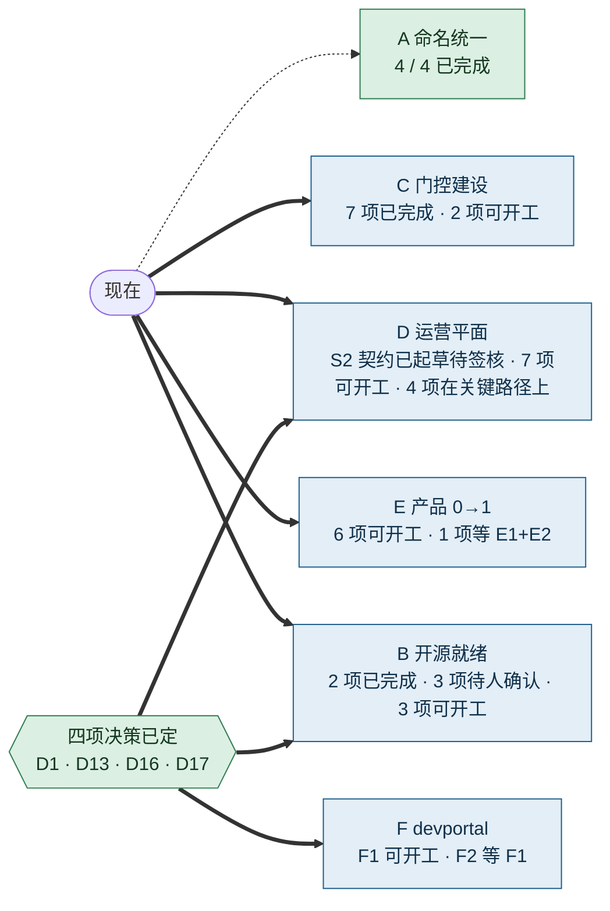
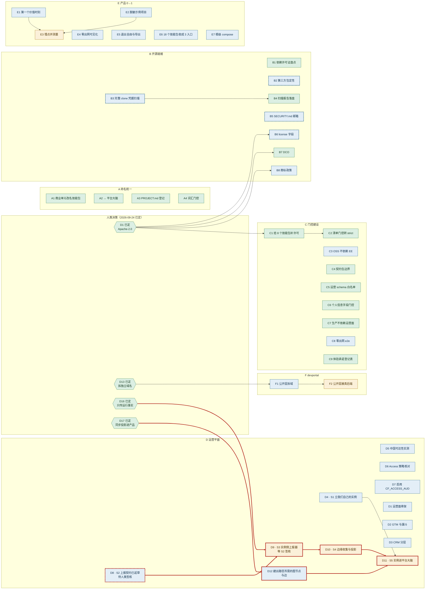
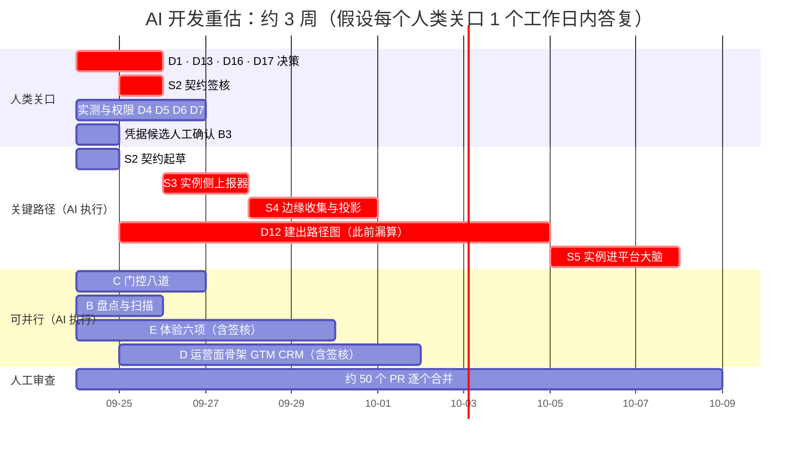

# 实施 Backlog 与并行执行图

> 2026-09-23 · 汇总本系列全部研究的可执行项，标出依赖与可并行轨道。
> 来源：`open-source-business-model.md`（v32.8）、`devportal-positioning.md`、
> `oss-readiness-probe-2026-09-22.md`、三份迭代记录。

---

## 0. 两个词的统一（本版先做）

### ① 商业与分发单元：此前叫 MAAU → **技能包**

**不发明新词——仓库里早就有这个词。** `apps/api/src/infrastructure/skill/ensure-standard-skill-packs.ts`、
`pg-skill-starter-import-repository.ts`、`file-skill-starter-pack-source.ts` 都在用「skill pack」。
整个运行时围绕 skill 建：`skills/` 目录、`SKILL.md`、`capability_id`、`skill-sandbox`。

**此前的 MAAU 是在一个已有清晰名字的概念上又加了一层缩写。** 对外讲「技能包」所有人都懂，
讲「最小智能体可执行单元」需要先解释三十秒。

| 用法 | 处置 |
|---|---|
| **商业与分发单元**（此前的 MAAU） | 改叫**技能包**。开源方案、PPT、对外材料一律用它 |
| **MAAU 画布**（`maau-canvas` skill，WX-S021） | **保留**。它是一种设计方法——把一段讨论收敛成一个可执行单元的画布，与商业单元不是一回事 |
| 代码标识符（`@repo/maau-postinvest-report`、`capability_id`、目录名） | **本版不动**。标识符可以滞后于叫法；真要改另开 issue，波及 40 个代码文件 |

### ② 此前叫「我们自己的组织大脑」、后来叫「团队记忆」→ **平台大脑**

「组织大脑」在本仓已是**产品概念**（`brain-promotion`、`batchConfirmAndWriteBackToBrain`、
「来自组织大脑」数据源区块），指客户把产出物沉淀进本组织知识库的能力。

我们自己那份是**平台层面的记忆**：跨所有客户实例的运行事实，加上工作、创新与学习的全部积累
（ADR、sprint 历史、方法论、踩坑经验、GTM 与案例知识）。

此前改叫「团队记忆」，把它说小了——它不只装我们团队的东西。定为 **平台大脑**：
与组织大脑成**层级**，谁在上谁在下一眼就懂。

| | 产品的组织大脑 | 平台大脑 |
|---|---|---|
| 内容 | 客户的材料、结论、决策链 | 跨实例运行事实 + 工作 / 创新 / 学习的积累 |
| 承载 | `context-engine.md`：PG + pgvector，RLS 隔离 | 产品的组织大脑 + harness 元本体（开发过程那一半，放哪待 D17）；在可移植层，边缘只放投影 |
| 归属 | 产品，售卖 | 不交付 · 内部运营平面 |

两个词都要在 `PROJECT.md` 登记为单一事实源，并加一道 lint：文档里出现旧用法即红。

---

## 1. 并行轨道总图

**七条轨道，五条不依赖任何未决决策，可立即并行开工。**

粗线是**现在就能开工**的轨道，虚线是被决策挡住的部分。
B 轨八项里只有三项要等决策，F 轨两项都要等，D 轨有两项分别等 D16 与 D17。

判据很简单：**一项工作要不要等决策，看它做完后决策改了要不要返工。**
盘点、门控、体验、运营面都不返工——决策怎么定它们都要做。

---

## 2. 完整依赖路径

42 项里只有 16 条依赖边，其余节点互不依赖，全部可并行。红色粗线是关键路径。

⚠ **B6 曾被错列为无悔动作。** 写上 `"license": "Apache-2.0"` 就是在执行 D1，
而 D1 是不可逆决策。无悔的是**盘点**，不是**声明**。

---

## 3. Backlog 全表

状态：`□` 未开始 · `◐` 部分完成 · `■` 已完成

### 轨道 A · 命名统一（无依赖，最先做）

| # | 项 | 状态 | 说明 |
|---|---|---|---|
| A1 | 此前的 MAAU → 技能包，全文档替换 | ✅ | #3888 |
| A2 | 此前的「我们自己的组织大脑」「团队记忆」→ 平台大脑，全文档替换 | ✅ | #3888 起步，v32.7 定名 |
| A3 | 两词在 `PROJECT.md` 登记为单一事实源 | ✅ | |
| A4 | lint：文档出现旧用法即红 | ✅ | `lint-vocabulary.mjs`，已进 `verify:harness:raw` |

### 轨道 B · 开源就绪（3 项依赖决策）

| # | 项 | 状态 | 依赖 |
|---|---|---|---|
| B1 | 装依赖后重跑依赖许可证盘点 `--strict` | ✅ | R5：先修了盘点脚本三个 bug（只读根目录且不看版本、漏掉 LGPL/MPL、不分生产与开发），实跑 2162 / 2163 已解析，随产品分发的需确认 2 个。见 `oss-dependency-licenses-2026-09-24.md` |
| B2 | `@firecrawl/anydoc` 等第三方包可再分发性定性 | ◐ | R5：声明 MIT；原生二进制静态链接了什么需上游依赖清单，留给人 |
| B3 | 完整 clone 上重跑凭据扫描，人工确认候选项 | ◐ | R6：已在完整历史（3076 commit）上跑完，156 处命中；先修了 `--head-only` 永远报 0 的 bug。**人工确认仍待人**，优先看只在历史里的 `aliyun-ak` 2 处 |
| B4 | 凭据扫描报告落盘 | ✅ | R6：`oss-secret-scan-2026-09-24.md`，只记计数不记位置 |
| B5 | 填 `SECURITY.md` 安全联系邮箱 | ◐ | 文件已建 |
| B6 | 补 `package.json` 的 `license` 字段 | ◐ | R11 标 13 个；R14 `cloud-deploy`（D23）；R16 `apps/api`、`apps/web`、`dev-mode-accounts`（D25、D26）。现 18 个：开源 9、售卖 1、运营面 7，**只剩 `fabric-markdown` 未定**（上游许可未记录）。NOTICE 的版权方名称待组织确定 |
| B7 | CLA 或 DCO 落地 | ✅ | R13：按 D20 用 DCO。`CONTRIBUTING.md`（DCO 1.1 原文）、`check-dco.mjs`、`dco.yml` 只查 fork PR |
| B8 | 商标政策 | □ | D1 已定，**可开工** |

### 轨道 C · 门控建设（九项彼此独立）

| # | 项 | 状态 | 依赖 |
|---|---|---|---|
| C1 | 给 8 个技能包补许可 | ✅ | R12：按 D18 全部补 Apache-2.0 官方正文。只加 LICENSE 文件、不改 SKILL.md——改正文要连带发新版到所有实例；已重建 5 个包确认产物逐字节不变 |
| C2 | 清单门控转 `--strict` 接 CI | ✅ | R12：存量清零后转 strict，接入 `verify:harness:raw` |
| C3 | `lint-ee-boundary`（OSS 不依赖 EE） | ✅ | R15 盘点；R16 按 D25、D26 立边界（`ee-*` 目录）并建门控，接入 `verify:harness:raw` |
| C4 | 契约包不依赖内容包的边界检查 | ✅ | R2：`lint-contracts-no-workspace-deps.mjs`，取最严版本——契约包不依赖**任何**工作区包 |
| C5 | 运营平面 schema 白名单门控 | ✅ | R8：`lint-telemetry-schema.mjs` 遍历 zod schema 本身：对象必须 strict、数组必须有上限、无开放键集合 |
| C6 | 运营平面个人信息字段级门控 | ✅ | R8：同一道门——字符串必须受约束（自由文本即红），字段名像个人信息即红 |
| C7 | 生产不依赖运营平面的依赖方向检查 | ✅ | R3：`lint-production-not-on-ops.mjs`，查依赖、import 与 `COORD_*` 环境变量；名单只列运营平面，新应用默认受检 |
| C8 | 本地零出网拔网 e2e | □ | |
| C9 | 体验承诺登记表 + 字段完整性门控 | ✅ | R9：`lint-commitments.mjs` 不另造登记表，直接读方案正文与仓库现实双向对账 |

### 轨道 D · 运营平面（Cloudflare）

| # | 项 | 状态 | 说明 |
|---|---|---|---|
| D1 | 运营面骨架：发布控制台 + 事故面板 | □ | 复用既有 Workers 部署流水线 |
| D2 | GTM 活动与漏斗（只放聚合与 ID） | □ | |
| D3 | CRM：边缘存 ID、源站存个人信息 | □ | 详情页回源 |
| D4 | 平台大脑落位：**S1 立一个真实 WorkspaceX 实例跑我们自己的组织**，现有 ADR / 方法论 / 经验迁进它的本体表，平台大脑从这里起步 | □ | **无依赖**——D14 已定（v32.6：既是也不是，三层分开）。见 `super-instance-design.md` |
| D8 | **S2 上报契约定稿**：schema + 四项同意 + `personal-local` 排除 + 字段白名单门控 | ◐ | R7 已起草（PROPOSED，不导出）；D16 方向确认；D22 出厂默认值已写进契约（只开健康信号）。**待人类签核**；上报周期仍待定 |
| D9 | S3 客户实例侧上报器（出站、可关、可看见传了什么） | □ | D8（签核）；D16 已定：只传运行事实 |
| D10 | S4 边缘收集与投影：Workers 收、DO 聚合、Pages 呈现车队 | □ | D9 |
| D12 | 建出六跳路径所需的图节点与边：客户实例、版本、缺陷、PR（v32.8 补：此前误以为已存在） | □ | D17 已定：同步投影进产品、权威仍是仓库，**可开工**；`ontology_edges` 的节点 kind 由 CHECK 写死，要改迁移 |
| D11 | S5 客户实例进组织大脑成一等实体，接六跳路径检索 | □ | D4 D10 **D12** |
| D5 | 中国可达性实测 | □ | **必须实测，不可假设** |
| D6 | Cloudflare Access 策略核对 | □ | 仓库无声明，控制台才是事实源 |
| D7 | 启用 `CF_ACCESS_AUD` | □ | 安全待办，独立于定位 |

### 轨道 E · 产品 0→1 体验

| # | 项 | 状态 | 依赖 |
|---|---|---|---|
| E1 | 定义第一个价值时刻 + 事件定义 | □ | |
| E2 | 内置脱敏示例项目 | □ | |
| E3 | 埋点并测量 | □ | **E1 + E2** |
| E4 | 零出网做成用户可见状态 | □ | 卖点不可见等于没有 |
| E5 | 退出自由承诺 + 导出命令 | □ | |
| E6 | 18 个技能包收敛成 3 个入口 | □ | 选择过载 |
| E7 | 根级 compose + 升级命令 | □ | 5 个分应用 compose 已存在，是组合 |

### 轨道 F · devportal

| # | 项 | 状态 | 依赖 |
|---|---|---|---|
| F1 | 公开层拆域 | □ | D13 已定：拆独立域名，**可开工** |
| F2 | 公开层接真实后端 | □ | F1；现为 mock |

### 轨道 G · 人类决策

| # | 决策 | 可逆性 | 挡住什么 |
|---|---|---|---|
| G1 | D7 开源目的 · D0 是否开源 | 高 / 中 | 方向，不挡具体执行 |
| ~~G2~~ | ~~D1 许可证~~ | — | **已定：Apache-2.0**（2026-09-24）。B6 B7 B8、C1 解锁 |
| G3 | D4 内容处置 | 高 | 无（H1 主线，但不挡其他轨道） |
| ~~G4~~ | ~~D13 公开层去留~~ | — | **已定：拆出独立域名**（2026-09-24）。F1 解锁 |
| ~~G5~~ | ~~D14 平台大脑是否用自家产品~~ | — | **已定（v32.6）**：既是也不是，三层分开。D4 D8 解锁 |
| ~~G7~~ | ~~D16 联邦运营的是运行事实还是客户内容~~ | — | **已定：只传运行事实**（2026-09-24）。D9 解锁 |
| ~~G8~~ | ~~D17 平台大脑开发过程那一半放哪套图~~ | — | **已定：同步投影进产品，权威仍是仓库**（2026-09-24）。D12 解锁 |
| G6 | D2 D3 D5 D8 D9 D10 D11 D12 D15 | 多为高 | 不挡执行 |

---

## 4. 排布：AI 开发约 3 周（原按人类估算 13 周）

全部改由 AI 开发后，写代码从「周」降到「小时到天」，**瓶颈移到了人**。三周的前提是每个人类关口一个工作日内答复——关口拖一天，整体拖一天。

| AI 加速不了的关口 | 涉及项 | 为什么 |
|---|---|---|
| **决策** | D1 · D13 · D16 · D17，及 E1、C1 的许可证部分 | 商业与法律选择。C1 给 13 个自研技能包填许可证就是在执行 D1 |
| **设计签核** | S2 契约、运营面骨架、GTM、CRM、E4 E5 E6 | 仓库硬约束：契约束开工前人类签核，agent 不许改签核状态 |
| **实测与权限** | D4 D5 D6 D7、B3 凭据候选确认、B5 邮箱 | 要人的身份、网络位置或凭据 |
| **PR 合并** | 约 50 个 PR | 一个 issue 一个 PR、不许合批；实测 PR 开出到合入 47 分到 5 时 19 分 |

新关键路径有两条，都起于决策：**D16 → S3 → S4 → S5**，与 **D17 → D12 建图 → S5**。D16 必须挪到第 1 周。

原来按人类开发估算的十三周排布保留作对照：

```mermaid
gantt
    title 原排布：按人类开发估算（S 期时长为估算，未算入 D12 建图）
    dateFormat X
    axisFormat 第%s周
    section A 命名
    两词替换与登记          :done, a1, 0, 1w
    词汇门控               :done, a2, after a1, 1w
    section D 关键路径
    S2 上报契约定稿         :crit, d8, 0, 3w
    D16 必须已定           :milestone, crit, g16, after d8, 0d
    S3 实例侧上报器         :crit, d9, after d8, 3w
    S4 边缘收集与投影       :crit, d10, after d9, 4w
    S5 实例进平台大脑       :crit, d11, after d10, 3w
    section D 运营面
    S1 立我们自己的实例      :d4, 0, 4w
    中国可达性实测          :d5, 0, 1w
    Access 策略核对        :d6, 0, 1w
    运营面骨架             :d1, 1, 4w
    GTM 与漏斗            :d2, 4, 4w
    CRM 分层              :d3, 6, 4w
    section C 门控
    补 8 个技能包许可（等 D1）:c1, 0, 2w
    转 strict 接 CI       :c2, after c1, 1w
    边界与依赖方向四道       :c3, 1, 4w
    零出网 e2e            :c8, 3, 2w
    section E 体验
    第一个价值时刻定义       :e1, 0, 2w
    脱敏示例项目           :e2, 1, 3w
    埋点并测量             :e3, after e2, 2w
    零出网可见化           :e4, 3, 2w
    退出自由与导出          :e5, 4, 3w
    根级 compose          :e7, 8, 4w
    section B 开源就绪
    依赖许可证盘点          :b1, 0, 2w
    完整 clone 凭据扫描     :b3, 0, 2w
    第三方包定性           :b2, 2, 2w
```

按人类估算时第 6 周设硬性复盘点；按 AI 估算，复盘点应提到第 1 周末——那时四个决策应已定下，否则关键路径已经在滑。

---

## 5. 加快实施的三条判据

1. **不依赖未决决策的先做。** 七条轨道里五条如此——A、C、D、E 全部，B 的 5/8。
   等决策是本方案最大的潜在浪费。
2. **门控可以一道一道上。** 九道彼此独立，不必攒齐再接 CI。
   已建三道（清单、依赖盘点、凭据扫描），做一道划掉一道。
3. **实测类的最先做，因为它们可能推翻计划。**
   中国可达性、Access 策略核对、依赖许可证分布——这三项若结果不利，
   会改变后面几周的安排。**第 1 周就做完，不要拖到需要它们的时候。**

---

## 6. 会推翻计划的事（D14 已答，D16 D17 待答）

| 事 | 若结果不利 | 现在能做什么 |
|---|---|---|
| ~~D14：平台大脑用不用自家产品~~ | ~~用了它就在产品栈，D4 作废~~ | **已答（v32.6）：既是也不是，三层分开。D4 D8 可开工** |
| ~~D16：联邦运营的是运行事实还是客户内容~~ | — | **已答（2026-09-24）：只传运行事实** |
| ~~D17：开发过程知识放哪套图~~ | — | **已答（2026-09-24）：同步投影进产品，权威仍是仓库** |
| **中国可达性** | 运营人员连不上，整个运营面要另备旁路 | 第 1 周实测 |
| **依赖许可证分布** | 出现不可再分发的包，开源前必须替换 | 第 1 周装依赖重跑 |

---

## 7. 十轮 AI 迭代的结果（2026-09-24）

| 轮 | 做了什么 | backlog | issue |
|---|---|---|---|
| R1 | 更正超级实例设计里的本体事实；同步三张图；写入 AI 开发重估 | — | #3928 |
| R2 | 门控：契约包不依赖任何工作区包 | C4 ✅ | #3930 |
| R3 | 门控：生产不依赖运营平面 | C7 ✅ | #3931 |
| R4 | 技能包清单门控误报一半，改用唯一解析器 | C1 → 等 D1 | #3934 |
| R5 | 依赖许可证盘点修三个 bug 后实跑 | B1 ✅ · B2 ◐ | #3936 |
| R6 | 凭据扫描修 `--head-only` 后在完整历史实跑 | B3 ◐ · B4 ✅ | #3939 |
| R7 | 起草客户实例运行信号上报契约（PROPOSED） | D8 ◐ | #3941 |
| R8 | 门控：上报 schema 无自由文本、无个人信息形态 | C5 ✅ · C6 ✅ | #3942 |
| R9 | 门控：承诺登记表与仓库现实双向对账 | C9 ✅ | #3943 |
| R10 | 收口：合入 main、状态回写 | — | — |

新建机械门控 **4 道**，全部接进 `verify:harness:raw`（契约包边界、生产不依赖运营面、上报 schema、承诺对账）；修好报告型工具 **3 道**（技能包清单、依赖盘点、凭据扫描），它们要等 D1 或人工确认后才能转阻断，暂不接链。harness 测试新增 55 条（1837 → 1892），契约包另增 9 条。

### 最重要的发现：前面交付的东西里，有五处是错的

十轮里真正的发现，大半是**早先交付物自己的错误**：

| 轮 | 错在哪 | 错了多少 |
|---|---|---|
| R1 | 超级实例设计把目标架构当成现状，把 harness 元本体当成产品的组织大脑 | 六跳路径上的节点几乎都不存在；S5 被严重低估 |
| R4 | 技能包清单门控自己写了一个只认顶层字段的解析器 | 18 处里 **10 处误报**，还据此写出一个错误的结构性结论 |
| R5 | 依赖盘点只读根目录、不看版本、漏掉 LGPL/MPL | 装着依赖也只解析出 **42 / 2163** |
| R6 | 凭据扫描 `--head-only` 两个 bug 叠加 | **永远报 0 命中**，那条路径从来没真正跑过 |
| R9 | 承诺对照表没人对账 | 13 行里 **5 行状态是错的** |

共同的形状是**假绿**：门控在跑，数字在报，但数字是错的，而且没有东西会发现它错。
修法也是同一个：每道门都要能证明自己**会红**——反例测试、空集判失败、按真实数据核对计数。
这也是 AI 开发提速之后最该警惕的地方：产出越快，越依赖这些门本身是真的。

### 现在挡在人手里的（2026-09-24 更新：D1 / D13 / D16 / D17 已由人类决定，剩下的是签核、确认与指派）

| 等什么 | 挡住什么 | 谁 |
|---|---|---|
| **S2 上报契约签核**（UI / 用例 / API 三件） | D9 S3 开工 | 签核 |
| **凭据候选逐条确认**，先看只在历史里的 `aliyun-ak` 2 处 | 开源 | 人（AI 不读凭据的值） |
| `buffers@0.1.1` 许可、`@firecrawl/anydoc` 原生二进制的上游依赖清单 | B2 收尾 | 人 |
| 安全联系人与 `SECURITY.md` 邮箱 | B5、4.9 的负责人 | 组织决策 |
