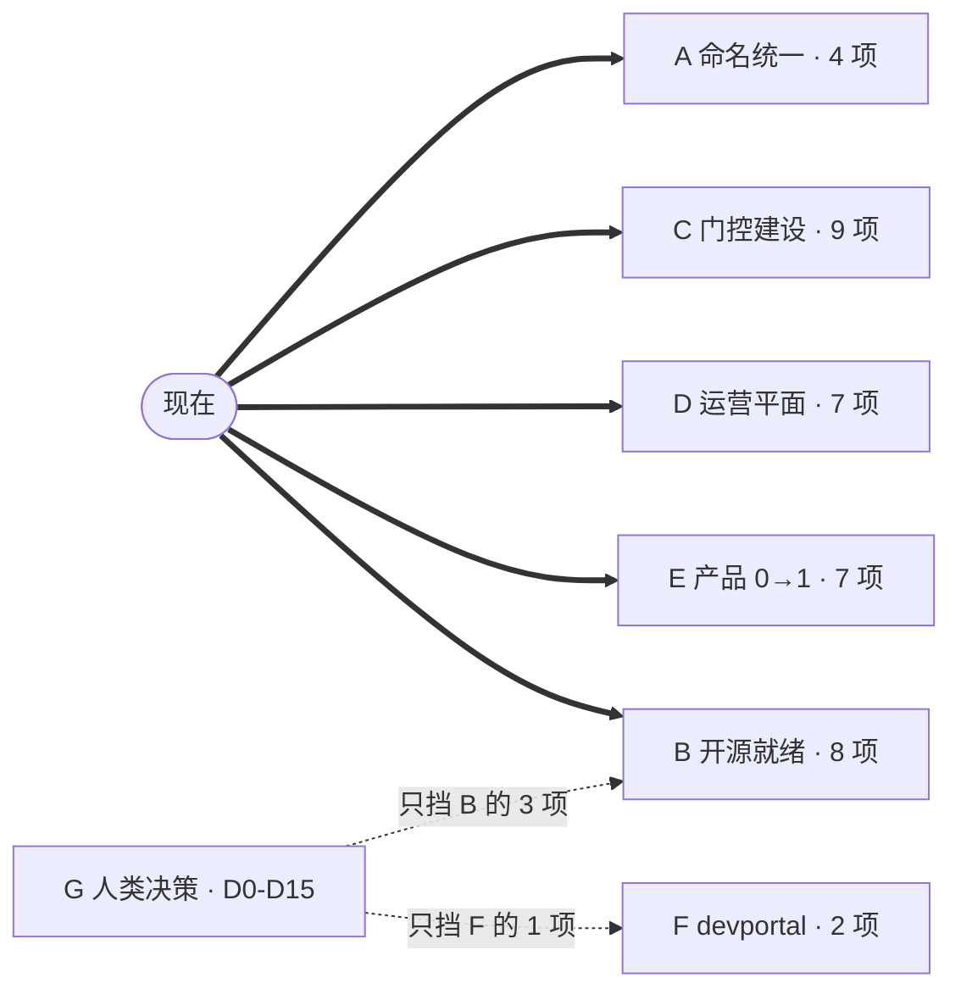
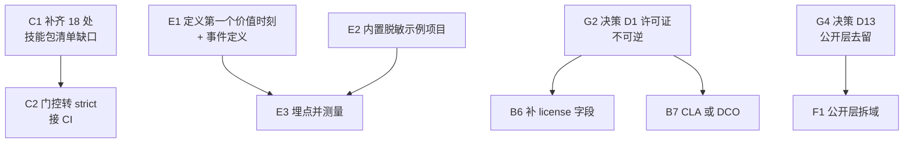

# 实施 Backlog 与并行执行图

> 2026-09-23 · 汇总本系列全部研究的可执行项，标出依赖与可并行轨道。
> 来源：`open-source-business-model.md`（v32.3）、`devportal-positioning.md`、
> `oss-readiness-probe-2026-09-22.md`、三份迭代记录。

---

## 0. 两个词的统一（本版先做）

### ① 商业与分发单元：此前叫 MAAU → **技能包**

**不发明新词——仓库里早就有这个词。** `apps/api/src/infrastructure/skill/ensure-standard-skill-packs.ts`、
`pg-skill-starter-import-repository.ts`、`file-skill-starter-pack-source.ts` 都在用「skill pack」。
整个运行时围绕 skill 建：`skills/` 目录、`SKILL.md`、`capability_id`、`skill-sandbox`。

**此前的 MAAU 是在一个已有清晰名字的概念上又加了一层缩写。** 对外讲「技能包」所有人都懂，
讲「最小智能体可执行单元」需要先解释三十秒。

| 用法 | 处置 |
|---|---|
| **商业与分发单元**（此前的 MAAU） | 改叫**技能包**。开源方案、PPT、对外材料一律用它 |
| **MAAU 画布**（`maau-canvas` skill，WX-S021） | **保留**。它是一种设计方法——把一段讨论收敛成一个可执行单元的画布，与商业单元不是一回事 |
| 代码标识符（`@repo/maau-postinvest-report`、`capability_id`、目录名） | **本版不动**。标识符可以滞后于叫法；真要改另开 issue，波及 40 个代码文件 |

### ② 此前叫「我们自己的组织大脑」→ **团队记忆**

「组织大脑」在本仓已是**产品概念**（`brain-promotion`、`batchConfirmAndWriteBackToBrain`、
「来自组织大脑」数据源区块），指客户把产出物沉淀进本组织知识库的能力。

我们自己那份装的是 ADR、sprint 历史、方法论、踩坑经验、GTM 与案例知识。
叫 **团队记忆**：一看就懂，且不会和产品的组织大脑混。

| | 产品的组织大脑 | 团队记忆 |
|---|---|---|
| 内容 | 客户的材料、结论、决策链 | 我们的决策、历史、方法论、经验 |
| 承载 | `knowledge-ontology.md` 四张 PG 表，RLS 隔离 | 运营平面（Cloudflare） |
| 归属 | 产品，售卖 | 不交付 · 内部运营平面 |

两个词都要在 `PROJECT.md` 登记为单一事实源，并加一道 lint：文档里出现旧用法即红。

---

## 1. 并行轨道总图

**七条轨道，五条不依赖任何未决决策，可立即并行开工。**

粗线是**现在就能开工**的轨道，虚线是被决策挡住的部分。
B 轨八项里只有三项要等决策，F 轨两项都要等。

判据很简单：**一项工作要不要等决策，看它做完后决策改了要不要返工。**
盘点、门控、体验、运营面都不返工——决策怎么定它们都要做。

---

## 2. 真正的依赖（只有五条）

其余全部可并行。

⚠ **B6 曾被错列为无悔动作。** 写上 `"license": "Apache-2.0"` 就是在执行 D1，
而 D1 是不可逆决策。无悔的是**盘点**，不是**声明**。

---

## 3. Backlog 全表

状态：`□` 未开始 · `◐` 部分完成 · `■` 已完成

### 轨道 A · 命名统一（无依赖，最先做）

| # | 项 | 状态 | 说明 |
|---|---|---|---|
| A1 | 商业单元技能包 → 技能包，全文档替换 | □ | 对外材料一律用新词 |
| A2 | 团队记忆 → 团队记忆，全文档替换 | □ | |
| A3 | 两词在 `PROJECT.md` 登记为单一事实源 | □ | |
| A4 | lint：文档出现旧用法即红 | □ | 否则半年后又漂回去 |

### 轨道 B · 开源就绪（3 项依赖决策）

| # | 项 | 状态 | 依赖 |
|---|---|---|---|
| B1 | 装依赖后重跑依赖许可证盘点 `--strict` | ◐ | 脚本已建 |
| B2 | `@firecrawl/anydoc` 等第三方包可再分发性定性 | □ | |
| B3 | 完整 clone 上重跑凭据扫描，人工确认候选项 | ◐ | 脚本已建 |
| B4 | 凭据扫描报告落盘 | □ | B3 |
| B5 | 填 `SECURITY.md` 安全联系邮箱 | ◐ | 文件已建 |
| B6 | 补 `package.json` 的 `license` 字段 | □ | **D1** |
| B7 | CLA 或 DCO 落地 | □ | **D6** |
| B8 | 商标政策 | □ | **D1** |

### 轨道 C · 门控建设（九项彼此独立）

| # | 项 | 状态 | 依赖 |
|---|---|---|---|
| C1 | 补齐 18 处技能包清单缺口 | □ | 门控已报出明细 |
| C2 | 清单门控转 `--strict` 接 CI | □ | **C1** |
| C3 | `lint-ee-boundary`（OSS 不依赖 EE） | □ | |
| C4 | 契约包不依赖内容包的边界检查 | □ | |
| C5 | 运营平面 schema 白名单门控 | □ | |
| C6 | 运营平面个人信息字段级门控 | □ | |
| C7 | 生产不依赖运营平面的依赖方向检查 | □ | |
| C8 | 本地零出网拔网 e2e | □ | |
| C9 | 体验承诺登记表 + 字段完整性门控 | □ | |

### 轨道 D · 运营平面（Cloudflare）

| # | 项 | 状态 | 说明 |
|---|---|---|---|
| D1 | 运营面骨架：发布控制台 + 事故面板 | □ | 复用既有 Workers 部署流水线 |
| D2 | GTM 活动与漏斗（只放聚合与 ID） | □ | |
| D3 | CRM：边缘存 ID、源站存个人信息 | □ | 详情页回源 |
| D4 | 团队记忆落位：**S1 立一个真实 WorkspaceX 实例跑我们自己的组织**，团队记忆迁进它的组织大脑 | □ | **无依赖**——D14 已定（v32.6：既是也不是，三层分开）。见 `super-instance-design.md` |
| D8 | **S2 上报契约定稿**：schema + 四项同意 + `personal-local` 排除 + 字段白名单门控 | □ | 无依赖，可与 D4 并行 |
| D9 | S3 客户实例侧上报器（出站、可关、可看见传了什么） | □ | D8；**等 D16** |
| D10 | S4 边缘收集与投影：Workers 收、DO 聚合、Pages 呈现车队 | □ | D9 |
| D11 | S5 客户实例进组织大脑成一等实体，接六跳路径检索 | □ | D4 D10 |
| D5 | 中国可达性实测 | □ | **必须实测，不可假设** |
| D6 | Cloudflare Access 策略核对 | □ | 仓库无声明，控制台才是事实源 |
| D7 | 启用 `CF_ACCESS_AUD` | □ | 安全待办，独立于定位 |

### 轨道 E · 产品 0→1 体验

| # | 项 | 状态 | 依赖 |
|---|---|---|---|
| E1 | 定义第一个价值时刻 + 事件定义 | □ | |
| E2 | 内置脱敏示例项目 | □ | |
| E3 | 埋点并测量 | □ | **E1 + E2** |
| E4 | 零出网做成用户可见状态 | □ | 卖点不可见等于没有 |
| E5 | 退出自由承诺 + 导出命令 | □ | |
| E6 | 18 个技能包收敛成 3 个入口 | □ | 选择过载 |
| E7 | 根级 compose + 升级命令 | □ | 5 个分应用 compose 已存在，是组合 |

### 轨道 F · devportal

| # | 项 | 状态 | 依赖 |
|---|---|---|---|
| F1 | 公开层拆域 | □ | **D13** |
| F2 | 公开层接真实后端 | □ | F1；现为 mock |

### 轨道 G · 人类决策

| # | 决策 | 可逆性 | 挡住什么 |
|---|---|---|---|
| G1 | D7 开源目的 · D0 是否开源 | 高 / 中 | 方向，不挡具体执行 |
| G2 | D1 许可证 | **不可逆** | B6 B7 B8 |
| G3 | D4 内容处置 | 高 | 无（H1 主线，但不挡其他轨道） |
| G4 | D13 公开层去留 | 中 | F1 F2 |
| ~~G5~~ | ~~D14 团队记忆是否用自家产品~~ | — | **已定（v32.6）**：既是也不是，三层分开。D4 D8 解锁 |
| **G7** | **D16 联邦运营的是运行事实还是客户内容** | **极低**（是商业模式换道） | S3 之后全部（D9 D10 D11） |
| G6 | D2 D3 D5 D8 D9 D10 D11 D12 D15 | 多为高 | 不挡执行 |

---

## 4. 十三周排布

轨道并行，同一周有多条在跑。

```mermaid
gantt
    title 十三周实施排布（轨道并行）
    dateFormat X
    axisFormat 第%s周
    section A 命名
    两词替换与登记        :a1, 0, 1w
    旧用法 lint          :a2, after a1, 1w
    section C 门控
    补齐清单 18 处        :c1, 0, 2w
    转 strict 接 CI      :c2, after c1, 1w
    边界与依赖方向四道      :c3, 1, 4w
    零出网 e2e           :c8, 3, 2w
    section E 体验
    第一个价值时刻定义      :e1, 0, 2w
    脱敏示例项目          :e2, 1, 3w
    埋点并测量            :e3, after e2, 2w
    零出网可见化          :e4, 3, 2w
    退出自由与导出         :e5, 4, 3w
    根级 compose         :e7, 8, 4w
    section D 运营面
    中国可达性实测         :d5, 0, 1w
    Access 策略核对       :d6, 0, 1w
    运营面骨架            :d1, 1, 4w
    GTM 与漏斗           :d2, 4, 4w
    CRM 分层             :d3, 6, 4w
    section B 开源就绪
    依赖许可证盘点         :b1, 0, 2w
    完整 clone 凭据扫描    :b3, 0, 2w
    第三方包定性          :b2, 2, 2w
```

**第 6 周设硬性复盘点**：不达标就砍范围，可砍项预先定好。

---

## 5. 加快实施的三条判据

1. **不依赖未决决策的先做。** 七条轨道里五条如此——A、C、D、E 全部，B 的 5/8。
   等决策是本方案最大的潜在浪费。
2. **门控可以一道一道上。** 九道彼此独立，不必攒齐再接 CI。
   已建三道（清单、依赖盘点、凭据扫描），做一道划掉一道。
3. **实测类的最先做，因为它们可能推翻计划。**
   中国可达性、Access 策略核对、依赖许可证分布——这三项若结果不利，
   会改变后面几周的安排。**第 1 周就做完，不要拖到需要它们的时候。**

---

## 6. 会推翻计划的事（D14 已答，D16 新增）

| 事 | 若结果不利 | 现在能做什么 |
|---|---|---|
| ~~D14：团队记忆用不用自家产品~~ | ~~用了它就在产品栈，D4 作废~~ | **已答（v32.6）：既是也不是，三层分开。D4 D8 可开工** |
| **D16：联邦运营的是运行事实还是客户内容** | 若是客户内容，开源方案的归属表、数据边界、对自托管客户的全部承诺一起作废 | S1 S2 不受影响，先做这两期 |
| **中国可达性** | 运营人员连不上，整个运营面要另备旁路 | 第 1 周实测 |
| **依赖许可证分布** | 出现不可再分发的包，开源前必须替换 | 第 1 周装依赖重跑 |
