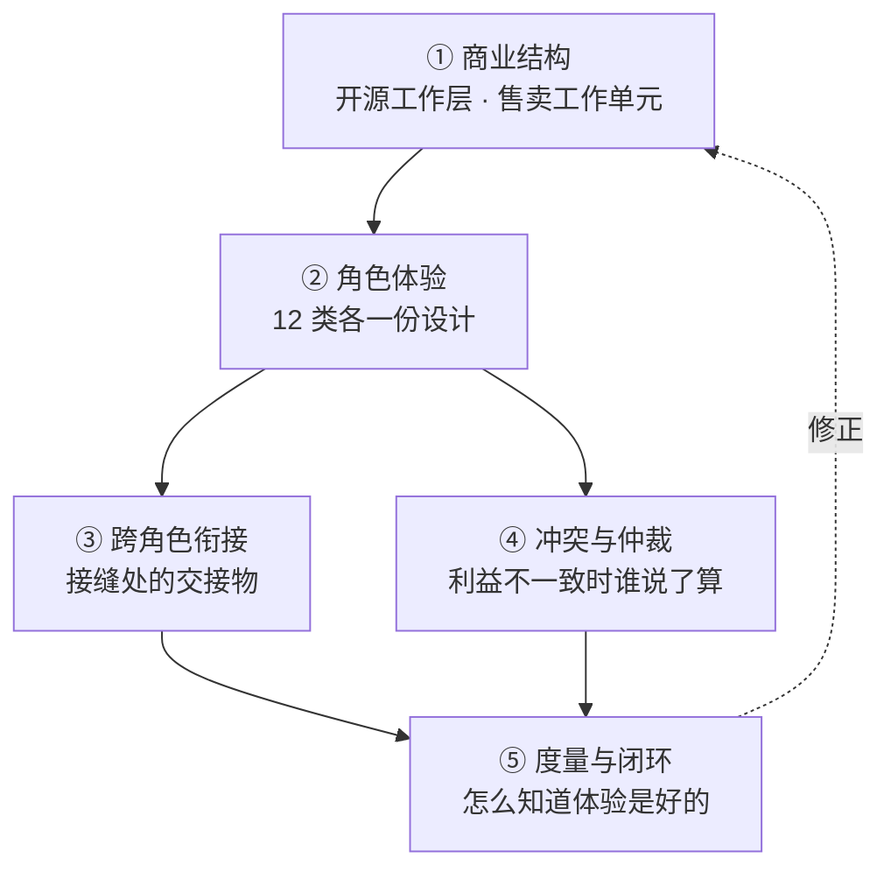

# WorkspaceX 开源方案（v32）—— 完整解决方案、各方体验与可执行门控

> 状态：**研究稿，待人类决策**（2026-09-22）。
> v11 = 初稿经十轮迭代；v12 = 吸收战略材料后按 MAAU 重写；
> v22 = 再经第 11–20 轮迭代，从「切分方案」变成「完整解决方案」；
> **v32 = 再经第 21–30 轮迭代（100 个问题），把 v22 自己点名的 5 个缺口变成可执行的东西，
> 并按仓库铁律「没有脚本的规范视为未落地」造出第一道真会红的门控。**
> 迭代记录：`-iterations.md`（1–10 轮）、`-iterations-2.md`（11–20 轮）、`-iterations-3.md`（21–30 轮）。
> 仓库实测：`oss-readiness-probe-2026-09-22.md`。
> 事实带出处，假设带标签。

---

## 0. v32 改了什么

v22 结尾诚实地写了「现在还不完整」并点了 5 个缺口。**逐个实测，两个是错的，一个半对。**

| v22 的缺口 | 实测 | 修正 |
|---|---|---|
| MAAU 格式规范不存在 | **错**。SKILL.md frontmatter 已含 `name` / `description` / `capability_id` / `version`，`maau-canvas` 就带 `WX-S021` 与 `3.0.0` | 缺的不是格式，是**对外公布的契约**。工作量从「设计」降为「固化并公布」 |
| devportal 没有发布路径 | 对 | 保留 |
| 通用 compose 不存在 | **半对**。5 个分应用 compose 已存在 | 缺的是根级编排，是**组合不是创造** |
| 报告里的证据呈现没有设计 | 对 | 保留，并补「证据被撤回时已发出的报告怎么办」 |
| 没有一条承诺是机械检查的 | 对，但**不是难题**：仓库已有 23 个 lint 门控的现成形状 | **本版已造出第一道**，见下 |

### 本版造出的第一道门控

`.harness/scripts/lint-maau-manifest.mjs`——检查每个 MAAU 能否机械回答
「**是谁、哪一版、凭什么用**」。这是商业边界要回答的第一个问题：这一个 MAAU 是开源的还是付费内容。

实测 18 个 MAAU，**12 个有问题，共 18 处**，而且缺口呈现出一个结构性形状：

| 群体 | 数量 | 有身份（`capability_id` + `version`） | 有许可 |
|---|---|---|---|
| 自研 | 13 | **有** | 多数无 |
| 外来 | 5 | **无** | 有 |

**清单的两半分裂在两批人身上，没有一个 MAAU 两样俱全。**
自研的声明身份不声明许可，外来的声明许可不声明身份。也就是说在今天，
**没有任何一个 MAAU 能机械回答它是开源还是付费**——而整个商业模式建立在这个区分上。

门控默认只报告不阻断，存量补齐后再转 `--strict`。长期黄着的门控等于没有。

### 还有一处一词两义

仓库里已经有一个叫 `maau-canvas` 的产品 skill，它把会议提炼成「MAAU 画布」；
而本方案把 MAAU 当作**商业与分发单元**。同一个词两个意思，文档与代码会各说各的。
必须区分：**MAAU 画布**是一种产物，**MAAU**是分发与计价的单元。

### 承诺与门控对照表

承诺不带门控就只是一句话。逐条登记，做一道划掉一道。

| 承诺 | 门控 | 状态 |
|---|---|---|
| 每个 MAAU 都能判定身份与许可 | `lint-maau-manifest` | **本版已建** |
| 依赖许可证全部已知 | `oss-dependency-inventory --strict` | 已建，待装依赖后重跑 |
| 历史无明文凭据 | `oss-secret-scan --strict` | 已建，待完整 clone 重跑 |
| 契约包不依赖 MAAU 内容包 | 边界检查 | 未建 |
| OSS 不依赖 EE | `lint-ee-boundary` | 未建 |
| 本地零出网 | 拔网 e2e，断言出网计数为 0 | 未建 |
| 第一个价值时刻有埋点 | 事件定义存在且被触发 | 未建 |
| 每类角色的体验有主、有判据、有度量 | 体验承诺登记表字段完整性 | 未建 |
| 响应 SLA 达成率 | 自动统计 + 看板，越线开 issue | 不可阻断，只能统计 |
| 退出自由 | 导出命令存在且 e2e 跑通 | 部分可查；「不断供」靠合同不靠脚本 |

## 0.1 v22 改了什么（存档）

前两版回答的是「开源什么、怎么赚钱」。那不是一个方案，是方案的一部分。
**一个完整的解决方案还要回答：每一类人在这件事里的体验是什么样的，由谁负责，怎么知道它好。**

| # | v12 | v22 |
|---|---|---|
| 1 | 7 类利益相关者 | **12 类**；少算的 5 类里有 3 类握有否决权 |
| 2 | 只描述各方「付费点与反感点」 | 每类角色一份**体验设计**：入口、第一个价值时刻、卡点、承诺、度量、负责人 |
| 3 | 没有角色之间的衔接 | **接缝是体验最常断的地方**，逐个定义交接物 |
| 4 | 假装各方利益一致 | 显式列出**冲突对**与仲裁原则 |
| 5 | 市场基础设施「已具备一半」 | 实测推翻：devportal 18 个页面**没有发布路径** |
| 6 | 计量事件列为待建 | 实测修正：token 额度与组织分配**已实现** |
| 7 | 资源 0.7 FTE | **承认承担不了 12 类角色**，H1 只承诺 4 类 |

---

## 1. 完整方案的五个部分

v12 只完成了 ①。②③④⑤ 是这一版补的，缺任何一个都不是完整方案。

---

## 2. 商业结构（承自 v12，未变）

**开源工作层，售卖工作单元。** 切分原则一句话：

> 凡是让我们成为中立工作层的，开源；凡是随客户积累的，售卖。

| 归属 | 内容 |
|---|---|
| **OSS（Apache-2.0）** | MAAU 运行时、Agent Harness、Context Engine、模型路由与适配层、Evidence/Eval 框架、沙箱、**MAAU 格式规范**、桌面本地版 |
| 售卖 · MAAU 内容 | 方法论正文、判据阈值、评测集、护栏、行业模板 |
| 售卖 · 托管执行 | 云端算力、模型配额、长任务、跨设备 |
| 售卖 · 企业治理 | SSO/SCIM、审计、多租户、配额、合规导出 |
| 售卖 · 市场通道 | 签名、审核、结算、分成 |

计价重心在 Task 与 MAAU 用量，座席只是入口。Outcome 计价与自托管结构性冲突，永远只存在于托管与企业合同。

定位：WorkspaceX 在 **AI Workspace 层**（同层 Copilot、Glean、飞书豆包、钉钉），不在 Agent Infra 层。
**这一层没有一个开源的**，所以开源是楔子不是入场券。

---

## 3. 十二类利益相关者

按六问盘点：谁掏钱、谁使用、谁受益、谁供给、谁把门、谁被影响。

| # | 角色 | 类型 | 有否决权 | H1 是否承诺体验 |
|---|---|---|---|---|
| 1 | 个人研究者 / 分析师 | 用户 | — | **是** |
| 2 | 团队 leader / 买家 | 买家 | 是 | **是** |
| 3 | 机构 IT 与安全 | 把门 | **是** | **是** |
| 4 | 业务采购方 | 买家 | **是** | 否，H2 |
| 5 | 最终读者（投委会） | 受益者 | — | **是** |
| 6 | 被评估企业 | 被影响者 | — | 否，H2（但合规底线 H1 就要有） |
| 7 | MAAU 作者 | 供给 | — | 否，H2 |
| 8 | 社区贡献者（三档） | 供给 | — | 部分，H1 只做首次贡献者 |
| 9 | 维护者（我们自己） | 供给 | 是 | **是**（否则前面全部塌掉） |
| 10 | 伙伴 / SI / 云厂 | 渠道 | — | 否，H2 |
| 11 | 安全研究者 | 把门 | — | 部分，H1 只做披露通道 |
| 12 | 内部销售与实施 | 供给 | — | 否，H2 |

⚠ **资源现实**：社区运营 0.5 FTE 加安全响应 0.2 FTE 承担不了 12 类角色。
H1 只承诺 5 类半，其余**明确写「暂不承诺」**，而不是承诺了做不到。
承诺不到的地方写清楚，比假装覆盖更可信。

---

## 4. 每类角色的体验设计

每份设计固定六格：**入口 / 第一个价值时刻 / 最大卡点 / 我们的承诺 / 怎么度量 / 谁负责**。

### 4.1 个人研究者与分析师

| 格 | 内容 |
|---|---|
| 入口 | 桌面版安装包，或 `docker compose up` |
| **第一个价值时刻** | **上传一份真实材料，拿到第一条带证据引用的结论。**这是全方案唯一的 0→1 北极星 |
| 最大卡点 | 首次启动要拉 GB 级模型权重；材料敏感，用户不会立刻上传真实数据 |
| 承诺 | 边下边用内置脱敏示例项目；断网可用；**本次会话出网 0 次**在界面上可见可点开 |
| 度量 | 安装到第一个价值时刻的中位时长；30 天留存 |
| 谁负责 | 桌面版负责人 |

**关键设计**：零出网是卖点却不可见。`local-egress-guard.ts` 一直在跑，用户看不到任何证明。
把它做成可见状态，卖点才成立。

**期望管理**：本地模型弱于云端，首屏必须明示当前模型与能力边界，一键对比云端。
不说清楚，用户会以为产品弱而不是模型弱。

**收敛选择**：18 个 skill（实测）对新用户是选择过载，按场景收敛成 3 个入口。

### 4.2 团队 leader（买家）

| 格 | 内容 |
|---|---|
| 入口 | 团队里已有人在用个人版 |
| 第一个价值时刻 | 看到团队共享的证据库里，别人的结论自己能复核 |
| 最大卡点 | 自托管运维负担；说不清为什么要付费 |
| 承诺 | 免费层功能完整，付费只换免运维、协作、算力、行业内容 |
| 度量 | 个人版到团队版的转化率与转化时长 |
| 谁负责 | 增长负责人 |

### 4.3 机构 IT 与安全（把门人）

握有否决权，且是**中国市场开源的全部理由**。

| 格 | 内容 |
|---|---|
| 入口 | 安全问卷 |
| 第一个价值时刻 | 能自己读源码、自己部署、自己验证数据不出网 |
| 最大卡点 | 安全问卷、私有部署的补丁路径、许可合规自证 |
| 承诺 | 每个 release 附 SBOM 与许可证清单；**离线补丁包 + 签名校验**；人类可读的权限矩阵随部署产出；许可合规自查工具 |
| 度量 | 安全问卷平均回合数；POC 通过率 |
| 谁负责 | 解决方案架构 |

**最重要的一条承诺，v12 从没写过：退出自由。**

> 不续费之后：开源部分继续可用，数据可完整导出，有明确降级路径，我们不做任何断供动作。

这是开源相对 Copilot 与飞书的**核心差异**，却一直只停在暗示。写成明文承诺才有销售价值。

**POC 剧本**：2 周、双方各出 2 人、通过线是一个可量化的 MAAU 结果，不是「感觉不错」。

### 4.4 最终读者（投委会）

**他们从不登录产品**，却是整条链路的受益者。v12 完全漏掉。

| 格 | 内容 |
|---|---|
| 入口 | 别人发来的一份报告 |
| 第一个价值时刻 | 对某条结论起疑，点开就看到原件出处 |
| 最大卡点 | 分不清哪些是 AI 生成、哪些有证据支撑 |
| 承诺 | 生成来源与证据标记是报告的**必需元素**；每条结论可追溯到原件；置信度与不确定性显式呈现 |
| 度量 | 证据点击率；读者提出的质疑中有多少能当场解答 |
| 谁负责 | 产出物负责人 |

Context Engine 有血缘，但**报告里没有呈现设计**——能力存在不等于体验存在。

### 4.5 被评估企业（被影响者）

它的财务数据被 AI 评级，却在 v12 里没有任何位置。

| 格 | 内容 |
|---|---|
| 入口 | 不主动接触产品 |
| 承诺（H1 底线） | 告知规则写进客户合同模板；**更正与申诉路径**有入口、有时限、有处置；默认不用于训练 |
| 度量 | 申诉量与处置时长 |
| 谁负责 | 合规 |

**冲突**：审计要长期留痕，隐私要最小化。用分层保留解决——证据长留，个人标识短留。

### 4.6 MAAU 作者

| 格 | 内容 |
|---|---|
| 入口 | 开发者门户 |
| 第一个价值时刻 | 本地一条命令跑通自己的第一个 MAAU，看到证据与耗时 |
| 最大卡点 | **发布路径根本不存在**（实测 devportal 18 个页面无 publish） |
| 承诺 | 先有 MAAU 格式规范，再招作者；公开沙箱资源契约（能否联网、内存、超时）；公布分成、结算周期与审核时限；支持**私有 MAAU** |
| 度量 | 从注册到第一个 MAAU 上架的时长；第三方 MAAU 数与交易额 |
| 谁负责 | 生态负责人（H2 才有） |

**现成资产**：11 个 skill 已自带 LICENSE 文件（实测）。每个 MAAU 独立授权**已有先例**，
把它升级成清单里的必填元数据即可，不用从零设计。

### 4.7 社区贡献者（分三档）

| 档 | 体验设计 |
|---|---|
| **首次贡献者**（H1 唯一承诺的一档） | good-first-issue 标注；15 分钟跑通的最小开发环境；快路验证（不要求跑全量 `verify:base`）；fork PR 默认走回环模型 lane 并明确告知哪些检查不跑 |
| 常规贡献者 | 外部贡献快车道：小改动只需 issue + PR + CI 绿，不走内部 sprint 流程 |
| 维护者候选 | 明确台阶：首次合并 → 常规贡献 → triage 权 → 合并权 |

**大多数 PR 会被拒，而拒绝方式决定口碑。** 拒绝模板固定四件：谢、理由、替代路径、是否欢迎再提。

### 4.8 维护者（我们自己）

**开源项目最常见的死法是维护者烧尽。** v12 只给了预算，没给体验。

| 格 | 内容 |
|---|---|
| 最大卡点 | issue 洪水、重复提问、低质量 PR |
| 承诺（对内） | issue 模板 + 自动分流；问答去讨论区不占 issue；triage 轮值表；**响应 SLA 有排班才敢承诺** |
| 度量 | 维护者每周投入时长；未分诊 issue 积压数 |
| 谁负责 | 维护者自己，且这是一级设计约束不是附属 |

agent 生成的 PR 的标识不能只是个说法：标签 + PR 模板字段 + 审阅要求，且机械检查。

### 4.9 安全研究者

| 格 | 内容 |
|---|---|
| 入口 | `SECURITY.md`（已落地，待填联系邮箱） |
| 承诺 | 3 个工作日首次响应；复现环境；时间线通报；致谢与 CVE 署名 |
| 度量 | 首次响应时长；披露到用户收到补丁的全链路时长 |

### 4.10 伙伴 / SI / 云厂（H2）

v12 把「集成商拿去做项目不回流」列为风险，**却没有伙伴计划去转化它**。风险要变渠道。

交付工具包三件套：部署脚本、验收清单、培训材料。加分级认证与公开名录、线索报备制、伙伴沙箱。

**白标目前不可行**：263 个源文件硬编码品牌名（实测）。品牌常量化是 OEM 的前置工作。

### 4.11 业务采购方与内部销售实施（H2）

明确列出但 H1 不承诺，避免承诺做不到。

---

## 5. 跨角色衔接：接缝是体验最常断的地方

接缝从未被识别，所以断裂也看不见。每个接缝要有**交接物**。

```mermaid
flowchart LR
    U["个人用户"] -->|"带产品进公司"| B["买家"]
    B -->|"安全问卷"| IT["IT 与安全"]
    U -->|"带证据链的报告"| R["最终读者"]
    A["MAAU 作者"] -->|"MAAU 包 + 责任边界"| U
    S["安全研究者"] -->|"披露"| M["维护者"]
    M -->|"签名补丁"| IT
    C["社区 issue"] -->|"同一分诊链路"| M
```

| 接缝 | 交接物 | 现状 |
|---|---|---|
| 分析师 → 最终读者 | 带证据链与版本的报告 | 未设计 |
| 个人 → 买家 | bottom-up 转 top-down 的显式路径 | 未设计 |
| 自托管 → 托管 | 迁移剧本，双方各有清单 | 未设计 |
| MAAU 作者 → 使用者 | 责任矩阵写进市场条款 | 未设计 |
| 安全研究者 → 维护者 → 用户 | 从披露到补丁送达的全链路 SLA | 部分（SECURITY.md 只覆盖前半段） |
| 社区 → 商业 | 转化路径与测量点 | 未设计 |

**一个现成资产被浪费了**：仓库里已经有一条端到端反馈闭环——
提反馈 → 分诊建 GitHub issue → 深化成设计 → 推收件箱 → 回流邮件（`feedback-loop-acceptance.md`）。
它只覆盖产品内反馈。**把开源社区的 issue 接进同一条链路**，社区提的问题也能收到回音，
不用另造机制。

**身份**：同一个人在社区、devportal、产品、市场里是四个身份，至少要可关联。

---

## 6. 冲突与仲裁

各方利益并不一致。装作一致，冲突就会在最糟的时候以最贵的方式爆发。

| 冲突对 | 冲突点 | 仲裁原则 |
|---|---|---|
| 免费用户 ↔ 付费用户 | 云端算力分配 | 免费层功能完整但配额有限；**超配额降级到小模型，不断服务** |
| 社区 ↔ 商业 | 路线图优先级 | 商业需求可以插队，但**EE 切线只进不退**——不把已开源的功能挪进 EE |
| 审计留痕 ↔ 隐私最小化 | 保留期 | 分层保留：证据长留，个人标识短留 |
| MAAU 作者 ↔ 平台自营 | 市场排序 | 自营与第三方同等排序规则，公开 |
| 分析师 ↔ 被替代的初级分析师 | 岗位焦虑 | **把初级分析师设计成复核者而不是被替代者**——人类复核是流程中的显式一步，有人、有痕、有责任 |
| 维护者负荷 ↔ 社区期待 | 响应速度 | 承诺有排班支撑的 SLA，承诺不到的明说 |
| 客户数据 ↔ 模型改进 | 训练用途 | 默认不用于训练，要用必须明示并单独授权 |

**谁仲裁**：D7 的答案决定原则，具体个案由维护者决策并公开记录（沿用仓库既有的 ADR 机制）。

---

## 7. 度量：怎么知道体验是好的

每类角色一个北极星，不共用。**遥测 opt-in，默认关闭，代码可审计。**

| 角色 | 北极星 | 护栏 |
|---|---|---|
| 个人用户 | 安装到第一个价值时刻的中位时长 | 30 天留存 |
| 买家 | 个人版到团队版转化率 | 免费层功能完整度不下降 |
| IT 与安全 | 安全问卷平均回合数 | POC 通过率 |
| 最终读者 | 证据点击率 | 当场可解答的质疑占比 |
| MAAU 作者 | 注册到首个上架的时长 | 审核时限达成率 |
| 首次贡献者 | 首次 PR 到合并的时长 | 拒绝后再次提交率 |
| 维护者 | 每周投入时长 | 未分诊 issue 积压数 |
| 安全研究者 | 首次响应时长 | 披露到补丁送达时长 |

**体验失败要能自动触发修复**：每项定阈值，越线自动开 issue。
这一条呼应仓库铁律——**没有脚本的规范视为未落地**，体验设计也不例外。

---

## 8. 复用仓库既有资产（不要重造）

实测清点，四件现成的：

| 资产 | 位置 | 怎么用 |
|---|---|---|
| 端到端反馈闭环 | `.harness/instructions/feedback-loop-acceptance.md` | 把社区 issue 接进同一条分诊与回音链路 |
| token 额度与组织分配 | `apps/api/src/application/auth/set-token-quota.ts`（F160，事务内保证逐人之和 ≤ 组织额度） | 计量基座已有，只需在上面加计费 |
| 每个 skill 自带 LICENSE | 11 个 `skills/*/LICENSE*` | 升级成 MAAU 清单的必填许可元数据 |
| 本地零出网保障 | `local-egress-guard.ts`、`personal-local` 组织 | 做成用户可见的状态，卖点才成立 |

**一件必须新建**：devportal 目前 18 个页面全是 agent/project 中心，**没有发布路径**。
市场是从零开始的工作，不是「已具备一半」。

---

## 9. 分阶段交付与负责人

| 地平线 | 承诺哪些角色的体验 | 明确不承诺 |
|---|---|---|
| **H1 2026-2028** | 个人用户、买家、IT 与安全、最终读者、维护者；首次贡献者与安全披露通道各做一半 | 业务采购方、被评估企业（底线合规除外）、MAAU 作者、伙伴、销售实施 |
| **H2 2028-2031** | MAAU 作者、伙伴、业务采购方、销售实施 | — |
| H3 2030s | 全部，并把格式规范做成行业中立标准 | — |

每类角色必须有**一个具名负责人**。没有负责人的体验等于没有设计。

---

## 10. 需要拍板的决策

承自 v12 的 D0–D9，新增两条：

| 编号 | 决策 | 建议 |
|---|---|---|
| D7 | 开源是为了什么 | 分发与采购解锁（中美各一个理由） |
| D0 | 是否开源 | 开源 |
| D8 | 中国优先还是全球优先 | 中国优先起步（仓库现状已是，海外无部署证据） |
| D1 | 核心许可证 | Apache-2.0（**不可逆**） |
| D6 | 贡献协议 | 取决于 D1：DCO 摩擦小但放弃改许可证的权利 |
| D2 | 仓库结构 | 单仓公开，`ee/` 商业许可 |
| D3 | EE 切线深度 | 仅治理与合规，**承诺只进不退** |
| D4 | MAAU 内容处置 | 运行时开源、内容与评测集闭源（当前架构只支持这一种） |
| D5 | harness 是否独立品牌 | 独立仓独立名，不投专职资源 |
| D9 | 计价重心 | Task 与 MAAU 用量为主，座席为入口 |
| **D10** | **H1 承诺几类角色的体验** | **5 类半**。资源只够这么多，多承诺就是失信 |
| **D11** | **退出自由是否写成明文承诺** | **是**。这是相对 Copilot 与飞书的核心差异，不写就浪费了 |

---

## 11. 什么时候算完整

**完整的判据**：12 类角色各自的最小体验都有**主、有判据、有度量**；接缝都有交接物；
冲突都有仲裁原则；**每条承诺都有脚本能机械检查**。

按第 21 轮的三分类重估缺口——缺的是规范、实现、还是公布：

| 缺口 | 缺什么 | 不补会怎样 | 前置 |
|---|---|---|---|
| MAAU 契约 | **缺公布**（清单已存在于 frontmatter） | 生态没有对接面，第三方无从写起 | 无，可立刻做 |
| 发布路径 | **缺实现** | 市场只是说法 | MAAU 契约 |
| 根级 compose | **缺组合**（5 个分应用 compose 已有） | 自托管承诺没有载体 | 无 |
| 证据呈现 | **缺规范与实现** | 最终读者的体验为空 | 无 |
| 承诺门控 | **缺实现**（形状已有 23 个现成的） | 承诺只是一句话 | 无，一次一道 |

### 90 天计划

v22 的「最小可行 5 件」里**有三件互相依赖**：第一个价值时刻要先有示例项目才测得出，
埋点要先有事件定义。重排后按依赖排期：

| 周 | 做什么 | 验收 |
|---|---|---|
| 1–2 | 补齐 18 处 MAAU 清单缺口，门控转 `--strict` | `lint-maau-manifest --strict` 绿 |
| 2–4 | 内置脱敏示例项目 | 干净环境安装后可直接走完整条链路 |
| 3–5 | 定义第一个价值时刻的事件并埋点 | 事件可被查询到 |
| 4–6 | 把零出网做成可见状态 | 拔网 e2e 断言出网计数为 0 |
| 5–7 | 写下退出自由承诺 + 导出命令 | 一条命令导出全部数据为开放格式 |
| 6 | **中期硬性复盘** | 不达标就砍范围，预先定好可砍项 |
| 7–10 | 社区 issue 接进既有反馈闭环 | 社区提的问题能收到回音 |
| 10–13 | 根级 compose + 升级命令 | 干净容器一条命令起全栈并可升级 |

每件必须**指名到人**，无人认领的不进计划。

### 这方案会怎么失败（事前验尸）

假设 18 个月后失败，最可能的原因按概率排：

1. **维护者先走**，不是没人用。早期信号是每周投入时长持续上升、未分诊 issue 积压。
   这是把维护者体验列为一级约束的原因。
2. 开源了但没人部署。信号是首月部署数低于两位数。
3. 部署了但到不了第一个价值时刻。信号是安装量远大于价值时刻数。
4. EE 切线反复移动，社区信任崩塌。
5. **战线过长**：12 类角色都想照顾，一类都没做好。这是 H1 只承诺 5 类半的原因。
6. 方案没被执行，留在文档里。信号是三个月后仓库没有对应 issue。

## 变更记录

| 版本 | 日期 | 说明 |
|---|---|---|
| v1 | 2026-09-20 | 初稿 |
| v11 | 2026-09-22 | 第 1–10 轮迭代，100 个问题 |
| v12 | 2026-09-22 | 吸收战略材料：按 MAAU 切分、纠正竞争层级、计价重心上移 |
| v22 | 2026-09-22 | 第 11–20 轮迭代，100 个问题：从切分方案变成完整方案；12 类角色各有体验设计；补接缝、冲突、度量、负责人 |

## 参考

- 输入材料：《AI 商业机会与 Workspace X 战略占位》（2026.09，15 页）。其中万亿级数字为该材料自述的**情景模型**，非第三方预测。
- 仓库内：`.harness/instructions/architecture.md`、`docs/architecture/context-engine.md`、`PROP-LOCAL-WORKSPACE-001.md`、`feedback-loop-acceptance.md`、`static-trace-vs-live-fact.md`
- 本系列：`-iterations.md`（1–10 轮）、`-iterations-2.md`（11–20 轮）、`-iterations-3.md`（21–30 轮）、`oss-readiness-probe-2026-09-22.md`
