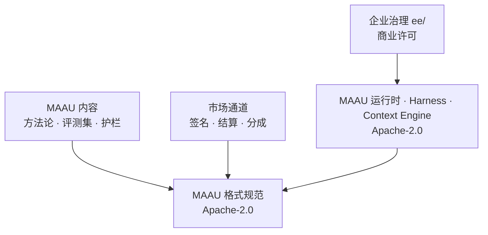

# WorkspaceX 开源商业模式方案（v12）

> 状态：**研究稿，待人类决策**（2026-09-22）。
> v11 = 初稿经十轮迭代修订；**v12 = 吸收《AI 商业机会与 Workspace X 战略占位》后的重写**。
> 迭代过程见 `open-source-business-model-iterations.md`；仓库实测见 `oss-readiness-probe-2026-09-22.md`。
> 事实带出处，假设带标签。战略材料里的情景模型**按其自身声明**，不作为第三方预测引用。

---

## 0. v12 改了什么

战略材料带来四处结构性修正，其中两处推翻了 v11 的判断。

| # | v11 的说法 | v12 的修正 | 影响 |
|---|---|---|---|
| 1 | 按**模块**切 OSS/EE（mod-chat、mod-project…） | 按 **MAAU** 切：运行时开源，工作单元售卖 | 切分原则整体替换 |
| 2 | 竞品是 Dify、Coze、OpenWebUI | **竞品是 Copilot、Glean、飞书/豆包、钉钉** | **开源的战略价值被严重低估** |
| 3 | 定价以座席为主 | 座席只是入口，计价重心上移到 Task / MAAU / Outcome | 免费层不再蚕食主要收入 |
| 4 | D7「开源为了什么」待答 | **中美各有一个答案，且都成立** | D7 可以定了 |

### 最重要的一处：定位错了，开源的价值被低估

v11 把竞品定为 Dify、Coze、FastGPT、OpenWebUI。战略材料把 WorkspaceX 放在
**AI Workspace 层**，同层是 Microsoft Copilot、ChatGPT、Claude、Glean、Notion，
中国是飞书/豆包 Work、企微、钉钉/QwenWork、WPS AI；Dify 与 Coze 在**下一层的 Agent Infra**。

这个差别决定了开源值不值得做：

- **对 Dify，开源是入场券。** Dify 本身就是 Apache-2.0，开源不构成差异。
- **对 Copilot、Glean、飞书、钉钉，开源是楔子。** 这一层**没有一个开源的**。
  可私有部署、可审计、可换模型，是它们结构上给不了的。

v11 因为选错了对标，把开源算成了「跟上行业惯例」；实际上它是**这一层唯一的差异化武器**。

---

## 1. 一页纸

**今天就能做的三件事**（不依赖任何决策）：

1. 生成 SBOM，盘点 2160 个依赖的许可证。**已做**，脚本入库。
2. 写 `SECURITY.md`。**已做**，待填安全联系邮箱。
3. 跑全 git 历史凭据扫描。**脚本已做**；当前副本历史被压平，须在完整 clone 上重跑。

注：补 `license` 字段**不是**无悔动作，那就是 D1 本身，已从清单移除。

**核心建议**：**开源工作层，售卖工作单元。** 运行时、harness、Context Engine、
模型适配层、Evidence/Eval 框架、MAAU 格式规范全部 Apache-2.0；
MAAU 内容（方法论、评测集、护栏）、托管执行、企业治理、市场通道收费。

**为什么现在能定 D7**：开源在两个市场各有一个成立的理由，且不冲突。
美国是分发与开发者信任，中国是**采购解锁**——私有部署与源码可审计正是中国企业采购的硬要求。

**最大风险仍然是没人用**，但风险的形状变了：这一层的竞争对手是超级应用与办公套件，
它们有分发优势。开源不是为了打赢功能战，是为了拿到它们进不去的那些场景。

**证伪条件**：若目标客户访谈显示，私有部署与可审计性在采购决策中排不进前三，
则开源的主要杠杆不存在，应退回桌面免费版加闭源云。

---

## 2. 术语

| 词 | 定义 |
|---|---|
| OSS | Apache-2.0 授权、可自由使用与再分发的部分 |
| EE | 源码公开可见但需商业许可才能合法使用的部分 |
| **MAAU** | Minimum Actionable Agentic Unit。战略材料的定义：Intent → Context → Agent Team → Workflow → Validation → Outcome 构成的最小工作单元，同时是**工作单元、产品单元、收入单元** |
| MAAU 运行时 | 执行 MAAU 所需的通用能力：编排、工具、沙箱、检索、证据记录 |
| MAAU 内容 | 某个 MAAU 特有的方法论正文、判据阈值、评测集、护栏规则 |
| Work Value ≠ AI Revenue | 战略材料的关键区分：完成多少工作，与平台能收多少钱，要分开估 |

---

## 3. 新的切分原则：开源工作层，售卖工作单元

v11 按模块切，切出来的边界与钱的来源对不上——它解释不了为什么投后评级的
评分代码在 domain 层却要闭源（实测冲突见勘探报告）。

战略材料给了更好的原子：**MAAU**。切分原则因此重写为一句话：

> **凡是让我们成为中立工作层的，开源；凡是随客户积累的，售卖。**

| 归属 | 内容 | 理由 |
|---|---|---|
| **OSS** | MAAU 运行时、Agent Harness、Context Engine、模型路由与适配层、Evidence/Eval 框架、沙箱、**MAAU 格式规范**、桌面本地版 | 中立性本身就是产品。闭源的路由层是没人要的锁定 |
| **售卖：MAAU 内容** | 方法论正文、判据阈值、评测集、护栏、行业模板 | 随行业 know-how 积累，照抄不来 |
| **售卖：托管执行** | 云端算力、模型配额、长任务、跨设备 | 边际成本真实存在 |
| **售卖：企业治理** | SSO/SCIM、审计、多租户、配额、合规导出 | 经典 open core 切线 |
| **售卖：市场通道** | 签名、审核、结算、分成 | 是服务与信任，不是代码 |

### 这条原则解决了 v11 解决不了的问题

勘探发现投后评级的评分逻辑 362 行在 `domain` 层，按 v11「domain 永远开源」的规则
不能闭源，与「行业 agent 闭源」直接冲突。MAAU 原则下这不再是矛盾：

- **评分代码是 MAAU 运行时** → 开源。它本来就是通用加权打分，照抄不难。
- **方法论正文与评测集是 MAAU 内容** → 售卖。这才是壁垒。

这与勘探报告独立得出的结论一致：护城河是方法论与评测答案，不是那 500 行代码。

⚠ **一处必须修的架构问题**：方法论的判据阈值现在在 `packages/contracts` 里，
而契约包是要以最宽松许可开源的。**护城河的核心参数躺在计划中最开放的包里**，
必须抽出到独立的 MAAU 内容包。这是 P1 的硬性工作项。

### 依赖方向

格式规范必须最开放，它是生态对接面。内容与治理依赖它，反向依赖由 `lint-ee-boundary` 拦下。

---

## 4. 定价：座席是入口，不是重心

战略材料给的五级收入结构，与开源模型的对应关系如下。
**价格形态取自战略材料，具体数字仍为假设。**

| 级 | 收费形态 | 开源版能否自助获得 | 说明 |
|---|---|---|---|
| 1 Seat / Team 订阅 | 低摩擦入口 | **能**，自托管即全功能 | 开源版替代这一级，这是有意为之 |
| 2 Agent / Task 用量 | Tokens / Run / Task | 自带模型 key 时不计费 | 托管版的主要计价面 |
| 3 Enterprise 平台许可 | 年度合同 | 否 | 治理、私有部署支持、SLA |
| 4 Solution 场景方案 | 项目 + 经常性 | 否 | MAAU bundle + 实施 |
| 5 Marketplace / Outcome | 分成 / 结果 | 否 | 市场抽成与结果计价 |

### 三条由此产生的判断

1. **开源蚕食的是第 1 级，而第 1 级本来就是获客成本。** 用座席费养公司的开源项目
   会和自己竞争；用 Task 与 MAAU 计价的不会。**计价重心上移，是开源可行的前提。**
2. **Outcome 计价与开源天然冲突。** 按结果收费要求平台在回路里测量结果，
   自托管切断了这条回路。**第 5 级永远只存在于托管与企业合同中**，不可能有开源等价物。
3. **市场抽成不靠代码控制。** 任何人都能 fork 市场客户端，但抽成靠的是签名权、
   结算通道与信任，那是服务。开源不削弱它。

中美双市场分别定价，货币与支付通道分开。超配额降级到小模型而不是断服务。

### 单位经济与止损

- 每活跃用户月均 token 乘单价等于变动成本，对照 Task 定价。
- 开源本身计入预算：至少 0.5 FTE 社区加 0.2 FTE 安全响应。
- 实施收入占比超过 60% 触发复盘。
- 止损：12 个月后自助付费为零，退回纯服务模式或闭源。

---

## 5. 中美双轨：同一套代码，开源起两种作用

战略材料的判断是「一套 Agentic Work OS，两套商业化路径」。
开源在两条路径上的作用**不同**，这一点必须写清楚，否则会用一套话术打两个市场。

| | 美国 · Revenue Market | 中国 · Transformation Market |
|---|---|---|
| 采购逻辑 | SaaS 付费习惯成熟，Cloud-first | 私有部署与数据主权优先，咨询/POC 驱动 |
| **开源的作用** | **分发与信任**：开发者入口、PLG 漏斗顶端、对抗 Copilot/Glean 的可审计性 | **采购解锁**：私有部署与源码可审计是硬要求，开源直接降低 POC 摩擦 |
| GTM | Team/Pro → Enterprise → Agent usage → Outcome | 咨询/POC → 私有部署 → License → MAAU/Marketplace |
| 社区渠道 | GitHub、HN、开发者生态 | Gitee、掘金、公众号、线下沙龙；企微/钉钉/飞书入口 |
| 对开源的风险 | 云厂商托管开源版 | 集成商拿去做项目不回流 |

**仓库现状与这条判断一致**：`deploy/` 下只有阿里云，CI 有中国生产部署与发版流程。
产品实际已经是中国优先。海外路径目前**没有任何部署证据**，是纸面计划。

---

## 6. 用户视角

免费层必须完整可用，付费只在托管算力、企业治理、MAAU 内容、结果四个维度加价。

| 用户 | 开源给他什么 | 付费点 | 反感点 |
|---|---|---|---|
| 个人研究者与分析师 | 桌面版加本地模型，完整 studio | 云端更强模型、跨设备同步 | 免费版故意阉割核心流程 |
| 小型咨询与投研团队 | 自托管全功能 | 托管免运维、协作、算力 | 自托管文档烂、升级痛 |
| **机构 IT 与采购** | **可审计源码与私有部署** | 企业治理、MAAU 内容、实施 | 许可证不清晰、EE 边界移动 |
| MAAU 作者与集成开发者 | 格式规范、运行时、沙箱、devportal | 市场分成（他们是收入方） | 格式频繁 breaking、自营挤压 |
| 云厂与 SI 伙伴 | Apache-2.0 允许托管 | 联合销售、OEM | 无，这是 Apache 的代价 |
| 社区贡献者 | 外部贡献快车道：小改动只需 PR 加 CI 绿 | 无，换口碑 | 被内部 sprint 流程劝退 |
| AI 工程团队 | agentic-harness-template | 未来托管协调服务 | 与主产品耦合太深 |

机构 IT 从 v11 的第三位升到**最重要的一类**：在中国市场它是开源的全部理由。

---

## 7. 社区与治理

- **治理**：起步 BDFL 加公开 ADR，写进 `GOVERNANCE.md`。至少两名有合并权的维护者。
- **贡献快车道**：外部小改动只需 issue 加 PR 加 CI 绿，不走内部 sprint 流程。
- **语言**：英文只维护入口层，深层容忍中文。
- **Roadmap**：公开 roadmap 只露 phase 目标与季度。
- **安全**：`SECURITY.md` 已落地，待填联系邮箱。
- **MAAU 格式兼容性**：格式是生态契约，比 API 更不能随便破。
  契约单源让它可机械 diff，做成发布门控，承诺 SemVer。
- **响应 SLA**：承诺首次响应时间并公开达成率。
- **agent 参与度公开披露**：PR 标注生成来源，人类维护者负最终责任。

---

## 8. 路线：按三个地平线重排

战略材料的 H1/H2/H3 与 v11 的 P0-P5 是两套坐标。以地平线为主，开源阶段挂在它下面。

| 地平线 | 战略目标 | 开源侧要交付什么 | 判据 |
|---|---|---|---|
| **H1 2026-2028** 企业 AI 转型 | 找到高价值、可验证的 MAAU | P0 决策与法务；P1 边界落地（含把方法论阈值从契约包抽出）；P2 开源发布 | LICENSE、SBOM、凭据扫描报告；`EE_ENABLED=false` 构建跑通；干净容器安装计时证据 |
| **H2 2028-2031** 跨职能 Agentic Work | Context/Ontology/Memory 沉淀，市场初成 | P3 托管计费；P4 MAAU 市场（签名、审核、分成） | 第一笔自助付费；第一个第三方 MAAU 成交 |
| **H3 2030s** Agentic Work Economy | Work Unit / Outcome 成为计价核心 | 保持格式规范中立，扩大生态 | 外部 MAAU 数量与交易额 |

**H1 的核心动作是战略材料给的那条**：选 3 到 5 个高价值 MAAU 做商业验证样板。
这意味着 **D4（行业内容处置）不再是「可延后」，它就是 H1 的主线**。

**发布前必须 dry-run**：私有仓构建纯 OSS 产物跑一遍完整验收。公开发布不可撤回。

**增长漏斗**：star → 部署 → 30 天留存 → MAAU 执行次数 → 付费线索。
注意第四环不是「贡献」而是**执行次数**——这一层的产品价值在工作被完成，不在代码被修改。

---

## 9. 需要拍板的决策

| 编号 | 决策 | A | B | C | 可逆性 | 建议 |
|---|---|---|---|---|---|---|
| D7 | 开源是为了什么 | 分发与采购解锁（中美各一个理由） | 生态与标准 | 招聘与品牌 | 高 | **A，已可定**：战略材料给出了两个市场各自成立的理由 |
| D0 | 是否开源 | 开源 | 不开源，只发桌面二进制 | 先私有一年 | 中 | A |
| D8 | 中国优先还是全球优先 | 双轨并行 | 中国优先 | 全球优先 | 高 | **B 起步**：仓库现状已是中国优先，海外无部署证据；双轨是目标不是现状 |
| D1 | 核心许可证 | Apache-2.0 | AGPL 加商业双许可 | FSL/BSL | **不可逆** | A；同层没有开源竞品，宽松许可换采用最划算 |
| D6 | 贡献协议 | DCO | CLA | 无 | 中 | 取决于 D1：选 DCO 就放弃将来改许可证的权利 |
| D2 | 仓库结构 | 单仓公开，`ee/` 商业许可 | 双仓 overlay | 先私有 | 中 | A |
| D3 | EE 切线深度 | 仅治理与合规 | 加团队协作 | 再加深度研究 | 低，**承诺只进不退** | A |
| **D4** | **MAAU 内容处置** | 整体闭源 | 全开源换生态 | **运行时开源、内容与评测集闭源** | 高 | **C**。当前架构只支持 C，且这是 H1 主线，不可延后 |
| D5 | harness 是否独立品牌 | 独立仓独立名 | 留在主仓 | 不推广 | 高 | A，不投专职资源 |
| **D9** | **计价重心** | 座席为主 | **Task/MAAU 用量为主，座席为入口** | Outcome 为主 | 高 | **B**。这是开源可行的前提；Outcome 留给托管与企业合同 |

每条决策需补：签核人、截止日期、复审触发条件。

---

## 10. 风险

| 风险 | 概率 | 影响 | 早期信号 | 应对 |
|---|---|---|---|---|
| **开源后无人问津** | 高 | 致命 | 首月部署数低于两位数 | 定位与品类词先验证；双渠道；必要时收缩为纯服务 |
| **被超级应用分发碾压** | 高 | 高 | 目标客户说「我们用飞书自带的就够」 | 打它们进不去的场景：私有部署、可审计、跨模型 |
| 内部信息随仓库泄露 | 中 | 致命 | 清洗报告有遗漏项 | HEAD 与历史都洗 |
| **MAAU 内容被照抄** | 中 | 高 | 竞品出现相似方法论 | 靠评测集与数据积累，不靠接口保密 |
| 依赖不可再分发 | 中 | 高 | 盘点出现 copyleft 或商业包 | 替换或改为运行时下载 |
| 安全事件 | 中 | 高 | 沙箱逃逸报告 | SECURITY.md 已落地；沙箱加固列 P1 |
| 供应链攻击 | 中 | 高 | 依赖异常更新 | 锁定、SBOM、签名发布 |
| **集成商拿去做项目不回流** | 中 | 中 | 中国市场出现基于本项目的项目交付却无贡献 | 接受；靠 MAAU 内容与治理层收费 |
| EE 切线移动引发分叉 | 低 | 高 | 社区对新功能归属的抗议 | 承诺切线只进不退 |
| 关键人风险 | 中 | 高 | 单人合并权 | 两名以上维护者 |
| agent 产出被质疑质量 | 中 | 中 | 社区对 PR 来源的讨论 | 公开披露加每个 feature 带可复现验证 |

---

## 11. 下一步

1. **选 3 到 5 个 MAAU 做商业验证样板**（战略材料的建议，也是 D4 的输入）。
2. 把方法论阈值从 `packages/contracts` 抽到独立 MAAU 内容包。**这是 P1 的硬性工作项。**
3. 装依赖后重跑 `oss-dependency-inventory.mjs --strict`。
4. 在完整 clone 上重跑 `oss-secret-scan.mjs` 并人工确认候选项。
5. 填 `SECURITY.md` 的安全联系邮箱。
6. 目标客户访谈验证证伪条件：私有部署与可审计性在采购决策中排第几。

批准后按项目规则执行：每个阶段开 issue，一 issue 一 PR。
OSS/售卖归属表落到 `PROJECT.md` 作为单一事实源，本文只引用不复制。

---

## 变更记录

| 版本 | 日期 | 说明 |
|---|---|---|
| v1 | 2026-09-20 | 初稿 |
| v11 | 2026-09-22 | 经十轮迭代、100 个问题修订 |
| v12 | 2026-09-22 | 吸收战略材料：切分原则改为按 MAAU；纠正竞争层级定位；计价重心上移；中美双轨各给开源一个理由 |

## 参考

- 输入材料：《AI 商业机会与 Workspace X 战略占位》（2026.09，15 页）。
  其中 $17.5–31.5T、$3–15T+、$0.2–1.5T 为该材料自述的**情景模型**，非第三方预测。
  公开锚点：Gartner 2026、World Bank 2024、UNCTAD、McKinsey、ILO 2025。
- 仓库内：`.harness/instructions/architecture.md`、`docs/architecture/context-engine.md`、
  `docs/proposals/PROP-LOCAL-WORKSPACE-001.md`、`.harness/instructions/static-trace-vs-live-fact.md`
- 本系列：`open-source-business-model-iterations.md`、`oss-readiness-probe-2026-09-22.md`
- 业界案例：GitLab（单仓 `ee/`）、Cal.com、Dify、Sentry
