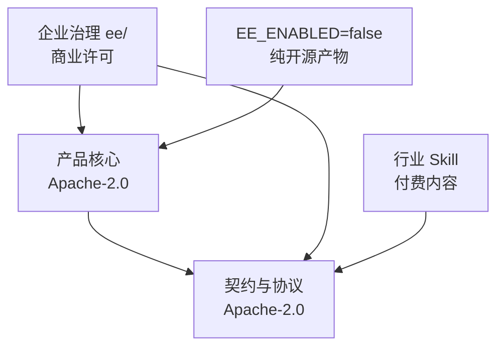

# WorkspaceX 开源商业模式方案（v11）

> 状态：**研究稿，待人类决策**（2026-09-22）。v11 = 初稿经十轮迭代、100 个问题修订而成；
> 迭代过程见 `open-source-business-model-iterations.md`。
> 本文只做分析，不改代码、不改许可证。**事实带出处，假设带标签。**

---

## 0. 一页纸

**今天就能做的三件事**（不依赖任何决策，全部无悔）：

1. 给每个 package.json 补 `license` 字段，生成 SBOM，盘点 2160 个依赖的许可证。
2. 写 `SECURITY.md`，定漏洞披露渠道与时限。
3. 跑全 git 历史的凭据扫描。

**核心建议**：开放核心（Apache-2.0）+ 托管云 + 垂直 Skill 市场。但**这个建议依赖 D7 的答案**——
开源是为了什么。若答案是「销售线索与信任」，本方案成立；若是「招聘」或「行业标准」，切法不同。

**最大风险不是被云厂商托管，是没人用。**

**证伪条件**：若目标客户访谈显示金融机构不关心源码可审计性，开放核心的主要销售杠杆就不存在，
应退回「桌面免费版 + 闭源云」。

---

## 1. 术语

| 词 | 本文定义 |
|---|---|
| OSS | Apache-2.0 授权、可自由使用与再分发的部分 |
| EE | 源码公开可见但需商业许可才能合法使用的部分（GitLab 模式） |
| open core | 核心 OSS、外围 EE 的模式 |
| source-available | 源码可见但非 OSI 开源（如 FSL/BSL），本文不采用但列为选项 |

---

## 2. 现状盘点

仓库目前**没有 LICENSE 文件**，`package.json` 标 `private: true`，法律上是保留所有权利。
开源是尚未发生的决策，边界可从零设计。

| 事实 | 出处 | 含义 |
|---|---|---|
| 无 LICENSE，无任何 `license` 字段，2160 个依赖无许可证清单 | 仓库根目录、`pnpm-lock.yaml` | **不做依赖许可证盘点就不能开源**，这是前置条件 |
| `deploy/` 下只有 `aliyun`；CI 含 `deploy-cn-production.yml`、`prepare-cn-release.yml` | `deploy/`、`.github/workflows/` | 这是中国部署优先的项目，开源策略须双轨 |
| 263 个源文件硬编码 `workspacex` | `grep -ril workspacex apps packages` | 品牌与代码强耦合，fork 与白标成本高 |
| 6 个 CI workflow 依赖真实模型 key | `real-model-chat-evidence.yml` 等 | 外部贡献者的 CI 必须走回环模型 lane |
| 模型接入是 OpenAI 兼容适配器 + model registry | `configured-model-provider.ts` | 模型与出网是天然计费线 |
| `personal-local` 组织 + 进程级 egress guard，零出网 | `local-egress-guard.ts`、`identity.ts` | 本地免费与云端付费的分叉点已存在 |
| 桌面发行版提案（Ollama + qwen3.5:4b） | `PROP-LOCAL-WORKSPACE-001` | 免费自托管形态已在路线图上 |
| 洋葱架构由 `lint-arch-deps.mjs` 机械强制 | ADR-020 | 商业功能可挂载而不污染核心 |
| API 契约 zod 单源，DTO/client/OpenAPI/mock 全生成 | `contract-design.md` | 生态靠契约对接；兼容性可机械 diff |
| 21 个业务模块，8 个模块知识库 | `PROJECT.md` | 模块清单就是切分粒度 |
| phase-16/17 是 IC 审阅、投后评级与报告 agent | `phases/` | 行业 know-how，最不该无偿开源 |

**尚未核实，需先勘探**：phase-16/17 与核心的耦合度；skill 与模板的真实数量（旧文档里的数字是静态痕迹，
按项目铁律不可直接引用）；`@firecrawl/anydoc` 等第三方包能否随产品再分发。

---

## 3. 定位：为什么有人选它

切分之前先回答这个。**WorkspaceX 不是通用 agent 搭建平台**，那条赛道已被 Dify、Coze、FastGPT、
OpenWebUI 占住。差异点是 Context Engine：不可变原件为证据、版本与血缘可追、片段可引用、
权限约束检索。这是投研与咨询场景要的东西，通用 chatbot 平台没有。

| 竞品 | 他们是什么 | 我们的差异 |
|---|---|---|
| Dify / Coze | 提示词与工作流编排平台 | 我们以证据库为中心，不是以工作流为中心 |
| OpenWebUI | 模型前端 | 我们有项目容器、访谈录制、产出物治理 |
| LangGraph | 编排库 | 我们是成品工作台，且内部就用 LangGraph |
| 通用 RAG 框架 | 检索管线 | 我们做血缘与可引用性，不只做召回 |

**为什么不会被模型厂商内建吃掉**：客户要的是私有证据库归属与审计留痕，不会交给模型厂。

---

## 4. 系统架构视角：边界怎么切

三条原则，都能机械检查。第一，按模块切不按文件切。第二，闭源只能出现在 `infrastructure` 层的
端口替换实现或独立 `ee/` 目录，`domain` 与 `application` 永远开源。第三，EE 物理隔离，
`lint-ee-boundary` 禁止 OSS 依赖 EE；**EE 同样遵守洋葱分层**。

箭头方向就是允许的依赖方向，反向由门控拦下。

### 模块级归属

| 模块 | 归属 | 理由 |
|---|---|---|
| mod-chat | OSS | 门面能力 |
| mod-agent-skill-runtime | OSS 运行时 + EE 治理 | 运行时是生态基础，治理是买单点 |
| mod-research-studio | OSS 基础 + EE 团队洞察库 | 单人可用，团队协作付费 |
| mod-asset-artifact、canvas | OSS | 与开源画布生态对齐 |
| mod-project | OSS | 最小可用单元 |
| mod-org-identity | OSS 单组织 + EE SSO/审计 | 经典 open core 切线 |
| mod-coord-platform | 独立开源到 harness 产品 | 与业务无关 |
| mod-devportal、skill-sandbox | OSS | 生态入口必须开放 |
| phase-16/17 行业 agent | 闭源付费包（待耦合度勘探确认） | 行业 know-how |
| deep-agent-service | OSS + 云端算力版增值 | 本地可跑，云端更快 |

### 切不干净的地方与处理

- **多租户与 RLS**：RLS 基座在 OSS 的 PG 层，EE 只加租户路由与配额，不动基座。
- **许可证校验**：开源代码里可被删除。威胁模型明确为防君子不防小人，靠合同执行。
- **计量事件**：OSS 版默认不发送，遥测 opt-in，代码可审计。
- **Cloudflare 依赖**：邮件等能力抽成适配器，提供 SMTP 默认实现，自托管者不被迫绑云。

### 需要新增的工程件

`lint-ee-boundary`、SBOM 与 `lint-license-compat`、许可证校验与 feature flag、
Skill 包签名与来源标识、计量事件端口、opt-in 遥测、`harness oss-readiness` 就绪检查、
通用 docker compose（目前不存在，需造）。

---

## 5. 商业模式视角：钱从哪来

组合是开放核心 + 托管云 + Skill 市场，**前 12 个月现金流由实施与定制承担**。

| 模式 | 代表 | 适配度 | 风险 |
|---|---|---|---|
| 开放核心 | GitLab、Cal.com、Dify | 主线 | 切线过深会自己和自己竞争 |
| 托管云 | Supabase、n8n | 与开放核心叠加 | 大云厂可托管开源版 |
| 延迟开源 | Sentry、HashiCorp | 防云厂兜底 | 社区信任成本高 |
| Skill 市场 | Dify 插件、Figma Community | 与 devportal 高度契合 | 冷启动需自己先供货 |
| 支持与服务 | Red Hat | 早期主要现金流 | 人力型，难规模化 |
| 双许可 | MongoDB 早期 | 可选 | AGPL 让企业法务却步 |

### 定价梯度（全部为假设，待验证）

| 层 | 对象 | 价格形态 | 转化墙 |
|---|---|---|---|
| Local | 个人 | 免费 | 无，功能完整 |
| Cloud Free | 小团队试用 | 免费 + 配额 | 第二个组织成员 |
| Cloud Pro | 小团队 | 座席月费 + 用量 | 云端深度研究次数、数据保留期 |
| Enterprise | 基金、券商、咨询 | 年费 + 实施 | SSO、审计、私有模型网关、SLA |
| Skill 市场 | 开发者与用户 | 一次性或订阅 | 平台抽成 |

超配额时**降级到小模型而不是断服务**。中国与海外分别定价，货币与支付通道分开。

### 单位经济与止损

- 建最小单位经济模型：每活跃用户月均 token × 单价 = 变动成本，对照座席价。
- 开源本身的成本计入预算：至少 0.5 FTE 社区运营 + 0.2 FTE 安全响应。
- **实施收入占比超过 60% 触发复盘**，防止被拖成外包公司。
- **止损条件**：12 个月后自助付费为零，则回退到纯服务模式或闭源。

### 护城河

行业 Skill 与评测集；Context Engine 的运营数据；合规与信任；harness 工程过程。
接口会被照抄，评测集与数据积累不会。

---

## 6. 用户视角

免费层必须完整可用，付费只在多人、合规、算力、行业内容四个维度加价。

| 用户 | 开源给他什么 | 付费点 | 反感点 |
|---|---|---|---|
| 个人研究者与分析师 | 桌面版加本地模型，完整 studio | 云端更强模型、跨设备同步 | 免费版故意阉割核心流程 |
| 小型咨询与投研团队 | 自托管全功能 | Cloud Pro：免运维、协作、算力 | 自托管文档烂、升级痛 |
| 机构 IT | 可审计的核心源码 | EE 许可、行业 Skill、实施 | 许可证不清晰、EE 边界移动 |
| Skill 与集成开发者 | 契约包、沙箱、devportal | 市场分成（他们是收入方） | 契约频繁 breaking、自营挤压 |
| 云厂与 SI 伙伴 | Apache-2.0 允许托管 | 联合销售、OEM | 无，这是 Apache 的代价 |
| 社区贡献者 | **外部贡献快车道**：小改动只需 PR + CI 绿 | 无，换口碑 | 被内部 sprint 流程劝退 |
| AI 工程团队 | agentic-harness-template | 未来托管协调服务 | 与主产品耦合太深 |

---

## 7. 社区与治理

- **治理**：起步 BDFL + 公开 ADR，写进 `GOVERNANCE.md`。至少两名有合并权的维护者，降低关键人风险。
- **贡献快车道**：外部小改动不走 sprint 流程，只需 issue + PR + CI 绿。内部流程不对外强加。
- **语言**：英文只维护入口层（README、CONTRIBUTING、契约文档），深层容忍中文。
- **Roadmap**：公开 roadmap 只露 phase 目标与季度，不露内部 feature。
- **安全**：`SECURITY.md`、披露时限、CVE 流程，P0 就要有，这是企业客户硬门槛。
- **兼容性**：契约单源让 API 兼容性可机械 diff，做成发布门控，承诺 SemVer。
- **响应 SLA**：承诺 issue 与 PR 首次响应时间，并公开达成率。
- **agent 参与度公开披露**：PR 标注生成来源，人类维护者负最终责任。这是本项目独有的新问题，
  正面处理比被质疑后解释好。

---

## 8. 路线与度量

依赖关系：P1 依赖 P0；P2 依赖 P1；P4 依赖 P2 与 P3；P5 可并行。

| 阶段 | 目标 | 北极星 | 护栏 | 退出判据（可机械检查） |
|---|---|---|---|---|
| P0 决策与法务（4-6 周） | 拍板 D0-D8 | 决策签核数 | 法务未过不进 P2 | LICENSE、SECURITY.md、SBOM、依赖许可证盘点、全历史凭据扫描报告落盘 |
| P1 边界落地 | 代码物理隔离 | 纯 OSS 构建可用 | 不新增 OSS 功能 | `verify:base` 绿；`EE_ENABLED=false` 构建跑通 core-loop smoke |
| P2 开源发布 | 公开仓库 | 首月部署数 | 仓库清洗未过不发布 | 干净容器跑安装脚本，计时脚本产出证据；仓库清洗与历史清洗报告 |
| P3 云与计费 | 收入通路 | 第一笔自助付费 | 毛利不为负 | 计量事件、订阅、配额上线并有真实交易 |
| P4 Skill 市场 | 生态通路 | 第三方 skill 交易数 | 自营不挤压第三方排序 | 第一个第三方 skill 上架并成交 |
| P5 harness 独立 | 第二产品 | 外部团队采用数 | 不占用主产品专职资源 | 至少一个外部团队采用 |

**发布前必须做 dry-run**：在私有仓构建纯 OSS 产物，完整跑一遍验收。公开发布不可撤回，
能调整的只有后续版本与投入强度，不是已发布的那一版。

**增长漏斗测量点**：star → 部署 → 30 天留存 → 贡献 → 付费线索，每一环单独测。

**开源前先测基线**：当前部署数、贡献者数、issue 响应时间、客户数。没有基线就无法判断成败。

---

## 9. 需要拍板的决策

按依赖顺序排列。D7 与 D0 先定，它们决定其余所有。

| 编号 | 决策 | A | B | C | 可逆性 | 建议 |
|---|---|---|---|---|---|---|
| D7 | **开源是为了什么** | 销售线索与信任 | 生态与标准 | 招聘与品牌 | 高 | 先答这个，它决定其余切法 |
| D0 | **是否开源** | 开源 | 不开源，只发桌面二进制 | 先私有一年再定 | 中 | A，前提是 D7 选 A 或 B |
| D8 | 中国优先还是全球优先 | 双轨并行 | 中国优先 | 全球优先 | 高 | A，两边渠道与合规分开做 |
| D1 | 核心许可证 | Apache-2.0 | AGPL-3.0 + 商业双许可 | FSL/BSL 延迟开源 | **不可逆** | A；主要风险是没人用，不是被托管 |
| D6 | 贡献协议 | DCO | CLA | 无 | 中 | **取决于 D1**：选 DCO 就放弃将来改许可证的权利 |
| D2 | 仓库结构 | 单仓公开，`ee/` 商业许可 | 双仓 overlay | 先私有 | 中，切换有成本 | A，与单仓、契约单源、门控最兼容 |
| D3 | EE 切线深度 | 仅治理与合规 | 加团队协作 | 再加深度研究 | 低（**承诺只进不退**） | A；切线移动是社区分叉的头号诱因 |
| D4 | 行业 Skill 处置 | 闭源付费包 | 开源换生态 | 模板开源、评测集闭源 | 高 | **可延后**，先做 5 家目标客户访谈 |
| D5 | harness 是否独立品牌 | 独立仓独立名 | 留在主仓 | 不推广 | 高 | A，但不投专职资源 |

每条决策需补：签核人、截止日期、复审触发条件。

---

## 10. 风险

| 风险 | 概率 | 影响 | 早期信号 | 应对 |
|---|---|---|---|---|
| **开源后无人问津** | 高 | 致命 | 首月部署数低于两位数 | 定位与品类词先验证；渠道双轨；必要时收缩为纯服务 |
| 内部信息随仓库泄露 | 中 | 致命 | 清洗报告有遗漏项 | HEAD 与历史都洗；必要时从干净仓重新发布 |
| 依赖不可再分发 | 中 | 高 | 许可证盘点出现 copyleft 或商业包 | 替换或改为运行时下载 |
| 安全事件 | 中 | 高 | 沙箱逃逸报告 | SECURITY.md、沙箱加固列 P1 |
| 供应链攻击 | 中 | 高 | 依赖异常更新 | 锁定、SBOM、签名发布 |
| EE 切线移动引发分叉 | 低 | 高 | 社区对新功能归属的抗议 | 承诺切线只进不退 |
| 云厂托管开源版 | 低 | 中 | 出现托管竞品 | 靠 EE 与行业 Skill 竞争 |
| 关键人风险 | 中 | 高 | 单人合并权 | 两名以上维护者 |
| 中美政策变化 | 中 | 中 | 合规要求变更 | 双轨部署与双轨社区 |
| agent 产出被质疑质量 | 中 | 中 | 社区对 PR 来源的讨论 | 公开披露 + 每个 feature 带可复现验证 |

---

## 11. 下一步

本方案批准后按项目规则执行：**每个阶段开 issue，一 issue 一 PR**，不许无 issue 开发。
OSS/EE 归属表批准后落到 `PROJECT.md`（单一事实源），本文只引用不复制，并加脚本核对防漂移。

---

## 变更记录

| 版本 | 日期 | 说明 |
|---|---|---|
| v1 | 2026-09-20 | 初稿 |
| v11 | 2026-09-22 | 经十轮迭代、100 个问题修订；见 `open-source-business-model-iterations.md` |

## 参考

- 仓库内：`.harness/instructions/architecture.md`、`docs/architecture/context-engine.md`、
  `docs/proposals/PROP-LOCAL-WORKSPACE-001.md`、`.harness/instructions/human-decision-packaging.md`、
  `.harness/instructions/static-trace-vs-live-fact.md`
- 业界案例：GitLab（单仓 `ee/`）、Cal.com（AGPL + 商业）、Dify（Apache-2.0 + 插件市场 + 云）、Sentry（FSL）
