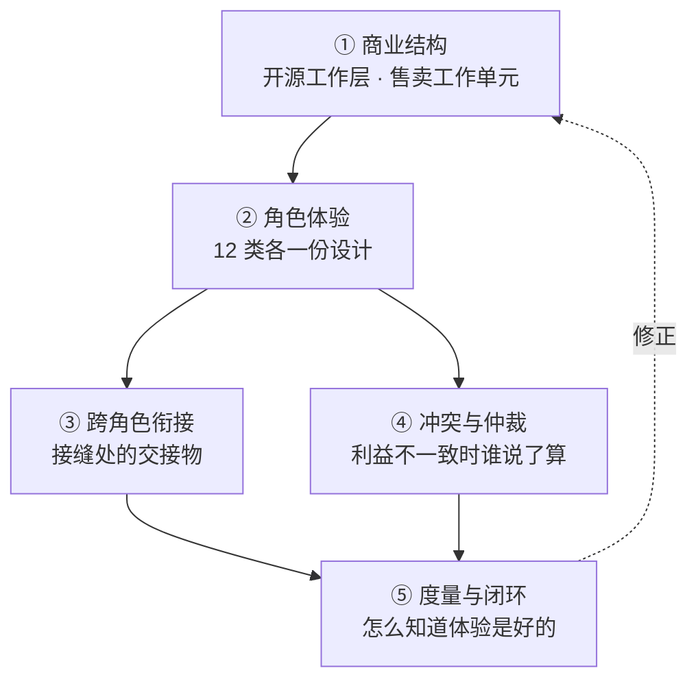
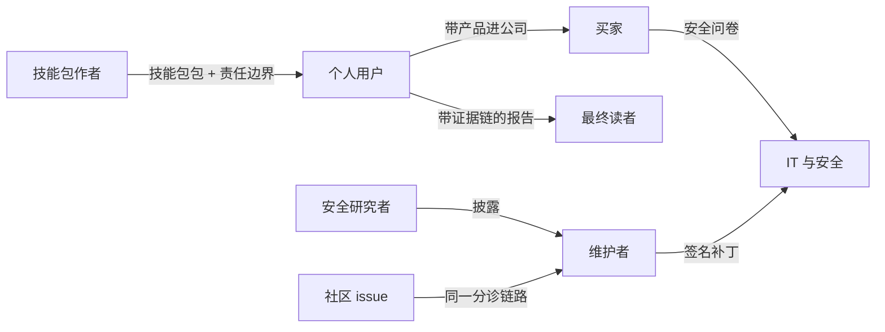

# WorkspaceX 开源方案（v32.10）—— 完整解决方案、各方体验与可执行门控

> 状态：**研究稿，待人类决策**（2026-09-22）。
> v11 = 初稿经十轮迭代；v12 = 吸收战略材料后按技能包重写；
> v22 = 再经第 11–20 轮迭代，从「切分方案」变成「完整解决方案」；
> **v32 = 再经第 21–30 轮迭代（100 个问题），把 v22 自己点名的 5 个缺口变成可执行的东西，
> 并按仓库铁律「没有脚本的规范视为未落地」造出第一道真会红的门控。**
> 迭代记录：`-iterations.md`（1–10 轮）、`-iterations-2.md`（11–20 轮）、`-iterations-3.md`（21–30 轮）。
> 仓库实测：`oss-readiness-probe-2026-09-22.md`。
> 事实带出处，假设带标签。

---

## 0. v32 改了什么

v22 结尾诚实地写了「现在还不完整」并点了 5 个缺口。**逐个实测，两个是错的，一个半对。**

| v22 的缺口 | 实测 | 修正 |
|---|---|---|
| 技能包格式规范不存在 | **错**。SKILL.md frontmatter 已含 `name` / `description` / `capability_id` / `version`，`maau-canvas` 就带 `WX-S021` 与 `3.0.0` | 缺的不是格式，是**对外公布的契约**。工作量从「设计」降为「固化并公布」 |
| devportal 没有发布路径 | 结论对，**理由错** | 不是 devportal 缺了发布路径，是它根本不是市场。市场需要另外的受众、数据源与可见性模型 |
| 通用 compose 不存在 | **半对**。5 个分应用 compose 已存在 | 缺的是根级编排，是**组合不是创造** |
| 报告里的证据呈现没有设计 | 对 | 保留，并补「证据被撤回时已发出的报告怎么办」 |
| 没有一条承诺是机械检查的 | 对，但**不是难题**：仓库已有 23 个 lint 门控的现成形状 | **本版已造出第一道**，见下 |

### 本版造出的第一道门控

`.harness/scripts/lint-maau-manifest.mjs`——检查每个技能包能否机械回答
「**是谁、哪一版、凭什么用**」。这是商业边界要回答的第一个问题：这一个技能包是开源的还是付费内容。

实测 18 个技能包：**18 个都有身份，8 个缺许可。**

⚠ **v32.9 更正**：这里早先写的是「12 个有问题、共 18 处，自研的有身份无许可、外来的有许可无身份，
没有一个两样俱全」。**那是门控自己的误报**：初版另写了一个 frontmatter 解析器，只认顶层字段，
而 5 个官方技能包（WX-S002 / S013 / S015 / S017 / S018）把身份嵌在 `metadata:` 下——
那是 `skill-frontmatter.ts` 明文承认的历史写法，构建一直读得出来。18 处里 10 处是假的，
「外来 5 个」其实是改编自上游的**官方**技能包，上游许可文件跟着来了。

根因正是本仓那条硬约束：**同一事实不得声明在两处**。「怎么读身份字段」早有唯一入口，
门控另写一份就漂了。已改为经 `parseSkillFrontmatter` 读取，并加了回归测试。

**真实缺口只有一类：8 个技能包没有许可。而补许可就是在执行 D1**（许可证决策）——
这一项在 D1 定下之前补不了，C1 因此整体等 D1，不是一件现在就能做的活。

门控默认只报告不阻断，D1 定下、许可补齐后再转 `--strict`。

### 还有一处一词两义（v32.4 已解）

仓库里本来就有一个叫 `maau-canvas` 的产品 skill，把会议提炼成「MAAU 画布」；
而本方案此前也用 MAAU 指**商业与分发单元**。同一个缩写两个意思，文档与代码各说各的。

v32.4 起分开：商业与分发单元改叫**技能包**，`maau-canvas` 产出的「MAAU 画布」
保留原名、只表示一种**设计方法**。两个词登记在 `PROJECT.md` 的「词汇单一事实源」节，
由 `.harness/scripts/lint-vocabulary.mjs` 机械核对——见 §0.9 术语。

### 承诺与门控对照表

承诺不带门控就只是一句话。逐条登记，做一道划掉一道。

| 承诺 | 门控 | 状态 |
|---|---|---|
| 每个技能包都能判定身份与许可 | `lint-maau-manifest` | 已建。R4 更正了它一半的误报；18 个全有身份，8 个缺许可要等 D1，故暂只报告不阻断 |
| 依赖许可证全部已知 | `oss-dependency-inventory --strict` | 已建。R5 修了三个 bug 后实跑：2162 / 2163 已解析，随产品分发的需确认 2 个、未解析 1 个，待人 |
| 历史无明文凭据 | `oss-secret-scan --strict` | 已建。R6 在完整历史（3076 commit）实跑：156 处命中待人确认 |
| 契约包不依赖任何工作区包 | `lint-contracts-no-workspace-deps` | 已建（R2），接入验证链 |
| 生产不依赖运营平面 | `lint-production-not-on-ops` | 已建（R3），接入验证链 |
| OSS 不依赖 EE | `lint-ee-boundary` | 未建：EE 的代码边界尚不存在，先定 D1 再划 |
| 本地零出网 | 拔网 e2e，断言出网计数为 0 | 未建 |
| 第一个价值时刻有埋点 | 事件定义存在且被触发 | 未建 |
| 每类角色的体验有主、有判据、有度量 | `lint-commitments` | 已建（R9），接入验证链；本表与第 4 节都由它对账 |
| 响应 SLA 达成率 | 自动统计 + 看板，越线开 issue | 不可阻断，只能统计 |
| 运营平面不含客户内容 | `lint-telemetry-schema` | 已建（R8）：上报 schema 无自由文本、每层 strict |
| 运营平面不含个人信息 | `lint-telemetry-schema` | 已建（R8）：字段名长成个人信息的样子即红 |
| 退出自由 | 导出命令存在且 e2e 跑通 | 未建：导出命令部分可查；「不断供」靠合同不靠脚本 |

⚠ **这张表本身曾经过时**：做到十轮迭代第 8 轮时回头看，R2、R3 建的门控在这里仍写着「未建」，
依赖盘点与凭据扫描的状态也停在「待重跑」——承诺不带门控只是一句话，**登记表不带对账也只是一张会过时的表**。
现在由 `lint-commitments` 双向对账：写了脚本名的行，状态与脚本是否存在必须一致；没写脚本名的行不许声称已建。

## 0.1 v22 改了什么（存档）

前两版回答的是「开源什么、怎么赚钱」。那不是一个方案，是方案的一部分。
**一个完整的解决方案还要回答：每一类人在这件事里的体验是什么样的，由谁负责，怎么知道它好。**

| # | v12 | v22 |
|---|---|---|
| 1 | 7 类利益相关者 | **12 类**；少算的 5 类里有 3 类握有否决权 |
| 2 | 只描述各方「付费点与反感点」 | 每类角色一份**体验设计**：入口、第一个价值时刻、卡点、承诺、度量、负责人 |
| 3 | 没有角色之间的衔接 | **接缝是体验最常断的地方**，逐个定义交接物 |
| 4 | 假装各方利益一致 | 显式列出**冲突对**与仲裁原则 |
| 5 | 市场基础设施「已具备一半」 | 实测推翻：devportal 18 个页面**没有发布路径** |
| 6 | 计量事件列为待建 | 实测修正：token 额度与组织分配**已实现** |
| 7 | 资源 0.7 FTE | **承认承担不了 12 类角色**，H1 只承诺 4 类 |

---

## 0.9 术语（v32.4 统一）

对外材料一律用左栏的词。**两处改名的原则都是「不发明新词，用已有的那个」。**

| 用这个词 | 指什么 | 不要和它混的 |
|---|---|---|
| **技能包** | **商业与分发单元**。仓库既有词汇：`ensure-standard-skill-packs.ts`、`skills/`、`SKILL.md`、`capability_id`、`skill-sandbox` 全在用 | **MAAU 画布**（`maau-canvas`，WX-S021）是一种**设计方法**——把一段讨论收敛成一个可执行单元的画布，保留原名 |
| **平台大脑** | **平台层面的记忆**：跨所有客户实例的运行事实，加上我们在**工作、创新与学习**上积累的一切——ADR、sprint 历史、方法论、踩坑经验、GTM 与案例知识。它是超级实例的大脑（`super-instance-design.md`）。此前叫「团队记忆」，把它说小了——它不只装我们团队的东西 | **组织大脑**是**产品概念**，客户把产出物沉淀进本组织知识库的能力（`brain-promotion`、`batchConfirmAndWriteBackToBrain`） |

**为什么不再用旧词 MAAU**：它是在一个已有清晰名字的概念上又加了一层缩写。
讲「技能包」所有人都懂，讲「最小智能体可执行单元」要先解释三十秒。
代码标识符（`@repo/maau-postinvest-report`、`capability_id`、目录名）**本版不动**——
标识符可以滞后于叫法，真要改另开 issue，波及 40 个代码文件。

---

## 1. 完整方案的五个部分

v12 只完成了 ①。②③④⑤ 是这一版补的，缺任何一个都不是完整方案。

---

## 2. 商业结构（承自 v12，未变）

**开源工作层，售卖工作单元。** 切分原则一句话：

> 凡是让我们成为中立工作层的，开源；凡是随客户积累的，售卖。

| 归属 | 内容 |
|---|---|
| **OSS（Apache-2.0）** | 技能包运行时、Agent Harness、Context Engine、模型路由与适配层、Evidence/Eval 框架、沙箱、**技能包格式规范**、桌面本地版 |
| 售卖 · 技能包内容 | 方法论正文、判据阈值、评测集、护栏、行业模板 |
| 售卖 · 托管执行 | 云端算力、模型配额、长任务、跨设备 |
| 售卖 · 企业治理 | SSO/SCIM、审计、多租户、配额、合规导出 |
| 售卖 · 市场通道 | 签名、审核、结算、分成 |
| **不交付 · 内部运营平面** | 协调平面（coord-gateway 与 coord-* 包）、**devportal 的协作层与平台层**、发布与部署控制台、事故面板、agent 车队状态、CI 指标、状态页、密钥轮换台账、**GTM 活动与运营元数据、对外案例、平台大脑**（三者的数据边界见下节；平台大脑的 canonical 在可移植层，边缘只放投影——D14 v32.6） |

**第三类归属是本版新增的，此前只有「开源」与「售卖」两栏——这是一个分类错误。**
有一批东西既不交付给客户，也不卖给客户：它们是我们自己运营用的。
把它们硬塞进前两栏，会得出两个都错的结论——要么承诺了做不到的可移植性，要么给一份跑不起来的开源代码。

### 内部运营平面：为什么它必须单列

**既成事实**：协调平面已经重度绑定 Cloudflare——Workers、三个 Durable Object 类
（带 SQLite 存储与 v1/v2/v3 迁移）、Queues 带死信队列、每两分钟的 Cron、devportal 用 Pages。
锁定的位置在业务包里：`packages/coord-repohub` 与 `coord-directory` 直接
`import { DurableObject } from "cloudflare:workers"` 并 `class RepoHub extends DurableObject`，
三个 coord 包的依赖含 `wrangler` 与 `@cloudflare/workers-types`。

这与 `architecture.md` 的**唯一硬约束**冲突：「架构必须可移植……禁止把业务逻辑绑死在单一云的专有原语上」。

**把它划进内部运营平面，冲突就消失了**：不交付就不承诺可移植，锁定成本我们自己承担。
这比让它悬在开源计划里干净得多——一个只能跑在 Cloudflare 上的「开源」组件，
自托管者跑不起来，等于在这个组件上架空了退出自由承诺。

**选 Cloudflare 的正面理由不是顺手，是故障域**：运营台最该在生产挂掉时还能用。
生产在阿里云，运营面在 Cloudflare，两者是独立故障域。放在一起则会在最需要它的时刻一起没了。

### 数据边界：按数据性质分三层，不按系统分

约束不再是可移植性，只剩两条：**数据边界**与**故障域**。

⚠ **早先版本把这条写成了「绝不放客户个人信息」，那个表述不够准确。**
它混了两件不同的东西：产品客户的**终端用户数据**（我们受托保管的），
与我们自己的**销售与市场数据**（我们自己是控制者的）。两者的约束来源不同——
前者来自对客户的承诺，后者来自个人信息保护法。
按系统划分（「CRM 能不能放」）会卡死；**按数据性质分三层才划得动**。

| 层 | 内容 | 放哪 |
|---|---|---|
| **① 公开内容** | 已审批的对外案例、官网、落地页、产品文档、状态页与公告 | **Cloudflare**，无条件 |
| **② 运营元数据** | 部署与事故、PR 队列与门控、readiness/dashboard/scorecard 快照、agent 车队状态、CI 指标、密钥轮换台账（只记元数据）、功能开关控制面、**GTM 活动排期与漏斗统计、归因、A/B 结果、商机阶段与金额、客户组织的不可逆 ID**、**客户实例上报的运行信号**、**平台大脑的投影** | **Cloudflare** |
| **③ 个人信息** | CRM 的人名/邮箱/电话、沟通记录原文、报名表原始提交、员工身份数据 | **留境内可移植层**，Cloudflare 只存不可逆 ID 引用 |

**这个分法让 CRM 的绝大部分功能仍然跑在边缘上**：看板、漏斗、报表要的是聚合与 ID，不是人名。
只有「点开看这个联系人是谁」这一步回源取。边缘存 ID、源站存个人信息是成熟模式，
实现成本不高，但它把合规问题从「整个 CRM 要不要出境」缩小成「详情页一次回源」。

**绝不放（任何层都不行）**：

- **产品客户的内容**：材料原件、报告正文、对话、转录、证据片段
- **产品的组织大脑**（见下）
- 任何凭据的值
- 计费权威账本（只读视图可以，钱的事实源不该活在专有存储里）
- 客户要审计的证据（承诺的是可离线核验的证据包，放在我们自己的专有云里不好交代）

### 组织大脑与平台大脑：两件事，两个名字

⚠ **「组织大脑」在本仓已经是产品概念**：`contracts/src/skills.ts` 有「来自组织大脑」的数据源区块、
`canvas.ts` 有 `batchConfirmAndWriteBackToBrain`、`artifact.ts` 的产出物类型里有 `brain-promotion`。
它指客户把产出物沉淀进本组织知识库的那个能力。

| | 产品的组织大脑（客户的） | 平台大脑（我们的） |
|---|---|---|
| 内容 | 客户的材料、结论、决策链 | 我们的 ADR、sprint 历史、方法论、经验沉淀 |
| 承载 | `context-engine.md`：PG + pgvector，五路召回；图只有 `ontology_edges`（递归 CTE，AGE 阶段一不启用） | 产品的组织大脑装 GTM / 案例 / 方法论 / 研究；**开发过程那一半（ADR、feature、证据）今天在 harness 元本体里**，放哪待 D17。边缘只有投影 |
| 能否上 Cloudflare | **不能** | **可以**（本版决定） |

**产品的那个不能上，理由是它自己的架构文档**：

> canonical 永远是 Postgres 关系表，图和向量都是可重建的投影——**这让整套东西保持可移植**（任何能跑 PG 的地方都能跑）

搬上去会同时破坏客户内容边界与它自己为可移植性做的设计；而且它是我们要卖的东西，也是承诺留在客户环境里的东西。

**已改名：我们自己那份叫「平台大脑」**（v32.4 先改成团队记忆，v32.7 定为平台大脑），并在 `PROJECT.md` 登记为单一事实源。
与组织大脑是**层级关系**：组织大脑是每个客户自己的，平台大脑在所有组织之上，方法论、技能包与经验从这里回流下去。**平台大脑不卖，也不交付。**
同批把商业与分发单元从此前的 MAAU 改叫**技能包**——见下节术语。

### D14 已定（v32.6 修正）：既是也不是——三层分开看

（2026-09-23 人类决策）D14 的答案不是「用」或「不用」。它**首先是一个 WorkspaceX 实例**
（所以平台大脑用的就是产品的组织大脑能力，dogfooding 成立），**同时是产品栈上的一个闭源扩展**，
**跑在边缘并连接到所有客户实例**。

⚠ **v32.5 写的「不 dogfooding」是错的，本版推翻。** 那个结论建立在一个错误前提上：
以为「用自家产品」与「在 Cloudflare」互斥。它们不互斥——前提是分清**哪一层在哪**。

| 层 | 是什么 | 在哪 |
|---|---|---|
| ① 产品本体 | 一个真实 WorkspaceX 实例，跑我们自己的组织；平台大脑用的就是产品的组织大脑能力，只是装的对象多了所有客户实例 | **可移植层**（PG + pgvector） |
| ② 运营扩展 | 闭源技能包与应用：车队、事故、GTM、CRM 看板、发布控制台 | 与①同栈 |
| ③ 边缘呈现与联邦 | Workers / DO / Pages：汇聚、路由、缓存、定时、呈现 | **Cloudflare** |

①**不能**搬上边缘：组织大脑要 PG + pgvector，Cloudflare 两样都没有，
搬上去就是用专有原语重写 canonical，违反架构唯一硬约束，且我们自己的实例会和卖给客户的
跑在两套不同的东西上——那就不是 dogfooding 了。边缘承载的**一切都是可重建投影**，
这正落在本体架构自己画的那条线上。

**销售问答因此反转**：不再需要解释「为什么我们自己不用」，而是
**「我们用得比任何客户都重——我们用它管所有客户」**。理由是运营问题天然是图问题
（哪版 → 哪个缺陷 → 哪个 PR → 谁决定 → 证据在哪 → 还有谁中招，六跳全是边）。

**结构设计详见 `super-instance-design.md`**：联邦方向（出站上报，运营面无读权限）、
传信号不传内容、`personal-local` 一行不上报、同意四项不可坍缩成布尔、四种死法、六期分期。

⚠ **那份设计带出一条新决策 D16，且它与本节下面的数据边界直接相关**：
「运营我们将来所有客户数据」照字面读是要把**客户内容**集中上来，而三层边界写着
**受托于客户的不能上边缘**。两条不能同时成立。设计按前者做——联邦运营的是
**客户实例的运行事实**，不是**客户的内容**。若本意是后者，那不是架构选项，
是商业模式换道（从「你的数据在你那」换成「你的数据在我这」），要独立决策。

### 三条纪律

1. **单向依赖。** 运营面读生产，或通过明确通道向生产下发；**不能让生产反过来依赖运营面**——
   否则等于给生产加了一个单点，而且在另一朵云上。
2. **数据最小化要可机械检查。** 「只存元数据」写成文档没用（本仓铁律：没有脚本的规范视为未落地），
   要有 schema 白名单加门控，否则半年后一定会有人往里塞一段客户原文。
3. **当最高权限面对待。** 独立鉴权、操作全留痕、不与产品账号体系混用——这是能一键回滚生产的地方。

⚠ **一条待实测，不可假设**：运营人员在中国境内访问 Cloudflare 控制面与 `workers.dev` 的稳定性。
这是中国部署优先的项目，运营台连不上就等于没有。

计价重心在 Task 与技能包用量，座席只是入口。Outcome 计价与自托管结构性冲突，永远只存在于托管与企业合同。

定位：WorkspaceX 在 **AI Workspace 层**（同层 Copilot、Glean、飞书豆包、钉钉），不在 Agent Infra 层。
**这一层没有一个开源的**，所以开源是楔子不是入场券。

---

## 3. 十二类利益相关者

按六问盘点：谁掏钱、谁使用、谁受益、谁供给、谁把门、谁被影响。

| # | 角色 | 类型 | 有否决权 | H1 是否承诺体验 |
|---|---|---|---|---|
| 1 | 个人研究者 / 分析师 | 用户 | — | **是** |
| 2 | 团队 leader / 买家 | 买家 | 是 | **是** |
| 3 | 机构 IT 与安全 | 把门 | **是** | **是** |
| 4 | 业务采购方 | 买家 | **是** | 否，H2 |
| 5 | 最终读者（投委会） | 受益者 | — | **是** |
| 6 | 被评估企业 | 被影响者 | — | 否，H2（但合规底线 H1 就要有） |
| 7 | 技能包作者 | 供给 | — | 否，H2 |
| 8 | 社区贡献者（三档） | 供给 | — | 部分，H1 只做首次贡献者 |
| 9 | 维护者（我们自己） | 供给 | 是 | **是**（否则前面全部塌掉） |
| 10 | 伙伴 / SI / 云厂 | 渠道 | — | 否，H2 |
| 11 | 安全研究者 | 把门 | — | 部分，H1 只做披露通道 |
| 12 | 内部销售与实施 | 供给 | — | 否，H2 |

⚠ **资源现实**：社区运营 0.5 FTE 加安全响应 0.2 FTE 承担不了 12 类角色。
H1 只承诺 5 类半，其余**明确写「暂不承诺」**，而不是承诺了做不到。
承诺不到的地方写清楚，比假装覆盖更可信。

---

## 4. 每类角色的体验设计

每份设计固定六格：**入口 / 第一个价值时刻 / 最大卡点 / 我们的承诺 / 怎么度量 / 谁负责**。

### 4.1 个人研究者与分析师

| 格 | 内容 |
|---|---|
| 入口 | 桌面版安装包，或 `docker compose up` |
| **第一个价值时刻** | **上传一份真实材料，拿到第一条带证据引用的结论。**这是全方案唯一的 0→1 北极星 |
| 最大卡点 | 首次启动要拉 GB 级模型权重；材料敏感，用户不会立刻上传真实数据 |
| 承诺 | 边下边用内置脱敏示例项目；断网可用；**本次会话出网 0 次**在界面上可见可点开 |
| 度量 | 安装到第一个价值时刻的中位时长；30 天留存 |
| 谁负责 | 桌面版负责人 |

**关键设计**：零出网是卖点却不可见。`local-egress-guard.ts` 一直在跑，用户看不到任何证明。
把它做成可见状态，卖点才成立。

**期望管理**：本地模型弱于云端，首屏必须明示当前模型与能力边界，一键对比云端。
不说清楚，用户会以为产品弱而不是模型弱。

**收敛选择**：18 个 skill（实测）对新用户是选择过载，按场景收敛成 3 个入口。

### 4.2 团队 leader（买家）

| 格 | 内容 |
|---|---|
| 入口 | 团队里已有人在用个人版 |
| 第一个价值时刻 | 看到团队共享的证据库里，别人的结论自己能复核 |
| 最大卡点 | 自托管运维负担；说不清为什么要付费 |
| 承诺 | 免费层功能完整，付费只换免运维、协作、算力、行业内容 |
| 度量 | 个人版到团队版的转化率与转化时长 |
| 谁负责 | 增长负责人 |

### 4.3 机构 IT 与安全（把门人）

握有否决权，且是**中国市场开源的全部理由**。

| 格 | 内容 |
|---|---|
| 入口 | 安全问卷 |
| 第一个价值时刻 | 能自己读源码、自己部署、自己验证数据不出网 |
| 最大卡点 | 安全问卷、私有部署的补丁路径、许可合规自证 |
| 承诺 | 每个 release 附 SBOM 与许可证清单；**离线补丁包 + 签名校验**；人类可读的权限矩阵随部署产出；许可合规自查工具 |
| 度量 | 安全问卷平均回合数；POC 通过率 |
| 谁负责 | 解决方案架构 |

**最重要的一条承诺，v12 从没写过：退出自由。**

> 不续费之后：开源部分继续可用，数据可完整导出，有明确降级路径，我们不做任何断供动作。

这是开源相对 Copilot 与飞书的**核心差异**，却一直只停在暗示。写成明文承诺才有销售价值。

**POC 剧本**：2 周、双方各出 2 人、通过线是一个可量化的技能包结果，不是「感觉不错」。

### 4.4 最终读者（投委会）

**他们从不登录产品**，却是整条链路的受益者。v12 完全漏掉。

| 格 | 内容 |
|---|---|
| 入口 | 别人发来的一份报告 |
| 第一个价值时刻 | 对某条结论起疑，点开就看到原件出处 |
| 最大卡点 | 分不清哪些是 AI 生成、哪些有证据支撑 |
| 承诺 | 生成来源与证据标记是报告的**必需元素**；每条结论可追溯到原件；置信度与不确定性显式呈现 |
| 度量 | 证据点击率；读者提出的质疑中有多少能当场解答 |
| 谁负责 | 产出物负责人 |

Context Engine 有血缘，但**报告里没有呈现设计**——能力存在不等于体验存在。

### 4.5 被评估企业（被影响者）

它的财务数据被 AI 评级，却在 v12 里没有任何位置。

| 格 | 内容 |
|---|---|
| 入口 | 不主动接触产品 |
| 第一个价值时刻 | 得知自己被评级时，**看得到依据、找得到申诉入口** |
| 最大卡点 | 不知道自己被评级，也不知道依据是什么 |
| 承诺（H1 底线） | 告知规则写进客户合同模板；**更正与申诉路径**有入口、有时限、有处置；默认不用于训练 |
| 度量 | 申诉量与处置时长 |
| 谁负责 | 合规 |

**冲突**：审计要长期留痕，隐私要最小化。用分层保留解决——证据长留，个人标识短留。

### 4.6 技能包作者

| 格 | 内容 |
|---|---|
| 入口 | 开发者门户 |
| 第一个价值时刻 | 本地一条命令跑通自己的第一个技能包，看到证据与耗时 |
| 最大卡点 | **市场根本不存在**。devportal 不是市场——实测它零连接产品 API、数据全来自协调平面，其模块知识库自称「协调平面状态的人类可读窗口」（见 `devportal-positioning.md`） |
| 承诺 | 先有技能包格式规范，再招作者；公开沙箱资源契约（能否联网、内存、超时）；公布分成、结算周期与审核时限；支持**私有技能包** |
| 度量 | 从注册到第一个技能包上架的时长；第三方技能包数与交易额 |
| 谁负责 | 生态负责人（H2 才有） |

**现成资产**：11 个 skill 已自带 LICENSE 文件（实测）。每个技能包独立授权**已有先例**，
把它升级成清单里的必填元数据即可，不用从零设计。

### 4.7 社区贡献者（分三档）

| 档 | 体验设计 |
|---|---|
| **首次贡献者**（H1 唯一承诺的一档） | good-first-issue 标注；15 分钟跑通的最小开发环境；快路验证（不要求跑全量 `verify:base`）；fork PR 默认走回环模型 lane 并明确告知哪些检查不跑 |
| 常规贡献者 | 外部贡献快车道：小改动只需 issue + PR + CI 绿，不走内部 sprint 流程 |
| 维护者候选 | 明确台阶：首次合并 → 常规贡献 → triage 权 → 合并权 |

H1 唯一承诺的是首次贡献者，六格按这一档写：

| 格 | 内容 |
|---|---|
| 入口 | 标了 good-first-issue 的 issue |
| 第一个价值时刻 | 第一个 PR 被合并 |
| 最大卡点 | 开发环境与全量验证太重，第一次就劝退 |
| 承诺 | 15 分钟跑通的最小开发环境；快路验证；fork PR 明确告知哪些检查不跑；被拒时拿到固定四件（见下） |
| 度量 | 首个 PR 从开到合并（或被拒）的时长；首次贡献者转为常规贡献者的比例 |
| 谁负责 | 维护者 triage 轮值（见 4.8） |

**大多数 PR 会被拒，而拒绝方式决定口碑。** 拒绝模板固定四件：谢、理由、替代路径、是否欢迎再提。

### 4.8 维护者（我们自己）

**开源项目最常见的死法是维护者烧尽。** v12 只给了预算，没给体验。

| 格 | 内容 |
|---|---|
| 入口 | 仓库的 issue 与 PR 队列 |
| 第一个价值时刻 | 第一次按轮值表值班，结束时未分诊积压归零——而不是被洪水淹没 |
| 最大卡点 | issue 洪水、重复提问、低质量 PR |
| 承诺（对内） | issue 模板 + 自动分流；问答去讨论区不占 issue；triage 轮值表；**响应 SLA 有排班才敢承诺** |
| 度量 | 维护者每周投入时长；未分诊 issue 积压数 |
| 谁负责 | 维护者自己，且这是一级设计约束不是附属 |

agent 生成的 PR 的标识不能只是个说法：标签 + PR 模板字段 + 审阅要求，且机械检查。

### 4.9 安全研究者

| 格 | 内容 |
|---|---|
| 入口 | `SECURITY.md`（已落地，待填联系邮箱） |
| 第一个价值时刻 | 报告后 3 个工作日内收到人的回复，而不是自动回执 |
| 最大卡点 | 找不到私下报告的渠道，只能公开提 issue |
| 承诺 | 3 个工作日首次响应；复现环境；时间线通报；致谢与 CVE 署名 |
| 度量 | 首次响应时长；披露到用户收到补丁的全链路时长 |
| 谁负责 | 未定（安全联系人尚未指定，`SECURITY.md` 的邮箱仍是占位——这是组织决策，不由写文档的人定） |

### 4.10 伙伴 / SI / 云厂（H2）

> 六格暂不设计：H2 阶段才进入。H1 只承诺 4 类角色（见 §0.1 第 7 条），这里先记录方向。

v12 把「集成商拿去做项目不回流」列为风险，**却没有伙伴计划去转化它**。风险要变渠道。

交付工具包三件套：部署脚本、验收清单、培训材料。加分级认证与公开名录、线索报备制、伙伴沙箱。

**白标目前不可行**：263 个源文件硬编码品牌名（实测）。品牌常量化是 OEM 的前置工作。

### 4.11 业务采购方与内部销售实施（H2）

> 六格暂不设计：H2 阶段才进入。H1 只承诺 4 类角色（见 §0.1 第 7 条），这里先记录方向。

明确列出但 H1 不承诺，避免承诺做不到。

---

## 5. 跨角色衔接：接缝是体验最常断的地方

接缝从未被识别，所以断裂也看不见。每个接缝要有**交接物**。

| 接缝 | 交接物 | 现状 |
|---|---|---|
| 分析师 → 最终读者 | 带证据链与版本的报告 | 未设计 |
| 个人 → 买家 | bottom-up 转 top-down 的显式路径 | 未设计 |
| 自托管 → 托管 | 迁移剧本，双方各有清单 | 未设计 |
| 技能包作者 → 使用者 | 责任矩阵写进市场条款 | 未设计 |
| 安全研究者 → 维护者 → 用户 | 从披露到补丁送达的全链路 SLA | 部分（SECURITY.md 只覆盖前半段） |
| 社区 → 商业 | 转化路径与测量点 | 未设计 |

**一个现成资产被浪费了**：仓库里已经有一条端到端反馈闭环——
提反馈 → 分诊建 GitHub issue → 深化成设计 → 推收件箱 → 回流邮件（`feedback-loop-acceptance.md`）。
它只覆盖产品内反馈。**把开源社区的 issue 接进同一条链路**，社区提的问题也能收到回音，
不用另造机制。

**身份**：同一个人在社区、devportal、产品、市场里是四个身份，至少要可关联。

---

## 6. 冲突与仲裁

各方利益并不一致。装作一致，冲突就会在最糟的时候以最贵的方式爆发。

| 冲突对 | 冲突点 | 仲裁原则 |
|---|---|---|
| 免费用户 ↔ 付费用户 | 云端算力分配 | 免费层功能完整但配额有限；**超配额降级到小模型，不断服务** |
| 社区 ↔ 商业 | 路线图优先级 | 商业需求可以插队，但**EE 切线只进不退**——不把已开源的功能挪进 EE |
| 审计留痕 ↔ 隐私最小化 | 保留期 | 分层保留：证据长留，个人标识短留 |
| 技能包作者 ↔ 平台自营 | 市场排序 | 自营与第三方同等排序规则，公开 |
| 分析师 ↔ 被替代的初级分析师 | 岗位焦虑 | **把初级分析师设计成复核者而不是被替代者**——人类复核是流程中的显式一步，有人、有痕、有责任 |
| 维护者负荷 ↔ 社区期待 | 响应速度 | 承诺有排班支撑的 SLA，承诺不到的明说 |
| 客户数据 ↔ 模型改进 | 训练用途 | 默认不用于训练，要用必须明示并单独授权 |

**谁仲裁**：D7 的答案决定原则，具体个案由维护者决策并公开记录（沿用仓库既有的 ADR 机制）。

---

## 7. 度量：怎么知道体验是好的

每类角色一个北极星，不共用。**遥测 opt-in，默认关闭，代码可审计。**

| 角色 | 北极星 | 护栏 |
|---|---|---|
| 个人用户 | 安装到第一个价值时刻的中位时长 | 30 天留存 |
| 买家 | 个人版到团队版转化率 | 免费层功能完整度不下降 |
| IT 与安全 | 安全问卷平均回合数 | POC 通过率 |
| 最终读者 | 证据点击率 | 当场可解答的质疑占比 |
| 技能包作者 | 注册到首个上架的时长 | 审核时限达成率 |
| 首次贡献者 | 首次 PR 到合并的时长 | 拒绝后再次提交率 |
| 维护者 | 每周投入时长 | 未分诊 issue 积压数 |
| 安全研究者 | 首次响应时长 | 披露到补丁送达时长 |

**体验失败要能自动触发修复**：每项定阈值，越线自动开 issue。
这一条呼应仓库铁律——**没有脚本的规范视为未落地**，体验设计也不例外。

---

## 8. 复用仓库既有资产（不要重造）

实测清点，四件现成的：

| 资产 | 位置 | 怎么用 |
|---|---|---|
| 端到端反馈闭环 | `.harness/instructions/feedback-loop-acceptance.md` | 把社区 issue 接进同一条分诊与回音链路 |
| token 额度与组织分配 | `apps/api/src/application/auth/set-token-quota.ts`（F160，事务内保证逐人之和 ≤ 组织额度） | 计量基座已有，只需在上面加计费 |
| 每个 skill 自带 LICENSE | 11 个 `skills/*/LICENSE*` | 升级成技能包清单的必填许可元数据 |
| 本地零出网保障 | `local-egress-guard.ts`、`personal-local` 组织 | 做成用户可见的状态，卖点才成立 |

**一件必须新建**：devportal 目前 18 个页面全是 agent/project 中心，**没有发布路径**。
市场是从零开始的工作，不是「已具备一半」。

---

## 9. 分阶段交付与负责人

| 地平线 | 承诺哪些角色的体验 | 明确不承诺 |
|---|---|---|
| **H1 2026-2028** | 个人用户、买家、IT 与安全、最终读者、维护者；首次贡献者与安全披露通道各做一半 | 业务采购方、被评估企业（底线合规除外）、技能包作者、伙伴、销售实施 |
| **H2 2028-2031** | 技能包作者、伙伴、业务采购方、销售实施 | — |
| H3 2030s | 全部，并把格式规范做成行业中立标准 | — |

每类角色必须有**一个具名负责人**。没有负责人的体验等于没有设计。

---

## 10. 需要拍板的决策

承自 v12 的 D0–D9，新增两条：

| 编号 | 决策 | 建议 |
|---|---|---|
| D7 | 开源是为了什么 | 分发与采购解锁（中美各一个理由） |
| D0 | 是否开源 | 开源 |
| D8 | 中国优先还是全球优先 | 中国优先起步（仓库现状已是，海外无部署证据） |
| D1 | 核心许可证 | Apache-2.0（**不可逆**） |
| D6 | 贡献协议 | 取决于 D1：DCO 摩擦小但放弃改许可证的权利 |
| D2 | 仓库结构 | 单仓公开，`ee/` 商业许可 |
| D3 | EE 切线深度 | 仅治理与合规，**承诺只进不退** |
| D4 | 技能包内容处置 | 运行时开源、内容与评测集闭源（当前架构只支持这一种） |
| D5 | harness 是否独立品牌 | 独立仓独立名，不投专职资源 |
| D9 | 计价重心 | Task 与技能包用量为主，座席为入口 |
| **D10** | **H1 承诺几类角色的体验** | **5 类半**。资源只够这么多，多承诺就是失信 |
| **D11** | **退出自由是否写成明文承诺** | **是**。这是相对 Copilot 与飞书的核心差异，不写就浪费了 |
| **D12** | **协调平面（coord-*）归哪一边** | **划进内部运营平面，不交付、不开源**。它已重度绑定 Durable Object，与架构唯一硬约束冲突；划进来冲突消失，留在开源计划里则等于给一份跑不起来的代码 |
| **D13** | **devportal 公开层拆域还是砍掉** | **拆域**。公开层（explore / 项目页 / 工程师档案 / agent 分身）与协作层在归属、受众、可见性、数据源四件事上都相反；现状是整域 Access 门禁，CI 断言根域 302，**公开层写了但公众到不了** |
| ~~D14~~ | ~~平台大脑用不用自家产品~~ | **已定（v32.6，人类决策）**：**既是也不是**。① 产品本体（含平台大脑）是一个真实 WorkspaceX 实例，在可移植层；② 运营扩展闭源、与①同栈；③ 边缘只承载投影与联邦。v32.5 的「不 dogfooding」是错的，已推翻。详见 `super-instance-design.md` |
| **D16** | **联邦层运营的是运行事实，还是客户内容** | 设计按**运行事实**做（出站上报、传信号不传内容）。若是客户内容，则是商业模式换道，会推翻归属表、数据边界与对自托管客户的全部承诺——**必须独立决策，不能夹带在结构设计里通过** |
| **D17** | **平台大脑开发过程那一半放哪** | 实测仓库里是两套图：harness 元本体（Graph Kernel，权威是仓库文件）与产品的组织大脑（Context Engine）。ADR / feature / 证据今天在前者。三种读法见 `super-instance-design.md` §2.2；**B「同步投影进产品，权威仍是仓库」与铁律和 D14 都不冲突**，但需人确认。挡 S5 |
| ~~D15~~ | ~~我们自己那份大脑叫什么~~ | **已定（v32.7，人类决策）**：**平台大脑**（此前 v32.4 叫团队记忆，范围说小了）；商业与分发单元此前叫 MAAU → 技能包 |

---

## 11. 什么时候算完整

**完整的判据**：12 类角色各自的最小体验都有**主、有判据、有度量**；接缝都有交接物；
冲突都有仲裁原则；**每条承诺都有脚本能机械检查**。

按第 21 轮的三分类重估缺口——缺的是规范、实现、还是公布：

| 缺口 | 缺什么 | 不补会怎样 | 前置 |
|---|---|---|---|
| 技能包契约 | **缺公布**（清单已存在于 frontmatter） | 生态没有对接面，第三方无从写起 | 无，可立刻做 |
| 发布路径 | **缺实现** | 市场只是说法 | 技能包契约 |
| 根级 compose | **缺组合**（5 个分应用 compose 已有） | 自托管承诺没有载体 | 无 |
| 证据呈现 | **缺规范与实现** | 最终读者的体验为空 | 无 |
| 承诺门控 | **缺实现**（形状已有 23 个现成的） | 承诺只是一句话 | 无，一次一道 |

### 90 天计划

v22 的「最小可行 5 件」里**有三件互相依赖**：第一个价值时刻要先有示例项目才测得出，
埋点要先有事件定义。重排后按依赖排期：

| 周 | 做什么 | 验收 |
|---|---|---|
| 1–2 | D1 定下后给 8 个技能包补许可，门控转 `--strict`（v32.9：此前写 18 处，10 处是门控误报） | `lint-maau-manifest --strict` 绿 |
| 2–4 | 内置脱敏示例项目 | 干净环境安装后可直接走完整条链路 |
| 3–5 | 定义第一个价值时刻的事件并埋点 | 事件可被查询到 |
| 4–6 | 把零出网做成可见状态 | 拔网 e2e 断言出网计数为 0 |
| 5–7 | 写下退出自由承诺 + 导出命令 | 一条命令导出全部数据为开放格式 |
| 6 | **中期硬性复盘** | 不达标就砍范围，预先定好可砍项 |
| 7–10 | 社区 issue 接进既有反馈闭环 | 社区提的问题能收到回音 |
| 10–13 | 根级 compose + 升级命令 | 干净容器一条命令起全栈并可升级 |

每件必须**指名到人**，无人认领的不进计划。

### 这方案会怎么失败（事前验尸）

假设 18 个月后失败，最可能的原因按概率排：

1. **维护者先走**，不是没人用。早期信号是每周投入时长持续上升、未分诊 issue 积压。
   这是把维护者体验列为一级约束的原因。
2. 开源了但没人部署。信号是首月部署数低于两位数。
3. 部署了但到不了第一个价值时刻。信号是安装量远大于价值时刻数。
4. EE 切线反复移动，社区信任崩塌。
5. **战线过长**：12 类角色都想照顾，一类都没做好。这是 H1 只承诺 5 类半的原因。
6. 方案没被执行，留在文档里。信号是三个月后仓库没有对应 issue。

**内部运营平面特有的四种死法**（随第六类归属一并引入）：

| 死法 | 早期信号 | 应对 |
|---|---|---|
| **客户内容渗进运营面** | 某个面板开始显示报告标题或客户名 | schema 白名单门控，越线即红 |
| **生产反向依赖运营面** | 生产的某条路径在运营面不可用时失败 | 依赖方向检查；运营面只读生产 |
| 运营人员在国内连不上 | 事故时打不开控制台 | **发布前实测**，连不通就另备国内旁路 |
| **个人信息随 CRM 出境** | 报名表或联系人原文出现在边缘存储 | 字段级门控；边缘只存不可逆 ID，详情回源 |
| 锁定扩散回可交付部分 | 新的 `cloudflare:workers` import 出现在计划开源的包里 | 边界检查，与 `lint-ee-boundary` 同级 |

前两种是**结构性**的：一旦发生，回退代价远高于一开始就拦住。

## 变更记录

| 版本 | 日期 | 说明 |
|---|---|---|
| v1 | 2026-09-20 | 初稿 |
| v11 | 2026-09-22 | 第 1–10 轮迭代，100 个问题 |
| v12 | 2026-09-22 | 吸收战略材料：按 MAAU 切分、纠正竞争层级、计价重心上移 |
| v22 | 2026-09-22 | 第 11–20 轮迭代，100 个问题：从切分方案变成完整方案；12 类角色各有体验设计；补接缝、冲突、度量、负责人 |
| v32 | 2026-09-22 | 第 21–30 轮迭代，100 个问题：实测推翻 v22 两个缺口；造出第一道门控 `lint-maau-manifest`（18 个 MAAU 查出 18 处问题）；补承诺门控对照表、90 天计划、事前验尸 |
| **v32.1** | 2026-09-23 | 归属从两类扩为**三类**，新增「不交付 · 内部运营平面」：协调平面已绑定 Durable Object 且与架构唯一硬约束冲突，划进内部平面后冲突消失；补数据边界（可放/绝不放/灰色地带）、三条纪律、四种运营平面特有死法、决策 D12、两行门控 |
| **v32.2** | 2026-09-23 | devportal 结构实测：它不是市场基础设施，是协调平面的人类窗口（零连接产品 API）。修正两处措辞；协作层与平台层并入内部运营平面；新增决策 D13（公开层拆域）。详见 `devportal-positioning.md` |
| **v32.3** | 2026-09-23 | 数据边界改为**按数据性质分三层**（公开内容 / 运营元数据 / 个人信息），不再按系统划分；澄清早先「绝不放客户个人信息」混了受托数据与自有销售数据；新增「两个组织大脑」一节（产品的不能上，我们自己的可以，但必须改名）；新增 D14（是否 dogfooding，会推翻放置决定）、D15（命名）；补个人信息门控与跨境死法 |
| **v32.4** | 2026-09-23 | 两个词统一：商业与分发单元 MAAU → **技能包**（用仓库既有词汇）；我们自己的组织大脑 → **团队记忆**。新增术语节；D15 已决 |
| **v32.5** | 2026-09-23 | **D14 已定（人类决策）**：运营平面装我们产品的私有数据，不 dogfooding，团队记忆落 Cloudflare。新增一节划清「私有数据」的边——权属是我们的可以上，受托于客户的不能上，自然人的留境内；「承载：待定」那一格填上 |
| **v32.6** | 2026-09-23 | **D14 修正（人类决策）：既是也不是**——推翻 v32.5 的「不 dogfooding」。拆成三层：产品本体（含团队记忆）在可移植层、运营扩展与之同栈、边缘只承载投影与联邦。销售问答反转为「我们用得比客户更重」。新增 D16（联邦运营运行事实还是客户内容）。结构设计见 `super-instance-design.md` |
| **v32.7** | 2026-09-23 | **团队记忆 → 平台大脑（人类决策）**。团队记忆把范围说小了：它是平台层面的记忆——跨所有客户实例的运行事实，加上工作、创新与学习的全部积累。与组织大脑成层级：组织大脑是客户的，平台大脑在其上。「团队记忆」加入词汇门控的已取代叫法 |
| **v32.8** | 2026-09-24 | **一处事实更正**：此前写组织大脑是「四张本体表 + pgvector + AGE」、六跳路径「右半边已经在图里」。实测不成立——那是 `knowledge-ontology.md` 的目标架构，且它建的是 harness 元本体，不是产品；产品侧只有 `ontology_edges`（节点 kind 写死）、AGE 阶段一不启用、graph-first 已被 `context-engine.md` 推翻。六跳路径上的节点今天几乎都不存在，S5 工作量被严重低估。新增 D17 |
| **v32.9** | 2026-09-24 | **更正自己的门控误报**：`lint-maau-manifest` 初版只认顶层字段，把 5 个身份嵌在 `metadata:` 下的官方技能包误判为缺身份，18 处里 10 处是假的，「两半分裂、没有一个两样俱全」的结论不成立。实际 18 个全有身份、8 个缺许可，而补许可就是执行 D1。门控改用唯一解析器 `parseSkillFrontmatter` |
| **v32.10** | 2026-09-24 | **承诺对照表本身过时了**：R2、R3 建好的门控仍写「未建」，依赖盘点与凭据扫描停在「待重跑」。按实况重写，并由 `lint-commitments` 双向对账。第 4 节「每份设计固定六格」实测 11 类里 6 类不齐：可从原文推出的补上，负责人这类组织决策写成显式缺口「未定（…）」，两个 H2 角色显式暂缓 |

## 参考

- 输入材料：《AI 商业机会与 Workspace X 战略占位》（2026.09，15 页）。其中万亿级数字为该材料自述的**情景模型**，非第三方预测。
- 仓库内：`.harness/instructions/architecture.md`、`docs/architecture/context-engine.md`、`PROP-LOCAL-WORKSPACE-001.md`、`feedback-loop-acceptance.md`、`static-trace-vs-live-fact.md`
- 本系列：`-iterations.md`（1–10 轮）、`-iterations-2.md`（11–20 轮）、`-iterations-3.md`（21–30 轮）、`oss-readiness-probe-2026-09-22.md`
