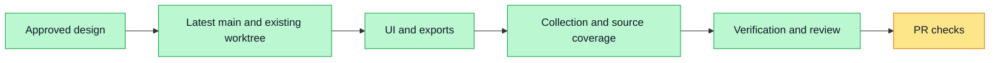

# Research simplification and evidence collection

Approved by the user in chat. Tracking: #4785. Native execution, existing worktree.
The user explicitly waived coordinator gateway access for this task.

1. Use current research name across steps; remove explanatory heading subtitles.
2. Replace Markdown plan editing with click-to-edit items, one numbering layer,
   add/delete items and confirmation before saving. Preserve persisted research metadata.
3. Reduce sources to numbered descriptions, hover full text, double-click original URL.
4. Fetch relevant documents concurrently during collection, summarize and persist them;
   preserve successful work on retries and increase relevant readable source coverage.
5. Show an editable big/small chapter hierarchy, without report body leaking into this step.
6. Remove references and their citation markers only from export clones, not stored evidence.
7. Run targeted UI/API regressions, type checks, rendered verification and branch review.
8. Create a PR linked to #4785 and follow its checks. Do not claim completion until green.

Evidence: init.sh passed; 316 UI regressions and 121 API unit regressions passed.
Real browser/API/PostgreSQL research flow passed, including report-stream reload.
Web/API type checks and web lint passed. Export prefix regression: 4/4 passed.
Full verify:base stopped on existing secret-scan findings in unrelated tests; see
docs/evidence/research-simple-plan-4785/verification.md. PR checks remain pending.
