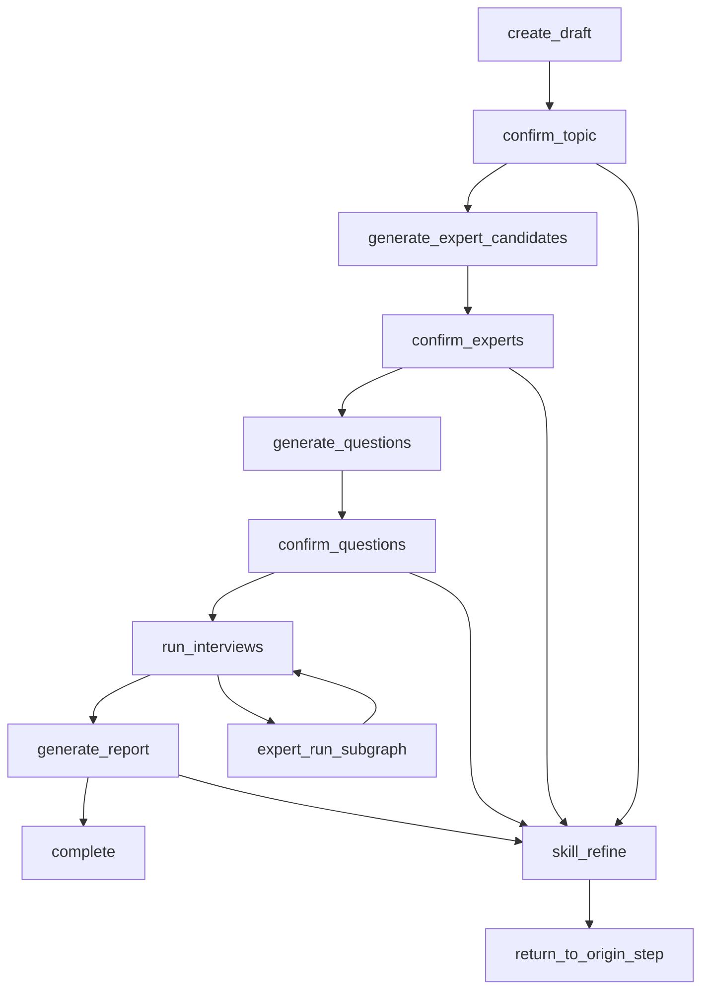

# 数字专家访谈 TypeScript LangGraph 持久化设计

## 1. 背景与目标

Phase 04 的访谈 Studio 已有五步 UI 与浏览器本地 Mock，但正式的后端持久化、节点恢复、Skill 上下文、专家运行和报告生成尚未完成。用户已确认将整个处理逻辑迁移为 TypeScript LangGraph：每个访谈步骤对应一个可恢复节点，用户明确确认步骤时才持久化并推进；Skill 对话需要跨刷新、跨步骤持续存在，且只能通过“预览建议 → 显式应用 → 确认步骤”修改访谈内容。

本设计覆盖 F04、F05、F06 的共同运行时骨架，但交付仍按一个 Feature 一个 PR 串行完成：

- F04：草稿、主题、专家、问题、Skill 上下文和 LangGraph/PostgreSQL Checkpointer 基础。
- F05：专家级并行运行、局部失败、恢复和单独重试。
- F06：Markdown 报告流式生成、Timeline、章节索引、来源回跳和导出。

本设计不包含真人、用户画像、语音或视频数字人，也不会把 Mock 内容提升为真实证据。

## 2. 已确认的产品语义

### 2.1 步骤保存

- 文本输入停止后不自动保存。
- 当前步骤的编辑只存在于浏览器内存；点击该步骤的“确认”按钮后，服务端才创建新版本并推进 LangGraph。
- 用户切换步骤、返回列表、关闭页面或刷新时，如果当前步骤存在未确认修改，必须显示离开提醒。
- 刷新后恢复最近一次服务端已确认版本，不承诺恢复尚未确认的本地输入。

### 2.2 Skill 建议

- Skill 消息和回复发送后立即持久化，因此刷新不会丢失对话上下文。
- Skill 回复产生结构化建议补丁，不得静默修改已确认业务数据。
- 点击“应用建议”只更新当前页面草稿；点击步骤“确认”后才持久化。
- 应用、拒绝、撤销建议均写入 Skill 提案记录，便于恢复与审计。

### 2.3 上游修改

- 返回并重新确认主题、专家或问题时，服务端创建新的访谈修订版本。
- 提交前明确提示将失效的下游数据。
- 旧回答、报告和 Skill 建议不硬删除，而是标记 `superseded`；新分支不得把旧分支内容混入当前报告。

## 3. 技术方案选择

采用以下组合：

- `@langchain/langgraph`：TypeScript `StateGraph`、`interrupt`、`Command` 和子图。
- `@langchain/langgraph-checkpoint-postgres`：生产级 `PostgresSaver`。
- 访谈业务表：可查询、可治理、可导出的产品事实来源。
- NestJS `apps/api`：LangGraph 编排与访谈应用用例的唯一运行位置。

不为访谈新增 Python 服务。现有 `apps/deep-agent-service` 继续服务通用 Agent，不参与本流程。旧 `/Users/shenyangjun/boardx/boardx-backend` 的 user research `StateGraph` 仅作为节点拆分和提示词参考；其按审批标记手工恢复、未在用户研究图上挂持久 Checkpointer 的方式不复用。

LangGraphJS 的官方持久化模型在每个 super-step 保存 Checkpoint，并通过稳定 `thread_id` 支持 human-in-the-loop、状态历史和故障恢复：<https://github.com/langchain-ai/langgraphjs/blob/main/docs/docs/concepts/persistence.md>。

## 4. 运行时边界

### 4.1 模块位置

新增应用模块：

```text
apps/api/src/application/interview/workflow/
  digital-interview-graph.ts
  digital-interview-state.ts
  digital-interview-nodes.ts
  digital-interview-router.ts
  digital-interview-runtime.port.ts
  digital-interview-effects.port.ts
```

基础设施实现：

```text
apps/api/src/infrastructure/interview/workflow/
  pg-digital-interview-checkpointer.ts
  pg-digital-interview-effects.ts
  langgraph-digital-interview-runtime.ts
```

Graph 属于 application orchestration；节点不直接拼 SQL，不直接读取 HTTP Principal，也不直接调用前端。节点通过端口访问业务仓储、专家目录、模型、Skill Runtime 和 Artifact 服务。

### 4.2 稳定线程标识

- `thread_id = interviewId`
- `checkpoint_ns = digital-interview:v1`
- `skillThreadId` 是与访谈一对一绑定的 Chat/Skill 线程 ID，单独保存在业务表；不得把 LangGraph 的 `thread_id` 当作 Chat 表外键。

所有 `graph.invoke`、`graph.stream`、`graph.getState`、`graph.getStateHistory` 和恢复调用都必须携带相同的 `thread_id` 与 namespace。不得像当前通用 Deep Agent Provider 一样每次请求新建 LangGraph thread。

## 5. Graph State

Checkpoint 只保存小型编排状态和业务记录指针：

```ts
interface DigitalInterviewGraphState {
  interviewId: string;
  orgId: string;
  initiatedBy: string;
  currentRevision: number;
  currentStep: "topic" | "experts" | "questions" | "interviews" | "report" | "completed";
  interviewVersion: number;
  topicVersionId: string | null;
  expertSnapshotVersionId: string | null;
  questionVersionId: string | null;
  expertRunIds: string[];
  reportId: string | null;
  skillThreadId: string;
  skillSummaryId: string | null;
  recentSkillMessageIds: string[];
  activeProposalId: string | null;
  invalidatedFromStep: string | null;
  timelineCursor: number;
  lastCompletedNode: string | null;
  failedNode: string | null;
  failureCode: string | null;
}
```

下列内容不进入 Checkpoint：完整专家材料、问题/回答正文、来源材料、全部对话历史、完整 Markdown 报告、Word/PDF 二进制。它们保存在业务表或 Artifact，并通过稳定 ID 加载。

## 6. 节点图



### 6.1 `create_draft`

- 在一个业务事务中创建访谈、初始 revision、Skill 线程绑定和 step receipt。
- 创建 LangGraph 线程的初始输入，运行至 `confirm_topic` 的 interrupt。
- 重复 `requestId` 返回同一访谈，不创建重复历史卡。

### 6.2 `confirm_topic`

- 使用 `interrupt()` 暴露已确认主题版本和 UI 所需恢复投影。
- `Command({ resume })` 必须包含主题、`expectedVersion`、`requestId`。
- 事务内写入主题版本、状态和 step receipt，随后进入专家候选生成。
- 重确认主题时创建新 revision，并将专家、问题、运行和报告标记为 `superseded`。

### 6.3 `generate_expert_candidates`

- 只通过既有 `DigitalExpertCatalogPort` 和 Context API 获取当前组织可用数字专家。
- 保存专家候选快照和生成来源；模型返回后、落库前再次验证权限。
- 节点重放使用稳定 operation ID，不重复插入候选。

### 6.4 `confirm_experts`

- interrupt 中返回候选、当前选择和专家目录查询游标。
- 用户可以从弹窗增删专家，确认时至少保留一位且去重。
- 保存不可变专家快照版本，然后进入问题生成。
- 重确认专家时仅使问题、运行和报告失效；不覆盖主题版本。

### 6.5 `generate_questions`

- 每位首次加入的专家默认生成三题，覆盖决策流程、否决风险和依据案例。
- 已存在且仍被选择的专家保留已确认问题；新增专家生成默认问题；移除专家的问题进入 superseded 版本。
- 默认题和手工题都拥有稳定 `questionId`，都允许编辑和删除。

### 6.6 `confirm_questions`

- interrupt 中返回按专家分组的问题版本。
- 确认时校验每位已选专家至少一题、归属合法、问题 ID 唯一、正文非空。
- 保存完整问题版本后进入访谈运行。
- 重确认问题只使专家运行与报告失效。

### 6.7 `run_interviews`

- 为每位专家启动独立子图；并发上限由运行配置控制。
- 子图按问题执行，逐题保存结构化回答、来源指针、不确定性和 Timeline 事件。
- 单专家失败不回滚其他专家；重试只恢复失败专家子图。
- 全部专家进入终态后，主图进入报告节点；允许部分专家失败，但不得伪装全部成功。

### 6.8 `generate_report`

- 从当前 revision 的已确认问题、回答和合法来源生成 Markdown。
- Markdown 增量、Timeline 和引用索引持续持久化；章节结构未稳定前不强制展示目录。
- 最终完成后生成章节索引，开放 Word/PDF 导出任务。
- 报告发现必须指向专家、问题、回答与来源，并保持 `exploratory=true`。

### 6.9 `skill_refine`

- 可从主题、专家、问题和报告节点进入，不推进主步骤。
- 消息先写入持久 Skill 线程，再调用 Skill Runtime。
- 输入由已确认业务快照、持久对话摘要/最近消息及本次页面草稿组成。
- 输出为结构化 proposal，不直接写主题、专家、问题或报告。
- 应用/拒绝/撤销 proposal 都持久化；“应用”先记录为 `applied_to_draft` 并把 patch 返回前端，本步骤确认后才进入业务版本。
- 刷新时 API 返回同一基准 revision 下仍有效的 `applied_to_draft` proposals；前端可重建草稿或提示重新应用，不会把尚未确认的 patch 冒充已保存业务内容。
- 步骤确认成功后，参与该版本的 proposals 记录 `committedVersionId`；基准 revision 变化后未提交 proposals 变为 `stale`。
- 返回原节点时保留同一个 LangGraph thread 与 Skill thread。

## 7. 双层持久化

### 7.1 Checkpointer schema

`PostgresSaver` 使用独立 schema `langgraph_interview`。初始化通过受控 migration/setup 命令执行，应用启动路径不得以高权限动态建表。运行账号只获得该 schema 所需的最小 DML 权限。

官方 Checkpointer 以 `thread_id` / namespace 查询，不承担 WorkspaceX 的租户授权。任何 `getState`、恢复、history 或 thread 删除操作前，应用层必须先通过业务仓储按 `orgId + interviewId + Principal` 完成可见性判定；控制器不得暴露任意 thread ID 的 Checkpointer 直通接口。

Checkpoint 提供：

- 最新 StateSnapshot；
- pending writes；
- interrupt 和 next node；
- 节点错误与重试上下文；
- state history/time travel 所需元数据。

### 7.2 业务表

建议新增或扩展：

- `digital_interview_revisions`
- `digital_interview_topic_versions`
- `digital_interview_expert_snapshot_versions`
- `digital_interview_expert_snapshots`
- `digital_interview_question_versions`
- `digital_interview_questions`
- `digital_interview_runs`
- `digital_interview_answers`
- `digital_interview_reports`
- `digital_interview_report_chunks`
- `digital_interview_timeline_events`
- `digital_interview_skill_threads`
- `digital_interview_skill_messages`
- `digital_interview_skill_proposals`
- `digital_interview_step_receipts`

每张租户数据表都以 `org_id` 参与复合主键/外键或唯一约束，并启用 RLS。跨表引用必须表达同组织不变量，不依赖应用层约定。

### 7.3 双写一致性

LangGraph Checkpoint 与业务事务不能假设处于同一个原子提交。每个有副作用的节点使用稳定：

```text
operationId = interviewId:nodeName:revision
```

节点首先调用幂等业务命令。业务事务写入数据和 `digital_interview_step_receipts`；重复 operation ID 返回首次结果。随后节点返回仅包含业务记录 ID 的 state update，供 Checkpointer 保存。若进程在两者之间崩溃，节点重放会命中 receipt，不重复产生专家、问题、运行或报告。

禁止节点采用“先调模型、直接写 Checkpoint、稍后再补业务表”的顺序。

## 8. API 契约

所有路径与 schema 的唯一事实源仍为 `packages/contracts/src/interview.ts`。建议操作：

| 操作 | 用途 |
|---|---|
| `createDigitalInterview` | 创建名称、Tags、初始 revision 和 Graph thread |
| `getDigitalInterview` | 业务读模型 + graph projection + interrupt + Skill cursor |
| `confirmDigitalInterviewTopic` | 确认主题并恢复 Graph |
| `confirmDigitalInterviewExperts` | 确认专家并恢复 Graph |
| `confirmDigitalInterviewQuestions` | 确认问题并恢复 Graph |
| `startDigitalInterviewRuns` | 明确启动/恢复专家运行 |
| `retryDigitalExpertRun` | 仅重试失败专家子图 |
| `generateDigitalInterviewReport` | 启动/恢复 Markdown 报告节点 |
| `appendDigitalInterviewSkillMessage` | 持久化消息并运行 skill_refine |
| `applyDigitalInterviewSkillProposal` | 记录显式应用，返回前端 patch |
| `rejectDigitalInterviewSkillProposal` | 记录拒绝 |
| `listDigitalInterviewEvents` | 按 cursor 恢复 Timeline |

所有写操作必须携带 `requestId + expectedVersion`：

- 相同 requestId、相同 payload：返回首次结果；
- 相同 requestId、不同 payload：`409 IDEMPOTENCY_REPLAY_MISMATCH`；
- expectedVersion 过期：`409 CONCURRENT_MODIFICATION`；
- 中途撤权：`PERMISSION_REVOKED_MIDWAY`，且不得落业务数据或消息。

## 9. 快速恢复

### 9.1 页面恢复

`getDigitalInterview` 返回：

- 当前业务 revision 和版本；
- 当前主步骤与最后完成节点；
- 当前 interrupt payload 的安全投影；
- 专家/问题/运行/报告读模型；
- Skill thread 的消息游标和未决 proposal；
- Timeline 最新 cursor。

Web 只以服务端投影恢复，不以 localStorage 作为正式事实源。

### 9.2 进程恢复

- API 重启后通过 `graph.getState(config)` 获取最新 Checkpoint。
- interrupt 节点继续等待用户确认；运行节点从 pending writes/step receipt 继续。
- 如果 Checkpoint 暂时不可用但业务表可读，历史列表和已完成内容仍可查看；推进操作返回依赖不可用，不伪装为空状态。

### 9.3 Timeline 重连

Timeline 事件按 `(org_id, interview_id, revision, cursor)` 唯一且追加写入。SSE 客户端携带 `after` 或 `Last-Event-ID`，重连后补发缺失事件，再进入实时流。

## 10. 上下文管理

- Skill 完整消息保存在业务消息表。
- LangGraph State 只保存摘要 ID和有限最近消息 ID，避免 Checkpoint 无界增长。
- 摘要必须标记总结到的消息游标；新消息加载“摘要 + 游标后消息”。
- 专家材料始终经 Context API 以当前权限读取，不把材料正文永久复制到 Checkpoint。
- proposal 记录其来源消息、目标步骤、基准 revision 和 patch；基准 revision 变化后自动标记 `stale`。

## 11. 权限与组织隔离

- `orgId`、`actorId` 从服务端 Principal 注入，客户端值不可信。
- 节点开始前、模型/Skill 返回后、业务落库前均复核资源可见性与材料权限。
- 无权与不存在继续复用相同 `NO_INTERVIEW_ACCESS` 信封。
- Checkpointer schema 不向 Web 暴露；Graph State 不包含敏感材料正文。
- 日志只记录 interview、node、revision、operationId、correlationId 和错误码，不记录问题、回答或 Skill 正文。

## 12. 删除与保留

- 普通“删除访谈”执行可恢复归档，不立即删除 Checkpoint 和业务证据。
- 组织级彻底删除按固定顺序清理 Artifact、业务表和 LangGraph thread。
- Checkpoint 需要 retention 策略，至少支持清理已归档访谈的过期历史版本；当前 revision 的恢复点不得提前删除。

## 13. 契约修订门禁

当前已签核束存在一处需要人类重新确认的漂移：

- 已确认 UI：创建弹窗只提交访谈名称和 Tags，进入第 1 步后再确认主题。
- 现有 `domain.md` / `usecases.md`：`createDigitalInterviewDraft` 同时接收并保存主题。

正式实现前必须在 `contracts/digital-expert-interview/` 收敛为一个事实源并重新完成束级 API 契约签核。推荐以已确认 UI 为准：创建输入为名称和 Tags，初始状态进入 `topic_pending`；主题只由 `confirmDigitalInterviewTopic` 持久化。Agent 不得自行修改 `design-signoff.md` 的人类确认状态。

## 14. 验证策略

### F04

- 真实 PostgreSQL：创建后停在 topic interrupt；重启运行时后仍可恢复。
- 每一步只有确认才写业务版本；未确认输入离开时有提醒。
- 相同 requestId 并发提交不会生成重复专家/问题。
- Skill 消息刷新后仍存在；建议未应用不改业务，应用后未确认也不改业务。
- 修改上游后下游变为 superseded，旧分支不进入当前读模型。
- 跨组织访问与复合外键反证。

### F05

- 多专家子图并行，单专家失败不回滚其他专家。
- API/进程重启后从最后成功问题恢复。
- 重试失败专家不重复调用已完成专家，回答和来源保持不变。
- 操作中撤权不产生回答。

### F06

- Markdown chunks 和 Timeline 断线重连不丢失、不重复。
- 报告章节在最终稳定后生成；生成期间正文正常渲染。
- 每条发现回跳到当前 revision 的专家、问题、回答和来源。
- Word/PDF 导出来自同一最终 Markdown 版本。

每个 Feature 除目标测试外，还必须通过 API/Web typecheck、migration check、组织隔离测试和浏览器 E2E；完成后才可通过 harness verify。

## 15. 主要风险与缓解

| 风险 | 缓解 |
|---|---|
| Checkpoint 与业务表双写中途失败 | 幂等业务命令 + step receipt，允许节点安全重放 |
| Checkpoint 无界增长 | State 只存 ID/摘要；归档线程 retention |
| Skill 上下文污染新 revision | proposal 绑定基准 revision；上游变化后标 stale |
| 上游修改误用旧回答 | 所有运行/报告查询显式限定 current revision |
| 同一访谈并发恢复 | expectedVersion + 数据库条件更新 + thread 级执行租约 |
| Checkpointer 依赖故障 | 已持久化业务内容仍可读；推进操作 fail closed |
| 旧 Mock 草稿迁移 | 仅作为 UI 草稿导入；必须经服务端重新确认，不作为正式证据 |

## 16. 非目标

- 不让 Skill 自动修改已确认数据。
- 不以 Checkpoint 代替业务数据库或 Artifact。
- 不把全部历史消息塞入 Graph State。
- 不在一个 PR 中同时实现 F04、F05、F06。
- 不复制旧后端 personas/模拟用户画像流程。
- 不修改真人访谈、录制、撤回链或强洞察治理能力。
