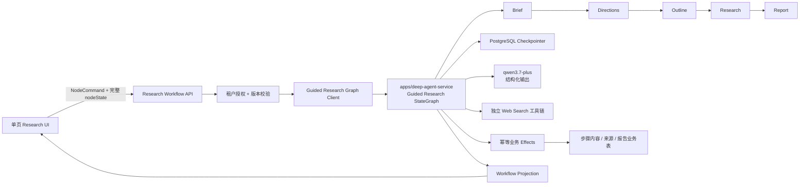
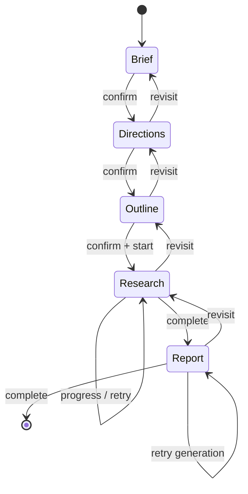

# 引导式 Deep Research LangGraph 节点持久化设计

## 1. 背景与已确认决策

当前引导式 Deep Research 已具备研究首页、主题、研究方向、大纲、演示检索和演示报告界面。
主题、方向和大纲已有部分业务表持久化，但步骤推进仍由仓储中的 SQL 状态更新控制；检索任务、
来源决策、报告内容和部分 Skill 状态仍依赖前端 Mock 或 localStorage。

用户于 2026-08-15 至 2026-08-16 确认以下目标：

1. 五个研究步骤分别成为 LangGraph 节点。
2. 每一步的数据都属于 LangGraph 的逻辑状态。
3. 前端调用任一步骤时，都必须提交当前前端节点的完整状态内容，而不是只提交步骤名或按钮动作。
4. 刷新、离开、API 重启和节点失败后，都能从同一研究会话恢复。
5. 页面保持单路由；步骤切换不得依赖路由跳转或整页刷新。
6. 只有点击当前步骤的确认/生成按钮才触发模型；查看、编辑和步骤切换不自动调用。
7. 所有研究节点统一使用阿里云百炼 `qwen3.7-plus`，输出必须是结构化 JSON。
8. Web Search 沿用独立检索工具链；模型负责查询规划、来源判断和结构化证据提取。

本设计扩展现有 Python `apps/deep-agent-service`，由它持有专用 Guided Research StateGraph；
生产 checkpointer 使用 PostgreSQL。`apps/api` 不再实现第二套 TypeScript 状态图，只负责 BoardX
租户授权、共享契约校验、调用内部 Graph 服务和维护列表/查询投影。

## 2. 目标与非目标

### 2.1 目标

- 用一个稳定 LangGraph thread 管理一项研究的完整生命周期。
- 用五个可恢复节点表达 Brief、Directions、Outline、Research 和 Report。
- 用统一 Node Command 契约接收前端当前节点的完整状态。
- 用 checkpoint、幂等 receipt 和业务内容表保证重放安全。
- 每个确认动作都先保存完整前端 nodeState，再由 `qwen3.7-plus` 生成下一步骤结构化数据。
- 用服务端投影恢复页面，不再把 localStorage 当作正式事实源。
- 保留历史 checkpoint，使上游重确认、失败重试和问题审计可追踪。

### 2.2 非目标

- 不在一个 Feature/PR 中同时交付全部五步；按垂直切片串行合并。
- 不让浏览器直接访问 LangGraph checkpointer。
- 不把来源全文、抓取页面、完整报告二进制重复复制到每个 checkpoint。
- 不在本轮增加导出、分享、评论或洞察入库。
- 不将模型生成内容冒充真实来源；真实 Web Search 仍必须产生可追溯来源记录。

## 3. 总体架构



边界原则：

- LangGraph 是步骤、节点版本、恢复位置、失败和重试状态的权威控制平面。
- Python Graph 服务是唯一编排运行时；NestJS 不复制节点转移规则。
- Graph State 拥有每一步的逻辑状态；大内容以稳定 ID 和版本进入 Graph State，由读投影补齐正文。
- 业务表是来源、报告正文等产品数据的可查询持久层，不自行决定下一步。
- Web 只理解 BoardX 契约，不解析 LangGraph 内部 checkpoint 或上游检索事件。
- `qwen3.7-plus` 由服务端配置和模型准入控制，浏览器不能选择或覆盖 model ID。

### 3.1 模型与检索边界

- Graph 服务复用现有 `KERNEL_MODEL_BASE_URL` / `KERNEL_MODEL_API_KEY`，新增
  `KERNEL_GUIDED_RESEARCH_MODEL_ID=qwen3.7-plus`；缺少凭据或模型未准入时 fail closed。
- 所有生成调用启用 `response_format: { "type": "json_object" }`，prompt 明确要求 JSON，随后再以
  BoardX 共享 schema 校验；可解析 JSON 但不符合 schema 仍视为节点失败。
- Brief 确认调用模型生成 Directions；Directions 确认生成 Outline；Outline 确认生成结构化
  Research Plan 与查询任务；Research 确认已采纳来源后生成 Report。
- Web Search 不使用模型内置联网搜索作为证据源。查询执行、URL、抓取状态和重试来自独立工具链，
  `qwen3.7-plus` 只承担查询拆分、来源判读、证据抽取和综合。
- 测试可注入 fake model/search port，但生产不得回退到 deterministic generator、Mock 或 localStorage。

## 4. 稳定身份与版本

- `thread_id = sessionId`
- `checkpoint_ns = guided-research:v1`
- `graphVersion`：每次成功 Node Command 后递增，用于乐观并发。
- `requestId`：每次用户意图的稳定幂等键。
- `operationId = sessionId:node:action:graphVersion:requestId`
- `contentVersionId`：步骤大内容的不可变版本标识。

所有 `invoke`、`stream`、`getState`、`getStateHistory` 和 `Command({ resume })` 都必须携带同一个
`thread_id` 与 namespace。客户端传入的 `orgId`、`actorId` 或任意 checkpoint ID 均不可信。

## 5. Graph State

```ts
type ResearchNode = "brief" | "directions" | "outline" | "research" | "report";
type NodeStatus = "locked" | "editing" | "ready" | "running" | "failed" | "completed" | "stale";

interface GuidedResearchGraphState {
  sessionId: string;
  orgId: string;
  ownerUserId: string;
  currentNode: ResearchNode;
  graphVersion: number;
  revision: number;

  brief: BriefNodeState;
  directions: DirectionsNodeState;
  outline: OutlineNodeState;
  research: ResearchNodeState;
  report: ReportNodeState;
  skill: ResearchSkillState;

  lastOperationId: string | null;
  lastRequestId: string | null;
  lastCompletedNode: ResearchNode | null;
  failedNode: ResearchNode | null;
  failureCode: string | null;
  invalidatedFromNode: ResearchNode | null;
}

interface NodeMeta {
  status: NodeStatus;
  version: number;
  confirmedVersion: number | null;
  contentVersionId: string | null;
  modelId: "qwen3.7-plus" | null;
  modelInvocationId: string | null;
  modelOutputSchemaVersion: string | null;
  confirmedAt: string | null;
  updatedAt: string;
  errorCode: string | null;
}
```

### 5.1 BriefNodeState

```ts
interface BriefNodeState extends NodeMeta {
  name: string;
  tags: string[];
  topic: string;
  objective: string;
  timeRange: string;
  geography: string;
  focus: string;
}
```

确认时校验名称、主题和目标；确认成功解锁 Directions。重确认 Brief 创建新 revision，并将
Directions、Outline、Research、Report 标记为 `stale`。

### 5.2 DirectionsNodeState

```ts
interface ResearchDirection {
  id: string;
  title: string;
  description: string;
  enabled: boolean;
  order: number;
}

interface DirectionsNodeState extends NodeMeta {
  basedOnBriefVersion: number;
  candidateVersion: number;
  directions: ResearchDirection[];
  generationStatus: "idle" | "running" | "failed" | "ready";
}
```

前端每次保存或确认都提交当前完整方向数组。确认时至少一项启用；重确认后 Outline、Research、
Report 进入 `stale`。

### 5.3 OutlineNodeState

```ts
interface OutlineSection {
  id: string;
  title: string;
  description: string;
  researchQuestions: string[];
  order: number;
}

interface OutlineNodeState extends NodeMeta {
  basedOnDirectionsVersion: number;
  candidateVersion: number;
  sections: OutlineSection[];
  generationStatus: "idle" | "running" | "failed" | "ready";
}
```

确认时章节非空、ID 唯一、顺序连续。重确认后 Research 和 Report 进入 `stale`。

### 5.4 ResearchNodeState

```ts
interface ResearchTaskState {
  id: string;
  sectionId: string;
  query: string;
  status: "queued" | "running" | "failed" | "completed";
  attempt: number;
  sourceIds: string[];
  errorCode: string | null;
}

interface ResearchNodeState extends NodeMeta {
  basedOnOutlineVersion: number;
  runId: string | null;
  startKey: string | null;
  progress: number;
  currentQuery: string | null;
  tasks: ResearchTaskState[];
  latestSourceIds: string[];
  acceptedSourceIds: string[];
  excludedSourceIds: string[];
  eventCursor: number;
}
```

来源正文和抓取快照存业务表或 Artifact；Graph State 保存来源 ID、任务归属、采纳状态和版本。
Workflow Projection 按权限补齐标题、URL、域名、类型、抓取时间和摘要。重试只重跑失败任务，
相同大纲版本与 `startKey` 不得启动第二个 run。

### 5.5 ReportNodeState

```ts
interface ReportSectionState {
  id: string;
  outlineSectionId: string;
  title: string;
  markdownContentId: string;
  citationIds: string[];
  status: "queued" | "generating" | "failed" | "completed";
}

interface ReportNodeState extends NodeMeta {
  basedOnResearchVersion: number;
  reportId: string | null;
  title: string;
  summaryContentId: string | null;
  sections: ReportSectionState[];
  citationIds: string[];
  qualityCheckStatus: "pending" | "passed" | "failed";
  generatedAt: string | null;
}
```

报告 Markdown 与未来导出文件不重复放入 checkpoint；Graph State 拥有章节结构、正文版本 ID、引用
集合与生成状态。投影返回用户可见的完整报告。引用只能解析到同一研究 revision 的已采纳来源。

### 5.6 ResearchSkillState

```ts
interface ResearchSkillState {
  threadId: string;
  activeNode: ResearchNode;
  summaryId: string | null;
  recentMessageIds: string[];
  activeProposalId: string | null;
  proposalStatus: "none" | "proposed" | "applied_to_draft" | "rejected" | "committed" | "stale";
}
```

Skill 消息发送后持久化。Skill 只生成针对当前节点的结构化 patch；应用 patch 会进入前端 nodeState，
只有再次提交 Node Command 才成为 Graph State 的新 checkpoint。

### 5.7 前端可提交状态与服务端状态分离

`BriefNodeState` 等 Graph State 包含 `NodeMeta`、模型结果和业务内容引用，不能原样作为公开写契约。
公开命令使用五个独立的 strict input schema，只包含当前页面可编辑的完整状态：

```ts
interface BriefNodeInputState {
  name: string;
  tags: string[];
  topic: string;
  objective: string;
  timeRange: string;
  geography: string;
  focus: string;
}

interface DirectionsNodeInputState { directions: ResearchDirection[] }
interface OutlineNodeInputState { sections: OutlineSection[] }
interface ResearchNodeInputState { acceptedSourceIds: string[]; excludedSourceIds: string[] }
interface ReportNodeInputState { title: string; revisionInstruction: string }

interface ResearchNodeInputMap {
  brief: BriefNodeInputState;
  directions: DirectionsNodeInputState;
  outline: OutlineNodeInputState;
  research: ResearchNodeInputState;
  report: ReportNodeInputState;
}
```

“完整 nodeState”指对应 `ResearchNodeInputMap[node]` 的全部字段，不包含 `NodeMeta`、模型调用身份、
服务端版本、时间、错误、来源正文或报告正文。公开 schema 拒绝未知字段，Graph 只把校验后的 input
合并到当前节点，并由服务端生成其余字段。

## 6. 前后端统一 Node Command

```ts
type ResearchNodeAction =
  | "save"
  | "generate"
  | "confirm"
  | "start"
  | "retry"
  | "reconfirm"
  | "complete";

interface ResearchNodeCommand<TNode extends ResearchNode> {
  sessionId: string;
  node: TNode;
  action: ResearchNodeAction;
  requestId: string;
  expectedGraphVersion: number;
  nodeState: ResearchNodeInputMap[TNode];
}
```

每次调用必须包含当前节点完整 `nodeState`。服务端执行顺序固定为：

1. 由 Principal 获取 `orgId` 和 `actorId`，验证会话可见性。
2. 读取同一 `thread_id` 的最新 checkpoint。
3. 按 `ResearchNodeInputMap[node]` 校验完整 `nodeState`，拒绝未知字段和非法下游 ID。
4. 计算 payload 指纹并先查询 `(sessionId, requestId)` receipt：同指纹回放直接返回首次成功响应所记录的
   checkpoint/version/projection 身份，不再执行版本校验、模型调用或业务 Effect；不同指纹返回 409。
5. 对首次请求校验 `node === currentNode`；若 action 为 `reconfirm`，则 node 必须是允许回看的已完成节点。
6. 对首次请求校验 `expectedGraphVersion`。
7. NestJS Graph Client 把已授权 command 发送给内部 Graph 服务；Graph 服务用
   `Command({ resume: command })` 恢复当前 interrupt。
8. Graph 节点先 checkpoint 输入，再调用 `qwen3.7-plus` 或独立检索工具链。
9. 结构化结果通过共享 schema 后，节点通过幂等 Effect 写业务内容与 receipt。
10. Checkpointer 保存输出 checkpoint，并返回 checkpoint/thread/version 身份。
11. NestJS 幂等更新 BoardX 查询投影并返回重新水合的 Workflow Projection。

禁止客户端直接提交或覆盖：`orgId`、`ownerUserId`、`graphVersion`、`revision`、服务端时间、错误码、
来源正文、报告正文和任意其它组织的数据 ID。

## 7. API 契约

在 `packages/contracts/src/research.ts` 增加统一外部操作；Python Graph 输入/输出 JSON Schema 由该
契约构建产物生成并由 CI 做漂移检查，禁止 Python 手写一份形似但独立的公开契约。旧操作仅作为迁移期兼容层：

| 操作 | HTTP | 作用 |
|---|---|---|
| `getGuidedResearchWorkflow` | `GET /research/guided-sessions/:sessionId/workflow` | 返回最新 Graph 投影和当前 interrupt |
| `getGuidedResearchNode` | `GET /research/guided-sessions/:sessionId/workflow/nodes/:node` | 按权限水合一个当前 revision 的可用节点；刷新后可查看已完成节点 |
| `executeGuidedResearchNode` | `POST /research/guided-sessions/:sessionId/workflow/nodes/:node` | 提交完整 nodeState 并执行 action |
| `listGuidedResearchEvents` | `GET /research/guided-sessions/:sessionId/workflow/events?after=` | 恢复检索/报告运行进度 |
| `appendGuidedResearchSkillMessage` | `POST /research/guided-sessions/:sessionId/skill/messages` | 持久化 Skill 消息并生成 proposal |

统一成功响应：

```ts
interface GuidedResearchWorkflowProjection {
  sessionId: string;
  graphVersion: number;
  revision: number;
  currentNode: ResearchNode;
  availableNodes: ResearchNode[];
  nodeSummaries: Record<ResearchNode, NodeMeta>;
  activeNodeState: HydratedNodeState;
  nodeStateVersions: Partial<Record<ResearchNode, number>>;
  skill: HydratedResearchSkillState;
  interrupt: { node: ResearchNode; allowedActions: ResearchNodeAction[] } | null;
}
```

新增封闭错误码至少包括：

- `RESEARCH_WORKFLOW_UNAVAILABLE`
- `RESEARCH_NODE_LOCKED`
- `RESEARCH_NODE_MISMATCH`
- `RESEARCH_GRAPH_VERSION_CONFLICT`
- `RESEARCH_NODE_STATE_INVALID`
- `RESEARCH_IDEMPOTENCY_REPLAY_MISMATCH`
- `RESEARCH_CONTENT_REFERENCE_INVALID`
- `RESEARCH_TASK_NOT_RETRYABLE`

无权与不存在继续使用同一不可区分响应，不泄露其它组织的 thread 或 checkpoint 是否存在。

## 8. Graph 节点与 interrupt



图不把 interrupt 永久停在 Brief/Report 等业务节点本身，而使用稳定的 `await_command` 控制节点：

1. `await_command` 通过 `interrupt()` 暴露当前节点、可回看节点和允许动作。
2. 相同 thread 以 `Command({ resume: ResearchNodeCommand })` 恢复后进入 `route_command`。
3. `route_command` 根据 `command.node + action` 条件路由到 Brief、Directions、Outline、Research 或
   Report handler；因此在 Report 阶段提交 `brief + reconfirm` 会真实进入 Brief handler，而不是错误地
   把 Brief payload 交给 Report interrupt。
4. handler 完成保存/生成/确认/失效后统一回到 `await_command`，再产生下一个 checkpoint interrupt。

`reconfirm` 只能路由到 `availableNodes` 中已经完成的上游节点，并在 handler 内创建新 revision、标记
下游 stale、切换 `currentNode`。因为恢复会重新进入控制节点，所有外部 Effect 都必须通过 receipt 幂等。

运行型节点 Research 和 Report 使用 Python 子图或 task 拆分长任务。每个章节检索、报告章节生成分别拥有
稳定 operation ID；失败恢复不得重放已完成章节。

## 9. 双层持久化

### 9.1 Checkpointer

- `apps/deep-agent-service` 使用 LangGraph PostgreSQL checkpointer（Python 包），不使用当前开发期
  in-memory saver，也不复用旧 BoardX Backend 的 24 小时 Mongo TTL saver。
- 独立 schema：`langgraph_research`。
- schema 初始化由 migration/setup 完成，应用启动不动态建表。
- 运行账号只获得所需 DML 权限。
- checkpoint 访问前必须先通过业务会话完成租户授权。

### 9.2 业务内容表

在现有 `guided_research_sessions` 和版本表基础上演进，建议增加：

- `guided_research_node_receipts`
- `guided_research_revisions`
- `guided_research_runs`
- `guided_research_tasks`
- `guided_research_sources`
- `guided_research_source_decisions`
- `guided_research_reports`
- `guided_research_report_sections`
- `guided_research_citations`
- `guided_research_skill_threads`
- `guided_research_skill_messages`
- `guided_research_skill_proposals`
- `guided_research_timeline_events`

所有租户表以 `org_id` 参与复合约束并启用 RLS。跨表引用必须在数据库层保证同组织、同会话和同
revision，不依赖应用层约定。

### 9.3 一致性与重放

业务事务与跨进程 LangGraph checkpoint 不假定原子双写。节点先执行幂等业务 Effect：

1. 事务内锁定会话或 revision。
2. 校验 graphVersion、revision 和 operationId。
3. 写业务数据与 `guided_research_node_receipts`。
4. 返回稳定业务 ID。
5. 节点把 ID 写入 Graph State，由 checkpointer 保存。

若进程在步骤 4 和 5 之间退出，节点重放命中 receipt 并返回首次结果，不重复搜索、调用模型或写报告。

## 10. 单页前端状态

- 首页：`/research`。
- 会话：`/research?session=<sessionId>`。
- `flow=` 不再是步骤状态来源；旧分享链接只在首次进入时解析，然后用 `history.replaceState` 收敛到
  canonical URL，服务端 `currentNode` 优先。
- 五步导航、编辑器和 Skill 助手都在同一 React 页面树内。
- 步骤切换更新本地选中节点和服务端投影，不使用 `router.push` 切步骤，不重新挂载整页。
- 左侧 Skill 助手占桌面工作区约三分之一；右侧进度和当前节点工作区约三分之二。
- 当前节点有未提交修改时，切换、返回首页或关闭页面必须提醒。
- 恢复时只信任 `getGuidedResearchWorkflow`；localStorage 仅可用于非权威 UI 偏好，不能恢复业务状态。
- Workflow GET 水合当前节点；用户点击任一已完成节点时调用 `getGuidedResearchNode` 水合该节点。
  节点读取同样经过会话授权并绑定当前 revision，不能用旧 checkpoint ID 越权读取历史内容。

## 11. 上游重确认与下游失效

| 重确认节点 | 新 revision | 保留 | 标记 stale |
|---|---:|---|---|
| Brief | 是 | 旧 checkpoint/history | Directions、Outline、Research、Report |
| Directions | 是 | 当前 Brief | Outline、Research、Report |
| Outline | 是 | Brief、Directions | Research、Report |
| Research 来源决策 | 否 | 检索结果 | Report |
| Report | 否 | 全部已采纳来源 | 旧报告生成版本 |

失效采用版本和状态标记，不硬删除历史内容。当前读投影只水合当前 revision，旧 revision 仅用于审计和
受控恢复，不得混入新报告。

## 12. 迁移与兼容

1. 为现有会话创建 `guided-research:v1` 初始 checkpoint。
2. 从现有 brief、directions、outline、stage、status 和 progress 生成初始 Graph State。
3. 旧演示搜索/报告不升级为真实证据；迁移后保持未运行或演示标记。
4. 迁移期旧 confirm/start/complete API 转换为统一 Node Command，Web 完成切换后再删除旧写入口。
5. Backfill 幂等；重复执行不得生成多个 thread 初始 revision。
6. 无法安全映射的会话进入 `failed` 并返回可诊断错误，不静默重置为 Brief。

## 13. 安全与可观测性

- Graph State 不保存跨组织敏感正文或密钥。
- 模型、检索、Artifact 读取前后都复核权限；撤权后不得落业务数据。
- 日志记录 `sessionId`、node、revision、graphVersion、operationId、checkpointId、耗时和错误码，
  不记录主题正文、来源正文、报告正文或 Skill 消息。
- 指标至少覆盖节点成功率、interrupt 等待时间、恢复次数、幂等命中、checkpoint 大小、章节重试和
  stale revision 数量。

## 14. 失败与恢复语义

- 409 版本冲突：返回最新投影，前端提示用户重新应用本地修改。
- 节点校验失败：不写业务表、不推进 checkpoint。
- 模型或搜索失败：当前节点进入 `failed`，已完成任务和来源继续可见。
- Checkpointer 不可用：历史业务读模型仍可查看；写操作返回依赖不可用，不伪装成功。
- 业务内容可用但 checkpoint 缺失：进入修复路径，不从卡片文案猜测当前节点。
- SSE/事件断线：客户端携带 cursor 重连，先补发缺失事件再进入实时流。

## 15. 串行 Feature 切片

现有 F170、F171 保留其用户可见目标；新增编号必须从最新 `main` 的 F190 之后分配，旧草案中的
F188 已被项目模板占用，禁止复用。完整交付由六个串行垂直切片组成：

1. **F191 Graph 基础与单页投影**：Python Guided Research StateGraph、Postgres checkpointer、统一
   Node Command、NestJS Graph Client、旧会话 backfill 和 canonical 单页恢复。
2. **F192 Brief → Directions**：提交完整 Brief nodeState，`qwen3.7-plus` 返回结构化研究方向，
   刷新恢复输入与输出。
3. **F193 Directions → Outline**：提交完整方向列表/选择/排序/人工编辑，模型返回结构化报告大纲，
   支持上游重确认和下游失效。
4. **F194 Outline → Research Plan**：提交完整大纲，模型生成章节检索计划和查询任务，确认后启动
   后台检索而不重复运行已完成任务。
5. **F170 Research**：按 Graph Research 节点执行真实独立 Web Search、来源判读、进度事件、失败章节
   重试和人工来源取舍；更新依赖指向 F194。
6. **F171 Report**：Research 确认后由 `qwen3.7-plus` 生成结构化报告、引用与质量检查，持久化完成态。

六个切片共享 Research 契约、Graph State、内部 Graph Client、单页工作区和 migration，必须串行；
每一项单独 issue、分支、验证和 PR。

## 16. 验证策略

### 16.1 契约

- 五种 Node Command 都要求完整 nodeState。
- 公开 input schema 不包含 `NodeMeta`、模型身份、服务端版本、时间或错误字段。
- 四个生成边界断言实际选择 `qwen3.7-plus`，并验证生产配置无 deterministic fallback。
- 未知字段、非法引用、缺少 requestId、缺少 expectedGraphVersion 均失败。
- 成功和错误响应封闭，Web 与 API 使用同一 schema。

### 16.2 真实 PostgreSQL / LangGraph

- 每个节点确认后产生 checkpoint，API 重启后从相同 thread 恢复。
- Graph 服务进程重启后从 PostgreSQL 恢复，不能依赖 NestJS 内存或 Python in-memory saver。
- 同 requestId 同 payload 返回首次结果；不同 payload 返回 409。
- 首次响应丢失后用旧 expectedGraphVersion 重放同 requestId/payload，仍返回首次 checkpoint，不报版本冲突。
- checkpoint 前后进程退出不会重复写业务内容或重复启动外部调用。
- 上游重确认只使规定的下游节点 stale。
- 从 Report interrupt 重确认 Brief 会经 `route_command` 执行 Brief handler，并把 Directions 之后置 stale。
- 跨组织 session、业务记录和 checkpoint 均不可见。

### 16.3 Web

- 步骤切换不改变 canonical URL、不触发整页刷新。
- 每次写调用都包含当前节点完整状态。
- 刷新后恢复服务端当前节点和已确认内容。
- 刷新后点击已完成节点通过授权 node-read 恢复完整可编辑状态，不依赖内存草稿。
- 未来节点禁用；已完成节点可查看，重确认时显示下游失效提示。
- Skill 应用只改页面草稿，再提交 Node Command 才进入 checkpoint。

### 16.4 Research / Report

- 单章节失败不清空其它任务和来源。
- 重试不重复执行已完成章节。
- 来源采纳/排除刷新后保持。
- 报告 citationId 只解析到当前 revision 的已采纳来源。
- 报告失败仍能查看真实搜索结果并重试。

## 17. 风险与控制

1. **Checkpoint 膨胀**：大正文外置，State 保存版本 ID；监控序列化大小。
2. **Graph schema 演进**：节点名和既有字段保持兼容；新增字段提供默认值；迁移旧 checkpoint。
3. **双写不一致**：Effect receipt + operationId 幂等，禁止在 interrupt 前产生副作用。
4. **并发覆盖**：graphVersion 与 payload fingerprint 双重校验。
5. **旧路由回退**：保留旧 URL 解析测试，但只由服务端 currentNode 决定实际步骤。
6. **范围失控**：六个垂直切片串行，一项一 PR；不在基础切片中实现真实 Web Search 或报告。
7. **跨语言契约漂移**：TypeScript 契约生成 JSON Schema，Python 运行时只消费生成物；CI 对生成物做
   clean-diff 检查。

## 18. 完成判据

当六个切片全部合入后：

- 一项研究对应一个持久 LangGraph thread。
- 五个步骤都有明确 Graph Node 和可检查 checkpoint。
- 所有生成节点均真实调用 `qwen3.7-plus` 并返回通过 schema 的结构化结果。
- 每次前端节点调用均提交完整 nodeState。
- 前端刷新、API 重启、任务失败和离开返回均能恢复。
- 步骤切换不再依赖 `flow=` 路由或整页刷新。
- Search 与 Report 不再读取 Mock/localStorage 作为业务事实。
- 所有报告引用均可追溯到同 revision 的真实已采纳来源。

## 19. 开工门禁与仓库治理

本设计获产品确认后，运行时代码开工前仍必须完成以下仓库动作：

1. 在 UC-24.6 增加可解析的 LangGraph 节点持久化需求锚点，记录“完整 nodeState + 单路由 +
   checkpoint 恢复”这一新决策，不用 F170 的旧 R4 暗示它已经覆盖全部 Graph 基础。
2. 新增 F191–F194 四个垂直切片；F170 和 F171 分别承担真实 Search 与真实 Report，共六个串行切片。
3. 更新 `contracts/research` 的 UI、用例、API 契约与 coverage，把新 feature 纳入 `covers`；
   `design-signoff.md` 的确认状态只能由人类修改。
4. 重新执行阶段一致性复核，重点核对 Agent Runtime、Skill、Files/Artifact 和 Research 的跨束约束。
5. F180 已在最新 `main` 机械转为 passing；开工前仍需确认没有其它 owner 正在修改共享 Research 热点。
6. F170 已建立公开 issue #1357；F191–F194 仍需分别建立 issue、分支、验证和 PR。
