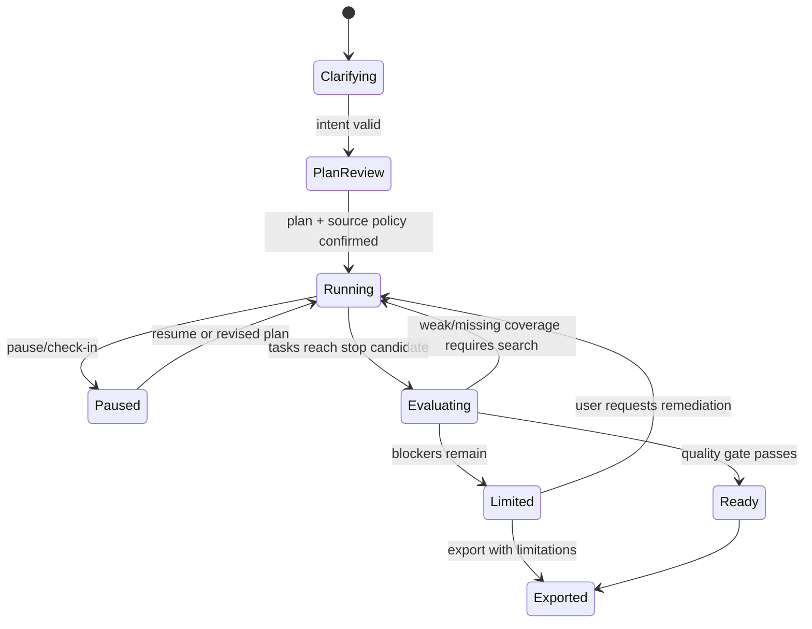

# Deep Research 可信研究控制台与质量门设计

## 1. 决策摘要

本设计在现有五步引导式研究之上增加一层统一的“可信研究控制台”，让用户在启动前明确目标与来源策略，在运行中理解和修正研究方向，在交付前看见覆盖、冲突、证据质量和限制。

本设计是 [`2026-09-24-trustworthy-long-horizon-research-design.md`](./2026-09-24-trustworthy-long-horizon-research-design.md) 的产品控制面增量，不复制其中的 effort budget、Evidence Snapshot、Claim Ledger 或 Stop Evaluator。现有研究编排器仍是唯一执行引擎，控制台只通过共享契约读取状态并发送显式控制命令。

## 2. 当前能力与问题

当前项目已经具备：研究 Brief、方向与大纲确认、研究计划、搜索任务、来源增删、流式进度、中断、证据提取、章节质量复核、证据缺口、引用和报告时间线。

主要缺口不是“没有研究流程”，而是用户难以回答以下问题：

- 系统是否正确理解了我的决策目标、受众、时间范围和完成标准？
- 当前为什么检索这些内容，哪些问题仍没有回答？
- 一条结论具体由什么原文支持，资料是什么时候取得的？
- 来源之间存在什么冲突，系统有没有静默忽略反证？
- 报告为什么可以发布，或者为什么只能“带限制完成”？

## 3. 业界模式与产品取舍

| 产品/资料 | 可验证模式 | 本项目取舍 |
| --- | --- | --- |
| [OpenAI Deep Research](https://help.openai.com/en/articles/10500283-deep-research-faq) | 启动前审阅计划；运行中显示进度；可中断并调整重点；最终报告附引用 | 采用可编辑计划、实时轨迹和 steering，不复制其页面结构 |
| [OpenAI Deep Research API](https://developers.openai.com/api/docs/guides/deep-research) | Web、文件与 MCP 来源；后台长任务；内联引用 | 保持来源类型可扩展，正式结论必须引用已保存证据 |
| [Gemini Deep Research Agent](https://blog.google/innovation-and-ai/technology/developers-tools/deep-research-agent-gemini-api/) | 计划—检索—阅读—发现缺口—再检索的循环；支持结构化输出 | 用覆盖矩阵驱动补检索，用共享 schema 生成可测试状态 |
| [Gemini Workspace sources](https://blog.google/products-and-platforms/products/gemini/deep-research-workspace-app-integration/) | 用户选择公开网页和内部资料范围 | 增加 restrict/prioritize/open 来源策略，不默认扩大数据范围 |
| [Exa Deep](https://exa.ai/products/deep) | 可指定输出格式，结构化结果以引用为依据 | 把目标输出和成功标准放入澄清卡，不让模型自行猜测 |
| [Exa Agent](https://exa.ai/blog/exa-agent) | 不同 effort 档位对应更充分的研究与引用 | 复用既有 effort-budget 设计，不在本规格声明第二套额度 |
| [Webhound](https://www.webhound.ai/) | 预算停止控制；claim/quote/source/confidence/tool trace；暂停与 steering | 采用 Claim 级证据链、执行轨迹和控制命令 |
| [Conveo](https://conveo.ai/product) | 保留研究目标并动态追问 | 借鉴“目标贯穿全程”，不把访谈参与者模型带入 Deep Research |
| [Outset](https://outset.ai/official-outset-company-information) | 主题、原话、模式和置信信息可回溯 | 报告结论回到原文摘录，并显式显示置信和限制 |
| [Aster](https://www.asterlab.ai/research/scaling_autonomous_research_to_thousands_of_agents) | planner/worker 并行探索与汇总 | 保留 planner/worker/evaluator 分工；本阶段不追求 Agent 数量 |

融资信息、最大来源数量和 Agent 数量不作为产品质量依据。本项目优先采用可解释、可控制和可验证的研究行为。

## 4. 目标与非目标

### 4.1 目标

1. 在开始前收窄问题并允许用户编辑计划和来源边界。
2. 在运行中显示可理解的进度、问题覆盖和执行原因。
3. 允许暂停、恢复和带版本记录的方向修正。
4. 让每个关键结论可回溯到原文、来源、时间和执行轨迹。
5. 显式呈现冲突证据、未解决缺口和机械质量评分。
6. 用发布前质量门区分“可发布”与“带限制完成”。

### 4.2 非目标

- 不新建第二套研究引擎、报告生成器或来源存储。
- 不在本阶段实现访谈招募、数字访谈、样本饱和度或模拟 Persona。
- 不把质量分数包装成事实正确率；评分只解释已执行的机械检查。
- 不允许前端自行决定 ready，也不允许模型自行清除 blocker。
- 不依赖尚未合入 `main` 的 PR；相关能力缺失时使用兼容降级。

## 5. 十项优化与用户可见行为

### 5.1 研究目标澄清卡

计划生成前展示可编辑卡片：决策对象、目标受众、时间范围、交付物格式、成功标准。缺少决策对象或成功标准时不得开始；原始输入保留用于审计。

### 5.2 可编辑研究计划

把研究问题树、子任务、预期来源类型与完成判据展示为可编辑计划。用户确认后生成 `planVersion`；运行中修订不得覆盖旧版本。

### 5.3 来源策略控制

提供三种互斥模式：`restrict` 仅限指定范围、`prioritize` 优先指定范围、`open` 允许公开网页。用户可设置域名和已授权内部资料；策略变更记录版本并由服务端鉴权。

### 5.4 实时执行轨迹

统一显示 `planning / searching / reading / validating / writing` 阶段、当前查询或动作、所属子任务、时间和结果。轨迹是服务端事件投影，不展示隐藏推理或模型 chain-of-thought。

### 5.5 暂停与方向修正

运行中可暂停、恢复、收窄/扩展问题或调整来源策略。命令带幂等键；已完成事件和既有证据不被改写，恢复从新的 plan/policy revision 继续。

### 5.6 章节覆盖矩阵

大纲每个问题显示 `answered / weak / missing`，并列出关联证据。`weak` 和 `missing` 形成补检索输入；用户可查看系统为何判弱，而不是只看百分比。

### 5.7 Claim 级证据链

关键结论展示逐字原文、来源、检索时间、置信级别和产生该结论的轨迹 ID。没有可定位原文的内容只能作为分析说明，不能成为受支持 claim。

### 5.8 冲突证据视图

对同一问题的矛盾 claim/source 并列展示，状态为 `open / resolved`。解决冲突必须记录理由和保留双方证据；系统不得通过隐藏低置信来源来“解决”冲突。

### 5.9 研究质量评分

显示引用覆盖、来源权威性、时效性、交叉验证率、未解决缺口和综合分。每项分数可展开查看公式、分母和缺失数据；`null` 与 0 严格区分。

### 5.10 发布前质量门

服务端计算 `ready / limited`。关键结论无来源、严重冲突未解决或核心问题覆盖不足时，页面不得显示无条件“完成”，而显示“带限制完成”及 blockers/warnings。用户仍可导出草稿，但导出物必须携带限制摘要。

## 6. 信息架构

控制台不是新页面，而是贯穿现有搜索与报告阶段的共享区域：

1. **启动前**：澄清卡 → 研究计划 → 来源策略 → 确认运行。
2. **运行中顶部**：当前阶段、暂停/继续、最近活动、计划和来源策略版本。
3. **运行中主体**：左侧问题/章节覆盖矩阵；中间实时轨迹；右侧来源、claim、冲突与缺口抽屉。
4. **报告顶部**：发布就绪状态与质量评分；每章保留 claim/citation 跳转。
5. **移动端**：三个主体区折叠为“覆盖 / 活动 / 证据”标签，不依赖 hover 才能查看证据。

关键可测试标识：

- `research-intent-card`
- `research-plan-editor`
- `research-source-policy`
- `research-activity-trace`
- `research-steering-controls`
- `research-coverage-matrix`
- `research-claim-evidence`
- `research-conflict-view`
- `research-quality-score`
- `research-publication-readiness`

## 7. 契约与单一事实源

以下是需要补齐的语义；最终 Zod schema 只定义在 `packages/contracts`，UI、API 和数据库不得各自复制枚举。

```ts
interface ResearchIntent {
  decision: string;
  audience: string;
  timeframe: { from?: string; to?: string };
  deliverable: string;
  successCriteria: string[];
}

interface SourcePolicy {
  mode: "restrict" | "prioritize" | "open";
  domains: string[];
  internalSourceIds: string[];
  revision: number;
}

interface ResearchActivityEvent {
  id: string;
  stage: "planning" | "searching" | "reading" | "validating" | "writing";
  taskId: string | null;
  summary: string;
  occurredAt: string;
  status: "started" | "succeeded" | "failed" | "paused";
}

interface SteeringCommand {
  idempotencyKey: string;
  action: "pause" | "resume" | "refine_scope" | "refine_source_policy";
  expectedRevision: number;
  payload: unknown;
}

interface CoverageItem {
  sectionId: string;
  questionId: string;
  status: "answered" | "weak" | "missing";
  evidenceIds: string[];
  reasons: string[];
}

interface ClaimEvidenceView {
  claimId: string;
  evidenceId: string;
  quote: string;
  sourceId: string;
  retrievedAt: string;
  confidence: "low" | "medium" | "high" | null;
  traceIds: string[];
}

interface EvidenceConflict {
  id: string;
  claimIds: string[];
  sourceIds: string[];
  status: "open" | "resolved";
  resolution: string | null;
}

interface ResearchQualityScore {
  citationCoverage: number | null;
  authority: number | null;
  recency: number | null;
  crossValidation: number | null;
  openGapCount: number;
  overall: number | null;
  explanations: string[];
}

interface PublicationReadiness {
  status: "ready" | "limited";
  blockers: string[];
  warnings: string[];
}
```

与既有设计的边界：Claim、Evidence Snapshot、effort budget 和停止判据继续使用既有权威模型；`ClaimEvidenceView` 只是供控制台读取的投影。`PublicationReadiness` 由服务端规则生成，不能从 UI 反向提交。

## 8. 状态与数据流



1. API 验证 intent、计划和来源权限，持久化 revision。
2. Orchestrator 产生活动事件；UI 使用现有流式通道消费并可从持久化游标恢复。
3. Coverage、claim、conflict 和 quality 都由已保存证据投影，不直接相信模型返回的计数或 URL。
4. steering 使用 `expectedRevision` 防止旧页面覆盖新策略；重复命令由 `idempotencyKey` 去重。
5. 质量门每次证据、claim、冲突或覆盖变化后重算，报告只读取最近成功 revision。

## 9. 失败、恢复与安全

- 网络断开后用事件游标补齐轨迹；顺序按服务端 sequence，不按客户端到达时间。
- 暂停超时或命令重试不得重复创建任务、来源或计费事件。
- 来源无权访问、robots/登录限制或内容抓取不完整时，保留限制并降低相关覆盖，不伪装成功。
- 内部资料只能在原授权边界内检索；`open` 只扩大公开网页范围，不扩大内部权限。
- UI 不展示隐藏推理，只展示用户可审计的查询、动作、工具结果摘要和错误。
- 导出“带限制完成”报告时，限制摘要、未解决冲突和时间戳必须进入导出内容。

## 10. 验证策略

### 10.1 契约与 API

- schema round-trip、非法枚举、`null` 分数、revision conflict 和幂等命令测试。
- restrict/prioritize/open 权限边界和未经授权内部来源测试。
- coverage、conflict、quality、readiness 的确定性投影测试。
- 未引用关键 claim、严重开放冲突、核心 missing 问题均应产生 `limited`。

### 10.2 UI

- 十个稳定 testid 均由真实 API 状态驱动，不仅做静态组件快照。
- 键盘与屏幕阅读器可操作计划、来源模式、暂停和 tabs；状态不只用颜色表达。
- 空状态、部分数据、流断开、恢复、revision conflict 和小屏布局均有测试。

### 10.3 真实浏览器端到端

1. 创建研究并完成澄清卡。
2. 编辑计划和来源策略后启动。
3. 观察真实活动轨迹和覆盖变化。
4. 暂停、修改范围并恢复，确认 revision 与幂等行为。
5. 打开 claim 原文和冲突证据。
6. 制造/加载缺证据状态，确认显示“带限制完成”。
7. 补齐证据后确认质量门变为 ready，并验证报告与限制导出。

验证必须覆盖真实浏览器 + API + PostgreSQL 持久化；仅 mock 页面不构成完成证据。

## 11. 验收标准

| # | 验收行为 |
| --- | --- |
| 1 | 未填写必要目标字段时不能启动，修正后能继续 |
| 2 | 用户编辑计划后产生新版本，旧版本仍可审计 |
| 3 | 来源策略真实约束服务端检索范围，且不扩大内部权限 |
| 4 | 刷新或断线恢复后活动轨迹连续、无重复 |
| 5 | 暂停后不再启动新任务；重复恢复命令无副作用 |
| 6 | 每个大纲问题显示覆盖状态、证据和判定原因 |
| 7 | 关键 claim 可跳到逐字原文、来源、时间与轨迹 |
| 8 | 冲突双方同时可见，解决记录不删除原证据 |
| 9 | 质量评分显示计算解释，未知值不伪装为 0 |
| 10 | blocker 存在时只能“带限制完成”；补齐后可变为 ready |

## 12. 交付与兼容策略

- 一个 Issue、一个 PR，目标 `main`，不自动合并。
- 先扩展契约和服务端投影，再接 UI；旧 run 缺少新字段时显示“暂无数据”，不得迁移成虚假高分。
- effort budget 若已在 `main` 存在则显示其快照；若不存在，本 PR 只保留扩展位，不复制预算实现。
- PR 前运行相关 contract/API/UI 测试、基础回归和真实浏览器 E2E；CI 与 review conversation 处理至可人工合并。
