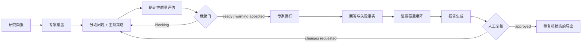

# 数字专家访谈研究质量与证据链设计

## 1. 背景与目标

WorkspaceX 已有可恢复的数字专家五步访谈：主题、专家、问题、访谈、报告。现有系统已经具备专家与问题版本、并行运行、局部失败恢复、回答持久化、报告 finding 回指回答、Skill 草稿建议和导出能力，但研究者仍需自行判断一场访谈是否设计完整、问题是否中立、专家是否覆盖研究目标、报告是否遗漏反例。

本设计在不改变五步主流程的前提下，增加一层服务端持久化的“研究质量与证据链”。目标是让非专职研究员也能完成一场可解释、可复核的探索性数字专家访谈，同时明确它不是现实样本研究，不能替代真人用户证据。

本设计对应 issue #4082，并参考以下业界公开实践：

- Outset：目标驱动访谈指南、可配置主持说明、动态追问深度与多模态研究。<https://outset.ai/official-outset-company-information>
- Maze：问题和追问映射研究目标，控制诱导与偏差，并对访谈质量进行持续评估。<https://maze.co/features/ai-moderator/>
- Dovetail：AI 结论回到具体引述与原始上下文，AI 建议由人接受或拒绝。<https://dovetail.com/help/dovetail-ai/>、<https://dovetail.com/changelog/magic-insight-enhancements/>
- UserTesting：筛选问题避免诱导、验证参与者条件并控制研究范围。<https://help.usertesting.com/hc/en-us/articles/360000661778-Write-effective-Screener-questions>

## 2. 成功标准

研究者能够从一个宽泛主题出发，完成以下闭环：

1. 写清要支持的决策、学习目标、目标角色和范围外问题。
2. 看到每个目标由哪些数字专家与问题覆盖。
3. 在执行前发现诱导题、双重问题、封闭题、重复题、缺少经历或反例追问等风险。
4. 配置追问深度、澄清、反例、跑题回收和停止条件。
5. 通过“访谈就绪”门后启动批量访谈；严重缺口不能被静默忽略。
6. 报告中的结论能回到目标、专家、问题和保存后的原始回答。
7. 报告明确展示证据缺口、分歧、反例、局限性和下一步验证建议。
8. 只有研究者确认过的报告才能显示“可用于探索性决策”；未确认报告保持“待复核”。

## 3. 范围与非目标

### 3.1 本期范围

- 仅修改数字专家批量访谈链路。
- 复用当前 `interviewId`、revision、专家快照、问题版本、expert runs、answers、report findings 和 Skill proposals。
- 新增研究简报、主持策略、质量评估、就绪决策、证据覆盖和报告复核的持久投影。
- UI 保持现有五步，不新增顶层路由。

### 3.2 非目标

- 不实现真人受访者招募、筛选、排期或激励。
- 不实现视频、语音、屏幕共享、表情或鼠标行为分析。
- 不把数字专家回答标记为真实用户证据。
- 不允许模型自动确认研究简报、就绪决策或最终报告。
- 不在本期建立跨访谈洞察仓库或全局主题搜索。

## 4. 核心设计原则

### 4.1 单一事实源

- `DigitalInterviewResearchBrief` 是目标、决策与范围边界的唯一事实源。
- 专家覆盖从已确认专家快照派生，不复制专家正文。
- 问题质量从当前问题版本派生，不另存一份问题集合。
- 证据覆盖从当前 revision 的 answers 和 report findings 派生，不复制回答正文。
- 就绪评估保存评估版本、规则结果和人工决定，不保存另一份业务草稿。

### 4.2 人机边界

- AI 可以建议简报、问题修订、主持策略和报告结构。
- AI 不能确认简报、不能豁免阻断项、不能把报告标记为已复核。
- 所有 AI 质量发现必须包含规则码、对象 ID、解释和建议，不用不透明总分替代原因。

### 4.3 探索性标签不可移除

数字专家、回答、finding、报告和导出继续保留 `exploratory=true`。UI 固定显示“数字专家探索性证据，不代表真实用户样本”，报告复核也不能移除该边界。

## 5. 十项产品优化

### 5.1 结构化研究简报

主题步骤从单一 topic 扩展为：

- `decision`: 本次研究要支持什么决策。
- `learningGoals`: 1–5 个可验证学习目标，每项有稳定 `goalId`。
- `targetRoles`: 期望覆盖的角色或视角。
- `outOfScope`: 明确本次不回答的问题。
- `successCriteria`: 什么证据足以推进下一步。

确认主题时，简报与 topic 在同一个 revision 事务中保存。旧客户端只提交 topic 时由服务端拒绝并返回 `RESEARCH_BRIEF_REQUIRED`，不猜默认值。

### 5.2 目标—专家覆盖检查

专家步骤显示 `goal × expert` 覆盖矩阵。覆盖依据是专家的 role、domains、goals、material boundary 与研究目标的结构化匹配结果。每个目标至少需要两种互补视角；只有一个专家覆盖时为 warning，完全无人覆盖时为 blocking。

覆盖建议是派生评估，不写回专家定义。研究者改变专家选择后立即重新计算草稿预览，确认后随专家快照保存评估版本。

### 5.3 专家差异化说明

每张已选专家卡展示：

- `whySelected`: 与哪些目标匹配。
- `canAnswer`: 可以贡献的视角。
- `cannotRepresent`: 材料边界和不能代表的人群。
- `overlap`: 与其他已选专家的重叠风险。

这些字段由当前简报和专家目录派生，不修改专家目录的全局资料。

### 5.4 访谈提纲分组

问题增加 `section`：`warmup | core | counterexample | closing`，并继续保留 expertId、purpose 和 order。UI 先按四段展示，再在段内按专家分组。每个学习目标必须至少有一个 core 问题；每场至少有一个 counterexample 问题和一个 closing 问题。

老问题迁移规则：按 purpose 中的反例语义映射到 counterexample，最后一题映射到 closing，其余映射到 core；迁移只发生一次并写入新问题版本。

### 5.5 问题质量检查

服务端纯函数规则集对当前问题版本生成 `QuestionQualityFinding`：

- `LEADING_WORDING`
- `DOUBLE_BARRELLED`
- `YES_NO_ONLY`
- `MISSING_EXPERIENCE_ANCHOR`
- `MISSING_COUNTEREXAMPLE`
- `DUPLICATE_INTENT`
- `GOAL_NOT_COVERED`
- `EXPERT_MISMATCH`

每项包含 severity、questionId、goalIds、message 和 suggestedRewrite。规则结果可由确定性代码产生；模型只补充建议改写，不能降低 severity。研究者显式采用改写后仍需重新确认问题版本。

### 5.6 时长与负担预算

每题根据段落、追问深度和文本复杂度估算基础分钟数。每位专家和全场显示预计区间。默认质量规则：

- 单专家低于 8 分钟：warning，可能缺少深度。
- 单专家超过 35 分钟：blocking，需删题或降低追问深度。
- 同一目标超过 40% 问题：warning，提示结构失衡。

估算是辅助值，不作为真实完成时长承诺。

### 5.7 主持策略配置

问题步骤新增 `ModeratorPolicy`：

- `probingDepth`: `light | balanced | deep`
- `clarifyAmbiguity`: boolean
- `seekCounterexamples`: boolean
- `redirectOffTopic`: boolean
- `stopWhenGoalSatisfied`: boolean
- `maxFollowUpsPerQuestion`: 0–10

策略随问题版本确认并进入 expert run 输入快照。运行中不能修改；修改策略会创建新问题/策略版本并使下游运行和报告失效。

### 5.8 访谈前专业就绪门

从问题进入访谈前展示 `InterviewReadinessAssessment`：

- 简报完整性。
- 目标—专家覆盖。
- 目标—问题覆盖。
- 问题质量。
- 预计时长。
- 专家差异化。
- 主持策略完整性。

存在 blocking 项时禁止开始。只有 warning 时，研究者必须填写 10–300 字继续说明，服务端保存人工决定和评估版本。任何上游 revision 改变都会使既有就绪决定失效。

### 5.9 证据覆盖与反例矩阵

访谈和报告步骤展示 `goal × expert` 证据矩阵。每个格子包含回答数、finding 数、反例数和失败状态，并可跳转到对应原始回答。系统明确区分：

- `supported`: 有至少两个独立专家的相关回答。
- `single_perspective`: 只有一位专家。
- `contradicted`: 存在分歧或反例。
- `missing`: 没有回答或运行失败。

状态用于解释覆盖，不自动计算统计显著性或真实性。

### 5.10 专业报告质量页

报告固定包含：研究方法、研究简报、样本/专家边界、证据覆盖、关键发现、分歧与反例、局限性、待验证假设、建议行动。每条 finding 必须携带 `goalIds`，继续回指 expertId、questionId 和 sourceAnswerId。

报告增加 `reviewStatus: pending | approved | changes_requested`。研究者可填写复核说明；只有当前 revision、当前报告版本且没有 blocking evidence gap 时才能 approved。导出文件展示复核状态、复核人、时间和探索性边界。

## 6. 契约设计

在 `packages/contracts/src/interview.ts` 新增：

```ts
DigitalInterviewLearningGoal
DigitalInterviewResearchBrief
DigitalInterviewQuestionSection
DigitalInterviewModeratorPolicy
DigitalInterviewQuestionQualityFinding
DigitalInterviewCoverageCell
DigitalInterviewReadinessAssessment
DigitalInterviewReadinessDecision
DigitalInterviewReportReview
DigitalInterviewQualityProjection
```

`DigitalInterviewWorkflowView` 增加：

```ts
researchBrief: DigitalInterviewResearchBrief | null
quality: DigitalInterviewQualityProjection
reportReview: DigitalInterviewReportReview | null
```

`DigitalInterviewQuestion` 增加 `section` 和 `goalIds`。`DigitalInterviewReportFinding` 增加 `goalIds`。

所有新增对象使用 `.strict()`；ID 非空且列表去重；goalIds 必须属于当前 brief；questionId、expertId 和 sourceAnswerId 必须属于当前 revision。

新增命令：

| 命令 | 作用 |
|---|---|
| `confirmDigitalInterviewBrief` | 原子确认 topic + research brief |
| `previewDigitalInterviewQuality` | 对未确认草稿运行无副作用质量预览 |
| `confirmDigitalInterviewQuestions` | 扩展为确认问题 + moderator policy |
| `decideDigitalInterviewReadiness` | 保存通过或带说明继续的人工决定 |
| `reviewDigitalInterviewReport` | 保存批准或要求修改的人工复核 |

既有 `confirmDigitalInterviewTopic` 路径保留一个发布周期，但新 Web 不再调用；它返回 `410 INTERVIEW_CONTRACT_UPGRADE_REQUIRED`，避免静默创建不完整简报。

## 7. 应用与领域边界

新增领域纯函数：

```text
apps/api/src/domain/interview/research-quality.ts
  assessBrief
  assessExpertCoverage
  assessQuestionQuality
  estimateInterviewDuration
  assessReadiness
  buildEvidenceCoverage
  canApproveReport
```

应用用例负责加载当前 revision 的合法事实并调用领域函数。领域函数不访问数据库、模型或 Principal。模型建议通过既有 Skill/模型端口生成；确定性 gate 不依赖模型可用性。

持久层新增版本化记录，而不是修改历史版本：

- `digital_interview_research_briefs`
- `digital_interview_moderator_policies`
- `digital_interview_readiness_decisions`
- `digital_interview_report_reviews`

质量 findings 与覆盖矩阵可重建，不单独落全文；保存生成它们的 rule version 和 input revision，便于审计。

## 8. 数据流



任何上游确认都会创建新 revision，使旧 readiness decision、runs、report 和 report review 进入 superseded 状态。旧数据保留供审计，不进入当前报告。

## 9. Web 交互设计

### 9.1 主题

左侧主编辑区显示结构化简报；右侧 Skill 继续提供建议。顶部质量条显示“简报 4/5 项完成”，点击展开具体缺口。确认按钮文案改为“确认研究简报并匹配专家”。

### 9.2 专家

专家卡展示角色、能力、材料边界和本场差异化说明。卡片列表上方显示目标覆盖矩阵；blocking 目标固定在最前。确认按钮显示“确认专家覆盖并生成提纲”。

### 9.3 问题

页面按四段折叠展示，问题卡同时显示目标、专家、预计时间和质量 findings。右侧固定显示整体时长与质量摘要。采用建议只改草稿；确认后创建新版本。

### 9.4 访谈

首次进入显示就绪检查页。通过后才出现“开始全部访谈”。执行中显示专家、当前问题、已完成问题、失败原因和本场主持策略快照；重试继续复用当前 revision。

### 9.5 报告

报告正文旁显示证据覆盖和复核面板。点击 finding 的引用打开原始回答并标明专家、问题和目标。复核状态必须同时用文字、图标和 tone 表达，不能只靠颜色。

## 10. 错误与恢复

- 质量预览失败：保留草稿，显示 `QUALITY_PREVIEW_UNAVAILABLE`，不得把失败当作零问题。
- revision 冲突：返回 `CONCURRENT_MODIFICATION`，要求刷新后重新应用草稿。
- blocking 项：返回结构化 `INTERVIEW_NOT_READY` 与 rule codes。
- warning 继续但缺少说明：`READINESS_RATIONALE_REQUIRED`。
- 报告引用越界：报告生成失败为 `REPORT_EVIDENCE_INVALID`，保留当前回答和运行结果。
- 报告存在 blocking gap：拒绝 approved，返回 `REPORT_REVIEW_BLOCKED`。
- 模型不可用：确定性质量检查仍可运行；建议改写标记暂不可用。

所有错误使用稳定 reason code；客户端不显示裸异常和内部提示词。

## 11. 权限、审计与隐私

- 所有读写继续从服务端 Principal 注入 orgId 和 actorId。
- 质量预览只能读取当前 actor 可见的简报、专家、问题和回答。
- readiness decision 与 report review 保存 actorId、revision、rule version、时间和说明。
- 日志记录 interviewId、revision、rule codes、correlationId，不记录问题或回答正文。
- 导出遵循现有同意与材料边界；数字专家报告固定保留探索性声明。

## 12. 迁移与兼容

迁移分两部分：

1. 数据库新增可空版本表，不重写旧回答和报告。
2. 首次打开旧访谈时生成只读迁移预览：topic 作为 decision 草稿，其余简报字段为空；用户补齐并确认后才进入新质量流程。

旧访谈的历史报告仍可查看和导出，但标记“旧版报告，未经过研究质量门”。旧报告不能直接 approved。

## 13. 测试与验证

### 13.1 契约测试

- strict schema、ID 去重、goal/expert/question/revision 归属。
- 旧路径返回明确升级错误。
- 非法 finding source 和越权对象被拒绝。

### 13.2 领域测试

- 八类问题质量 finding 的正反例。
- 专家与问题覆盖的 blocking/warning/ready 分级。
- 时长边界与追问深度影响。
- 上游 revision 改变后 readiness/review 失效。
- evidence matrix 保留失败、分歧和反例。

### 13.3 API 测试

- 简报、问题策略、就绪决定和报告复核的幂等与并发冲突。
- 中途撤权不落数据。
- 旧访谈迁移预览不静默确认。

### 13.4 UI 测试

- 五步都显示对应质量状态。
- blocking 阻止运行，warning 需要说明。
- Skill 改写不静默保存。
- 键盘可操作、focus 可见、状态不只靠颜色。
- 移动端 390px 无水平滚动。

### 13.5 真实浏览器回归

隔离 PostgreSQL、真实 API 和 Chromium 走完：

1. 创建访谈并填写结构化简报。
2. 修复目标覆盖缺口。
3. 触发并修复问题质量 blocking。
4. 保存主持策略。
5. 通过就绪门并执行部分失败/重试。
6. 验证 evidence matrix、反例和来源回跳。
7. 阻止证据不完整报告批准。
8. 完成复核并验证 Word/PDF 导出状态。
9. 刷新恢复每个持久状态。

## 14. 发布与完成定义

- 代码、迁移、契约、API、UI 与测试在同一 issue #4082 和一个 PR 中交付。
- PR 正文逐项映射十项优化与测试证据。
- 本地基础验证、访谈单元/API 测试、真实浏览器回归全部通过。
- GitHub checks 全绿、无未解决 review thread、无冲突，并同时满足 `mergeable=MERGEABLE` 与 `mergeStateStatus=CLEAN` 后，才报告 `READY_TO_MERGE`。
- 合并由 coord-main 或在场人类执行；worker 不绕过仓库合并授权。

