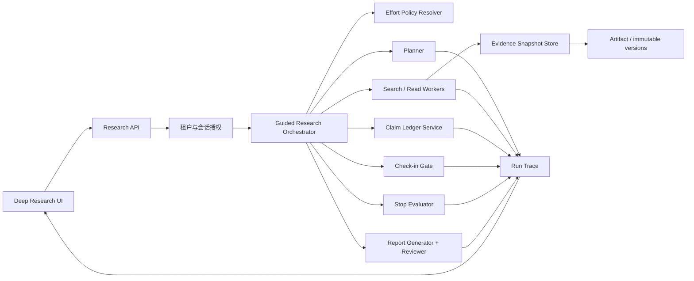
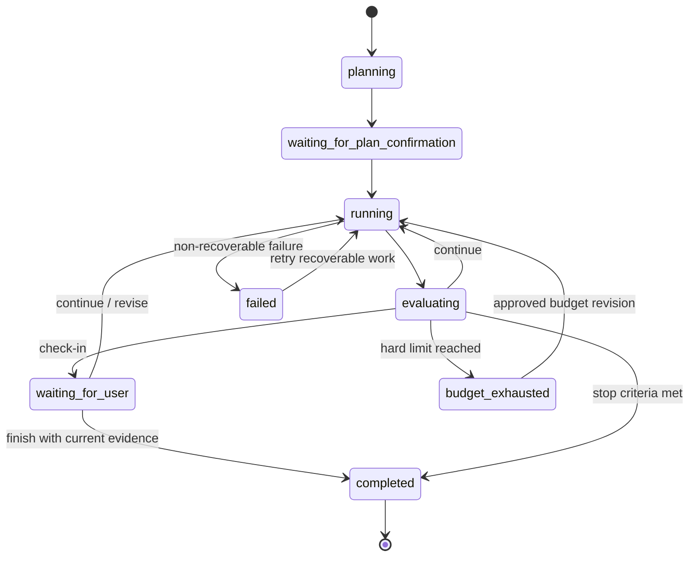

# 可信长时研究控制面设计

## 1. 决策摘要

WorkspaceX 保留两条独立产品工作流：

- **Deep Research** 面向网页、组织材料和结构化数据的长时研究。
- **User Research** 面向研究设计、参与者、访谈材料和跨样本发现。

两条工作流不合并页面、步骤或领域对象，但共享一个**可信研究内核**：投入预算、来源快照、
证据定位、Claim Ledger、人工 check-in、停止判据、执行轨迹与质量门。

第一阶段只升级 Deep Research 的长时研究控制面；User Research 在自身研究方法、招募和访谈
契约完成后复用共享原语。此顺序避免把网页检索结果、模拟 Persona 和真人访谈证据混为同一种
“来源”，同时先解决当前实现里最明显的可信度与自治性缺口。

## 2. 背景

当前引导式研究已经具备以下真实能力：

- Brief、研究方向、报告大纲和 Research Plan 的人工确认。
- 按章节生成检索任务，保存任务、来源、失败和重试状态。
- 对来源摘录做逐问题证据提取，逐字校验证据确实存在于输入摘录。
- 按章节生成报告并独立复核问题覆盖、证据支持和分析深度。
- 失败恢复、报告 checkpoint、流式进度、来源引用、PDF/Word 导出和历史报告保留。

现有实现的问题不是“没有 Deep Research”，而是缺少一层让用户理解并控制研究投入、可信度和
停止原因的控制面：

1. `fast / std / deep` 已存在于旧研究配置契约，但引导式运行时没有把它解析成可审计的执行预算。
2. Research Plan 能规划任务，却没有保存“允许花多少时间、调用、来源和成本”的不可变预算快照。
3. 长任务只有固定节点确认，没有用户自定义的中途 check-in。
4. 报告已经逐问题核验证据，但没有独立的 Claim Ledger 表达结论、支持证据、反证和未决缺口。
5. 来源保存 URL 与检索摘录，尚不足以证明未来打开同一 URL 时看到的仍是当时内容。
6. 执行完成主要由任务耗尽决定，而不是由问题覆盖、冲突和新增信息收益共同决定。
7. 阶段原型仍混有“演示来源/演示报告”，容易让人把原型状态误认成正式运行事实。

## 3. 竞品事实与可借鉴原则

本设计只采用一手产品资料中能够落成产品契约的模式，不使用融资规模作为产品判断依据。

### 3.1 Exa

可借鉴：把复杂任务拆为多个子任务并行研究；结构化返回；根据任务用不同成本的模型与搜索能力。

不照搬：Exa 更接近搜索与研究 API 基础设施，不替 WorkspaceX 决定研究项目、人工确认和组织内
证据治理。

### 3.2 Webhound

可借鉴：把 effort budget 作为研究的一等输入；后台运行；分步预算；中途 check-in；保留工作文档、
来源和运行轨迹；更高投入必须能解释新增证据和决策价值。

这是本阶段最直接的产品参照。

### 3.3 Rhizome

可借鉴：主来源优先；每个事实可回到具体证据位置；清楚暴露资料库缺口；高来源数量不是可信度
本身，能否逐条核验才是。

不照搬：“最多 1,000 份文档”不是目标指标。WorkspaceX 不以固定来源数制造深度感。

### 3.4 Conveo 与 Outset

可借鉴：研究目标驱动的研究设计、参与者配额、AI 主持的自适应追问、跨访谈综合、研究库复用和
面向利益相关者的汇报产物。

边界：这些能力属于 User Research。Deep Research 只提供共享的预算、证据、Claim Ledger 和质量
原语，不引入参与者、招募、视频访谈或饱和度的领域对象。

### 3.5 Aster

可借鉴：planner / worker / evaluator 分工、并行探索、把中间学习回流给规划器。

不照搬：千级 Agent 和科学实验搜索不进入本阶段。当前瓶颈是可信控制面，而非并行数量。

## 4. 目标与非目标

### 4.1 目标

1. 用户在启动前选择研究投入档位，并能看到它会约束哪些资源。
2. 服务端把所选档位解析为不可变预算快照，运行、恢复和审计始终引用同一快照。
3. Research Plan 明确说明每个任务服务于哪个研究问题、假设、来源策略和证据缺口。
4. 用户可以设置一个或多个中途 check-in；系统到达检查点必须暂停，不得擅自继续高成本步骤。
5. 系统用 Claim Ledger 管理关键结论、支持证据、反证、置信状态和待验证缺口。
6. 被报告正式引用的网页证据具备可重放快照与精确定位，而不仅是 URL。
7. 系统用机械停止判据说明为什么继续、暂停或结束研究。
8. 报告显示研究方法、覆盖率、冲突、限制、预算消耗和执行轨迹。
9. 中断、重试、重新规划和上游重确认不会重复扣费、重复来源或丢失人工排除意图。
10. 共享原语能在后续被 User Research 使用，但不会让两条工作流串读或混淆证据类型。

### 4.2 非目标

- 本阶段不实现参与者招募、样本配额、真人或 AI 主持访谈。
- 不把模拟 Persona 的回答当作真实用户证据。
- 不接入千级 Agent，也不以 Agent 数量作为质量指标。
- 不承诺固定来源数量、固定运行时长或固定成本；具体额度由服务端预算策略的单一事实源决定。
- 不让模型自行创建 URL、来源 ID、证据定位或预算消耗记录。
- 不用来源数量替代问题覆盖、反证和证据质量。
- 不在同一个 feature/PR 中交付整个设计。
- 不在本设计阶段修改现有 phase 的签核状态、feature 状态或 evidence 字段。

## 5. 架构边界



边界原则：

- `packages/contracts` 是公开 API 形状的单一事实源。
- 预算策略的具体额度只有一个服务端配置来源；契约只保存策略 ID、版本和解析后的快照。
- Orchestrator 决定控制流，不把预算、停止或 check-in 逻辑复制到前端。
- Search/Read Worker 只返回候选资料和抓取结果，不生成正式结论。
- Claim Ledger Service 只接受已保存证据引用，不接受模型编造的 URL 或自由文本出处。
- Artifact 模块拥有不可变内容版本和哈希；Research 保存对 Artifact 版本的引用。
- Report Generator 只消费已通过验证的 Claim Ledger 投影和明确的 evidence gap。
- User Research 将来复用共享类型时，通过独立 `workflowType` 和证据种类隔离数据。

## 6. 核心领域模型

以下为设计语义。实现时以 `packages/contracts` 中的 schema 为唯一可执行事实源。

### 6.1 EffortPolicy 与 EffortBudgetSnapshot

用户只选择稳定语义档位：`fast | std | deep`。客户端不能提交任意成本上限来扩大权限。

```ts
interface EffortBudgetSnapshot {
  policyId: string;
  policyVersion: string;
  tier: "fast" | "std" | "deep";
  maxWallClockMs: number;
  maxSearchTasks: number;
  maxSearchAttempts: number;
  maxAcceptedSources: number;
  maxModelCalls: number;
  maxEstimatedCostMinor: number | null;
  concurrency: number;
  resolvedAt: string;
}
```

不变量：

- 一次 run 的预算快照创建后不可变。
- 恢复和重试继续消耗原快照的剩余额度。
- 用户若升级档位，创建新的预算 revision 并留下旧快照，不原地改写历史。
- 所有消耗由服务端事件累计；模型声明“花了多少”没有权威性。
- 达到任一硬上限时进入 `budget_exhausted`，不得静默超支。

### 6.2 ResearchStrategy

```ts
interface ResearchStrategy {
  preferredSourceClasses: SourceClass[];
  primarySourceRequired: boolean;
  recency?: { from?: string; to?: string };
  geographies: string[];
  languages: string[];
  contradictionRequired: boolean;
  domainAllowlist: string[];
  domainBlocklist: string[];
}
```

`SourceClass` 的闭集必须在契约单源中定义。至少能区分官方/监管、一手组织材料、学术论文、行业
资料、新闻媒体、用户提供材料和内部知识；具体枚举在契约签核时确定，不在 UI、prompt 和数据库
迁移中分别维护副本。

### 6.3 ResearchTask

每个任务必须能回答“为什么要做”和“完成如何判定”。

```ts
interface ResearchTask {
  id: string;
  sectionId: string;
  questionIds: string[];
  hypothesisIds: string[];
  objective: string;
  queries: string[];
  desiredSourceClasses: SourceClass[];
  expectedEvidence: string;
  stopWhen: string;
  status: "pending" | "running" | "paused" | "succeeded" | "failed" | "skipped";
}
```

任务的 `stopWhen` 是给停止评估器的结构化意图，不是允许模型自行宣布完成的自由文本开关。

### 6.4 EvidenceSnapshot

```ts
interface EvidenceSnapshot {
  id: string;
  sourceUrl: string;
  canonicalUrl: string;
  artifactVersionId: string;
  contentHash: string;
  retrievedAt: string;
  title: string;
  publisher: string | null;
  publishedAt: string | null;
  sourceClass: SourceClass;
  locatorKind: "html_selector" | "text_quote" | "pdf_page" | "document_range";
  locator: string;
  quote: string;
}
```

不变量：

- 报告正式引用必须指向 `artifactVersionId + locator + quote`。
- `quote` 必须能在不可变版本中重新定位并逐字验证。
- URL 变化、网页下线或后续内容更新不改变历史证据。
- 抓取失败或受 robots、登录、地区限制影响时记录限制，不伪装成完整页面读取。
- 搜索结果摘要只能用于发现和筛选，不能直接升级为正式证据；只有实际读取并快照后才能引用。

### 6.5 Claim Ledger

```ts
interface ResearchClaim {
  id: string;
  sectionId: string;
  questionIds: string[];
  text: string;
  status: "candidate" | "supported" | "contested" | "gap" | "rejected";
  confidence: "low" | "medium" | "high" | null;
  supportingEvidenceIds: string[];
  contradictingEvidenceIds: string[];
  limitations: string[];
  verificationNeeded: string[];
  derivedByModelCallId: string;
  reviewedAt: string | null;
}
```

不变量：

- `supported` 至少有一条直接证据；只有背景资料时不能升级为 supported。
- 存在未解决的直接反证时必须为 `contested`，不得靠多数来源自动压掉少数反证。
- `gap` 不得携带伪装为支持证据的无关引用。
- confidence 是证据覆盖与冲突状态的派生结果；不允许模型单独给一个数字成为权威。
- 报告中的事实性结论必须能映射到 Claim Ledger；叙事连接句可不单独建 claim，但不得引入新事实。

### 6.6 CheckIn

```ts
interface ResearchCheckIn {
  id: string;
  runId: string;
  trigger:
    | { kind: "after_stage"; stage: string }
    | { kind: "before_budget_fraction"; numerator: number; denominator: number }
    | { kind: "before_task_class"; taskClass: string };
  prompt: string;
  status: "scheduled" | "waiting" | "resolved" | "cancelled";
  summaryClaimIds: string[];
  optionIds: string[];
  selectedOptionId: string | null;
  userMessage: string | null;
  resolvedBy: string | null;
  resolvedAt: string | null;
}
```

到达 check-in 后，运行状态必须从 `running` 转为 `waiting_for_user`。后台 worker 完成已领取的小任务后
不得再领取新任务，直到用户继续、调整方向或结束研究。

### 6.7 StopEvaluation

```ts
interface StopEvaluation {
  id: string;
  round: number;
  decision: "continue" | "pause_for_checkin" | "complete" | "budget_exhausted";
  questionCoverage: Array<{ questionId: string; state: "supported" | "contested" | "gap" }>;
  unresolvedCriticalClaims: string[];
  newEvidenceYield: number;
  reasonCodes: string[];
  evaluatedAt: string;
}
```

停止评估必须先跑确定性门控，再允许模型对“是否值得继续”给结构化建议：

1. 达到预算硬上限 → `budget_exhausted`。
2. 到达待处理 check-in → `pause_for_checkin`。
3. 仍有未执行的关键任务或关键问题完全无直接证据 → 默认继续，除非预算不足。
4. 关键问题已被支持、明确争议或诚实标记为 gap，且连续轮次新增证据收益低 → 可以完成。
5. 模型建议必须通过 schema，并保存输入的 Claim Ledger revision；它不能绕过前四条。

“连续轮次”和“低收益”的具体阈值由预算策略单源管理，不能散落在 prompt 与前端文案中。

## 7. 运行状态机



状态要求：

- 每个转换都写 append-only run event。
- `waiting_for_user`、`budget_exhausted`、`failed` 和 `completed` 都是可恢复稳定态。
- API 重放同一 `requestId` 不得重复执行或重复计费。
- 上游 Brief/方向/大纲重确认创建新 revision；旧 Claim Ledger、预算与报告保留为历史，不能被覆写。
- 已排除来源保持排除；重新规划不得把它静默加入。

## 8. 数据流

### 8.1 启动

1. 用户确认 Brief、研究方向和大纲。
2. 用户选择 effort tier、来源策略与可选 check-in。
3. API 校验授权和输入，从策略单源解析预算快照。
4. Planner 生成任务，服务端校验每个启用章节和研究问题都有任务覆盖。
5. UI 展示计划、预算、预计证据类型、check-in 与限制；用户确认后才启动。

### 8.2 检索与阅读

1. Orchestrator 在并发额度内领取任务。
2. Search Worker 发现候选 URL；去重、域策略和历史排除在服务端执行。
3. Read Worker 实际读取候选内容并创建不可变 Artifact 版本。
4. Evidence extractor 只从已读取快照提取逐字证据及 locator。
5. Claim Ledger Service 根据研究问题更新 candidate claim、证据和反证。
6. 每轮结束运行 Stop Evaluator；继续、暂停或结束均产生可解释事件。

### 8.3 Check-in

UI 显示：

- 已覆盖、争议和缺口问题；
- 本轮新增证据与关键变化；
- 已用/剩余预算；
- 下一阶段准备做什么及其预估成本；
- `继续`、`调整方向`、`提前完成` 三类显式动作。

调整方向创建 Research Plan revision，并将受影响任务标为 superseded；已经产生的证据和 claims 仍可
审计，不从历史中删除。

### 8.4 报告

报告只消费当前 revision 的 Claim Ledger：

- `supported` 作为可陈述结论；
- `contested` 必须同时呈现冲突双方及未决原因；
- `gap` 必须呈现缺口、决策影响和下一步验证；
- `candidate/rejected` 不进入正式结论。

报告头部展示方法摘要、预算消耗、来源覆盖、主要限制和完成原因。正文引用点击后打开固定快照的
精确定位，原 URL 作为辅助链接，而不是唯一证据载体。

## 9. UI 设计

### 9.1 创建与计划确认

在现有 Brief/方向/大纲之后增加“研究投入与验证策略”，不新增独立顶级模块：

- 三档投入卡：快速、标准、深挖；展示相对投入和适用场景，不在前端硬编码服务端具体额度。
- 来源策略：主来源优先、时间范围、地域、语言、允许/排除域、必须查找反证。
- Check-in：关闭、建议节点、用户自定义节点。
- 计划确认页展示服务端解析后的真实预算快照和任务覆盖，不展示拍脑袋的固定“预计 20–30 来源”。

### 9.2 运行视图

在现有任务与来源进度上增加三个稳定区域：

- **预算与时间**：已用/剩余、当前并发、预计下一动作。
- **问题与 Claim Ledger**：支持、争议、缺口，可按章节过滤。
- **运行决策**：最近一次停止评估、即将到达的 check-in、失败与恢复动作。

用户可以离开页面；恢复必须读取服务端事实，不依赖 localStorage。

### 9.3 Check-in 视图

Check-in 是阻塞态而不是普通通知。主动作是“继续执行”，次动作是“调整计划”和“以当前证据完成”。
所有动作说明后果和剩余预算。未授权角色只读，不显示可写动作。

### 9.4 报告视图

保留全宽阅读模式，增加：

- 方法与范围；
- 完成原因；
- Claim 覆盖概览；
- 冲突与证据缺口；
- 预算消耗和运行轨迹入口；
- 引用定位与固定快照入口。

正式运行界面不得出现“演示来源”“演示报告”等容易误导用户的文案。Demo fixture 只能在显式测试或
预览入口使用，并醒目标明非真实研究结果。

## 10. API 与契约方向

具体路径在契约设计阶段确定，但能力面至少包括：

- 创建/读取预算快照；
- 保存来源策略和 check-in；
- 读取运行摘要与预算消耗；
- 读取 Claim Ledger；
- 处理 check-in；
- 读取 StopEvaluation 历史；
- 读取 EvidenceSnapshot 定位；
- 基于原预算恢复，或由授权用户创建预算 revision。

所有写操作必须包含：

- `sessionId`；
- `requestId` 幂等键；
- `expectedVersion` 乐观并发版本；
- 服务端从身份上下文取得的组织与操作者，禁止客户端自报成为权威。

公开错误至少需要区分以下补救路径：

- 预算耗尽；
- 正在等待人工 check-in；
- 计划版本冲突；
- 来源读取失败；
- 快照或定位校验失败；
- 证据不足；
- 存在未解决反证；
- 运行不可恢复；
- 跨 workflow 或跨组织访问。

错误码闭集和共享归属在契约设计时落单一事实源，本设计不提前复制枚举。

## 11. User Research 复用边界

User Research 后续可复用：

- EffortBudgetSnapshot；
- EvidenceSnapshot 与 Artifact 版本；
- Claim Ledger 的支持/反证/缺口语义；
- CheckIn 和运行事件；
- StopEvaluation 的可解释决策框架。

User Research 必须自己拥有：

- Study、Participant、Recruitment、Quota、Consent、InterviewSession；
- 访谈提纲、跳题/追问规则与非诱导检查；
- 音视频、逐字稿、时间码和撤回链；
- 参与者级证据与跨样本主题；
- 饱和度、少数意见和样本偏差；
- 真人、合成 Persona 和内部专家来源的显式区分。

隔离规则：

- `workflowType=deep_research` 与 `workflowType=user_research` 永不串读会话和投影。
- 合成 Persona 的回答不得成为 `human_participant` 证据，也不得生成“真实用户验证”结论。
- 共享 Claim Ledger 只共享形状和规则，不共享未经授权的内容或可见范围。

## 12. 失败、恢复与安全

- provider/search/read 失败只影响关联任务；已完成任务、来源、claims 和消耗不可回滚成“未发生”。
- worker 在持久化领取记录后才调用外部服务；进程崩溃后 running 任务转 interrupted，再按幂等键恢复。
- 预算计量和外部调用 receipt 同事务或通过可重放 outbox 连接，避免调用成功但消耗丢失。
- prompt 将网页、文件、模型旧输出和用户提供材料视为不可信数据，防止来源内容注入控制指令。
- 快照遵循组织权限、来源可见性和撤回链；Research 不复制另一套 ACL。
- 报告引用的权限取报告和来源中更严格者。
- 删除首页条目不删除运行、证据、引用或审计记录；销毁由资产治理和保留策略负责。

## 13. 可观测性

每次 run 至少可查询：

- 预算解析、消耗和耗尽原因；
- planner 版本、任务 revision 和 worker receipt；
- 搜索、实际读取、快照、证据提取各阶段数量；
- 来源类型、去重、排除和失败原因；
- claims 的状态变化及其证据 revision；
- check-in 等待时间和处理动作；
- 每轮 stop decision 及 reason codes；
- 报告章节审查、修复和未通过警告；
- 模型、工具和策略版本，不记录密钥和不必要的敏感正文。

核心产品指标不使用“来源越多越好”，而使用：

- 关键问题直接证据覆盖率；
- contested/gap 的诚实暴露率；
- 正式 claim 的可重放引用率；
- 人工 check-in 后被调整或提前停止的比例；
- 更高预算带来的新增关键证据收益；
- 恢复后重复外部调用率。

## 14. 迁移与兼容

1. 旧会话没有预算快照时，以 `legacy` 策略生成只读迁移快照，不伪造历史消耗。
2. 旧来源没有 Artifact 版本和 locator 时标记 `legacy_unfrozen`，仍可查看但不满足新的正式引用门。
3. 旧报告继续可读，不回写成“已通过新 Claim Ledger 验证”。
4. 新功能用服务端 capability/version 判断，不靠前端猜数据库列是否存在。
5. 新 run 只走新契约；不长期维护两套新建路径。
6. Demo 数据与正式 API fixture 分离，迁移不能把 demo 来源写入生产研究。

## 15. 实施切片

正式 feature ID 和 verification 在需求/契约阶段生成。建议按以下纵向切片串行交付，每个切片一个
issue、一个 PR：

1. **预算快照与运行摘要**：契约、策略解析、持久化、恢复、UI 计划确认。
2. **来源快照与定位**：Artifact 版本、locator、逐字回放、权限和旧来源兼容。
3. **Claim Ledger**：证据/反证/缺口、确定性状态门、运行 UI。
4. **Check-in Gate**：计划设置、后台暂停、继续/调整/提前完成、通知与恢复。
5. **停止评估**：覆盖与新增信息收益、预算耗尽、解释性 reason codes。
6. **可信报告投影**：方法、覆盖、冲突、限制、完成原因、快照引用。
7. **User Research 适配设计**：只做独立的领域契约和复用映射，不在 Deep Research PR 中夹带。

依赖顺序为 1 → 2 → 3 → 4/5 → 6；4 与 5 可在 Claim Ledger 稳定后分别实现。第 7 项需要 User
Research 的三件签核单独完成。

## 16. 验证策略

### 16.1 契约与领域单测

- 任一 tier 都由服务端解析成合法预算快照。
- 同一 run 恢复后预算不重置；升级产生 revision 而非覆盖。
- 跨 workflow、跨组织和旧 expectedVersion 写入被拒绝。
- supported/contested/gap 的状态门不能由模型自由文本绕过。
- 正式证据必须能在固定 Artifact 版本按 locator 逐字回放。
- 被排除来源在重试、恢复和重新规划后仍排除。

### 16.2 Orchestrator 集成测试

- 预算耗尽前不会再领取任务。
- check-in 到达后 worker 停止领取新任务，恢复后只执行剩余任务。
- 同一 requestId 和 worker receipt 不产生重复外部调用或重复消耗。
- 关键问题缺直接证据时不会因“来源很多”而完成。
- 存在直接反证时 claim 进入 contested，报告不得只呈现支持方。
- 连续低收益轮次满足策略时产生可解释 complete decision。
- provider、search、read、snapshot 和 persistence 分别失败时保留已完成事实并给出正确补救动作。

### 16.3 UI 测试

- 启动前显示服务端解析后的预算，而非硬编码来源数。
- 运行时预算、Claim Ledger、停止原因与下次 check-in 可见。
- waiting_for_user 是阻塞态，继续、调整、提前完成三条路径均可恢复。
- 报告显示方法、限制、争议、缺口和完成原因。
- 引用能打开固定快照定位；失败时明确说明，而不是退化成无提示外链。
- 正式路径没有演示来源/演示报告文案。

### 16.4 真实端到端证据

至少准备三个固定研究题：

1. 主来源充分、可以正常完成；
2. 来源互相冲突，必须保留 contested claim；
3. 关键资料不可访问，只能诚实生成 gap。

每题分别在 fast/std/deep 中运行，验证更高投入带来的新增证据收益，而非只验证 token 或来源数量
增长。证据包保存计划、预算快照、任务事件、来源快照、Claim Ledger、StopEvaluation 和最终报告。

## 17. 风险与取舍

### 正面后果

- 研究“做了多少”和“为什么停”首次成为可解释产品事实。
- 报告从章节级引用升级到 claim 级可重放证据链。
- 更高预算是否值得可被度量，而非依赖营销式来源数量。
- User Research 能复用可信原语，又不会牺牲研究方法边界。

### 负面后果

- 保存不可变网页快照增加存储、合规和权限治理成本。
- Claim Ledger、预算 receipt 和 run events 会增加写放大与查询复杂度。
- Check-in 会让部分用户感到流程变慢，需要提供合理默认值。
- 动态停止具有策略复杂度；过早停止和无效追加检索都必须进入评测集持续校准。
- 旧报告只能标为 legacy，不能自动获得新可信等级。

### 被否决的方案

1. **把 Deep Research 与 User Research 合并成一个万能工作流**：领域对象、证据语义和质量判据不同，
   会让网页资料、模拟 Persona 和真人访谈相互污染。
2. **先上千 Agent/千来源**：放大现有预算和证据治理缺口，不能证明质量提高。
3. **只改 UI 增加“深度”按钮**：没有服务端预算快照与计量，按钮无法约束真实执行。
4. **只在报告阶段补引用**：事后引用无法修复搜索时未读取原文、缺少快照或遗漏反证的问题。
5. **按固定来源数停止**：不同问题的资料密度差异巨大，固定数会鼓励无关来源填充。

## 18. 设计通过条件

进入实施计划前需确认：

- Deep Research 与 User Research 保持独立工作流；
- 首批实现范围是 Deep Research 的可信长时研究控制面；
- 三档投入由服务端策略解析并保存不可变预算快照；
- 正式引用必须落到不可变来源版本和精确 locator；
- Claim Ledger 是报告事实性结论的输入边界；
- check-in 与机械停止判据属于控制流，而非纯 UI 提示；
- User Research 只在独立契约完成后复用共享原语。

本文件批准后，下一步是使用实施计划流程拆成可执行任务；随后再按仓库的 feature、签核、issue、
独立 worktree、验证和 PR 门禁逐项实施。
