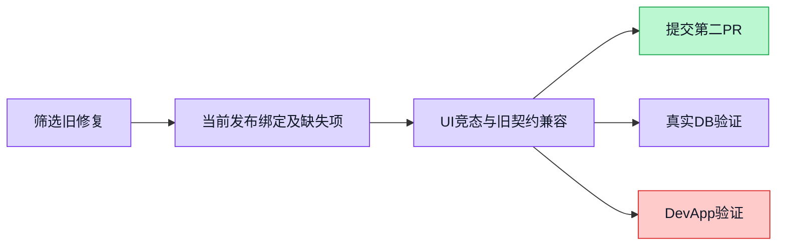

当前发布版本只有固定 Skill pins 时，旧能力图会显示空白；切换 Agent 后旧请求还能覆盖当前结果。本修复读取实例当前发布版本的真实绑定，明确标出未解析与待绑定项，并保护 UI 请求顺序。

Refs #5386

验证：13 API + 16 Web 测试通过，API/Web 全量 TypeScript 通过。证据 docs/testing/capability-graph-followup。后续已在独立合成 PostgreSQL 数据库通过 37 项真实路由及权限传播检查，详情见 ci-repair/README.md。无迁移、授权写入或自动绑定。

排除旧实例编辑器保存修复：main 无对应组件，不能独立移植。角色及文件导出已在 #5385。

