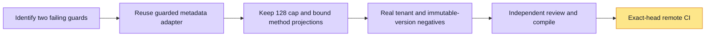

# PR 5389 CI repair

Original head 7058d9a1c failed two guard tests: create-agent-repo-guard still declared every method agents-only, and the new helper increased the permission exemption count above 128.

The exact pin resolver now lives as an exported function in the existing guarded directory repository, shared by the graph adapter. The new helper file and exemption are removed. The original permission-propagation threshold remains 128, unchanged. The existing create repository exemption documents only the narrow graph addition; create/clone/list/instructions-write methods remain agents-only. Guards require the exact graph SELECT projection, current published version + agent + org join, tenant-scoped lookup and metadata-only Skill SELECT projection.

Validation: 28 database-free guard/repository tests passed; 37 real local PostgreSQL/HTTP and permission-propagation tests passed in wsx_capability_5389_ci on the existing workspacex-kernel Docker infrastructure with WORKSPACEX_REUSE_INFRA=1. The new HTTP case resolves only current published same-tenant pins, withholds foreign/unpublished/missing pins, preserves numeric legacy mounts, does not infer historical bindings, discloses no instructions or Skill body, and refuses foreign-agent reads with 404. All data is synthetic. No production calls, grants, deployment, new containers or model calls.

Independent review: 18 passing assertions; adding an extra Skill content column causes the guard to fail as expected. API full lint and TypeScript pass. Web code is unchanged since the prior 16 passing Web checks. Remote exact-head CI remains pending at commit time.

