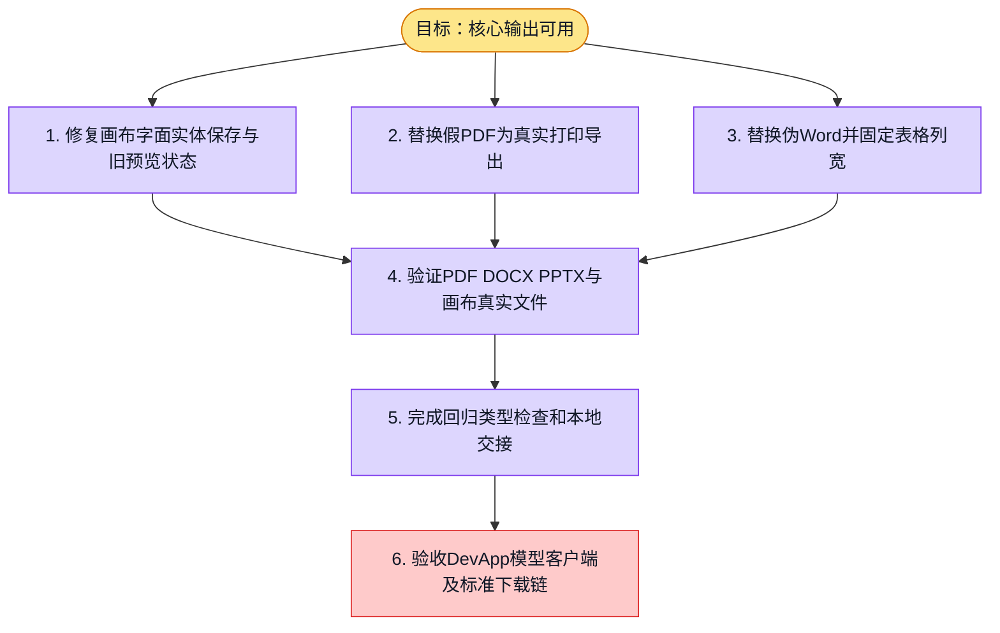

# 执行计划 — {{GOAL_TITLE}}

> 规范：`.harness/instructions/execution-plan-visualization.md`。
> 改状态用 `node .harness/scripts/execution-plan.mjs set <本文件> <节点> <状态>`，
> 改完 `check` 一遍；不要手改 classDef 颜色。

## 我理解的目标
- **目标**：修复画布、PDF、Word输出和文件预览链，验证真实PPTX文件。
- **完成判据**：本地生产导出函数实际生成文件，非零页PDF、真实OOXML及完整中文回读；相关测试和Web类型检查通过。
- **不做什么**：不重跑数字人16例，不调用模型、真实DB，不部署或修改权限。
- **假设与待确认**：PDF采用明确标注的浏览器打印另存路径；DevApp端到端和Office客户端显示另行验收。

## 执行计划

图例：⬜ 灰=未开始 · 🟨 黄=已开始 · 🟩 绿=已完成 · 🟪 紫=已测试（有证据） · 🟥 红=被堵塞

## 进度日志（append-only，每次改颜色追加一行）
| 时间 | 节点 | 状态变化 | 依据（命令 / 证据 / 堵塞原因） |
|---|---|---|---|
| 2026-10-05 | G, S1 | todo → doing | 接到目标，开始理解 |
