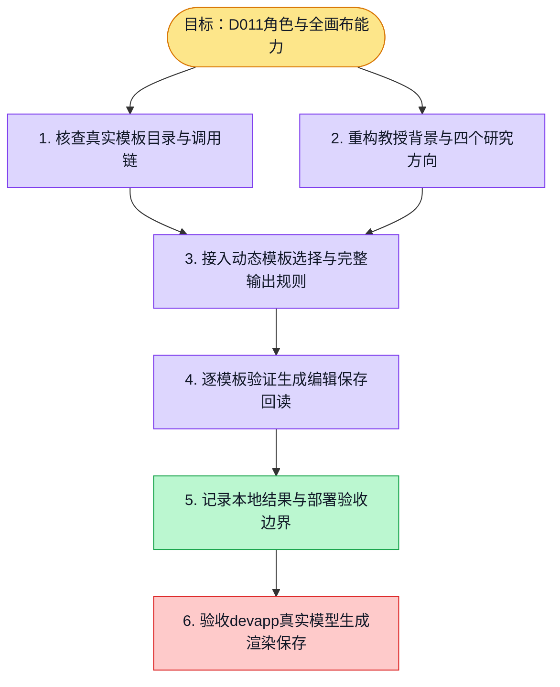

# 执行计划 — {{GOAL_TITLE}}

> 规范：`.harness/instructions/execution-plan-visualization.md`。
> 改状态用 `node .harness/scripts/execution-plan.mjs set <本文件> <节点> <状态>`，
> 改完 `check` 一遍；不要手改 classDef 颜色。

## 我理解的目标
- **目标**：重构 D011 为斯坦福 d.school 教授背景的虚拟设计思维数字人，支持全球传播、企业应用、AI×DT 和未来教育，并掌握全部可见画布。
- **完成判据**：角色包契约测试通过；内置模板逐个生成和保存回读；组织模板按授权目录发现；部署和真实模型表现分别验收。
- **不做什么**：不虚构现实任职，不扩大权限，不修改冻结16例，不进行新模型外发或生产部署。
- **假设与待确认**：源码目录可核查；devapp当前部署目录和组织自定义模板尚未读取。

## 执行计划

图例：⬜ 灰=未开始 · 🟨 黄=已开始 · 🟩 绿=已完成 · 🟪 紫=已测试（有证据） · 🟥 红=被堵塞

## 进度日志（append-only，每次改颜色追加一行）
| 时间 | 节点 | 状态变化 | 依据（命令 / 证据 / 堵塞原因） |
|---|---|---|---|
| 2026-10-05 | G, S1 | todo → doing | 接到目标，开始理解 |
