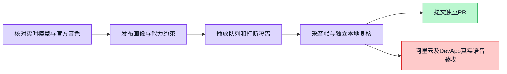

数字人实时通话需要遵循当前发布画像及能力边界。此前播放状态在供应商音频结束时提前变为空闲，含空格的官方音色名称被配置解析拒绝；交互采音使用较大的录音默认帧。

Refs #5388

本修复追加当前发布版本的能力快照，区分已解析 pins、缺失与待绑定及仅声明的 Workflow，并明确语音不能执行工具或生成文件。保持真实发布画像，不从源码角色模板覆盖已发布实例。

播放状态改为等待实际音频队列结束；打断后按 responseId 丢弃旧响应音频并接受新响应。缺少 responseId 的旧事件保持兼容，不承诺可隔离无编号迟到音频。实时采音改1024，普通录音保留4096。默认音色空白回落Maia，支持官方含空格名称。

验证：47 API +46 Web测试通过；API/Web全量TypeScript通过。独立生产播放器合成复核7断言通过。全部为本地合成/回环，无真实模型或DB调用。日志在 docs/testing/realtime-voice-followup。

官方配置核对（2026-10-05）：当前qwen3.8-omni-flash-realtime使用正确实时WebSocket协议及16k输入/24k输出。Maia在该模型官方音色表中，知性温柔，适合作为教授画像的试听起点；未进行听感比较。来源 https://help.aliyun.com/zh/model-studio/omni-voice-list#qwen38-voices 和 https://help.aliyun.com/zh/model-studio/realtime 。未验证DevApp部署实际环境、真实首音延迟、真实模型遵循及通话期间的权限撤销；不声称已端到端验收。

