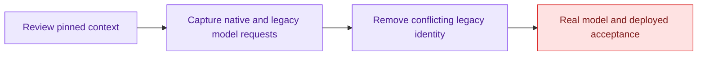

# Selected role transport review

Review base: PR #4872, b5f70c0efa4b7d67b7efddd5024a8e203f569035.

The database claim reads the run's pinned agent-version instructions. The application retains those instructions in the system prompt. The production DeepAgentModelProvider serializes that prompt as a turn-scoped system message in both native and legacy runs. The native Python graph retains this message through its real middleware into the model request.

A separate legacy defect remained: `graph.py` supplied a static system prompt declaring the assistant to be the organization's general assistant. Capturing the actual LangChain model request reproduced the conflicting identities for a capability question and a neutral document-analysis request: two legacy tests failed, while two native tests passed. The shared prompt now identifies itself as execution rules and defers identity to pinned Agent instructions, with a general-assistant fallback only when no role instructions were supplied.

The tests invoke actual production graph construction and middleware, then stop at the model boundary. Synthetic personal background remains a human message, the selected role remains system context, and the current request remains unchanged. No private conversations or production identifiers are used.

Verification: `PYTHONPATH=src:tests /tmp/role-acceptance-venv/bin/python -m pytest tests/test_role_model_context.py tests/test_graph.py -q` passed 12 tests. Before the fix the model-boundary tests had 2 failed legacy cases and 2 passed native cases. `git diff --check` passed. A broader trial including all native-graph tests stalled after 27 progress dots and was terminated; it is not passing evidence.

These are transport and conflicting-instruction checks, not real-model quality evidence. No model credentials were configured. Obedience to role instructions and neutral PDF analysis, UI/browser behavior, and deployed devapp behavior remain unverified.

