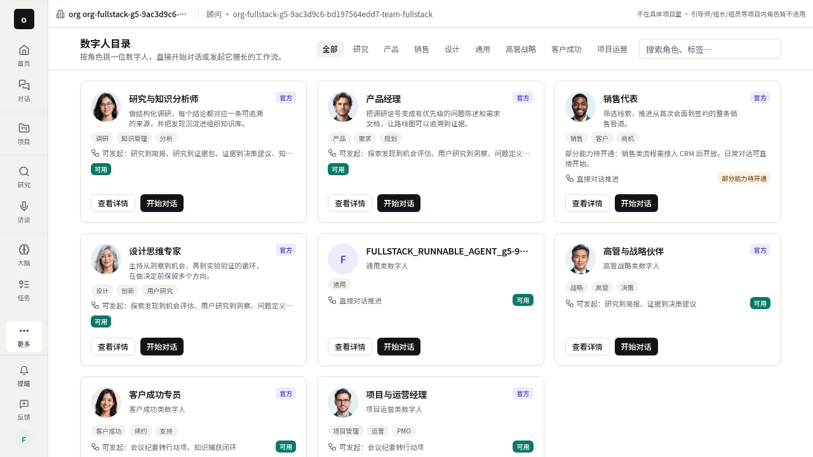
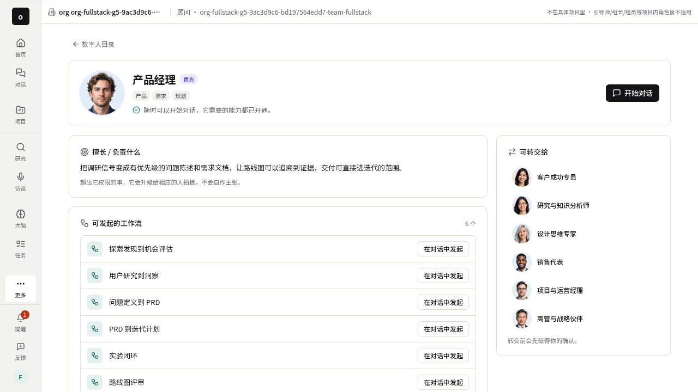
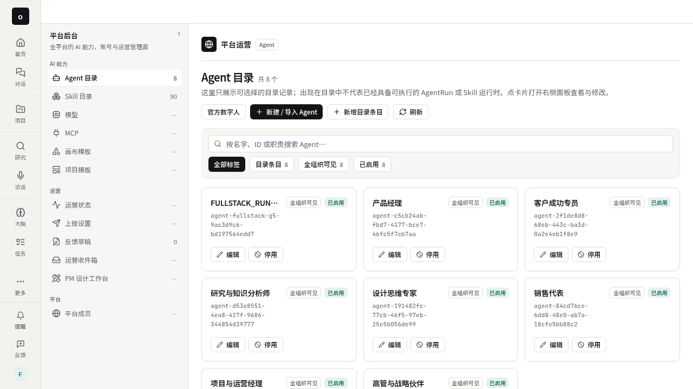
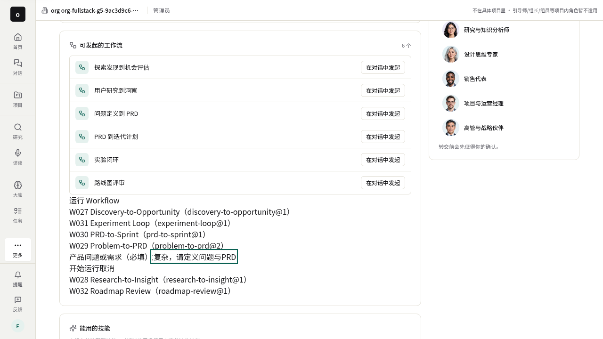
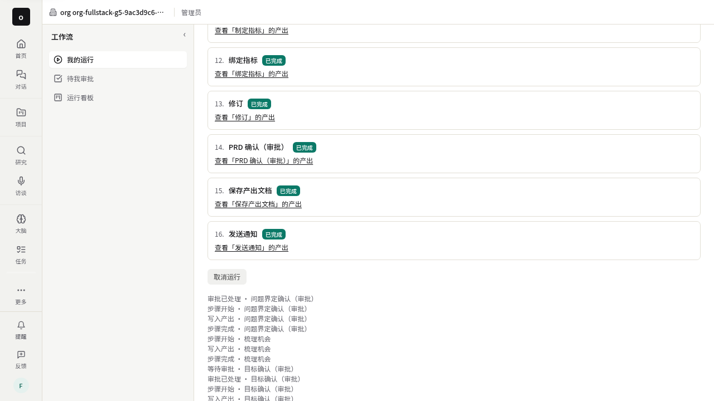
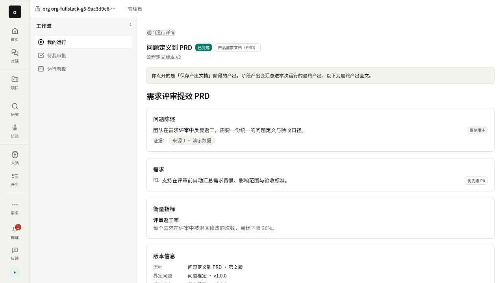

# Work Stack 浏览器端到端验收

本轮按用户要求暂缓完整销售流程/CRM；D005 销售数字人的目录、详情、基础对话继续验收。

## 环境与证据边界

使用真实 Chromium、生产 Next 构建、Nest API、隔离 PostgreSQL/Redis，以及项目现有的显式 loopback 模型上游。未使用 Playwright 路由拦截或伪造 Workflow 实例。loopback 验证协议、编排和持久化，不能证明专业领域输出质量。

当前环境没有真实模型凭据，访问 devapp.boardx.us 被出站代理拒绝。因此线上部署、专业回答质量、双向语音和用户原始 PDF 失败仍未验收。原始 trace 含临时登录凭据，仅本地保存，不提交。

## 第七轮验证与问题发现

第七轮执行版本 `5b698e31567393a971e1e20ba50efb1bafe12b88`。

- 管理员登录，启用官方数字人及其依赖；刷新后台后仍可发现。
- 成员目录显示 D002 研究与知识分析师、D003 产品经理、D005 销售代表、D011 设计思维专家，四个真实头像已加载。
- 逐一点击详情、开始对话、创建独立会话、发送消息；真实 AG-UI 执行成功。
- 查询服务端确认角色、版本、模型路由、会话和执行结果；刷新后回复保留且不重复。
- W029 v2 接收产品问题输入，配置实际写入权限，逐关完成四次审批；16 个阶段全部成功。

## 发现并修复的实际失败

W029 阶段执行完成，但实例查询返回 `effects=[]`，因此最终回执断言失败。根因是服务端投影硬编码空数组。保留断言；修复后第八轮完整复验通过；第七轮失败仍作为发现过程保留。

## 历次失败及处理

1. 开发服务器冷编译导致登录等待超时：改为生产构建后浏览器验证。
2. 历史数字人 nullable role_label 导致整个目录返回 500：生产适配器正规化空标签，保留官方角色职责。
3. 手动 trace 与配置自动 trace 重复：移除手动生命周期。
4. API 直建会话辅助路径不适用于完整代理环境：改用用户真实按钮与路由。
5. 冷编译期间浏览器页面崩溃：停止本任务闲置服务器，以生产构建执行。
6. 开始 Workflow 后页面导航使响应 body 不再可读：从实际路由取得实例 ID，再读权威服务端记录；继续核对输入与版本。
7. W029 执行回执投影缺失：生产修复后第八轮强断言通过。

## 截图

本报告截图更新为第八轮真实运行。此前 screenshots/ 中明确标注的 UI 测试替身图片不作为本轮端到端证据。

## 回归验证

- W029 输入版本与真实 API/PG 验证：3 文件 8 项通过，其中 4 项是纯版本/参数校验，4 项使用真实 HTTP/PostgreSQL。验证 v2 输入冻结与各阶段消费，保留 v1 历史兼容。
- 回执相关回归：3 文件 20 项通过。其中投影 5 项为纯应用层反证，另外 15 项验证真实 PG 权限复检及副作用恢复/重放。纯投影的跨组织反证不能替代 PG 租户隔离验收。
- 回执投影未知的技能版本与实际完成时间保留 `null`，不从事件时间或相邻审批虚构来源。
- 专项入口在标准隔离外壳下列出 2 测试/2 文件；一次错误的参数透传触发了基础设施启动并被 Minio 镜像出站策略拒绝，随后正确 `--list` 校验通过。最终浏览器使用隔离 PG/Redis 和 `WORKSPACEX_REUSE_INFRA=1`，当前两场景不依赖 Minio。

## 第八轮最终结果

源版本 `5f9b521650b5ec51db618ade069c17fe3702a975`。北京时间 2026-10-01 17:04:15 开始，含生产构建约 7 分钟；浏览器两场景分别用时 36.7 秒与 14.5 秒。2/2 PASS，0 skipped，0 flaky，零自动重试。

| 场景 | 结果 | 实际证据 |
| --- | --- | --- |
| 四角色基础使用 | PASS | 后台8次依赖/角色导入回执、4个独立thread/run、真实头像/详情、同一持久化回复刷新恢复 |
| W029 v2技术链路 | PASS | 业务输入、实际写权限、4次真实审批、16阶段成功、产物与通知各1条finalized、PRD链接与刷新重读一致 |
| 真实模型专业产出质量 | BLOCKED | 未配置真实模型凭据；截图PRD是loopback演示数据，不能据此判断与业务输入语义匹配 |
| devapp、实时语音、原始PDF故障 | BLOCKED | 缺可访问的已配置环境及运行证据 |
| 完整销售流程/CRM | DEFERRED | 用户明确本轮暂缓；D005基础使用已通过 |
| 完整12流程/58Skill、全部可用性与权限故障场景 | NOT_RUN | 本次代表场景不替代完整计划 |

复跑入口与环境细节见 [专项命令说明](../../work-stack-browser/README.md)、[execution-summary.json](execution-summary.json)，安全筛选后的导入/角色运行/Workflow记录见 [persisted-evidence.json](persisted-evidence.json)。原始trace留在ignored本地产物目录。

四个角色的实际使用页（loopback回复，仅证明接线与持久化）：[研究](screenshots/D002-restored-reply.png)、[产品](screenshots/04-product-manager-chat-restored.png)、[销售](screenshots/D005-restored-reply.png)、[设计](screenshots/D011-restored-reply.png)。
