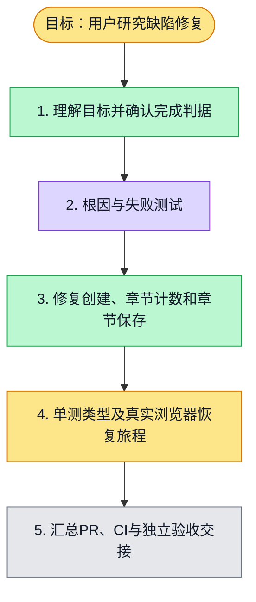

# 执行计划 — 用户研究验收缺陷修复

> 规范：`.harness/instructions/execution-plan-visualization.md`。
> 改状态用 `node .harness/scripts/execution-plan.mjs set <本文件> <节点> <状态>`，
> 改完 `check` 一遍；不要手改 classDef 颜色。

## 我理解的目标
- **目标**：修复 #5057 长需求创建失败、#5068 持久章节计数滞后与 #5081 章节保存清空检索，调查报告及导出边界；一个汇总 PR，交主会话独立验收。
- **完成判据**：失败测试→通过；web/API/contracts 类型与回归、受影响 lint；真实浏览器复验缺陷及研究恢复旅程；PR CI 全绿。
- **不做什么**：不移除质量门、不造来源，不改访谈或问卷；不自行合并。
- **假设与待确认**：本次按直接交办处理；已 fetch main 83462a88ef49d0983fc1f0e02a6ee3190d409f18，独立唯一 worktree。

## 执行计划

图例：⬜ 灰=未开始 · 🟨 黄=已开始 · 🟩 绿=已完成 · 🟪 紫=已测试（有证据） · 🟥 红=被堵塞

## 进度日志（append-only，每次改颜色追加一行）
| 时间 | 节点 | 状态变化 | 依据（命令 / 证据 / 堵塞原因） |
|---|---|---|---|
| 2026-10-02 | G, S1 | todo → doing | 接到目标，开始理解 |
