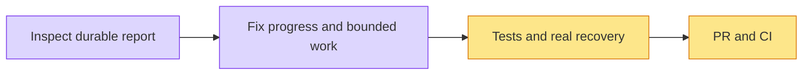

# Report progress and recovery — #5243

Original real session: report preparation included failed document rereads; evidence had 18 batches and 19 total calls (not nineteen retries). It ended with RESEARCH_WORKFLOW_UNAVAILABLE and two durable chapters. No sources or chapters were deleted.

Changes: publish the confirmed destination before external work; reuse document outcomes without automatic transient rereads during report generation; four bounded concurrent evidence batches with serialized durable writes; UI completed/total batch progress; source preparation uses `GUIDED_REPORT_PREPARATION_BUDGET_MS`; each model attempt uses the shared transport/stream deadline `GUIDED_REPORT_MODEL_BUDGET_MS` and closes callbacks before retry/finalization. Both constants are defined in `apps/api/src/application/research/guided-search-budget.ts`; the per-attempt limit does not promise a deadline for the full validated report.

Validation: API research unit lane 261 tests before final callback test, chapter lane 90 after final change, evidence lane14; UI30; API/Web typecheck; API lint and affected Web lint. Independent reviewer103tests, no remaining findings. Local API restarted after old request was terminal; shared database services retained. Real browser retry uses existing two chapters; outcome recorded in issue.

