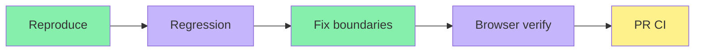

# Issue #5061: attributed expert summaries

The server wraps saved expert output in a linked level-two heading. Genuine provider answers can contain level-one or level-two headings, so generic Markdown section boundaries truncate the selected expert transcript before its answers. Selection now ends only at the next expert attribution wrapper and keeps repeated segments. Saved insight cards follow the same attribution boundaries.

Regression: one failure and eight passes before the fix; nine passes after it. Covers provider H1/H2, repeated segments, other-expert exclusion and insight attribution. Browser real DashScope execution completed both experts; selecting the published synthetic expert renders its saved answers, and selecting the virtual expert gives 4515 characters without the other wrapper heading. Screenshot attached. Model output itself may include extra cross-expert prose because the execution prompt receives the full outline; this separate generation behavior is outside this display fix.

The browser uses the isolated local database and synthetic research data. No model output fixture was injected. Whole-web observation has unrelated sandbox and canvas failures; it is not exact-SHA proof. PR CI remains required.

