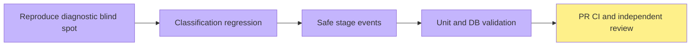

# #5099 report generation diagnosis

Two actual local synthetic interview report attempts returned503 AI_GENERATION_UNAVAILABLE after2/2 genuine expert tasks. No report draft was saved. Existing logs do not distinguish provider error, completion flags, malformed body and quality rejection; the root cause of those two requests remains unknown. This PR does not claim they were repaired or repeat old#5063 attribution.

Report diagnostics now reuse DebugTracePort and middleware traceId. Events contain only controlled reason/provider code, stage outcome/duration, context/model/validation/storage timings, call count, output character count and missing quality dimensions. No bodies, prompts, exception messages or provider details. Public HTTP/error and quality requirements unchanged. Save/read still run original visibility/version checks. Sink exceptions cannot alter business results.

Initial diagnostic regressions failed because no events existed. The independent initial review reproduced JSON format rejection incorrectly marked stage=model; its two regression cases failed and now pass. Final pure diagnostics13/13; pre-review-fix isolated PostgreSQL+HTTP36/36; typecheck and standardAPI lint passed; ./init.sh fast baseline passed. Models in automated tests are controlled doubles, not browser/provider evidence. Init was not--full. No speed/real-model-success claim.

Existing local app_diag_ro could not SELECT debug_events (permission denied); no grant/permission change attempted. Additional external model diagnostic was previously rejected for data/destination transmission authorization and remains pending direct human approval. Own temporary read-onlyPG server closed.

Next independent issue: preserve quality-rejected draft and bound missing-dimension repair; then reduce redundant report context while retaining unique evidence, compare fixed scenarios and establish actual request timings once external call authorization is resolved. Export excluded from requested acceptance.

