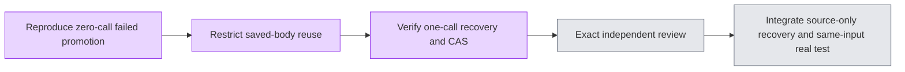

# Historical failed report regeneration (#5437)

A failed report could be promoted using unchanged historical raw bytes without any model call when corrected current gates accepted it. A gate correction is not proof that the entire historical report is correct. The observed synthetic report also contains unsupported single-QA metadata; it is not a normal-output PASS.

The saved-body reuse path now only applies to nonfailed/nonretry reports. Qualified historical failed bodies retain the existing source version/hash checks before their one bounded retry. Failed bytes remain untouched if no provider is configured or the provider fails. New candidates pass unchanged analysis, claim and grounding gates and the same storage CAS. Normal qualified draft reuse remains unchanged. Source-only regeneration prompting is independently tracked in #5430 / PR #5433.

RED four assertions failed before the production change. GREEN 378 Markdown unit tests and API typecheck. Independent readonly recovery review passed 28/28. No actual model request was made for these controlled tests. Real normal-output acceptance remains 0/3, requiring same-input regeneration after exact review.

