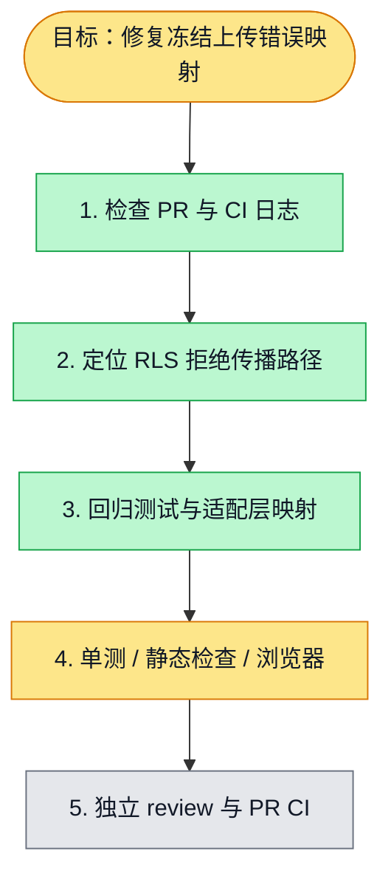

# 执行计划 — Frozen organization file upload HTTP denial

> 规范：`.harness/instructions/execution-plan-visualization.md`。
> 改状态用 `node .harness/scripts/execution-plan.mjs set <本文件> <节点> <状态>`，
> 改完 `check` 一遍；不要手改 classDef 颜色。

## 我理解的目标
- **目标**：修复未合并 PR 的共同文件上传阻塞：冻结组织上传返回 403 而非 500。
- **完成判据**：新增回归 RED→GREEN；API typecheck/lint；真实 board-files-acceptance；最新 PR CI 全绿。
- **不做什么**：不改 RLS 或权限判断，不自动合并，不改其他任务目录。
- **假设与待确认**：直接交办；用户已授权跳过协调身份/租约前提。

## 执行计划

图例：⬜ 灰=未开始 · 🟨 黄=已开始 · 🟩 绿=已完成 · 🟪 紫=已测试（有证据） · 🟥 红=被堵塞

## 进度日志（append-only，每次改颜色追加一行）
| 时间 | 节点 | 状态变化 | 依据（命令 / 证据 / 堵塞原因） |
|---|---|---|---|
| 2026-10-02 | G, S1 | todo → doing | 接到目标，开始理解 |
