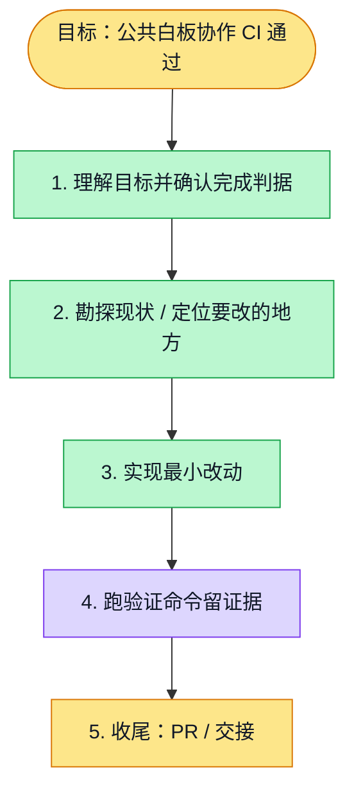

# 执行计划 — 修复白板协作回归创建步骤

> 规范：`.harness/instructions/execution-plan-visualization.md`。
> 改状态用 `node .harness/scripts/execution-plan.mjs set <本文件> <节点> <状态>`，
> 改完 `check` 一遍；不要手改 classDef 颜色。

## 我理解的目标
- **目标**：消除 usersyj PR 的公共浏览器 CI 阻塞。
- **完成判据**：完整 whiteboard-live.spec.ts 真实服务回归成功，随后新 PR CI 通过。
- **不做什么**：只适配真实画布放置步骤，保留同步、并发、权限与刷新断言。
- **假设与待确认**：n 只激活创建工具，点击 upper canvas 放置对象；main 已明确实现。

## 执行计划

图例：⬜ 灰=未开始 · 🟨 黄=已开始 · 🟩 绿=已完成 · 🟪 紫=已测试（有证据） · 🟥 红=被堵塞

## 进度日志（append-only，每次改颜色追加一行）
| 时间 | 节点 | 状态变化 | 依据（命令 / 证据 / 堵塞原因） |
|---|---|---|---|
| 2026-10-02 | G, S1 | todo → doing | 接到目标，开始理解 |
