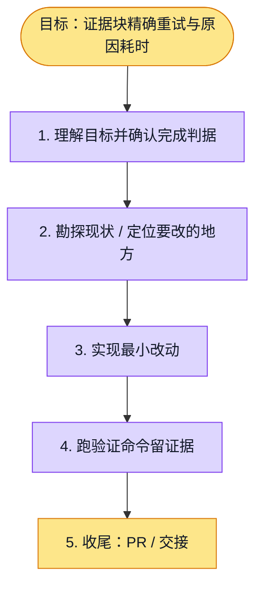

# 执行计划 — 按失败证据块精确重试并记录原因耗时

> 规范：`.harness/instructions/execution-plan-visualization.md`。
> 改状态用 `node .harness/scripts/execution-plan.mjs set <本文件> <节点> <状态>`，
> 改完 `check` 一遍；不要手改 classDef 颜色。

## 我理解的目标
- **目标**：整块已验证证据不因其他块失败被重复生成或丢失；只修复可归属失败块
- **完成判据**：隔离证据/章节/正式门回归、API类型/lint、init快速路径、独立review及PR CI；真实质量/耗时单独比较
- **不做什么**：不改公开报告契约、并发/提供方/章节重试上界，不降JSON/ID/逐字quote/重复冲突门，不记录原文，不验导出
- **假设与待确认**：无法归属错误仍整批修复；保留单位为全块而非一块中的个别match；沿用debug recorder

## 执行计划

图例：⬜ 灰=未开始 · 🟨 黄=已开始 · 🟩 绿=已完成 · 🟪 紫=已测试（有证据） · 🟥 红=被堵塞

## 进度日志（append-only，每次改颜色追加一行）
| 时间 | 节点 | 状态变化 | 依据（命令 / 证据 / 堵塞原因） |
|---|---|---|---|
| 2026-10-02 | G, S1 | todo → doing | 接到目标，开始理解 |
