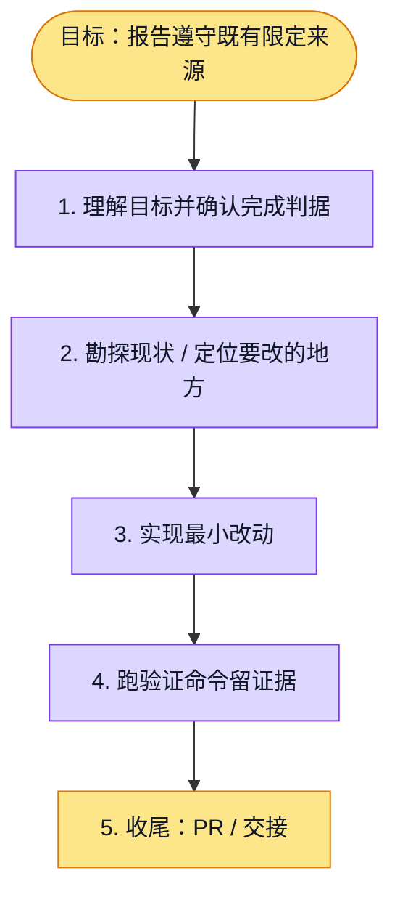

# 执行计划 — 报告严格来源策略

> 规范：`.harness/instructions/execution-plan-visualization.md`。
> 改状态用 `node .harness/scripts/execution-plan.mjs set <本文件> <节点> <状态>`，
> 改完 `check` 一遍；不要手改 classDef 颜色。

## 我理解的目标
- **目标**：让新报告证据与恢复严格遵守已经确认的 restrict 来源范围。
- **完成判据**：域外正文不送入证据模型、域外引用无法保存、策略变更不能复用旧恢复依据；研究回归、类型、lint、init 通过；独立 PR 的 CI 绿。
- **不做什么**：不改变公开 API、内部资料鉴权、正式报告质量门、签核状态；不合并 PR。
- **假设与待确认**：本修复恢复已有来源范围规则。需求到大纲漂移与精准重试分别继续追踪，不宣称完整研究质量通过。

## 执行计划

图例：⬜ 灰=未开始 · 🟨 黄=已开始 · 🟩 绿=已完成 · 🟪 紫=已测试（有证据） · 🟥 红=被堵塞

## 进度日志（append-only，每次改颜色追加一行）
| 时间 | 节点 | 状态变化 | 依据（命令 / 证据 / 堵塞原因） |
|---|---|---|---|
| 2026-10-02 | G, S1 | todo → doing | 接到目标，开始理解 |
