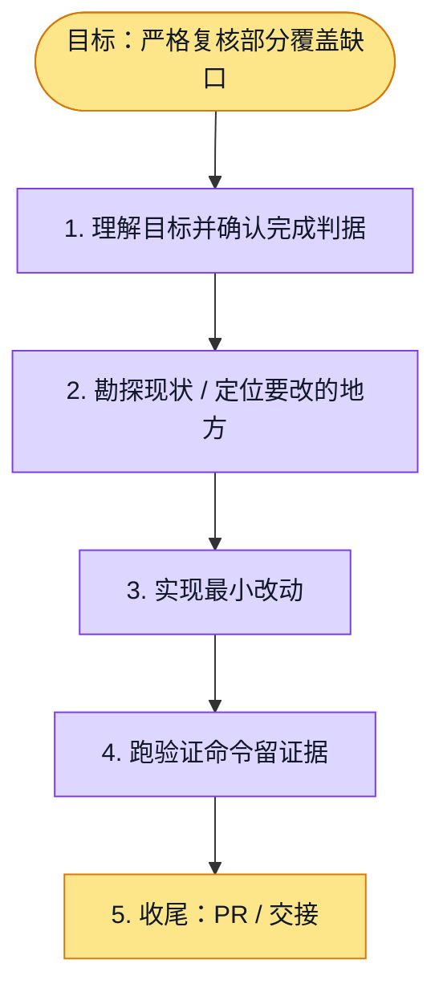

# 执行计划 — 诚实部分证据缺口复核

> 规范：`.harness/instructions/execution-plan-visualization.md`。
> 改状态用 `node .harness/scripts/execution-plan.mjs set <本文件> <节点> <状态>`，
> 改完 `check` 一遍；不要手改 classDef 颜色。

## 我理解的目标
- **目标**：避免把复合问题的诚实部分缺口误当忽略已有证据，质量门不降低
- **完成判据**：隔离研究质量及章节回归、API typecheck/lint、init快速基线及独立exact SHA review；PR CI全绿且不合并
- **不做什么**：不改公开schema/签核、引用门或正式报告门；不验证导出
- **假设与待确认**：可逆实现沿用已有诚实缺口规则；真实质量/耗时改善需要后续同配置证据

## 执行计划

图例：⬜ 灰=未开始 · 🟨 黄=已开始 · 🟩 绿=已完成 · 🟪 紫=已测试（有证据） · 🟥 红=被堵塞

## 进度日志（append-only，每次改颜色追加一行）
| 时间 | 节点 | 状态变化 | 依据（命令 / 证据 / 堵塞原因） |
|---|---|---|---|
| 2026-10-02 | G, S1 | todo → doing | 接到目标，开始理解 |
