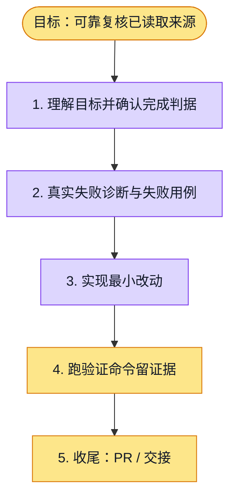

# 执行计划 — 研究证据来源正文复核修复 #5142

> 规范：`.harness/instructions/execution-plan-visualization.md`。
> 改状态用 `node .harness/scripts/execution-plan.mjs set <本文件> <节点> <状态>`，
> 改完 `check` 一遍；不要手改 classDef 颜色。

## 我理解的目标
- **目标**：已抓取来源以正文复核相关性，并以块内原文编号防止抄写及归属错误。
- **完成判据**：研究 API 测试、typecheck、独立审查及真实公开资料模型重放；PR CI 全绿。
- **不做什么**：不放宽原文归属、原子重试或报告质量门，不修改公共 API。
- **假设与待确认**：沿用已授权的既有契约修复，依赖 PR #5134，禁止合入 main。

## 执行计划

图例：⬜ 灰=未开始 · 🟨 黄=已开始 · 🟩 绿=已完成 · 🟪 紫=已测试（有证据） · 🟥 红=被堵塞

