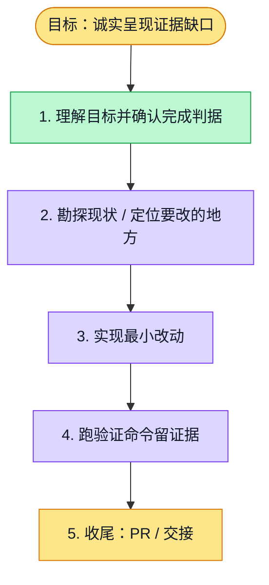

# 执行计划 — 无证据章节与未审核正文隔离 #5179

> 规范：`.harness/instructions/execution-plan-visualization.md`。
> 改状态用 `node .harness/scripts/execution-plan.mjs set <本文件> <节点> <状态>`，
> 改完 `check` 一遍；不要手改 classDef 颜色。

## 我理解的目标
- **目标**：跳过无证据写作，让结论事实只来自质量通过章节
- **完成判据**：针对测试、完整研究回归、API typecheck、独立审查及PR CI通过
- **不做什么**：不修改已确认问题、不放宽全局证据或正式报告门，不合入main
- **假设与待确认**：沿用已授权修复；保留真实context引用，只跳过零可用引用章节

## 执行计划

图例：⬜ 灰=未开始 · 🟨 黄=已开始 · 🟩 绿=已完成 · 🟪 紫=已测试（有证据） · 🟥 红=被堵塞

## 进度日志（append-only，每次改颜色追加一行）
| 时间 | 节点 | 状态变化 | 依据（命令 / 证据 / 堵塞原因） |
|---|---|---|---|
| 2026-10-03 | G, S1 | todo → doing | 接到目标，开始理解 |
