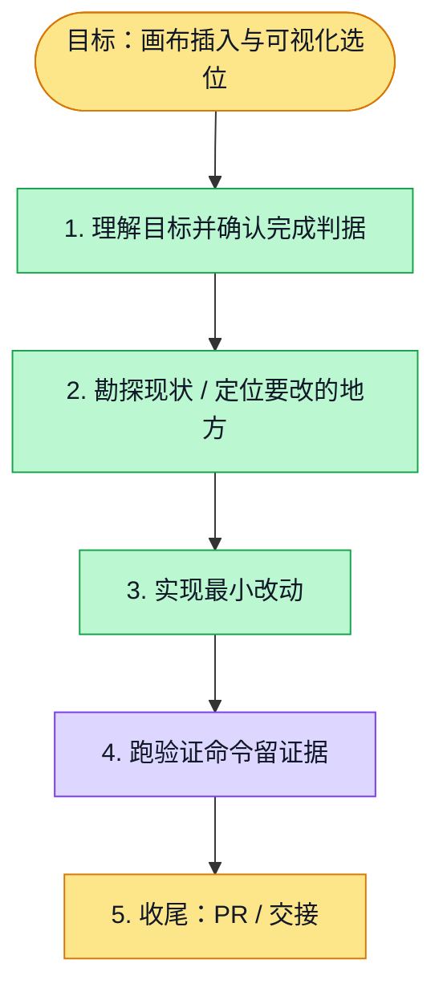

# 执行计划 — 修复工作坊画布插入与位置预览

> 规范：`.harness/instructions/execution-plan-visualization.md`。
> 改状态用 `node .harness/scripts/execution-plan.mjs set <本文件> <节点> <状态>`，
> 改完 `check` 一遍；不要手改 classDef 颜色。

## 我理解的目标
- **目标**：JTBD 等工作坊画布正常插入 Board，用户通过简化概览选择位置，无需输入坐标。
- **完成判据**：受影响 web/API/contracts 测试、类型检查、lint 和三档真实浏览器交互通过；PR CI 通过。
- **不做什么**：仅修复 Chat → Board 模板传输、来源验证、位置选择与源码回读。
- **假设与待确认**：用户授权跳过身份确认；不发布生产。图片与特殊 Mermaid 图形仍走既有拒绝分支。

## 执行计划

图例：⬜ 灰=未开始 · 🟨 黄=已开始 · 🟩 绿=已完成 · 🟪 紫=已测试（有证据） · 🟥 红=被堵塞

## 进度日志（append-only，每次改颜色追加一行）
| 时间 | 节点 | 状态变化 | 依据（命令 / 证据 / 堵塞原因） |
|---|---|---|---|
| 2026-10-06 | G, S1 | todo → doing | 接到目标，开始理解 |
