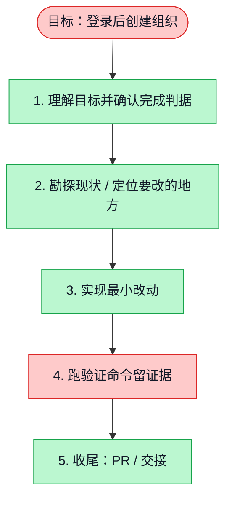

# 执行计划 — 登录后创建组织

> 规范：`.harness/instructions/execution-plan-visualization.md`。
> 改状态用 `node .harness/scripts/execution-plan.mjs set <本文件> <节点> <状态>`，
> 改完 `check` 一遍；不要手改 classDef 颜色。

## 我理解的目标
- **目标**：现有账号从组织菜单创建独立组织，无需新邮箱。
- **完成判据**：API/Web/contracts typecheck，API/Web lint，后端原子隔离测试、UI 测试、浏览器创建与切换测试，draft PR。
- **不做什么**：不访问生产，不复制租户数据，不合并或部署。
- **假设与待确认**：名称为现有组织契约的必要字段；创建者复用 admin 模型；套餐与额度保持未配置。

## 执行计划

图例：⬜ 灰=未开始 · 🟨 黄=已开始 · 🟩 绿=已完成 · 🟪 紫=已测试（有证据） · 🟥 红=被堵塞

## 进度日志（append-only，每次改颜色追加一行）
| 时间 | 节点 | 状态变化 | 依据（命令 / 证据 / 堵塞原因） |
|---|---|---|---|
| 2026-10-07 | G, S1 | todo → doing | 接到目标，开始理解 |
