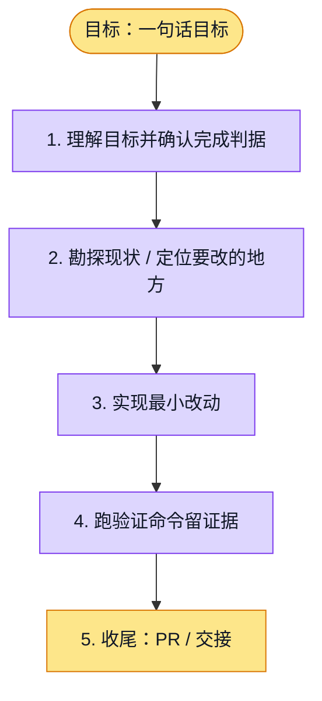

# 执行计划 — 核心 UIUX ad-hoc 修复

> 规范：`.harness/instructions/execution-plan-visualization.md`。
> 改状态用 `node .harness/scripts/execution-plan.mjs set <本文件> <节点> <状态>`，
> 改完 `check` 一遍；不要手改 classDef 颜色。

## 我理解的目标
- **目标**：基于最新 main 修复浏览器发现的一致性 Gap 并提交 PR
- **完成判据**：浏览器证据、受影响测试、typecheck/lint 通过，PR CI 通过
- **不做什么**：不修改他人共享工作树改动，不修改模型/权限契约
- **假设与待确认**：十轮为专项走查，不声称穷尽问题或达到独立评分9分

## 执行计划

图例：⬜ 灰=未开始 · 🟨 黄=已开始 · 🟩 绿=已完成 · 🟪 紫=已测试（有证据） · 🟥 红=被堵塞

## 进度日志（append-only，每次改颜色追加一行）
| 时间 | 节点 | 状态变化 | 依据（命令 / 证据 / 堵塞原因） |
|---|---|---|---|
| 2026-09-30 | G, S1 | todo → doing | 接到目标，开始理解 |
