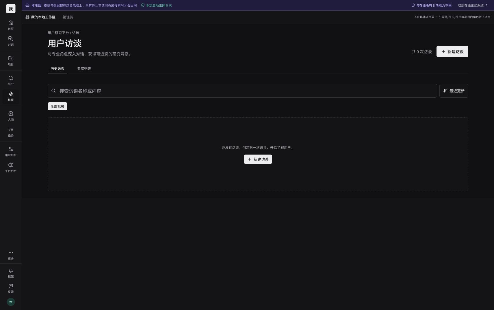
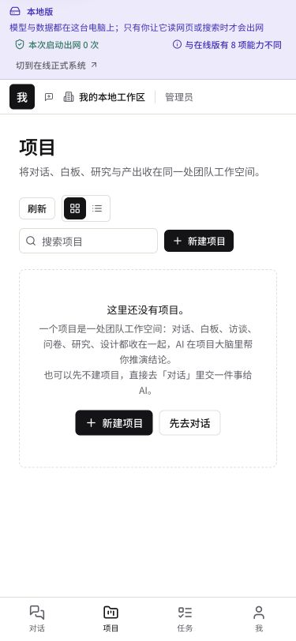
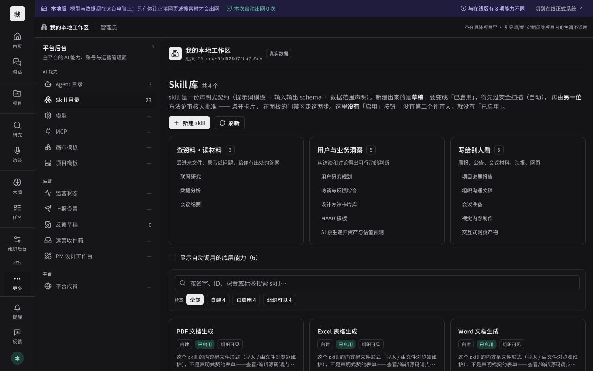

# WorkspaceX 核心 UIUX：10 轮专项走查与修复

日期：2026-09-30。关联：boardx/workspacex#4773。交付方式：人类直接交办的 ad-hoc 修复。
修复基线：最新 main 2ca8e6f17dfd55d0f0394409f5e16e4baae8a428；分支 codex/uiux-core-polish-20260930。

## 结论与范围

完成了下面 10 轮**专项**浏览器走查与修复。它们不是“所有页面各测十遍”的声明，也不代表穷尽所有 UIUX 问题。证据来自本轮本地真实界面；旧 main 的截图不参与本次判断。
重点改善真实上下文、首次使用引导、主操作一致性、错误恢复、键盘可访问性，以及实际页面与开发预览的隔离。
“从 6 分到 9 分”是改进目标，尚没有独立用户评测支持 9 分结论。本报告不把单元测试通过当成真实模型、录音或整体产品体验通过。

## 环境

隔离工作树、独立本地数据目录；Web 3100、API 3200、Postgres 55439、sandbox 3310。
浏览器使用 cua browser-use，先用 Codex 内置浏览器；控制接口超时后恢复到独立 Chrome 测试会话。没有使用终端 Playwright 代替浏览器观察。
内置浏览器截图为浅色 1280px；Chrome 跟随系统暗色，最终 Skill 截图为 1280px；375px 实测项目和录音。未切换用户保存的外观偏好。

## 逐轮测试与修复

| 轮次 | 路径与实际操作 | 本轮发现的 Gap | 修复与回归证据 | 状态 |
|---|---|---|---|---|
| 1 | 首页/项目/研究基线；访谈历史与专家切换 | 首次使用被当成筛选无结果；访谈计数叫“项目”；空态主按钮为次级；错误没有重试 | 区分初次空态和筛选无结果；清除筛选；正确计数与主按钮；重试历史加载。r01-interview-fixed.jpg；组件测试 | 已复测 |
| 2 | 首页→独立问卷列表，检查顶栏 | 空工作区虚构“欧洲市场进入”项目上下文 | 删除共享路由中的 demo 项目映射，保留显式真实项目/项目对话。r02-survey-fixed.jpg；8 项上下文测试 | 已复测 |
| 3 | 问卷新建弹窗输入名称/标签，验证按钮、取消 | 页头创建为次级按钮；空态只说去右上角；筛选无结果无恢复入口 | 主操作统一为 primary；空态直接打开同一个弹窗；清除筛选。r03-survey-actions-fixed.jpg；问卷列表测试 | 已复测 |
| 4 | 聊天首屏，点击建议任务 | 空态说“新建对话”，按钮却叫“交一件事给 AI” | 统一为新建对话。建议任务正确填入消息框并启用发送。r04-chat-fixed.jpg；分页回归 | 已复测 |
| 5 | 任务中心→新建→取消 | 标题、日期、风险等级没有可访问名称；新建时未聚焦；失败缺少 alert 语义 | 可见关联标签、共享 Input、自动聚焦、alert；最终截图另修标签排布。r05-task-form-fixed.jpg（最终标签 block 微调后由测试覆盖） | 浏览器+测试 |
| 6 | 大脑分层切换；组织后台总览 | 真实后台混入开发态切换工具 | 真实数据页隐藏状态预览，预览屏保留。r06-admin-fixed.jpg；后台与真实总览测试 | 已复测 |
| 7 | 平台 Agent 目录→两个创建入口之一→取消 | 新增目录条目叫“新增 Agent”，与可执行 Agent 创建混淆；提示暴露数据库实现 | 名称明确为新增目录条目，说明不能用于对话；确认按钮统一 primary，去除 I-17 技术文案。r07-agent-create-fixed.jpg；写路径测试 | 浏览器+测试 |
| 8 | 375px 录音、跳到主要内容；项目列表→创建真实项目 | 项目空态无直接动作；介绍只讲工作坊，与通用项目定义矛盾 | 项目空态创建/去对话；统一团队空间说明。录音无横向溢出，跳转焦点成功；真实项目创建成功。r08-project-mobile-fixed.jpg、r08-project-created.jpg | 已复测 |
| 9 | 访谈页签键盘操作与代码语义对照 | 手写 tab 缺少方向键导航、焦点管理和面板关联 | 复用共享 Radix Tabs；ArrowRight 实测切到专家且移动焦点。r09-interview-keyboard.jpg、r10-experts-final.jpg | 已复测 |
| 10 | 设计首屏、访谈最终暗色回归、Skill 库；登录与真实项目工作台一致性检查 | 访谈巨大 hero 与列表页密度不同；专家空态误指分类、错误不可恢复；Skill/项目/登录混入预览工具 | 访谈标题收敛为列表层级；专家区分空态与筛选并可重试；真实项目隐藏预览；Skill 默认真实页隐藏工具，显式预览保留；登录仅显式 state 显示工具。r10-interview-final.jpg、r10-skill-fixed.jpg；相关测试 | 修复通过；部分最终浏览器边界见下 |

## 每个核心流程的健康状态

| 流程/步骤 | 本轮观察 | 健康状态与边界 |
|---|---|---|
| 登录 | Chrome 本地测试账号真实登录成功 | 正常；最新默认预览条隐藏尚需最终浏览器复测 |
| 首页 | 快捷入口、当前任务、继续工作空态 | 正常；r01-home.jpg |
| 聊天 | 新建入口、建议任务填入、发送状态 | 正常；未发送真实模型任务 |
| 项目列表 | 375px 布局、空态主操作、搜索入口 | 正常；r08-project-mobile-fixed.jpg |
| 项目创建→概览 | 填名提交、真实项目出现，进入概览 | 正常；首次编译造成等待。真实项目预览条隐藏改动有测试，最终截图仍是改前状态 |
| 深度研究列表 | 搜索、标签、创建入口、空态 | 正常：空态 primary，新建和筛选清除已在浏览器复测；r10-research-final.jpg |
| 访谈历史→专家 | 首次空态、方向键、暗色最终界面 | 正常；错误与重试由回归测试覆盖 |
| 问卷列表→创建弹窗→取消 | 真实上下文、字段/动作、空态主按钮 | 正常；本轮没有发布公开问卷 |
| 录音历史 | 375px、主操作、无溢出、跳转主内容焦点 | 正常；未授权麦克风、未运行真实 ASR |
| 大脑 | 长期记忆/项目组织页签切换 | 正常；空态信息准确 |
| 任务 | 新建字段、焦点、取消 | 正常；创建失败恢复由测试覆盖 |
| 组织后台 | 真数据总览、预览隔离 | 正常；未改成员权限或配额 |
| Agent 目录 | 创建入口能力边界、弹窗、取消 | 正常；未新增能力或改权限 |
| Skill 库 | 真实库、场景目录、最终暗色截图 | 正常；不以目录存在证明真实 Skill 执行 |
| 设计工作台 | 列表空态、示例需求入口 | 观察正常；未运行模型生成完整设计 |
| 个人页 | 真实导航、显示名及密码表单 | 页面可达，标签和禁用状态正常；r10-profile-final.jpg；未修改资料或密码 |
| Board/反馈完整闭环 | 菜单入口可见 | 尚未执行完整流程 |

## 已知后续项与验证限制

- 研究列表空态统一 primary，搜索/标签/状态筛选可一起清除；22 项列表回归与浏览器搜索恢复通过。
- 真实项目顶栏在名称解析前仍显示项目 ID；本轮保持诚实上下文，未增加另一份项目名称缓存。
- 录音/转录的术语映射需要产品定义确认，当前不能仅凭文字不同判断错误。
- 本地默认 qwen3.5:4b 模型尚未安装，调用返回 404；本轮不将建议卡片填入当成真实模型完成。ASR、模型执行、导出与协作多角色不是本次测试的通过项。
- 开发服务器首次编译：平台模块约 29.6 秒，录音约 38.6 秒，Skill 约 87.1 秒。它是开发态观测，不能外推生产性能。
- 内置浏览器读取/导航超时；Chrome 曾恢复并完成最终访谈/Skill 截图，个人页随后恢复并留存截图。正常登录和项目预览隐藏的最终截图尚未获得，保留边界。

## 代码验证

- CI=true ./init.sh：通过（修复后基础验证）。
- pnpm run verify:quick：退出 0；5 个 turbo task 成功；前端 741 个测试文件、6230 项通过、5 项跳过。
- 受影响模块专项：15 个测试文件、128 项通过；新增 Skill 预览隔离及任务可访问性验证通过；最终研究、Skill、任务和目录表单：4 文件46项通过。
- 前端 typecheck、lint（含设计规范和共享 token 检查）：通过；最终代码再次执行通过。
- 没有手工修改 feature 状态，没有宣称 passing 或已合入 main。

## 证据

截图在 latest/。r01–r10 表示专项轮次，不是十份相同页面截图。
浅色/暗色和移动端截图可用于判断信息层级与操作一致性，不能代替真实模型/ASR证据。

## PR 同步更新

PR #4776 创建后 main 更新导致冲突；已 rebase 至 557c1a6a0e，保留 main 新的访谈简洁标题、研究三列密度与共享筛选布局，并保留本 PR 的 Radix 页签及空态恢复。冲突涉及的3文件59项测试、typecheck通过。截图记录的是 rebase 前实际浏览器状态，不伪称最终新 SHA 的截图。
