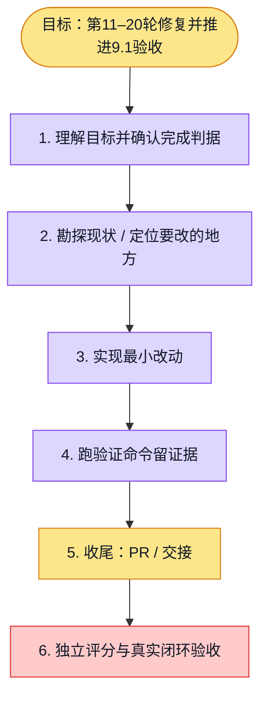

# 执行计划 — 第二组十轮 UIUX 迭代

> 规范：`.harness/instructions/execution-plan-visualization.md`。
> 改状态用 `node .harness/scripts/execution-plan.mjs set <本文件> <节点> <状态>`，
> 改完 `check` 一遍；不要手改 classDef 颜色。

## 我理解的目标
- **目标**：最新 main 上完成第11–20轮真实浏览器测试、修复、回归与PR，目标9.1/10
- **完成判据**：逐轮截图、真实流程证据、测试/typecheck/lint与PR CI通过；评分由证据支持
- **不做什么**：不改变权限或生产配置，不伪造模型/邮件结果
- **假设与待确认**：本地模型与邮件能力先验证；缺失功能不计通过

## 执行计划

图例：⬜ 灰=未开始 · 🟨 黄=已开始 · 🟩 绿=已完成 · 🟪 紫=已测试（有证据） · 🟥 红=被堵塞

## 进度日志（append-only，每次改颜色追加一行）
| 时间 | 节点 | 状态变化 | 依据（命令 / 证据 / 堵塞原因） |
|---|---|---|---|
| 2026-09-30 | G, S1 | todo → doing | 接到目标，开始理解 |
