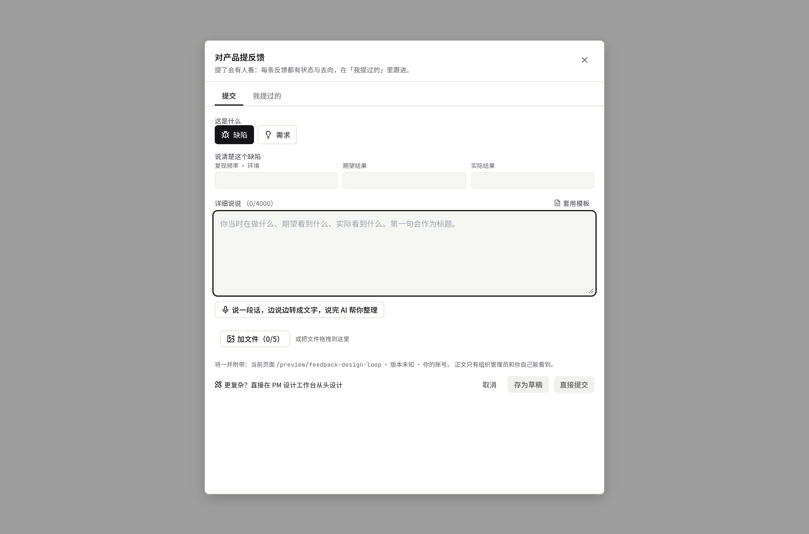
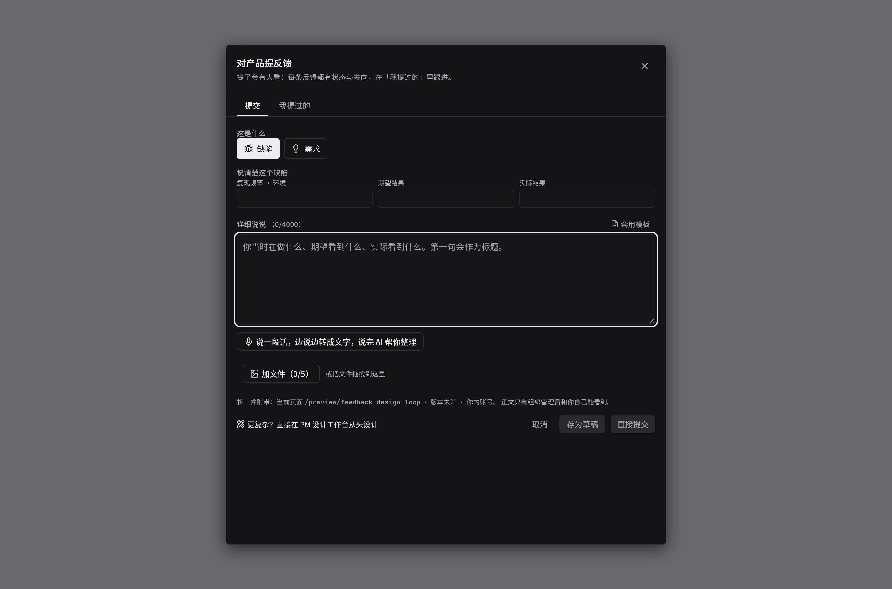
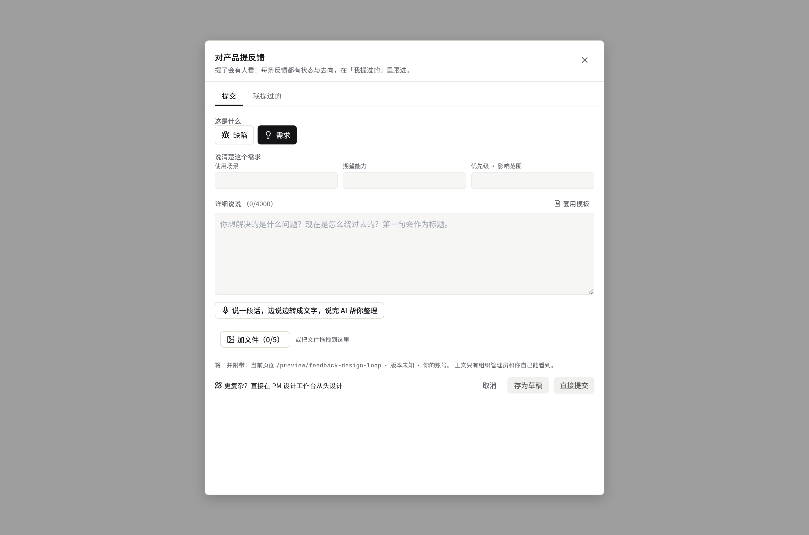
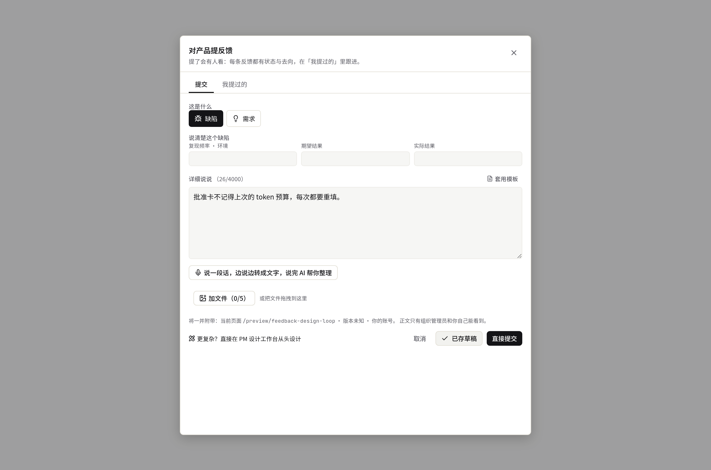
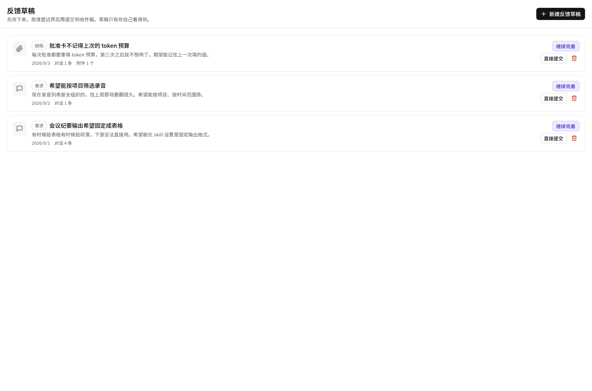
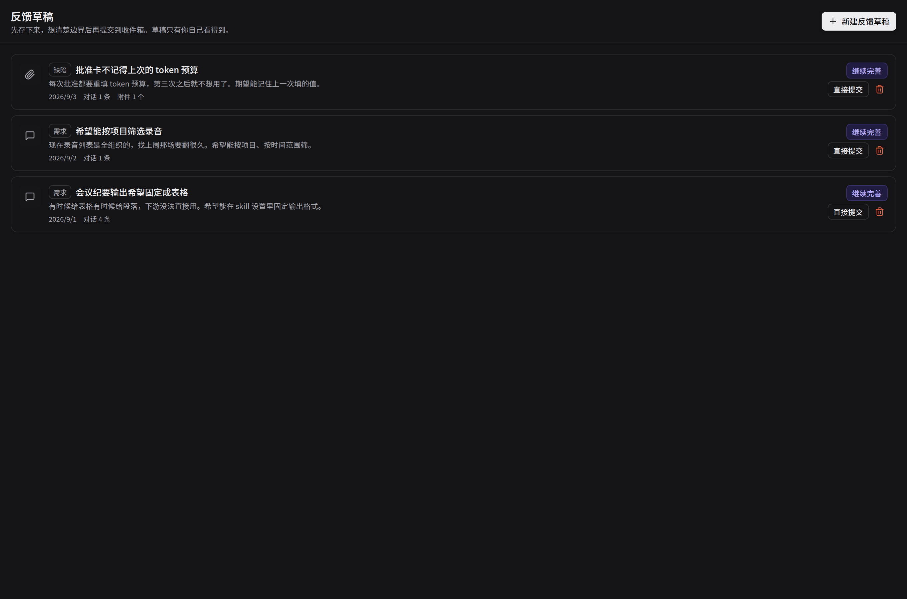
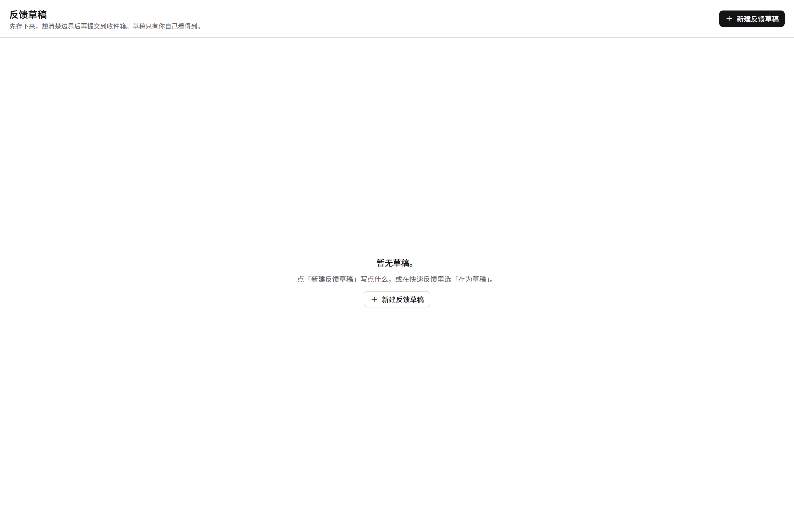
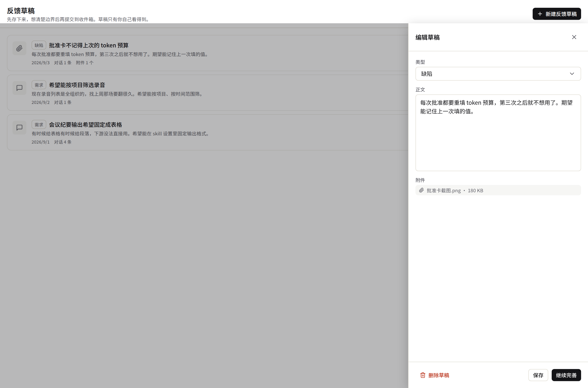
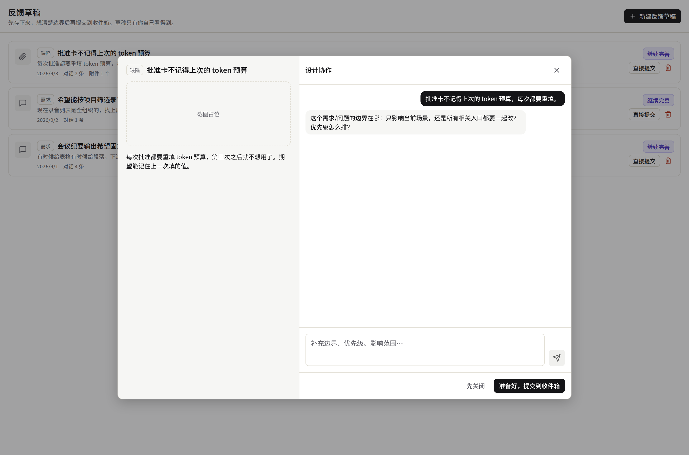

# 契约束 `feedback-drafts` — 签核第 ① 件：UI

> **自检**：本文件引用 9 张截图，目录下实际 20 张。
> （共用 `ui-preview/feedback-design-loop/`，孤图由组级并集检查兜底，见
> `.harness/scripts/ui-material-map.json`——另 11 张 `inbox-*` 属 `inbox-unified` 束。）

## 这些图是怎么来的（重要）

由 `apps/web/scripts/shot-feedback-design-loop.mjs` 从取材页 `/preview/feedback-design-loop`
（`scene=dialog` / `drafts` / `drafts-empty`）拍摄，**渲染的是生产同一份组件**
（`components/feedback/feedback-dialog.tsx` / `components/design-loop/drafts-screen.tsx`），
数据由脚本 `page.route()` 拦截 `/feedback/drafts*` 提供。图与生产的差别只有数据，没有代码。

重跑（需本地起 `apps/web` dev server）：
```bash
BASE=http://localhost:3187 \
  OUT=<repo>/phases/phase-03-reuse-and-governance/ui-preview/feedback-design-loop \
  SHOTS_FILTER='^(dialog|drafts)' \
  node apps/web/scripts/shot-feedback-design-loop.mjs
```

---

## 屏 A · 草稿的入口：快速反馈弹窗「存为草稿」（R4.1 / R4.2）

- 
- 
- 
- 

⚠ 这四张 `dialog-*` 同时是 B2（弹窗真栈化，`feedback-loop` 束）的材料。本束只签
「存为草稿」按钮与回执这一条路径；结构化字段 vs 派生标题（矛盾①）、弹窗高度（矛盾②）
归 `feedback-loop` 束 B2.6 重签时判，见 `ui-preview/feedback-design-loop/README.md`。

## 屏 B · 我的草稿列表（`/platform-admin/feedback-drafts`）

- 
- 
- 

签核要点：只有 owner 自己的草稿；卡片上 `draft-open-{id}` / `draft-refine-{id}` /
`draft-submit-{id}` / `draft-delete-{id}` 四个动作。

## 屏 C · 编辑 drawer 与「继续完善」浮层

- 
- 

签核要点：编辑正文追加一条 `edit` 记录而不折叠对话轨迹（V4）；浮层首次 seed 一条澄清
问题（V5）；浮层高度 `min(680px,88vh)`。

⚠ 未产出：草稿屏的 `loading` / `denied` / `dep-failed` 三态没有单独截图——`drafts-screen.tsx`
用 `UiState` 走与收件箱同一套三态组件（`inbox-loading` / `inbox-denied` / `inbox-depfailed`
三张可作视觉参照）；是否要补三张请人类决定。
